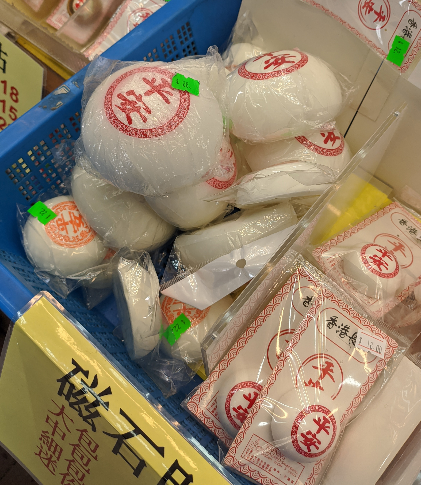
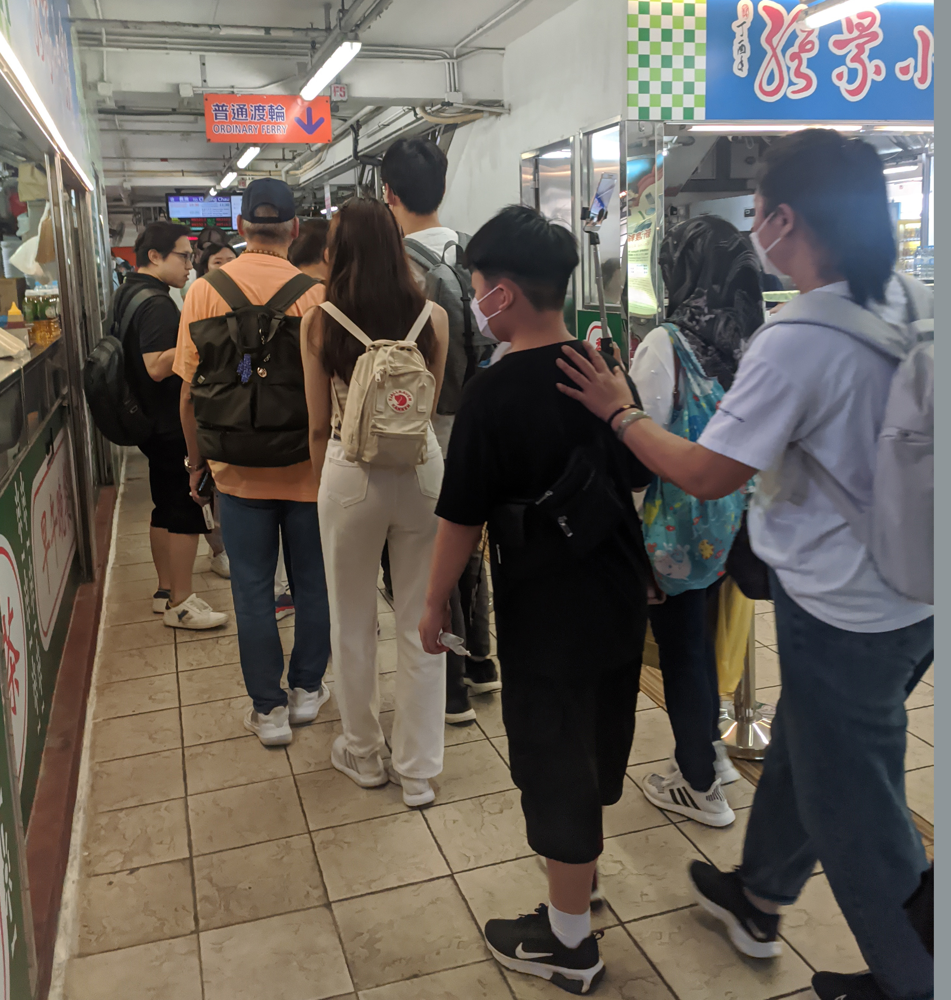
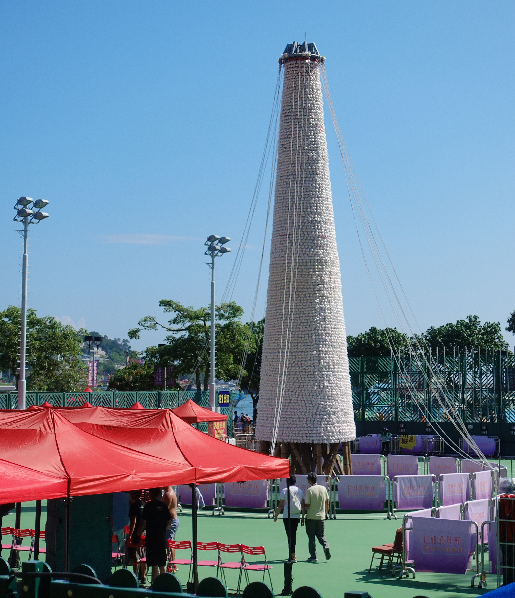

After three years of Kung Flu reign, Cheung Chau Bun Festival has returned onto the regular schedule. I haven't had the opportunity to see it myself yet, but having heard of it before - and given the fact that there's nothing else really happening in this city - I was very keen on attending. Especially since the date coincides with Buddha's Birthday, which this year came out to be Friday, 26th of May. 

The story of the festival revolves around buns and ending of a plague, thanking a deity for bringing health and peace to the island. And yes, that's about the whole story, what you'll find on Wikipedia or hear from the locals.

Seems fitting to restart the festival now, but instead of thanking a deity for ending the bad times, we need to thank Xi Jinping. 

# Coming in with expectations

As a casual tourist with some knowledge of the local culture, I know the festival is famous for dressing up kids, dancing dragons and a midnight bun run.

As for crowds, I wasn't exactly sure - it's the first festival in four years, so that should attract a crowd already; but I also notice from my own experience that there's a still a massive part of the population that is still afraid of the bat soup virus. So it could be crowded because it's finally reopened, or it could be somewhat empty because people are still irrationally afraid.

Oh, and the buns. The whole point. I tried it before, actually, so I didn't have to line up to get one today. Let's get a review of it out of the way.

## Focus On The Negative: Ping On (平安) bun

"平安" (ping on) means safety, referring to the deity giving the people much needed calm times. That also reminds me of the quote of giving up liberty for safety and deserving neither - but in the original story, that's fine. 

You can get it with various fillings, most notably lotus seed paste and red beans. I tried red bean - that's my favorite part of Asian desserts - not too sweet, got some chunk, pretty good.

The bun itself was dry, bean paste quantity was unsatisfactory and as such I would recommend only getting it if you're in the area for the vanity of it. Frankly, if you're hungry for a snack, get a mango mochi instead.

The bun? Get a plush magnet. Better than the real thing.

## Organization

Online you would not find much information about the festival. The only things you'd find were that you would find a parade between 14:00 and 16:00, and the midnight bun run at 23:30. I was definitely hoping to get more information about the event on the island or right before that. There was very little advertisement of the event, after all. I didn't want to stay for the bun run either - so the plan was to see the parade, take some pics and go back before it actually ends.

# Getting there

The festival happens on a small island outside of the big city area, with only one big ferry company operating between Hong Kong island and Cheung Chau. They operate two types of ferries - "fast" and "ordinary" - the fast one has AC and takes 35-40 minutes, while the ordinary takes an hour without any air conditioning (unless you pay extra for a "deluxe suite"). They both operate with 1 hour frequency, but 30 minutes out of phase.

Due to possible crowds, I decided to go there three hours early, with a friend - have a light lunch there, try to learn something more about the event and then head for the parade.

When I arrived at the piers in Central, you were greeted with a long line... of rope. Obviously they were preparing for the worst, as the path you had to take was few bends with long stretches, ready to be filled to the brim with slow moving traffic. To my surprise, ferries just took people without a line, basically - both types having a capacity of about a thousand people (+- few hundred, by my estimations). 

# Expectations, meet reality

On arrival things didn't seem too bad - crowds were sparse, police were setting up barriers. However, getting a table for lunch in a place that was not an overpriced seafood restaurant proved to be difficult. Still, the worst was yet to come.

What was more concerning is that you could see some preparations - and some kids running with a circular fan that was supposed to warden off evil - there wasn't anything telling anything more than what I have seen online. A map of the parade path would have been very, very welcome - instead, planning for the best spot would have required prior knowledge. 

That's fine for a spontaneous event, or a protest, but it feels wrong for an event with a long tradition. There's also only so much I can blame on being a gweilo - a local friend knew even less what was actually going on.

# It's not so bad though at times...

The best part of it was trying to find our way towards the main plaza, that was rather surely a point in the parade. Hearing drums, we marched towards them and found a group marching towards, assumedly, the beginning point of the whole ordeal. Three of them, even. The streets of Cheung Chau are narrow and difficult to navigate, so there's only so much that can be done, but that got me some genuine smiles, and overall enjoyment from everyone involved. If that was it - trying to make my way around parades, in some sort of organized chaos, that would have been awesome.

Arriving to the main square, a parade of children dressed up as various characters passed us by. Been pushed around to make way, well, that's the famous Hong Kong hospitality - but still much better that what was yet to come.

# Stuck at the main plaza

At that time, the path has been secured and barricaded; getting anywhere, or trying to find a better lookout spot, with the crowd also basically locked in, became impossible. Crowds with umbrellas - yes, it is hot, but goddamn, get a fucking hat! - made it even more difficult to see what was going on. Everyone and their mom with their phone out, getting a video that they won't look at again - well, I'm jaded as you can tell, but it does get annoying in places of high population density. 

Two hours to go. Got somewhere with an okay view - that I could aim my Minolta XD and get an okay shot, past the umbrellas - and stayed for a bit.

That's it. Your only role now is to stay and look at meticulously prepared performances and costumes. Some groups brought dragons; some groups got kids, some groups carried some unidentified objects of worship. At various intervals - there could be three groups one after another, or five minutes of nothing in the heat. That doesn't mean that it wasn't worth staying - have a look at a little gallery below. The crowds were certainly cheering more for the kids than anything else. And yes, that's what makes this festival special - the lion dances are a part of other cultural events after all, but cosplaying children - not so much.

     

          
     

     

          
     

          

          
     

     

          
     

     

          
     

# That's enough for me, time to get back

But how? The ferry pier, in straight line, is 50 meters in front of me, but the whole thing has been barricaded, and there's no clear direction. A police officer asked for tips waved in a direction, and said "need to go around". Fair enough, but the tight streets of Cheung Chau do not make it clear exactly how to go around. Some paths ended with a barricade for the path of the parade, and following the crowd often yielded in the whole crowd having to go back.

At some point we found an arrow, showing which way to go. And another one. And one more, that pointed into a barricade. Great - an older lady living in the area had to explain again and again, to incoming tourist masses, how to get around.

Finally arrived at the ferry pier - the line was long and we had to wait for half an hour in the sun for the next one, but after all this waiting I could finally put it all behind me...

# Midnight run

...or could I? I mentioned before that there was one more event for the celebration: climbing a mountain of buns. A competition, where a contestant has three minutes to get as many buns as possible, with more points for buns more towards the top of the tower.

On the way around I could actually see it prepared - the buns are obviously fake, and it didn't make a great impression - but it was there. I don't think that would make for a fun spectacle though, and the amount of logistics of actually staying until then makes it not exactly worth it. You would have to get a hotel beforehand - actually, long before the day - a week before all hotels were already full. And on top of that, that event is ticketed - with the tickets being given away on the day of the competition. So even if you did book your (probably overpriced) room, there was no guarantee you would get a seat.

As a side note, previously there have been huge bun towers that have been missing this year, from what I can [read](https://www.thestandard.com.hk/breaking-news/section/4/204000/Giant-bun-towers-absent-from-this-year%E2%80%99s-Cheung-Chau-bun-festival) - these have been replaced with... drawings. There would be more honor in not putting anything up, to be honest.

# Worth it?

From the tone of the article you probably think that I got really salty - well, for good reasons, organisation of the whole event was extremely weak and crowds, even though probably not in their final form, were massive, but... is it worth it?

At face value, I would say yes - if you're in the area. But besides that, the bun festival isn't worth coming to Hong Kong for, even if the variety of the parades can be somewhat interesting. Go there once, and that's about it. 

But there's more to it than pure experience. The event has had a grassroots tradition, something that came from the people - which can be easily seen from how local the event is. After 2019 protests and National Security Law being passed, the event was allowed to stay. Without caveats, although with vague laws loved by authoritarian dictatorships, self-censorship happened, of course. The children were [no longer dressed up in political costumes](https://www.thestandard.com.hk/section-news/section/11/252411/Bun-fun-avoids-political-touch) - so whatever issues people had with the higher ups, or even as a meaning of parody (cute kids in military costumes?), or support - that's gone. A way of self expression, although that can be argued that it's not exactly consensual on the children side, disappeared behind unclear rules.

And the question may be, is a castrated event worth visiting?

Any other event that could be seen as a threat to national security would be banned outright, meaning whatever left is an either carefully curated tradition, or something manufactured from the ground up with specific goals in mind. The views of the people living there are not present - their roles have been assigned already, making Hong Kong's cultural life basically a big Disneyland. 

On the other hand, how long will it actually prevail? Which festival will be the last? The democratics are brutal - and I don't think there's many kids being born on Cheung Chau in particular, although since Hong Kong is so absolutely fucked when it comes to housing, migration out to the city is not as bad as a tiny village in Eastern Poland. Will the participants be imported from the mainland at some point? Is it even worth preserving? I'm not the one to give you a concrete answer.