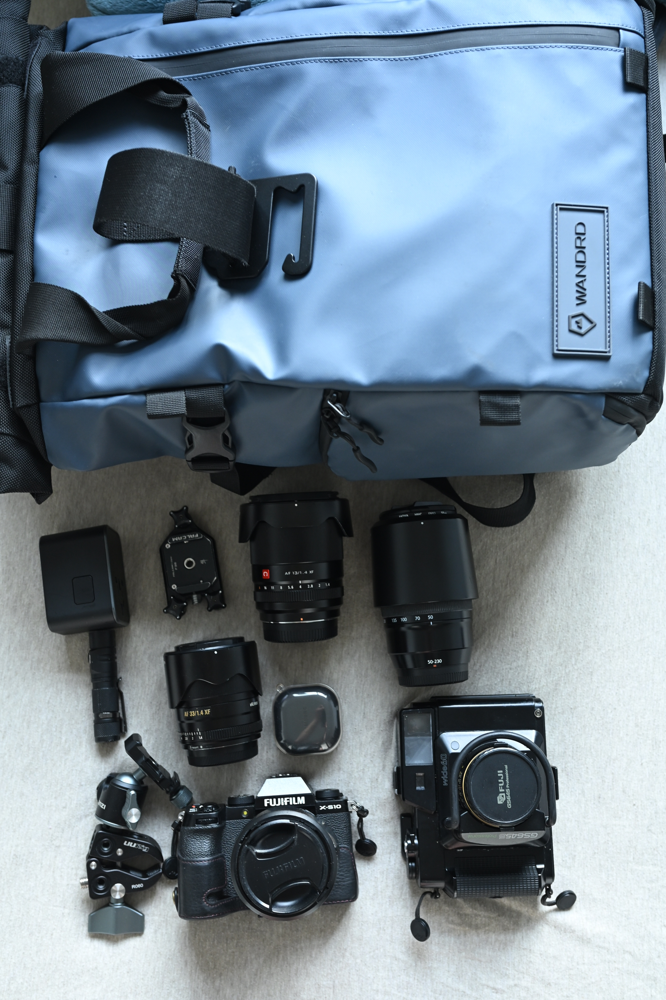
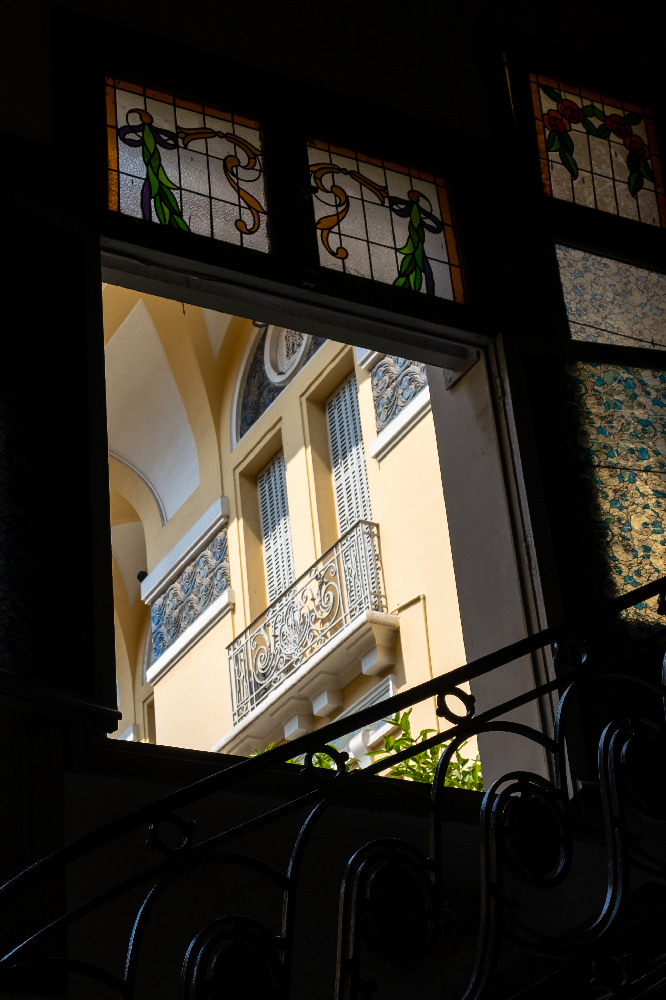

Still having some annual leave left, I decided to go for a weeklong trip to Vietnam. That's one destination I've heard great things about - the food, the views; HK can be stifling too, so it was a break I really was looking forward to. Let's see what I have learned from this trip.

# Original itinerary and expectations

Well, I didn't plan this trip well and kind of scrambled to get everything within one week, so I didn't plan much.

Basically, Hanoi and Saigon. Originally I wanted to take the train between the two, 36 hours, but finally decided against, to have more time for myself, and money - the plane was cheaper. I did want to take a long train ride once in my life finally, but this was not the right moment. _I'll take the transsiberian at some point for sure._

I didn't think much about what I'll be doing there either. In my head Vietnam means jungle, and rice fields on the mountains. And white backpackers. It seemed like a place with a lot of history, including colonial, so I assumed that I'd get to see some historical artifacts and colonial buildings. Simple as. Eat great food, don't strand too far from the cities, it will be alright. Sunday morning to Thursday in Hanoi, Thursday to Sunday in Saigon.

# What did I take?

## Backpack

I packed one backpack... a new backpack: the **Wandrd Prvke 21L**. I already have a Tenba Axis 24L, but it's a fully photographic backpack - you can't really make space for clothes or anything. The Prvke has a dedicated camera compartment - yes it's smaller - but a whole bunch of space on top. And many little side pockets, including two that I would call "stealthy", or pickpocket resistant: one in the back, and one on the bottom.

Then, a little side bag, an Adidas one I got from a friend. Nothing special about it, except that it's light and small, and helped take me few extra things

## Photo gear

* Fujifilm X-S10
* 2 extra batteries
* Fujinon XF 18-55 2.8-4
* Fujinon XC 50-230 4.5-6.3
* Viltrox 13mm f1.4
* Viltrox 33mm f1.4
* Fujica GS645S
* Bunch of Provia 100, Velvia 100

Fuji X-S10 is still the smaller choice, and the smarter one I'd say. Then a whole bunch of lenses: the classic 18-55 and 50-230 to cover most daytime traveling, Viltrox 13mm f1.4 for wides, and finally decided to take the Viltrox 33mm f1.4 out, for low light scenarios.

And GS645S is my favorite travel film camera. This time it also did its job great.

Oh and the Ulanzi F35 mount - absolutely great thing to have, to free up your hands.

No drone though - not for the lack of space, I'd surely find some, but rather stricter than usual laws. Since I planned to stay in the cities mostly, I didn't wanna bother either.

## Other things

Other things to mention: Galaxy Buds 2 Pro - great for airplanes or rare cases where you want to listen to music. Beats the Moondrop Golden Ages that I unfortunately lost back in Montreal.

UTorch UT01 - flashlight that has been with me everywhere. It's small, and so even if it doesn't get much use, I don't mind carrying it. I didn't use it after all, but I wouldn't leave it either.

Worst thing though? I forgot to bring my powerbank. As I've heard that pickpocketing can still be common, I took my old phone (Mi 9T) out with awful battery life; the powerbank would have been really useful. Just got a special Vietnam SIM card for data, moved my communicator apps and installed **Grab**. Very important, more on that later.

Additionally, I took some clothes that I would throw out anyway, with the goal of purchasing new touristy t-shirts in Vietnam. Could be a valid strategy.

# Departure

Just remember that Vietnam is not a visa-free country. Getting a visa is quite straightforward though - if you follow the official website. It may take few days, and without the confirmation you won't be able to fly; there doesn't seem to be a visa-on-arrival scheme anymore, at least for Polish citizens.

The flight from Hong Kong was not very long and the HK Express staff thankfully did not check the weight of my backpack (no check-in). Whew.

Without much delay I landed on Sunday, early morning in...

# Hanoi

From the plane you could see it's a vast city, but with no mountains or seas. The landscape photographer in me was already getting disappointed. But I've still heard good things about food, attractions, atmosphere; what's worth seeing?

The airport is quite far from the city. You can take a Grab, that would cost around 200-250k VND; metro buses (supposedly cheaper), or the special airport bus number 86 - that's 45k VND, that goes to the center (Old Quarters). Cash only. You just get in and the driver will approach you to get his share. Things seemed confusing at first, but there's a worldwide rule...

_If you're not sure how to pay/is a thing paid, just do what seems natural and remember that someone will ask for the money in one way or another. Let them come. Don't seek out._

Works everywhere. In a foreign country, without knowing the language? Hand gestures for money are pretty much universal.

## Train street

A lovely little tourist attraction - train tracks with cafes next to it. Having landed early and yearning coffee, I went with that recommendation at first, with train schedule saying that it would come in one and half hours. Since I came early I had enough time to walk around and pick a cafe. They all have very similar prices, so pick one that you like best.

The cafes are well decorated; feel free to take some pictures in the tracks, or of the hawkers that constantly go back and forth offering cheap trinkets at inflated prices.

Zippos made to look like they were left by American soldiers are still popular too. One hawker was particularly invasive, despite showing no interest (I like my lights electronic, thanks). I told him I don't smoke.

_I don't care!_

Well, me neither.

Ordered an egg coffee and bun cha; total about 120k. Coffee was made on site, food came from outside. In the last 30 minutes, the cafes got quite full. You do have to order something to get a seat. Fair enough.

     

          
     

     

          
     

In the last minutes before the train comes, tables and chairs are moved to the very edge of the street. The train is wide, and it comes very close, and quite fast. And it's not short either. Don't stick your hand in there, and you'll be fine; definitely not something you would see in any other place.

The crowd disperses rather quickly after the train; you can take your time before you leave.

Recommended as a side attraction.

## Hoan Kien lake

I took my sweet time at the hotel, without any particular destination in mind. The hotel was in the Old Quarters, with plenty of dining options nearby. After a nap I went out to the other big thing on the map: the lake. Grabbed a banh mi on the way; cilantro, pate, warm baguette, 25k, awesome.

On Sundays (and I think on Saturdays), the whole area is closed to traffic. People walk around, play badmintion; plenty of hawkers around; ladies selling small doughnut balls from a wheeled cart. Approached one with slight curiosity; haven't had a tiny doughnut since Poland.

_- How much?_

She's already packing, and counting.

_- See? It's good. One, two..._

_- ...how much?_

_- ...ten. 150k pls._

My eyes went wide. Do I look American?

_- lol, lmao even._

_- Then how much would you give me?_

Being realistic; snack in a tourist spot? Let's be generous.

_- 20k._

_- lol, lmao even._

I turn back, she screams _"we go half! 75!"_, but I just kept on going, knowing there's no way to get to a reasonable deal from here. Haven't tried the doughnuts after all during my stay.

The lake doesn't seem to be too very nice; there's a little temple there on the island. Water ain't clear, and I wasn't lucky with the weather.

I got approached by some students who wanted to practice English. There's no scam around it; they come with a list of questions they want to ask. If they're half decent at English already you can have a lovely conversation with them, and you can learn a bit more about Vietnam from them too, so it's not a one-sided conversation. Find out some destinations, or food to try that you might've missed otherwise. However, if their English isn't good they won't tell you much, expecting a set response.

Little kids may approach you too.

_"What is this?"_ - a six year old said while pointing at my Fuji GS645S on a strap, and putting his hands on it already. Aha. Nothing happened, but a reminder to stay vigilant.

I didn't let it go as it is my favorite film travel camera, but there was no harm in letting them touch a piece of technology they will probably never see again.

Still, one positive, or even a neutral experience shouldn't stop you from keeping your eyes peeled. If someone approaches you with a friendly face, they want something from you; whether it's English skills or money in some way.

     

          
     

     

          
     

     

          
     

    

          
     

Around the lake there's few cafes, so if you're caffeine starved, you won't be for long. Coffee is good, plentiful, and cheap; they're definitely proud of it. There's also a Mixue if you want cheap ice cream. Uniqlo in a stylized colonial building, main police station and old Ha Noi Moi newspaper building that seems to be popular for wedding shoots.

     

          
    

    

          
     

On my last day in Hanoi I went there again, as weather seemed to get better. Looking for an egg coffee place to enjoy, I found a tiny hidden cafe, [Dinh Cafe](https://maps.app.goo.gl/5KRJwoDcYyM93bK87) - the place was absolutely crowded despite being well hidden. The coffee was cheap and very good; and inside while it looks rather unmaintained, keeps a comfy atmosphere.

## Ngoc Son temple and interlude on traffic

Temple on the lake. Frankly, nothing special (after visting countless Asian temples), besides the lit up red bridge at night. Not worth the 50k entrance fee, but you can't get on the bridge without paying, so if you want a photo there, go for it.

I had my next destination in mind already - a funky little bar, a bit further from the centre. And it's impossible not to notice the traffic; infamous worldwide. Roads full of scooters. Roughly one per person in the whole country, of course. Traffic lights are merely a suggestion, and it all seems chaotic, and yet everyone gets to their destination safely. Including pedestrians crossing the streets. The constant honking is to let another driver know that they're being passed, not an angry honk. Motorists actually generally seem to be pretty chill with being cut off; getting to your destination is more important than pride.

Crossing is not not easy, but there are few ways you can work your way through it. Easiest if you see a local crossing the street, just stick to them; or another tourist, but they may need some extra encouraging. Keep your eyes at the incoming scooters, don't do any suddent movements that may end up with them crashing into you... and they will flow around you.

Just remember that cars won't.

## The Hanoi Social Club

Certainly a shoutout to a lovely [bar](https://g.co/kgs/iA1cm8r). I'm a sucker for their colonial decor, and while the venue isn't big, it certainly has a lot of charm. It was a slow evening, so a waiter kept me company and we had a lovely chat. It seems to be a favorite topic of the Vietnamese towards tourists - the traffic; I've heard that a lot. Paraphrasing:

_"We all get safely from A to B. It's like a math problem in high school; sometimes you get the answer right, but the method may be wrong."_

_"You know, in Hong Kong you have the order, and laws, but you still have accidents. Here you have chaos, but everyone gets to their destination safely."_

Remembering how annoying the HK traffic is, how inept (if not old) taxi drivers are, and how no one will move their car off to the side after the most minor fender bender... yeah, I think I prefer the chaos.

_"Beware the cat. May suddenly scratch or bite strangers."_

They have some pasta choices and decent beer in the menu which were alright, but one item in the menu stood out to me: the _Pho cocktail._ Generally I like weird tasting, savory cocktails, but I didn't dare the first time around. I came back the next day, over a promise of live music, and that the waiter told me that I should get real pho first, so I can compare the taste. The cocktail recipe was purchased from a guy who made it up in 2019 and won an award; it seemed exciting, worth the 180k price.

Live music was alright; a fella playing most known songs on guitar. Pho cocktail looked like pho. With coriander in the glass, and chili and limes on the side. The smell was incredible. Like pho. The taste... was kinda bland and sweet? Is it how it's supposed to be?

Not too long later I was asked how is it. Usually people don't like being asked "how's the food", especially in a social setting - they want to enjoy their company, so they throw "it's good" and leave it at that. Since I was not in a social setting, but chilling on my own, I tried to describe the taste.

Quickly it turned out that _something was wrong in the way it's made_ - it's not supposed to be sweet; and I would get it remade. It took them a while and couldn't find the issue; so I got something else instead... and later they came back to me with a newly made pho cocktail. And this time it was it - it tasted like the soup. Savory, with that coriander note. Bit sour, and definitely not as sweet. Got a discount after all too. How long was it being made wrong? Can't say, if previous customers wouldn't go into detail on describing the drink... the smell was right after all. So a life lesson, to not be afraid to speak up when things seem wrong.

## Temple of Literature

A historical relic, to point out the 1000+ year old history of Vietnam. One of the first places in the city, a place for scholars. There's plenty of history there, including the temple that is featured on the 100k banknote. Technically - nothing special or spectacular, but if you want to learn a bit more about the history of Vietnam, it's a good starting point.

     

          
     

     

          
     

## Hoa Lo prison

An interesting museum for sure. Probably the first time when I realized the reverse propaganda - how terrible the French were (frankly, it does look like the conditions in the prison were indeed bad), and how nice Vietnamese were to American soldiers they imprisoned there. I'm not the one to judge, but I did enjoy seeing the exhibitions. Oh and multiple mentions of future Communist party members who have been conspiring in there.

From the English-curious students from the first day, I learned that they have a special show at night there. I went there the first day in the evening, after finding vague information that it's on weekends after 19:00. However, I was met with a closed gate, and few posters; I could not find any detailed information online on ticketing, in English especially. The QR code on the posters led me to a Vietnamese [Facebook page](https://www.facebook.com/hoaloprisonrelic/), seemed like it was a "DM me for details" thing in Vietnamese only. The shows are only on Friday and Saturday, so I haven't missed any, and the tickets were quite pricy.

## Ho Chi Minh mausoleum

Having heard stories of the Lenin mausoleum which I will probably not have a chance to ever visit, I definitely took my chance to see at least one dead communist. Should I even call this place an "attraction"?

It's open early in the morning, and closes quite early too. The entrance is at the corner of Ngoc Ha and Le Hong Phong. Definitely aimed at locals - I was the only foreigner in a very long queue, and the staff spoke almost no English. There's a dress code, like to temples - for men, need long pants. You can't bring big backpacks - you leave them at the deposit - and cameras are also forbidden, but they're taken later, near the mausoleum entrance, and returned after you exit from the mausoleum.

After a long queue you finally get to go into this massive building. Through few corridors, your group has to keep walking. No talking, no photos, pay your respects and leave. A Vietnamese couple in front of me made some small talk - it didn't seem to be a very serious place for them. Plenty of school excursions too.

After you exit and retrieve your camera, you can enjoy a little area with Ho Chi Minh's house on stilts where he supposedly lived and his garage with Soviet limousines, for a small fee. That's actually quite nice, albeit small. And there's a museum dedicated to HCM that I have skipped. I've seen the man himself. That's more than enough.

     

          
     

          

          
     

## Tran Quac pagoda and interlude about transportation around Hanoi

Nothing really to write home about, but I also haven't been lucky with the weather. Theoretically, it faces west and it could possibly be either a good sunset point, and the pagoda itself would look good.

To get around Hanoi you can just walk - it's not a big area with the main attractions. Alternatively you can use Grab, the app. Drivers will ask you if you want to go anywhere; seeing a white face their eyes become big VND symbols. Grab is just cheaper and more honest. And you can take a taxi car, or a motorbike. Motorbikes are cheaper and more efficient; probably faster than cars too considering the traffic. Taking the bike is quite fun and I'd recommend it, and works great if you're a solo traveler carrying just a backpack. If you consider the traffic as chaotic from a pedestrian perspective, try it out from the rider's.

## Ha Long Bay daytrip

In Old Quarters you can find plenty of travel agencies, or you can book a daytrip online. They all offer basically the same itineraries. I've heard that Ha Long Bay is beautiful, so decided to go on a daytrip - they pick you up from the hotel, drive you there (about 2 hours), bring you on a boat, serve lunch, sail to few places.

It was fairly crowded and again, probably a weather issue. The cliffs were nice, but the water seemed quite dirty and generally speaking, Coron and El Nido in the Phillippines were better - cleaner, cheaper, more beautiful. I can tell that people could get excited about it though, but I got spoiled :)

     

          
     

     

          
     

     

          
     

## Ninh Binh daytrip

Another day, another trip, this time to the old capital. Includes a temple (_yawn_), a cruise along Tam Coc (three caves, actually nice), a bike ride in the countryside before lunch and Hang Mua. Again unlucky with the weather, it was raining for most of the day.

It was actually quite nice, the caves and temples around it seemed quite scenic. You gotta help the oarswoman/driver row at times, which I didn't mind. Make some small talk to fellow travelers on the way. The bike ride in the rain on a barely maintained bike? Also exciting, especially when you notice the brakes aren't fully working. I can assume it's really nice on a good day, especially in spring, with flora blossoming.

The last part, Hang Mua, is a small cave and two hills. And a whole commercial complex. Just ignore all that crap and get to the top, for a really nice view of Tam Coc. 

     

          
     

     

          
     

     

          
     

     

          
     

     

          
     

From all the places around Hanoi that I've been to, this is one I'd like to try again with better weather.

## Beer street/Ma May street and other things to mention

There's a whole street of restaurants with beer. All the same crap with loud music. I'm too old for that I guess.

Some places on Ma May street were weirdly empty despite late hour and it all seemed quite seedy. If you go there by yourself, take care of your belongings, looks like you could get drugged in there. Even then, looking on Google Maps, the whole place had high ratings.

I have a feeling that Americans going first time to Asia, to Vietnam, would rate anything highly. _"It was a scam, but at least it was a really cheap scam.5 stars"_

I did find a lovely place that served quite good spring rolls and another that served chè (dessert, not very different from Taiwanese/HK style, but still very nice).

For a beer place I liked [Bross Craft Beer](https://maps.app.goo.gl/cj4AM5LPTic3oWKF6) slightly away from the centre. Went in on a slow night, had a lovely chat with the bartender, and they serve locally made beer by that microbrewery. Ok, it's not the best beer, but beats the mass produced piss that you'd get on the beer street. And by talking to locals you can actually learn how much they make, how they manage their daily lives, and how racist Koreans are towards South East Asians.

     

          
     

     

          
     

For souvenirs, I liked t-shirts from Tired City. There are plenty of their shops around. The t-shirts are quite pricy, but quality is really good, and the designs are cute.

There's also St Joseph's Cathedral. Outside looks like another Notre Dame knock-off, but the altar inside has an interesting design that mixed western sacral art with Vietnamese patterns. Worth a quick look if you're nearby.

     

          
     

     

          
     

     

          
     

That's about it from places worth visiting here. I wouldn't spend too much time in Hanoi itself, but rather focus on daytrips around; but a day or two won't hurt.

# Saigon

_"It's not Saigon, it's Ho Chi Minh City!"_

_"The people from there, they try so hard to be American!"_

From a conversation with someone definitely pro-Communist while waiting at the mausoleum.

Generally the feel of the place is completely different from Hanoi. Wider streets, more cars, different architecture; taller office buildings. Overall I think Saigon would be richer.

_Don't get your souvenirs in Hanoi, Saigon will be cheaper!_

From a Saigon native met in Ninh Binh. Not true.

## Getting there

There were two options I considered: the train, and the plane. The train takes 36 hours, is more expensive than the plane, but it seemed like great fun.

The plane is cheaper, and takes two hours. I only had a week, so I went with the plane. If I had more time, and decided to visit the middle part of Vietnam (which I'd like to at some point, at least to see [Hue City](https://willbullen.artstation.com/projects/ARe0X)).

I took a domestic plane. VietJet Air seems to suffer from delays often though, so my departure was moved by half an hour. No big deal, just slightly annoying. First time I was allowed to keep my 500mL bottle of water that I completely forgot about. Getting the staff at the Hanoi airport to not scan my film was a bit of a pain though, but I managed. "Hand check" consisted of putting the film next to the metal detector. Wish all security looked like that, wasting less of travelers' time.

After landing quite late, I went to the Grab pickup point. There were many motorbike drivers waiting, and they all asked me where I'm going. Out of curiosity, I talked with one; going to District 1, 150k. Uh.

The app got me a ride for 44k.

## Independence Palace

The first place I have visited, that wasn't too far from my (shit) hotel. You'd see it on magnets, postcards. No wonder - it's a beautiful building, although in some ways looking quite brutalist, not too far from Eastern European style, despite being built with heavy American influence.

This is the place where the leadership of South Vietnam and Americans have stayed in. Dropping two bombs on it at the end of Vietnam War was the last straw, and the president of South Vietnam has evacuated at once.

You can see the lavish rooms where foreign ambassadors would have been invited to; quarters, and the bunker, with the war room and a whole lot of equipment. I do like how communists haven't actually destroyed the whole thing and preserved it. A little treat for an architecture nerd. There's also an old French building that has survived the revolution, for a comparison of the colonial French style versus American colonial.

     

          
     

     

          
     

Generally worth seeing.

     

          
     

    

          
     

## War Remnants Museum

I mentioned earlier that you can feel the switch in propaganda in Vietnam, and there's no better place that shows this than the War Remnants Museum.

It invites you with an outdoor exhibition of American planes, tanks, helicopters, promising a good time for a military nerd, and then once you're inside, slaps you in the face with the terrible consequences of Agent Orange. With some weapons here and there. Certainly a harrowing sight, seeing the stories and photos of people affected by it.

The top floor had an interesting exhibition about photographers and journalists; photos they've taken, the terrible fate they've met. Starts with Robert Capa ([well known scammer](https://medium.com/exposure-magazine/alternate-history-robert-capa-on-d-day-2657f9af914)) dying during the revolution against the French (probably faked that too), and goes onto Vietnam War, from people who fought valiantly in their last moments, to photographers who had survived and came back to document the post-war life. I certainly enjoyed it, counting Nikon Fs and M3s.

But even if you're not into photography, or war, I'd still recommend visting. No pictures; I was too absorbed, and really there isn't much I can say without spoiling the experience.

## Daytrip to Mekong Delta

You may stumble upon tourist agencies here and there, and they basically offer two trips: 'Mekong Delta River' and 'Cu Chi Tunnels'. Or both in one day. Having only one day I went with the Mekong Delta expecting to see some wild rivers, rice paddies, Predators and all that.

What I got was 5 minutes of the river trip and the rest was tourist traps. Coconut candy factory, beekeeper farm, traditional singing, all designed you to showcase a product for you to buy. Oh and the boatwoman on a short ride quite strongly asking for tips.

     

          
     

     

          
     

Should've gone with the tunnels; heard at least that's interesting or entertaining. Don't waste your money.

## Ben Thanh Market

Have you heard stories of tourists going to a local market and getting an insane deal, like "omg less than half price" for a product? Having lived in Asia for a long while I've never had that, if I haggled I could get the price down a bit sometimes.

Until I came to that famous market. The schtik is simple. You're just greeted with an outrageous price from the beginning and are expected to give your own counteroffer. If you've ever lived in a normal country (non-western), you know how much things should cost. So you give a price below, and end up with slightly higher than it should've been, but okay.

All vendors in that market sell mostly the same things anyway. But it gets tiring fast if you want to buy few things, as the process of fake haggling starts from the beginning with every vendor.

I wouldn't waste my time except to buy some fridge magnets.

_Feel free to open up the panorama in full resolution._

## Museum of Art

Last minute visit, just so I wouldn't just keep drinking coffee like I would have.

Stumbled upon a photography exhibition of an Ukrainian photographer who had visited Vietnam in the 50s. I would have recommended it, but it was time limited.

The main building, of lovely French colonial style has art from modern Vietnamese artists. It's not a big place and the visit isn't very long, but it does give some insight; from pencil sketches done in a trench during the war to socrealism.

I came there on Sunday and few groups of schoolkids had also visited it at the time. Of course I got approached to practice English; was asked questions to which I answered (mostly what I knew about Vietnam, cities, food, mode of transport, how are Vietnamese people), but they were persisting that I didn't answer correctly - they needed a particular synonym that maybe went out of my head. At least they helped me take a picture of me in the museum, so I got that out.

## Cafe apartment and other places

On the last day, I went to a small city museum next to the Independence Palace - thanks to its colonial architecture it seems to be popular with photographers for model shoots, but I'll admit I remember nothing from the exhibitions. Then I took the Grab bike to go to the Art Museum.

Then I visited the Cafe Apartment - a building full of cafes. Frankly speaking the ones on the top floor were alright, the rest seemingly ignored or empty. Not too bad.

Wanted to visit the Cathedral, but unfortunately it was under construction ;_; However, next to it there's the main post office building - again, lovely architecture. Inside is a bit chaotic, and the postcards and magnets are noticeably marked up. Visit the building for sending or to look at it, but preferably get the cards somewhere else.

     

          
     

     

          
     

Oh and next to that I finally got some spring rolls, in a random place. If you're not aware, in Polish the city is called "Sajgon" (also an euphenism for a mess), and spring rolls - "sajgonki".

Sajgonki w Sajgonie. 

My dream is complete.

     

          
     

    

          
     

## Getting out

Getting to the airport isn't too bad if you take a Grab. It's not too far from the city centre. There's a caveat - if you take a taxi car, it can go to the international departures no problem, but if you take the bike - which is significantly more exciting and cheaper - it will lead you only to the Grab bike dropoff point which is kinda near the domestic terminal, but to get to the international one you have to walk for about 15 minutes. No big deal, but please account for it.

Once at the airport after you check in, you have to join the queue for the passport control. And it's LONG. Very long. You could spend over an hour there, easily. Maybe you'll meet a friend and learn an important life lesson?

_"When choosing a \[security] queue, don't choose the one that has mostly women. They always have to take out so many things."_

~Very based older Bahrainese man that kept me company for the queue.

Besides that (and having my flight delayed once again), everything else went smoothly and I returned to HK.

# So...

Having been around South East Asia already I wasn't particularly enamoured. I had a general feeling that due to Vietnam war history, it's often first destination in Asia for young Americans trying to find themselves on a break between high school and college, as evidenced by RX100s and ZV-1s I've seen everywhere. And it shows in attractions, loud places, bar streets, not too unlike Thailand, but seemingly with less things to see and do otherwise.

I'm glad I went and I would like to go back to explore a bit more, but I wouldn't discount any other places in the region.