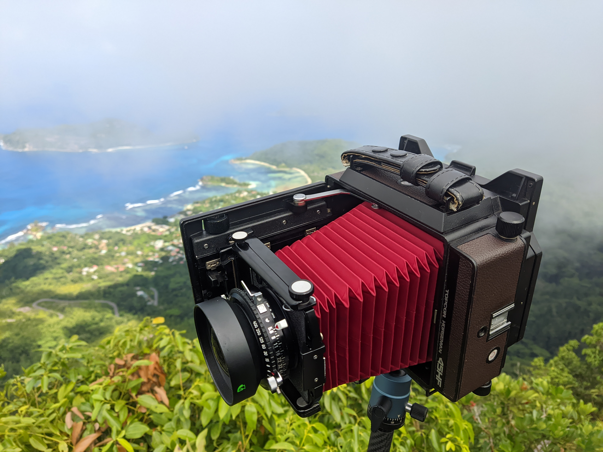
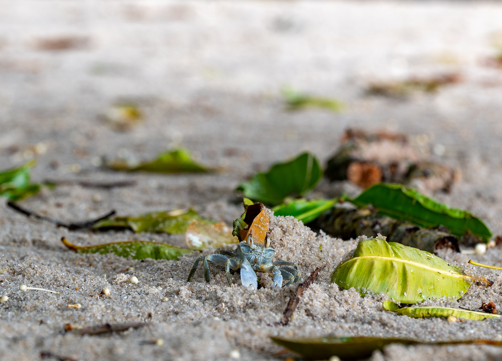
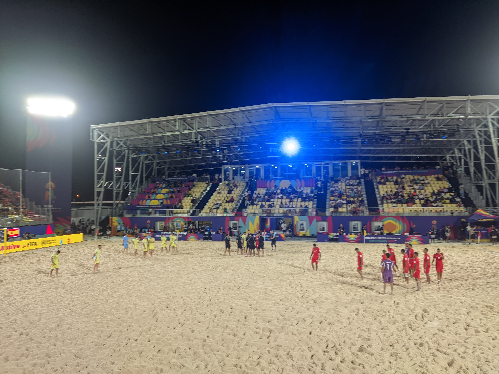
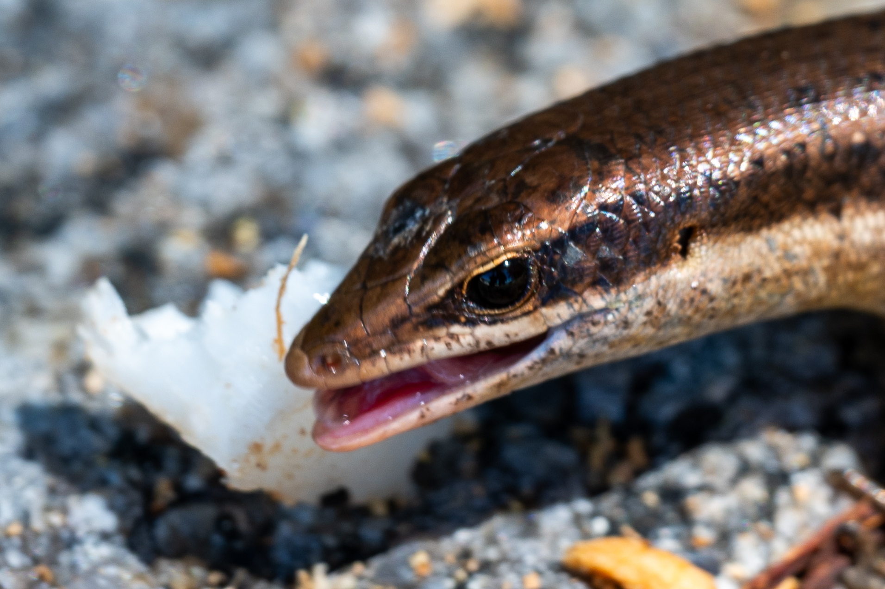
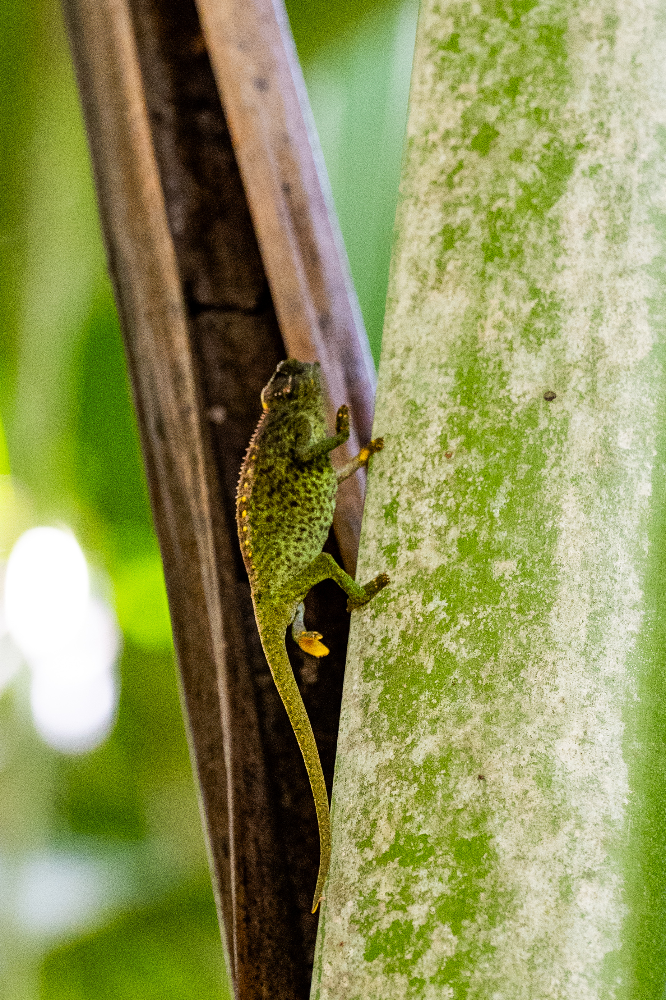
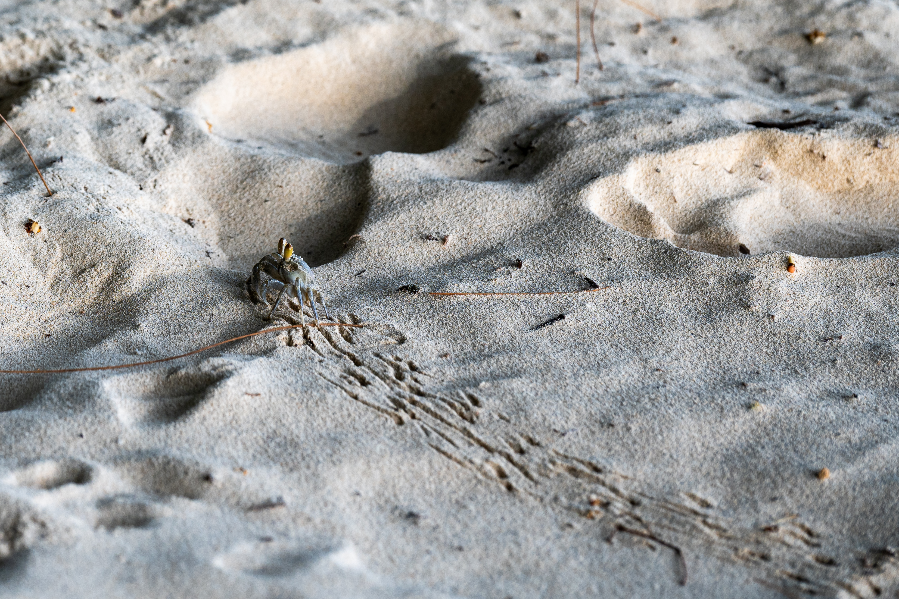
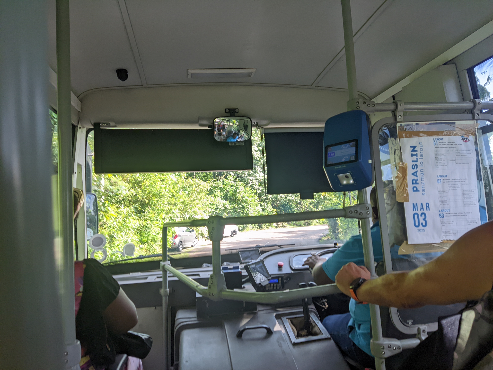
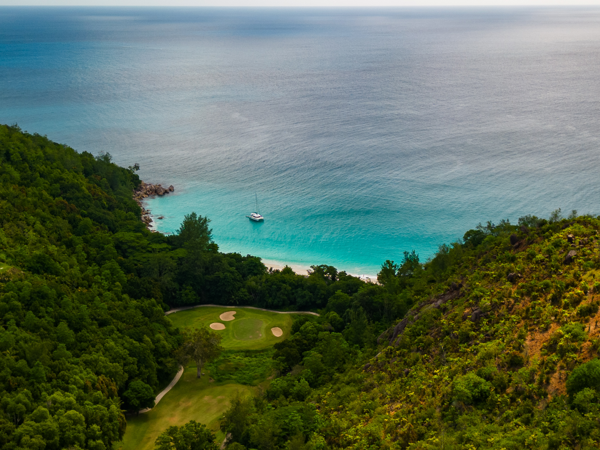
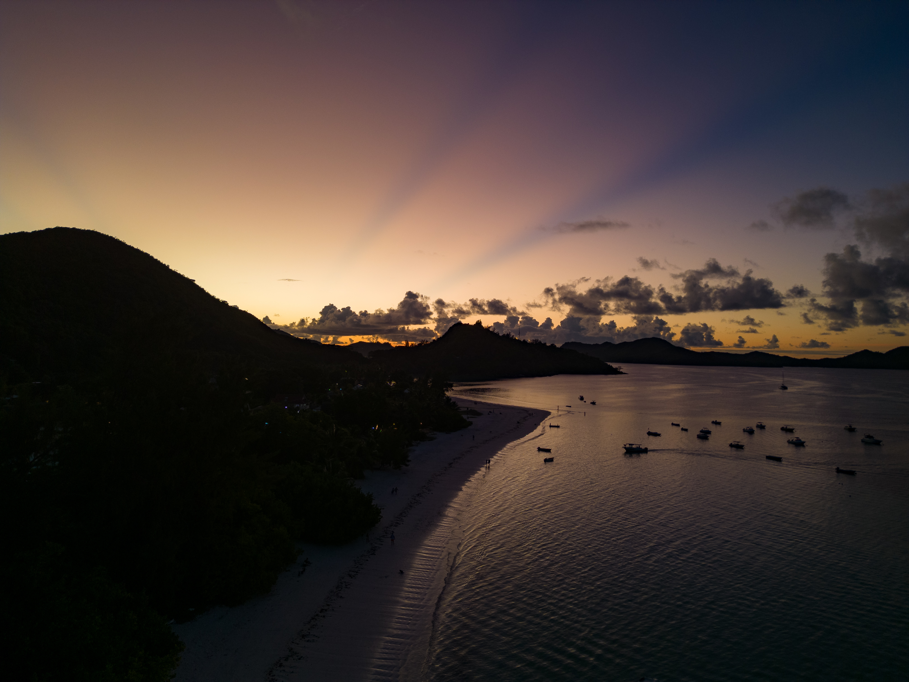
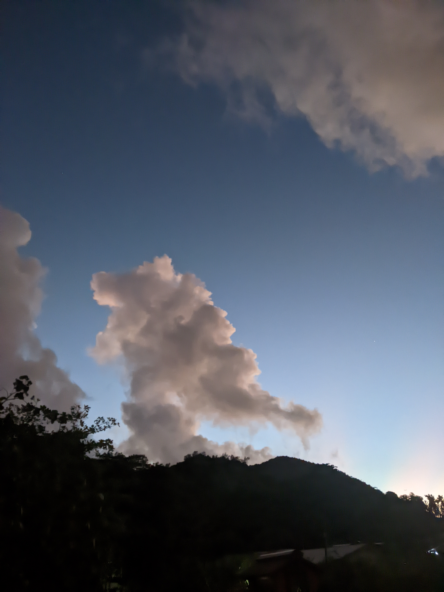

Ever heard a music album that transported you somewhere else, from the first note? That's not that rare. How about made you want to book a ticket somewhere else? I'd say two albums did it for me. Fishmans' music would mentally transport me to 90s Japan, but I cannot book a ticket to then. The second is Masayoshi Takanaka's **Seychelles**. From the first crisp guitar riff, I wanted to be teleported onto the beautiful beaches.

Seychelles are a somewhat popular destination for European honeymooners; mildly popular with Americans (they have Hawaii, don't need to travel half the world), and it's almost unknown around Asia. From afar they're known for their stunning sandy beaches, containing few considered top in the world, such as Anse Source d'Argent. It's also known for being an expensive holiday destination, which is kind of true, but more on that later. 

- [What did I bring?](#what-did-i-bring)
  - [What I should've brought?](#what-i-shouldve-brought)
- [Tips before the trip](#tips-before-the-trip)
  - [Entry requirements](#entry-requirements)
  - [SIM card](#sim-card)
  - [Insurance, hotels](#insurance-hotels)
  - [Any extra information](#any-extra-information)
- [Let the journey begin](#let-the-journey-begin)
  - [Mahé](#mahé)
    - [What's free and what's not?](#whats-free-and-whats-not)
    - [Copolia Trail](#copolia-trail)
    - [Anse Grande Trail](#anse-grande-trail)
    - [Weather?!](#weather)
    - [Morne Blanc Trail](#morne-blanc-trail)
    - [First attempt at Sauzier Waterfall](#first-attempt-at-sauzier-waterfall)
    - [Petite Anse & Anse Soleil](#petite-anse--anse-soleil)
    - [What to eat?](#what-to-eat)
    - [Beau Vallon and Top Soleil](#beau-vallon-and-top-soleil)
    - [Anse Capucins Trail](#anse-capucins-trail)
    - [Do you need cash?](#do-you-need-cash)
    - [Mangrove Walk and Sauzier Waterfall](#mangrove-walk-and-sauzier-waterfall)
    - [Victoria](#victoria)
    - [Anse Royale](#anse-royale)
    - [Fifa Beach Soccer Cup](#fifa-beach-soccer-cup)
    - [Random beach in the north](#random-beach-in-the-north)
  - [Praslin](#praslin)
    - [Cat Coco Ferry and landing in Praslin](#cat-coco-ferry-and-landing-in-praslin)
    - [Vallée de Mai](#vallée-de-mai)
    - [Anse Lazio](#anse-lazio)
    - [Buses](#buses)
    - [Anse Georgette](#anse-georgette)
    - [Diving near Curieuse Island and St. Pierre Island](#diving-near-curieuse-island-and-st-pierre-island)
    - [Cote d'Or](#cote-dor)
    - [Anse Takamaka](#anse-takamaka)
  - [La Digue](#la-digue)
    - [Getting around and renting a bicycle](#getting-around-and-renting-a-bicycle)
    - [Anse Source d'Argent](#anse-source-dargent)
    - [Three Beaches with Anse Cocos](#three-beaches-with-anse-cocos)
  - [Coming back](#coming-back)
- [Tropic Birds](#tropic-birds)

Let's focus on the fun part first.

# What did I bring?

No pics of the backpack this time, sorry! Just a list from memory.

* Nikon Zf
* Nikkor 24-120mm f4
* Viltrox 16mm f1.8
* Techart TZM-02 + 7agull 35mm f1.7
* 77mm CPL

The workhorse. The 24-120 is awesome, the wide angle should compliment it in rare moments, and the 35 could help out in low light situations or for nicer portraits. Spoiler alert, I haven't used the 35mm once.

* Horseman 45HF
* DaYi 612 back
* Super Topcor 120mm f5.6
* Topcor 210mm f5.6
* Nikkor-SW 75mm f4.5
* 67mm CPL and ND1000

Yeah I went with large format. I had this idea of shooting beaches in panorama on Velvia 100F. Since I was already planning to rent a car and could bring big luggage, it seemed feasible.

* DJI Mini 3 Pro
* Variable ND filters, wide angle lens
* RC-1 controller (modded with better antennas)
* 3 batteries, spare props, screwdriver

Classic. You'll be seeing drone stuff a lot in here. It's a stunning place that has little restrictions on drones, it's a no-brainer. The recently premiered Mavic 4 with absolutely amazing tech made me realize that the Mini 3 is more than enough, and the whole set weighs less than the Mavic 4 itself.

The screwdriver sucks though. I had to replace the props and the screwdriver head is too big. Might've mentioned it before. The screws didn't go all the way and almost got stripped, but I needed it on the last day. Thankfully, they stuck. Do yourself a favor and get a tiny PH000 screwdriver instead of the manufacturer-provided piece of shit.

* Insta360 One RS
* Official underwater housing
* GoPro floating stick
* BCD-attaching strap/carabiner
* Head strap

I got the Insta360 One RS from a friend last month, to use on FPV drones. And I also was planning on diving, just to remind myself how it feels. The One RS itself isn't waterproof, so it needed a housing. I found an official one for cheap on Taobao, and it did its job well. The BCD strap is also great, you can just hook it up on the BCD and not worry about dropping the camera anywhere.

Some other items:

* Utorch UT01 - classic. It's always with me.
* F95D fan - very nice to have when AC isn't enough
* Scubapro Crystal Vu mask + snorkel - great mask for diving thanks to great visibility
* Xiaomi waterproof Bluetooth speaker - for mornings and evenings. Don't noise pollute the beaches, please.
* Lens cleaning fluid and microfiber cloth
* 1TB external HDD for backups
* SD card adapter
* Anker 10Ah power bank
* Kindle
* Earphones
* First aid packet with stomach meds, plasters, aspirin etc.
* Sunscreen, mosquito spray.

The first aid kit came quite useful, don't underestimate it. Even if pharmacies were more common, it's not easy to reach one with a diarrhea.

And of course you know, hat, sunglasses, clothes, towels, etc.

## What I should've brought?

Some things I didn't use that much, or at all. That space could've been used in a better way. For example, I didn't backup the data onto the HDD at all (as I didn't bring the Ravpower mini-router).

Things that I should've anticipated? Sand. Lots of sand. Everywhere. You can't ever get rid of it. And I didn't even bring a rocket blower. Even better, I should've brought the [air duster](https://www.youtube.com/watch?v=X_ncYXk1cP4) I got recently!

A small, sharp, sturdy knife would've made opening coconuts so much easier. I do have one too, just didn't bring it with me.

More proper hiking shoes. There's plenty of hikes and some of them can be quite tricky and uncivilized. They may end in a beach, but you shouldn't slip on the rocks on the way there.

# Tips before the trip

Before boarding the plane, there's few things that need to be taken care of in the first place. Basic things like:

* Entry requirements (visa),
* SIM card,
* getting a hotel, any obligatory insurance,
* planning any itineraries, checking local customs etc.

## Entry requirements

Seychelles are a visa-free country, which should make sense since they're so focused on tourism. They recognize every passport except for Kosovo. Don't ask me.

However, you have to apply for travel authorization 30 days before you enter the country, on the [official website](https://seychelles.govtas.com/en). The cost is 10 EUR per person, and you need to do it online. Unlike Vietnam, it gets approved within a day or two - so you don't have to pay extra for a faster process unless you really forgot to do it.

## SIM card

I looked through Sham Shui Po and few shops near me for a SIM card. Hongkies have never heard of this place and don't offer a SIM card that would cover it, even the "global" super expensive card won't work in Seychelles. I found an offer on Taobao, and I would pay around 300CNY for two weeks. I was about to get that one, but...

As you apply for the travel authorization, you can also find SIM card options. I paid 25 EUR for 15GB for 21 days, which was more reasonable than the TB option.

Let's just say that while it's nice to be away from the global chaos network, it's also somewhat necessary as public WiFi hotspots don't really exist.

## Insurance, hotels

You can find plenty of hotels on Booking, Google, Agoda, etc. at various price points. Generally though you won't find anything below 100 EUR per night. A booking is necessary to apply for the travel authorization. Just as usual, check the ratings on a website, and then Google reviews to make sure you don't get a total lemon.

Insurance is not really necessary, wasn't checked, but probably a good idea. Thankfully I haven't had the pleasure of visiting the local hospitals, but I wouldn't expect much.

## Any extra information

Here's the first hurdle, there really isn't much centralized information. You can find plenty of info on reddit, but that can be outdated - check the dates, and redditors aren't usually the smartest or most accurate either. Same with Facebook groups, that's even worse.

Since you're reading this post, if you want to use it as a guide, that was the state at May of 2025 as well.

What I got is that:
* On Mahé, you should rent a car.
* Buses may come or not come, and their frequency is low.
* You cannot bring luggage on a bus.
* Taxis are insanely expensive, one ride to a hotel being as much as a car rental for a day.
* Food is expensive, and if you want to get it cheaper, go to "takeaways" (takeaway restaurants).
* You cannot get the Seychelles Rupee (SCR) in any exchange in the world besides there.
* But you can use credit card almost everywhere.
* Everything is imported (= expensive), so don't plan on getting any supplies, bring everything you can.
* Mixed feelings on Seychellois (some say they're nice, some say it can be unsafe).
* They also drive like maniacs on the narrow roads and some redditors feel uneasy about it.

How much of it is true? Let's board the plane and find out. But you'll have to make your own notes...

# Let the journey begin

After a long journey with stomach problems, in a rattling 787 to Ethiopia and a 737 to Seychelles, I was tired. Not a great start of the journey and it certainly affected my mindset.

Landing on the small island though quickly rejuvenated me. It was lightly raining on this tiny airport next to the sea, but the sky just a bit away was sunny and clear. The staff handed the passengers umbrellas, for about 20 meters that you needed to walk to the airport building, and urging us to hurry up as we were trying to take a photo of the beautiful view.

 

Immigration goes without a hitch. No need to pass your authorization to anyone, goes quickly, you just get a beautiful stamp in the shape of Coco de Mer. Luggage can take an hour to arrive, though.

The SIM card you ordered can be picked up outside of the customs, in the main hall of the airport. Now, the heat hits you in its fullest - if you're not prepared for it, it might be tough. 

You can choose either Airtel or Cable & Wireless. They both have comparable if not identical prices. I went with the latter, it turned out that the queue was shorter as well. Popped up the card in and was greeted with no internet access. As I saw people queueing up to the point, I just called the customer service on the leaflet, and after few minutes got my answer. Turns out you need to set up the APN: _name_ to ``cws`` and the _APN_ to ``internet``.

## Mahé

`youtube: https://youtu.be/uvc1xog2GS0`

_It probably says "video unavailable". That's because of the blight of humanity called copyright. Click to open it in YouTube in a separate tab._

For Mahé, I decided to go with a rental car. First, I was just missing driving (and driving on a beautiful road by the sea was VERY appealing), secondly, with the rare buses, as cheap as they were, it would be a pain to traverse. 

The rental car options are just to the left of the exits. I went with *Sunshine Cars*, as they gave me a cheapest option - a Suzuki S-Presso for **38 EUR/day**. Sure you can get extra insurance, but I went without, as my travel insurance would cover some of the excess. Other options in similar price range would include a Kia Picanto or Hyundai i10, showing superiority or East Asian car industry. Autotragic, 1.2 NA, 60HP with AC running the whole time... as long as it gets me places. A slow car fast is more fun anyway, right?

_My (for a week) blue rocket._

Beautiful blue color, interior reminding me of my first car, a '97 Fiesta, but with a tablet in the middle. 8400km on the odo, basically brand new. I still took a good view at the car, making note of any scratches on the bodywork. And soon I got into the car I realized it was my first time driving on the wrong side, and there was a massive traffic jam and a complicated crossing to go through. Getting to the hotel on almost no sleep was not a fun challenge, but I made it without much issue, besides messing up the blinkers and wipers stalk few times.

Having checked into the house, after a light meal consisting of fruit that were left by the owner, I finally could get some rest. After figuring out what to do the next day, at least.

### What's free and what's not?

That was a bit of a confusing part, and I still am not entirely sure. There's an official website to [pre-purchase an entrance ticket](https://www.spga.gov.sc/tickets/purchase). Not everything to see is on there, of course, but it can start as a guide what to look up further. And here's the thing, it does tell you about the tickets, but doesn't tell you where's the ticket office, or where it starts, or how to get there...

Some hikes have a ticket booth at the entrance, including the two we went on: **Copolia Trail** and **Anse Grande Trail**. The ticket offices are open from 9am to 4pm. From experience it seems the trails are not closed outside of these hours, which does mean if you go there early enough, you can probably get away without paying. Well, that's immoral, and the money goes towards maintaining the nature, but there are not many amenities. Most importantly, there are no public toilets almost anywhere on the island, leaving you with the bushes and the seas. Bring tissue.

Marine parks have no ticket office, but it seems that it would be paid by the excursion boat you get on, but you can also purchase the ticket online. I am not sure about the enforcement there.

Generally speaking, beaches are free, most hiking trails are too.

### Copolia Trail

First thing to do after you come to a dream holiday destination? Go hiking. Copolia Trail seems to be one of the most mentioned hiking trails on Mahé, and for good reasons.

A winding road leads you up there - it was a bit of a fun challenge. There were few wild parking spots nearby the trail entrance - you can't miss the ticket office, where you're supposed to pay 150 rupees per person. Kinda steep, but at least the hike isn't.

The path is well marked and cuts through the jungle with a lot of variety. You can meet local birds, lizards, tenrecs and at the very top, tropical pitcher plants. The view is stunning as well - of St Anne Marine Park, Victoria and Eden Island. Since it faces east, I'm sure it would great for sunrise. Some may say it's overrated, but it's alright IMO. Alternatively you can go to _Dans Gallas_ Trail for a similar view.

_First time seeing them in the wild!_

### Anse Grande Trail

If you thought that Copolia isn't enough exercise for you, within the same day you can go for Anse Grande Trail. The parking spots are tough to find close to the trail, so you may start hiking earlier before reaching the ticket booth. The tickets for this trail cost 100 rupees per person.

It's a trail along the sea that ends in a beach; not that difficult as there's not much of ups and downs. It's also quite civilized, but decent shoes may come useful if it's a bit wet. There's a lovely cave on the way with rocks that look like faces to rest, but don't waste too much time - just jump into the sea when you reach the end, that's the best reward.

_Moments before the rain._

_Crabs don't mind the change in the weather though._

The beach itself I'd rate as "so-so", but it's a welcome reward. If you don't feel like coming back, there are boats that come from time to time and can bring you back for 100 or 150 rupees. Consider that option if it starts to rain, cause otherwise you'll be soaking wet, trying to get back without slipping... and you will learn that while the Wandrd Prvke is quite weather resilient, it is not waterproof during a tropical storm. Which brings me to the next point...

### Weather?!

On the first day, after reaching the hotel it started raining hard. The hotel owner said it's gonna be over soon, and it was. Typical tropical rain, looks buff but lasts few minutes at most.

And you can run with this assumption until you get caught in the rain that will not stop for hours. The rain that caught me off guard in Anse Grande lasted for the whole afternoon and changed into a thunderstorm in the evening, deep into the night, with thunder cutting off electricity even (and importantly, air conditioning in the room!). Slope to the hotel parking was so slippery, that I was losing traction with the rental car and had to plan ahead to get some momentum.

What's the lesson here? Bring an umbrella or a raincoat if it looks like it's gonna rain, and if there's a hike involved, get decent shoes that will hold traction on wet rocks. And don't be fooled by what you see from your accommodation; due to high mountains rain clouds may stop in some regions, so the north of the island may be wet, but it's completely dry in the south.

That's in May, which was supposedly one of the best, least rainy months of the year in that place. If you go there during any other time, well, just be more prepared.

Heavy rain hasn't caught us since then, thankfully. There's not much to do in this place if the weather stops you from enjoying the beaches...

### Morne Blanc Trail

This trail starts quite close to Copolia, and this one's completely free. Just park your car at the edge of the road and get prepared for 650 meters up without much of a flat break, using nature's stairs. And before you go, look up - see if there's any clouds on the mountains, you'll probably end up there.

_The jungle can be a bit intimidating at times._

It's exhausting and I decided to carry the large format with me for the beautiful view of the west side. It is stunning, although not as wide as the top of Copolia. I wanted to take two 6x12 pictures, but only had the time for one before the clouds took over. I'd still say it's worth the effort.

_Absolutely stunning._

### First attempt at Sauzier Waterfall

Just following the Google Maps direction for Sauzier Waterfall you arrive at a private property, where the old hag will say that you need to pay 50 rupees for parking, and then another 50 for entrance per person. Thankfully I didn't have any cash with me, and the attitude overall felt quite scammy. So we left. Pfft, I don't need to see another stinking waterfall. There's a bit of a beach with very shallow water and a small island nearby, where we took a break. Doesn't look like the place has a name; there's a church nearby and an abandoned building of unknown purpose (until later, when I used it as a toilet, then the purpose became known).

_Would you like to take a boat, to that island over there?_

A tall, slender local man has approached us, pointing in the general direction of Isle Theress.

_You can go there for snorkeling, feed fish with the bread... We just get you there on a boat and you tell us when to come back and we pick you up._

Well, could be fun, I guess? How much for this? 800 SCR for two. Well, maybe if it wasn't quite late already... let me add the guy's number, consider it some other day.

_I can also take you to the waterfall afterwards-_

Oh really? We just came back from there... oh there's a way to avoid it, you need a guide and you want 150 rupees each?

I'll keep it in mind. On a second thought, snorkeling...? Feeding fish? That's it, for 50 euro? I can do it myself...

### Petite Anse & Anse Soleil

What's there to do on a beautiful island full of beaches? Beach hopping. Let's go for a sunset somewhere else! It's half an hour drive, maybe a bit quicker cause I already got used to driving on ~~touge~~ narrow roads, not too bad. And Petite Anse has been mentioned on few internet resources as a great beach, with a small caveat.

It's surrounded by Four Seasons hotel.

Now in any other place it would be a problem, consider it a private beach and all. But in Seychelles, you just approach the guards, smile and ask "which way to the beach?"

_Which one would you like to go? Petite Anse, or Anse Soleil?_

Well, what's the difference? Which one's better?

_They're both good in their own way, Petite Anse is the beach of choice for the patrons of our hotel, but it's a 10 minute walk..._

No big deal. 10 minute walk ain't nothing compared to the morning hike. But the biggest piece of wisdom comes a second later:

_All beaches in Seychelles are public._

It makes sense. Of course. Tourists come here for the beaches, and a resort should not be able to take over the whole thing for their own benefit. They can make it inconvenient for non-guests to visit, but it cannot be impossible.

Four Seasons may charge per night more than I earn in my lifetime (through this website, at least), but they won't stop you from visiting. They'll ask you to register - put in your name and where you're staying, and give you a wristband, maybe to differentiate from the real guests. Whatever.

And they chose the location very well, I have to admit. The beach is clean, the sand - softest that I've ever experienced. I'm sure it's meticulously maintained every day by the employees of the hotel. Water is clear; you can go for snorkeling, although underwater it's not that interesting. Philippines were better in that regard.

That open beach policy though? It only seems natural. It brings another aspect to it, that I noticed over the course of the stay - there's no advertisements or buildings on the beaches themselves; there are beach bars, but they're always behind the sand. That's for practical reasons in some capacity, but the effect is simple - the beachest just don't change, ever. Assuming it's just sand, sea and rocks, the view stays the same over decades. I'm seeing exactly what Masayoshi Takanaka was seeing in the 70s. Most of the island keeps this feeling, but it's nowhere as apparent as on the beaches. And I'm not ready to go back to civilization, it hits you hard. It's like comparing old, individualistic internet with little advertisements to the modern shitfest.

Alright, go back to relaxation. Just sit down and watch the hours fly by.

I can't. I gotta move. Not used to doing nothing. Let's check the other beach.

_Have you enjoyed the beach? Was that your first time?_

A security guard kindly asked on the way out. These guys are definitely paid well.

_I didn't carry my camera or drone there - this was taken from the other beach. Just trust me it's great._ 

### Anse Soleil

Walk back to the Four Season's entrance and go the other way. This is certainly dirtier, more local, but no big deal. It's a bit of a steep hill too. You walk through a restaurant, if you'd like to stop for a bite or a drink. This beach is smaller and doesn't give that much of a total paradise feel, but it's still nice. I decided to bring the drone and large format with me, fly around, and see the sunset.

Should I say it's skippable, in comparison? Yes, for certain. It's more approachable though.

And so I got down to taking pictures, setting it up in the sand. It was the first time and I already got annoyed.

I realized I have something in common with young Anakin Skywalker.

I hate sand. It's rough and coarse, and it gets everywhere. I blow it off the lenses and it ends up on the backpack, in the backpack, on other items.

But the sunset was nice. I should've gotten ND1000 for 77mm as well, but I managed to get some floaty sunset pics by holding the 67mm in front and zooming in a little bit.

### What to eat?

You may start to wonder, I haven't mentioned any restaurant or takeaway place yet. The reason for it is simple - cost. A meal where you sit down starts from 350 SCR. An average takeaway that's something better than chicken fried rice, around 150. Pricy but not too bad, but if you don't mind, you can just go to any little shop and stock up on staples, pasta, tomato sauce, lentils, canned beef or tuna. Get some fresh veggies or fruits from street markets from time to time too, or pick up some coconuts, they're laying everywhere. Or fry a fish.

Sounds sad? Generally, we'd eat breakfast after waking up and dinners after sunset. Maybe some snacks instead of lunch. Breakfasts are a no-brainer, considering little effort and time required; and after sunset there's not much to do in this place anyway, so might as well cook.

### Beau Vallon and Top Soleil

It's both the name of the district and a massive beach that we just passed by every day. One morning we finally decided to go.

I'm starting to lose unique words to write about another beach that is mostly just sand and sea, so let me focus on amenities - there are many, many restaurants around this area, few diving shops, bars. Certainly a nice place to stay at with some convenience.

I'm also avoiding saying that a place is a must-visit, because I didn't feel like this is.

We tried to go for Das Gallas hiking trail afterwards, but it started raining. Returned to the hotel, rested a bit and for the sunset, went for the beach near Top Soleil Beach Grill & Bar.

You have to walk through a private property, near the remains of a Peugeot 206. I saw a guy in a house. Which way to the beach?

_\*waves a finger to go around some buildings\*_

Fair enough. There were some people partying, but I didn't see the bar or grill. There was some infrastructure on the side, and it could be interesting... I decided to grab the large format. The guy is now painting an oven outside, with a spray gun connected to a compressor. Not wanting to get sprayed, I wait until he's done. I nod, he nods back. On the way back, with the camera and tripod in hands, we nod to each other again. Beautiful inter-cultural moment without a language.

We stayed there until it got dark, and stars (and mosquitoes) came out. How many stars you see is a reminder that you're on an island that's not well developed, and a three and a half hour flight away from the continent, which isn't developed either. It's a great place for astrophotography... or for normal people, to remember that we're just a speck of dust in the whole universe.

### Anse Capucins Trail

The hunger for a hike can never be satisfied. Let's go to the most southern part of the island, seems like there's a hike.

Google Maps reminds us that it's only as good as its contributors - there's obviously a road there that's not on Google Maps, but is visible on OSMAnd. Not sure where I can park, I just find a spot near a beach, but away from a coconut tree, and continue on foot.

Not too far from that we see a lanky, old white man. That wouldn't be particularly weird, if he also didn't carry a massive knife. We just sneak past and continue onwards.

The path is not well marked and it seems like no one really goes there all that often. But the beach at the end is supposed to be beautiful, so we continue onwards, avoiding massive spiders (remember they're not venomous!) and getting scratched by the flora. We reach the first beach on the way, Anse Petite Marie-Louise. There's a low hanging coconut palm; while I'm not really into it, I receive pressure to try to get the coconuts down.

Let me just tell you, coconuts don't easily fall down from the tree. You can try to poke them, shake the leaves nearby, but they won't budge at all. You just gotta pick up one yourself, or cut it off the tree, if you can climb it, if you really want a coconut.

The beach isn't very special, it's quite rocky. You can get on one of the rocks and see a bit more of the eastern side of the island. The nice part is that there was not a single soul besides us. The weather was a bit dark and seemed it could rain any minute, but it hasn't. The currents seemed quite strong with some waves, but despite that, in distance I could see a single person snorkeling, quite far from the shore, closer to the next beach.

We've been trying for a bit, and three people come in; one man and two women; a couple from Sri Lanka and their friend from Ghana. They keep their distance at the start, but they see our struggle. Sri Lankan girl finds a coconut on the ground, the guy goes into the jungle and 20 mintues later comes with a bunch he cut off himself.

I'm trying to get it to open, and I'm like a monkey bashing it onto a rock.

_Just give it to me._

Turns out it's much easier if you have a small, sharp, sturdy knife. Seems like every local person is carrying one, for the fruit. They can tell if a coconut is gonna taste good, if it's gonna have a lot of meat or more water. I'm quite suspicious at first, but after some chitchat, turns out they're just really friendly. They've been living in Seychelles for few years now, and hiking is one of the few things you can do on this island. And picking fruit, and recognizing different trees.

We enjoyed some coconuts together. The meaty ones taste well with a toffee candy together.

There's a trail that goes on top of the nearby mountain; they assumed we were headed there and said we shouldn't really attempt it at this time of the day - it takes a long time and it's very poorly marked, you can get lost easily. Instead we can just go back a little bit and enjoy the sea, some shallow water to sit in, a hammock, a place to rest up. The weather is getting better and we're fine with not reaching the next beach. From the drone it doesn't look much different anyway. Sure, let's go.

I couldn't see the person snorkeling in the sea anymore. Hope they're fine.

We received some recommendations for places to visit - although most of the biggest hits we've already seen, or been planning. The Sri Lankan showed us the cinnamon trees - turns out they're everywhere, mostly due to the French occupation - and the leaves and bark smell amazing. We were given some very sour fruit, and learned that the orange coconut is the king coconut, probably the best.

The thought of moving to Seychelles for work has crossed my mind; not seriously, but still. I am surprised there's any foreigners working here in the first place. So, do you ever get bored here?

_Oh man, you don't even know. There's only one hypermarket, one theater that's open only on the weekends... On weekdays it's okay because you have work, but weekends, man._

Feels like Hong Kong in a way - you visit the same places every weekend, except HK is a bit bigger, and there are other places to visit not that far from it. But day to day the monotony can get to you. That's why you learn all about the local trees, focus on the smallest things. But since there's only 75 thousand people on these islands, it's quite safe - everyone knows everyone. Since the Sri Lankan has arrived three years ago, there was only one murder!

Lovely people. I repaid by giving them a ride back, least I could do.

The Ghanaian girl has recommended us to visit the rockpool, not too far. Let's check it out.

### Rockpool & Anse Takamaka

A short drive later, we have reached a crowded parking lot, with many coconut trees. Don't park under them, that's the usual lesson; so I left the car a bit further (also because there were no close spots). Now, time to find the way.

This is a lesson in how there is almost no information about anything, anywhere - there was a small sign saying "ROKPOOL" and warning that the entrance closes at 6pm, but not much else. To the rescue came Google reviews - one guy documented most of the path. Seemed easy enough to follow the instructions,and as we were on our merry way...

_Do you know where you're going?_

A slender local man with a bunch of tourists behind him shows up.

To the rockpool.

_Do you know the way?_

Yeah, we found a guide online.

_Oh you found a guide online. These people also thought they could make it_

I don't like the mocking tone, but I say nothing. Just continue on. With my experience from South East Asia, he'd probably want money.

We reach a point where you have to slowly go down a naked rock to a ladder; that was well hidden and it seemed dangerous, so we were considering another way.

The local guy shows up some time later with a family of tourists. The overly mocking tone is still there, but we follow them. Almost there, after all.

Arriving at the pool, dude is showing off - on a steep rock running carelessly without shoes, but also without slipping. Once we reach the destination... well, a rockpool is just a hole in the rock where seawater gathers, by the cliff. Not very attractive; I haven't even bothered taking a pic.

_It's about five meters deep._

He lays down some rules - you can swim in it, or jump into it even; but it's quite small, so only one person at a time. To demonstrate the safety, he climbs onto a rock above the pool, takes one step and lands cleanly, feet first.

_I didn't bother taking the photos when I was there, so again this is flying from the beach nearby. Note the pentagram. Feel free to zoom in to see the pool._

Still not sure if he will ask for money or not, we quietly leave and make our way back to the beach near the parking - Anse Takamaka.

Takamaka is a tree that grows mostly in the southern part of Mahé. It's quite sturdy and is used for furniture. It's also the name of the local rum, marketed towards tourists. There's even a distillery that you can visit, but I haven't had the time, unfortunately.

It's also one of the districts in Mahé, and I assume that's where the name came from.

The beach is nice. There are some big tortoises in a nearby pen, poor animals. On the beach I went snorkeling for a bit - to see many, many sea urchins, ready to stab you. I didn't bring my water shoes, but they would be useful here... I had to be careful. And since I'm here, I took the large format with me.

Stayed there until sunset. It's a long way back, and so I drive on the western side of the island, on the narrow road next to the sea. The sky is in deep red, and the road is unlit, only with car lights hinting the way. Too bad I was driving; this image is now only burned in my head.

We stopped at a bus stop a bit later, to enjoy the sunset; three Seychellois were sitting nearby, chatting, drinking SeyBrew. Island life.

_Hope you enjoy your vacation here!_

One of them says as we're about to leave.

The mocking tone I got from that young fella is probably just the usual feeling of superiority by the young, rather than trying to scam. They're more genuine than I thought.

### Do you need cash?

Around this time I started to wonder - do you need cash? I will go ahead of myself for a bit and just say straight up - yes. The only question is, how much?

You cannot exchange money into SCR outside of Seychelles, but it doesn't mean you have to bring USD/EUR. You can easily use the ATM; they're almost everywhere.

Supermarkets, little shops, car rental, gas stations - they all take credit cards. You can pay for tickets to parks with a credit card, for souvenirs. A beach bar on Anse Georgette in Praslin took Visa only, but still, that counts. I even saw a stand near a beach to rent a kayak and it also had the card terminal. But there are few exceptions to this rule.

Main one - government tax. It's 25 SCR per person, per night, and it's only payable in cash. No questions asked. To be honest, it may be a scheme to get some more money out of the tourists - otherwise it could be possible to go completely cashless for one's holidays, but now that you need to get some, you might just as well spend it... or keep it, but it still means you paid the Seychellois government for their currency.

Okay, so what else?

Taxis; not all of them take cards. Some do, but most operate on cash, either SCR or EUR.

Bike rental in La Digue. It's a whole shady business with extremely overpriced shitty bikes that you can only pay in cash with.

And if you find a local on the way and would like to reciprocate somehow being shown around.

That's about it. Sure, you can spend it wherever a card is accepted, so if you take out too much, no worries. I took out 1500 SCR for two weeks, and that was almost perfectly enough - I was left with 5 rupees that I forgot in my wallet.

     

          
     

    

          
     

    

          
     

_Let me interject for a moment with Eden Island. The place where cash... will not be enough._

### Mangrove Walk and Sauzier Waterfall

Remember what I mentioned about Google Maps? Being a better guide than other sources? I did want to see a waterfall after all and while looking at some places around the previous waterfall, I noticed a mangrove boardwalk. In the reviews there were mentions that there is a way to the waterfall without having to pay anyone. So we decided to go back there and try again.

The boardwalk starts in the middle of a bridge, so you park the car nearby. Well, not being sure where it's safe, it was a bit of a walk away, but not too bad.

The boardwalk between mangroves isn't very long, but it's lovely. Look down and you'll see a lot of different types of crabs - big, small, with one big claw. They live there in the mud and seem to be quite happy. But be careful as it's not well maintained and some boards were rotting and falling.

_Seychellois cats have the fluffiest tails! Here's a fella I met at the end of the mangrove._

It ends abruptly with a forest path, and a bit of a hike. I wouldn't say it's straightforward, but it's also not that complicated, if you keep your eyes peeled. On the way we stumbled upon another local that just would take us to the waterfall. I was a bit less sceptical this time, so we decided to follow. A bit of a weird fellow, with tattoos, 32 years old.

_Well, without you \[tourists], we're nothing._

He said without a prompt, maybe feeling that I'm still not convinced about his pure intentions. That's kind of sad - what is there that Seychellois do for themselves, rather than serving tourists (and packing tuna)?

I learned that he's never been outside of Seychelles, but has a family here. It's nice to talk to outsiders, as a window to the world. He'd go around the forest and spend the time in the wild. What's a job for, when nature will give you everything?

_This is the way that you don't have to pay anyone. The other way is that private land, and there's one more, through a Russian resort. Most people say they are okay with paying the locals, but never the Russians._

Fair assessment. I didn't bring my FPV drones with me unfortunately to make a statement. He also pointed out to an outdoor cafe they were building in the vicinity of the waterfall.

_I'll show you the way, then leave you alone for some private time._

We arrived. I wouldn't say it's that the waterfall was really impressive, but it also hasn't rained in few days. I was glad I didn't carry the large format with me then, at least.

Guide has decided to go around the waterfall on rather slippery rocks and wash his hair in the pond. Seems it could be deep, and I didn't want to damage myself, so we just stayed at the edge.

There were some crayfish in there that the guide tried to bait with some coconut, minced in mouth and spat out; one came out for a moment before scurrying away. We spent some time and another family of tourists came from the other side, to enjoy the place. Guide hasn't left despite the promises, but maybe that's for the better.

He shared a coconut with us, and after we were done, insisted on showing us the way back, showing the local flora and fauna as well. Cinnamon we knew, and there were some fruit that looked like mangosteen inside, but you had to spit them out because they had a thick seed; probably _achacha_. The big spiders he said he could put on his hand as they don't have any venom, but thankfully we didn't see any on the way.

_These are fruit bats, they fly during the day. Some tourists that's crazy, in my country they fly only at night and drink blood, but these are different._

They also do eat the crabs sometimes. And the bats. Haven't had the pleasure myself though. I mentioned that my car was a bit of a walk, but he still wanted to walk with us.

_You don't have to worry about the parking in the villages, it's not like Victoria._

Yeah, I get it, I could've parked closer. We thanked for showing us the way and the fruit...

_Well, I didn't ask for anything for showing you the way, but you know, for the fruit... you know what I'm saying?_

Ah, yeah, now it's all coming together. Unfortunately I only had cash in the car, so it was all the way. And I only had 50 rupees on me, which isn't much, but we haven't set a price. Sorry bro, better luck next time.

### Victoria

One of the smallest capitals in the world. Is that title on its own worth visiting?

We decided to give it a go anyway, send some postcards. It's famous for its tiny clock that marks a roundabout. There's a fruit and fish market with souvenir shops nearby as well.

Parking is a bit of an ordeal; there's one near the Hindi temple and market, but it's quite full. There's another one a bit further away, where you can easily find a place. Then you're supposed to buy a parking ticket, but there are no machines; you need to ask around and find a shop that sells these. And they're very old school - thick pieces of paper, where you're supposed to mark the day and the hour you started parking, and they're valid only for an hour. Each is 10 rupees. 

An hour is enough to get postcards and send them, but not much more, so you may want to buy two or three, depending on your plans.

There's a museum that's supposedly recommended, but the tickets were 150 rupees per person and it seemed like a bit too much of a stretch. On the other side, there's the post office - a lovely building from the 50s with an appropriately antiquated interior; but they do accept credit cards. There's also a souvenir shop attached to it, and it's one of the better ones if you ask me - not just the usual Chinese crap you find everywhere else.

The veggie/fish market ain't nothing special except for some birds walking around, hoping to get a bite. A Chinese centre that has nothing to do with China. Some smaller boutiques. And a view of the city from above.

And you don't even notice when your hour is gone and you have to go back.

A bit on the outskirts you will find the hypermarket - a big warehouse repurposed into a mall, that reminded me of the early 2000s malls in Poland; few smaller shops and the shopping hall. The choices are better than in a smaller shop, but they don't have everything either, and prices aren't much better. Except for Lebanese snacks, for less than 2 rupees each for a bag. Whoa. Haven't had such cheap junk food in a long time.

     

          
     

     

          
     

### Anse Royale

When you are done so soon, what else can you do? Go to a beach, a royal one at that! That's one that you can easily miss on the way, it's quite small, but popular for good reasons. There's a parking lot nearby, usually full of rental Kias parked front to the sea, where you can easily find a place, most of the time. The beach itself isn't big, but it has some beautiful rocks and a little island not too far away. Very scenic. There was also a lady selling fresh coconut and that's where I saw the guy renting kayaks with a credit card terminal. Waves are calm, and while it's not much to see underwater, it's a lovely swim - maybe you could even reach the island in the distance.

I also took out the large format for a picture of this stunning view. First time someone actually stopped while I was counting out the exposure, and stopped their partner in the way as well, lovely!

_Film version of the beach_

There is only one problem with this beach - it faces east, meaning it's no good for sunset. Still having some time, on Google Maps we found a giant beach rock, 19 minute drive south. That wasn't too crowded and had a nice view of the endless sea. Sit down for a bit and relax, before the sun goes down and you already have to leave.

_And digital._

### Fifa Beach Soccer Cup

Now that's a coincidence. After landing, there were advertisements for a beach soccer event; easily dismissed as too expensive or fancy, but the tickets were only 10 USD, and they let you claim that you have seen live, on a FIFA official event, teams of Spain and Brazil. I have little interest in kicking a ball, but there's some appeal in that; just don't mention that it's beach soccer.

The event was very professionally done, despite cheap tickets, and quite entertaining to watch.

### Random beach in the north

Somewhere in between, driving slowly one morning we stumbled upon a beautiful view, beach with tall rocks, framed by palm trees. Stopped nearby, had to walk a little and go down.

_We stopped near the most peaceful bus stop in the world, probably._

On the last day we returned there, deployed a towel and laid down. Found a coconut and smashed it open; drank the juice, and we noticed skinks, lizards that you can find anywhere on the islands, gathering. These little fellas love coconut and will fight for it. One was brave enough to eat from my hand, even.

The best part about this slice of paradise is that there was almost no one. And the lesson is that you may discover a place that escaped other guides; and maybe not as perfect as the others, but far more peaceful.

     

          
     

    

          
     

This was the time to say goodbye to Mahé, and take the Coco Ferry to Praslin.

## Praslin

`youtube: https://youtu.be/lfb4tJQJ65s`

_You know the drill - click to open it in YouTube in a separate tab. The second video actually went much better IMO once I got the hang of Premiere._

### Cat Coco Ferry and landing in Praslin

Let me tell you this much - unlike many other aspects of the Seychelles, the Cat Coco is very punctual.

Before boarding though you may have to check in your luggage, kinda like in a plane. The good news is that they don't x-ray it. The ride was quite smooth and took 1h17m. There are no amenities on board besides a toilet, and there's no need for them, it's not that long.

Once you get off, you can easily find a taxi. These are quite expensive indeed, as I experienced myself. 300 SCR for a 10 minute ride?! But there's no other real choice - either rent a car, or walk, or if you don't have big luggage, then you can take a bus - more on that later.

So the driver took us to our accomodation near Cote d'Or and a new adventure has begun.

### Vallée de Mai

Coco de Mer is the pride of Seychelles. It's a coconut, but not just any coconut - it's the biggest, heaviest coconut in the world, and it only grows in Praslin (and nearby islands). The female seed looks like the shape of a beautiful woman; the male palm fruit looks like a dick. It takes years to grow, but the window for pollination is very short, just 36 hours. Needless to say, it's a picky plant, and eating it is illegal.

But despite the rarity, you can still see it in the wild, in Vallée de Mai. This not so big national park is the home for Coco de Mer, Black Parrot and many other local species, and it's open for visitors, with a walking trail around the whole area. And getting there is quite easy even if you don't have a car, most buses will take you there - more on them later.

Entrance fee isn't low, 450 SCR per person, and it would be great if you also took a tour guide to point out interesting facts and animals you may meet on the way. At very least you'll find geckos, if you're lucky a chameleon, or the Black Parrot itself. While you cannot taste it, you can hold the seed of the coconut - and trust me when I say it's really heavy.

     

          
     

    

          
     

    

          
     

_The green gecko is on the male Coco de Mer._

The guide you can find near the entrance, and if you share the experience with a bigger group, it will cost 150-200 SCR per person, adding costs to already not cheap tickets. But trust me, it's worth it. Get some interesting facts in and learn how to differentiate different palm trees - some are for eating, some are for roofing, some just provide food to the parrots. Or that a nearby waterfall provides drinking water for the whole island, and you can drink it from tap without treating, but on La Digue it's dug up from the ground and it's better to drink bottled.

The walk with the guide will take just over an hour, and ends not too far from the furthest point. Getting back to the entrance will not take long either. But you should take your time and keep your eyes peeled. Funnily enough, we ended up in a group with two other couples, both Polish. What a coincidence.

The ticket is in part so expensive, because half of the profits go to maintenance of Aldabra - a remote atoll, few hours by flight from Mahé, full of untouched marine wildlife. From what the guide has told us, it's really inaccessible, but also incredible; I'd like to see it too one day.

Once you get out of the park, you can take a bus to somewhere else, or... walk to the waterfall I mentioned earlier. It's quite inacessible and requires some dexterity, not mentioning a rather busy, narrow road on the way without a sidewalk, but it's actually quite nice. And you will see warnings that you cannot wash yourself in there, as it's a supply of drinking water, which means if you do reach it, you can fill up your water bottles :^)

But from the waterfall, you are on your own in coming back. You can either hike back up to the park entrance, or walk further down towards Grand Anse. That beach while big, kind of sucks and is full of stingrays, but plentiful with coconuts and crabs.

     

          
     

    

          
     

### Anse Lazio

The next morning the destination was clear - Anse Lazio. Not too far, at least on the map and generally good reviews.

The bus takes you to a point where it can turn around, and about 15 minutes away from it, uphill at first. The atmosphere on the way feels much different than the beaches on Mahé, more... commercialized. There's paid parking, a small kiosk selling water for 50 SCR, and some fancy restaurants and resorts. On the beach itself, you can rent a beach bed for 350 SCR... or set up a blanket for free.

On the other hand, it is a good beach. Early in the morning there's no one and you can enjoy the soft sands and calm waves. It is quite peaceful; quite large as well, and there are some cool rocks to climb. Sit down and relax.

     

          
     

    

          
     

 

     

          
     

    

          
     

 

     

          
     

    

          
     

And when you're done relaxing, you can go to the other good beach on Praslin - Anse Georgette. You can either go back to the bus stop and go around the island, or if you're a bit adventurous, hike through.

The hike isn't that demanding, but may be technically challenging at times. You're rewarded with some sweet views on the way though! Beware though as Google Maps will not show you the way, but it's roughly there on Open Street Maps or Komoot. Besides that the trail, while not marked that well, is pretty straightforward and popular enough to meet some people on the way.

### Buses

Let me interject for a moment. The buses in Seychelles are _special_. Not in a unique way, these are older Tata Starbuses mostly, so I assume they're also found in India, but they fulfill a specific purpose because of the nature of the islands.

See, the roads are narrow and winding, a normal bus would be out of the question. In Hong Kong, for these cases you have minibuses like Toyota Coaster, but they cannot accomodate standing passengers. So the small Tatas it is.

From outside they look well used, but still on the road without too many issues. Passing by one of them forces you to hold your nose, those old diesels can leave a big cloud of smoke.

_Bus depot from above in Mahé._

The interior of these is quite amazing. The driver sits on top of the engine, with a massive gear lever sticking out, reminding me of buses of the 70s like Ikarus 260 in some ways (I know the engine is in the back in these, but it resurfaced some childhood memories). The handles and seats however look like taken from 90s, chairs made of plastic to be vandal-proof. But the modern touches don't end there - the driver has a modern screen notifying of the route and a receipt/ticket dispenser, and next to him there's a bus card reader with a modern screen, and a camera for reading QR codes.

The seats are crowded and there's only a single narrow row to get to the seats in 2+2 configuration, explaining why you cannot take big luggage with you. There is just no space for it without blocking the way.

They're loud, there's no AC, and that screen with stops is only for the driver. You're supposed to know where your stop is, and notify the driver with an even louder bell connected to a button nearby when you want to get off. It's the ideas of western public transport, but low tech and nonchalant, fitting the lazy island life. I dig it.

     

          
     

    

          
     

So how do you make use of these beautiful history museums on wheels? Two apps are absolutely necessary. First one is an Open Street Map client like [OSMAnd](https://play.google.com/store/apps/details?id=net.osmand&hl=en) and [SPTC](https://play.google.com/store/apps/details?id=sg.emsystem.eM_USR_Android_SPTC&hl=en), the official app of the public transport company.

Now, why a map app different than GMaps that usually works well? OSM has the bus stops marked down and even named. That's important to locate the stops and know when you need to get off, and to work in conjuction with SPTC, which takes the stop name but won't really let you search a route by map points. The official app is on the other hand important for two reasons - it shows the bus schedule while also making the route for you (showing the bus number and the time), and can be used for payments in lieu of a bus card.

Bus cards are quite popular, and you can get them from few select places, but they have to be recharged (thankfully in most shops). But the QR code from the app can be recharged anytime with a credit card, and you don't have to look for the bus card in the first place.

So unless you collect bus cards, you can just use the app. The only problem arises when your phone dies, of course.

Buses on Praslin aren't frequent and start around 6 in the morning, and finish around 18 with the sunset, so you may not stay on a beach long enough to see the sun down unfortunately. Schedule you can in theory find online, but you may find an outdated one on top of being hard to read, so the app becomes crucial again, since surprisingly it has very accurate arrival times on it, most probably because buses have GPS receivers on them that communicate with a central server. Just be careful planning your trips the next day in mornings, as the bus may just pass your stop early if there's not many passengers on the way.

There's also a fun little part of being on a small island with a handful of buses... you start to recognize the drivers pretty quickly and maybe they will remember you too if you thank them when getting off. And since the atmosphere is quite much relaxed, don't be surprised if the driver stops by a shop to buy something to drink (non-alcoholic) or smoke. No worries. You'll make it on time wherever you wanna go anyway.

### Anse Georgette

Anse Georgette is the other amazing beach on Praslin that people go to. It's far smaller than Anse Lazio but not less lovely. It's located inside Constance Lemuria resort, fancy-ass place with a golf course which you need to walk through to get to the beach. Since it's so popular, they also have another beach for the hotel guests with some amenities, but more seaweed washing onto the shore; both beaches are quite nice.

They're also located on the local airport approach and for DJI drones it's not possible to fly around, so I have no aerial footage. The beach is clean, the waves are quite strong, just like in Lazio, and while it's not much to see underwater, it is a nice beach to spend an afternoon at.

_You cannot fly at the beach; this was taken during the hike. You can spot the beach behind the golf courses, near the yacht._

     

          
     

    

          
     

     

          
     

_It's even better in real life._

_It blows my mind there are very frequent (sometimes 20 min headway) propeller planes going between Mahé and Praslin. Probably one of the shortest commercial flights in the world._

### Diving near Curieuse Island and St. Pierre Island

Being in a beautiful destination with clear water, I had to make use of my open water license I got last year and go scuba diving, even if just to remember how to use the equipment and practice my buoyancy. On Mahé I couldn't go diving really as I was driving and I didn't want to leave my companion without a way to move around; but also I had to do it more than 24 hours before the flight back due to decompression sickness risk. I contacted two diving shops through WhatsApp near the hotel to ask for a quote. One didn't respond, obviously didn't want my money; the other was [Whitetip Divers](https://g.co/kgs/MPYupWo). I got quoted 135 EUR for two dives in the morning. Diving sites would be chosen before the dive itself, depending on the conditions and experience level of the participants.

I showed up at 9 in the morning as discussed and after filling the paperwork the divemaster has decided - a coral garden near Curieuse, and then St. Pierre Island. Funnily enough we were considering a boat trip to these two places earlier, so we checked out two things in one go. We assigned the buddies, got the gear, climbed onto the small dive boat and headed not too far from the main island. It was my first time rolling into the water, and so we went down.

Took me a while to calm down and get the hang of underwater orientation. I attached the Insta360 ONE RS in a diving case to my BCD, so in addition to remembering the basics, I had to figure out the camera operations. No problem and soon I would enjoy the underwater world, while following the more experienced divers.

How can I start this in any other way than "Philippines were better"? Nah of course it's still enjoyable, there's some coral here and there, but the first dive was rather uneventful, with the highlight being surrounded by yellow snappers. That's not a bad thing, the conditions were good and provided an easy reintroduction to diving for me.

Near the tiny St. Pierre Island though it was more interesting. A manta swam by, a sea turtle came around to say hi, and the dive guide showed us where the white-tip reef sharks sleep. I also felt far more comfortable diving this time and enjoyed my time. I was quite nervous before, knowing the dangers of this activity and revising the hand signals even to make sure everything goes smoothly, but the previous training clicked back quickly. The ClearVu mask I got for this trip was also an excellent choice. I want to go diving again soon~ and I should get the Nikonos at some point...

### Cote d'Or

Once we got back on the land, we headed onto the very long beach nearby, Cote d'Or. The beach we haven't had the time or opportunity to really check out during the daytime before.

It's not as clean or swimmable really as the others I have mentioned, there are some boats attached here and there. It's also facing north, and sunset is not visible, but the sunrise is. There's some activity, small sellers and beach shops, and there are people advertising their boat excursions. They have better prices than the big tourist agencies like Creole, so if you want to visit Curieuse, you can head out there, ask around, get some WhatsApp numbers.

     

          
     

    

          
     

That's one point though, WhatsApp is the standard of communication here. Someone will know a taxi driver, then you'll get a number to text. Or arrange a trip. Or a business that's on the maps but has no presence otherwise will reply on WA. Or if you need anything from your hotel. If you don't use this app yet, you should install it before you come.

There are few shops nearby Cote d'Or, and few takeaway places as well, active even in the evening. And there's a resort with a fancy restaurant if that's what you're into. Takeaways start from around 100 SCR for basic options like chicken with rice, up to 200 for more fancy ones like octopus with rice. There were some hamburgers for less than 100, but they didn't look too big. Restaurant was starting at 400. So yeah, even though it's not too far, we kept cooking, going to the supermarket from time to time.

Just don't get too surprised when you're shopping and looking at snacks...

_Hi there, how are you?_

...huh? I'm fine, how are you? A slender, older Seychellois was standing next to us.

_We Seychellois are very friendly and will greet any stranger on the street. Don't get startled, it shows how we are open to the world._

I did notice that, and while I was wary at the beginning, I became a believer over time.

_I lived in Germany for 45 years and these people looked at me crazy when I told them good morning..._

Yeah these people are weird, but Poles would also be like that.

And that's quite true, they're friendly. Most won't start a conversation out of the blue like this positively slightly crazy uncle, but in the morning you will hear some _mornings_ and _bonjours_. Oh what a stark contrast to Hong Kong...

_Even kaijus are fluffy here._

### Anse Takamaka

On Anse Georgette we saw a woman with a Raffles bag. I had no idea and was educated that it's a very fancy hotel. Looking at the map it turns out that they have a public/private beach as well. If you decide to go there, it's not very big, it's very narrow even, but offers some nice views and lovely rocks. Just if you decide to go there, take the bus to the stop on the north side of the beach, that will save you a walk and a hike.

     

          
     

    

          
     

_Why is it called "Smoon Island"? Only wrong answers._

## La Digue

`youtube: https://youtu.be/5ZwEEeYr9mU`

_Same deal - click to open it in YouTube in a separate tab. Not much footage but it certainly feels heavenly..._

Last full day in Seychelles... and the last chance to visit La Digue.

To get there from Praslin, you have two choices of ferry companies, Cat Coco and Cat Rose. For Cat Coco you can buy a ticket online (skipping the middleman of course), for Cat Rose you can only purchase it in person. You can do it right before the ferry leaves, or book it in advance by visiting the ticket office in the meantime, when it's open. The price was just above 1000 SCR both ways for two people, around 15 EUR each one way.

Just remember, there is no 7am ferry on the weekends, if you see a schedule with that, it's outdated. And that's the option we went with, to come before the crowds.

The last ferry back is at 17:00, which is before sunset. This means you won't be able to enjoy the sunset on the island unless you stay overnight.

Getting up in the morning is a challenge, and another challenge came with the fact that one of the buses advertised in the app didn't show up; a single anomaly. It would've left at 6:30 from Cote d'Or, but the first one would leave actually at 6:50. That's cutting it real close, and while the bus driver was sure we would make it, we were not. Thankfully one of the locals overheard us and took us by car before the bus started. We made it easily thanks to them. They really are nice people.

### Getting around and renting a bicycle

Once you get off the ferry some shady guy will probably find you and offer a bicycle. There are no real taxis or buses around the island, so you can either walk, or rent a bike. The usual going price seems to be 200 SCR for the whole day per bike, unless you're a masterful negotiator like me who had only 350 rupees in the wallet and as such managed to get the price down to 175. Online it seems the price would be lower for longer term rental, like if you stay there.

The bikes are just given to you without any ID writeup or phone number. You're just supposed to return it to the same place as before, even if the shop is closed and there is no one there.

Check the bike well before you go, they might be in a bad state. You don't get a bike lock but you really don't need one - the place is quite safe and there's nothing to gain by stealing a rental bike besides fucking up someone's plans, so don't worry about it too much.

Generally I would just call the whole business a scam or coercion, but you really have no choice in this place, so go along with it.

_A lovely little church we passed by on the way._

### Anse Source d'Argent

First destination of course is the most famous and supposedly most beautiful beach in the world. It's a short bike ride to a farm, plantation, that owns the territory around, including that beach and few others nearby. This is the first time you really have to pay to access the beach, and it's 150 SCR per person. You get a strap, not unlike one for a music event, then you're free to wander around the premises. On the way to the beach you will find a vanilla plantation, some old turtles and other things that no one really cares about.

Once you arrive close enough to the beaches, you're supposed to leave your bicycle at the parking lot. There are some amenities near the point of interest, and by that I mean some souvenir shops. They're really trying to milk the place. But like I said earlier, the beach itself is untouched. Pristine. And there are few great spots nearby, just not as well known; so much so that I wasn't sure which one was supposed to be The One without crowds to guide us. We saw an employee preparing a wedding ceremony in one corner; it's a stunning place for such an event I'm almost jealous.

The water is crystal clear. Transparent fishes are swimming around, and the water is calm with very gentle waves. Far in the background you can see the rougher sea that somehow stops few hundred meters from the shore, as if the beach is protected by a force field. In the background you can see Praslin, and a silhouette of Mahé. Massive boulders on your sides and behind you give that grandiose feeling that really makes it feel like a slice of paradise.

     

          
     

    

          
     

 

     

          
     

         

          
     

    

          
     

Maybe you already have beach fatigue and don't appreciate it as much yet, but the title is deserved.

At least at 8 in the morning. Around 10 it gets flooded with tourists, mostly Russians, and the magic is gone. My advice is to go early and enjoy the peace while you can.

### Three Beaches with Anse Cocos

In one day with a bike you don't have much other choice. It's not a long way to get to three beaches, albeit a hilly one, so I hope the gears in your bike work properly and the chain doesn't fall or break. You start at Grand Anse, where you leave your bike by a palm tree. The beach is quite rowdy, the seas rough with big waves and little to no shadow. It's also the most accessible, that's the best I can say. There's a restaurant nearby if you're hungry, but otherwise just start walking to the left, into the forest, hike for 10 minutes and reach Petite Anse. 

_That was really high._

There's again no shadow to shield you from the sun, so my recommendation is to just keep walking towads Anse Cocos. The hike is a bit longer this time, but not challenging either. Once you arrive though you will see the best beach of the three. Starting from the sand, there's some shade here and there; some dried dead trees which you can exploit for some cool portrait photos; the sea is still rough with big waves, but more manageable than in the other beach. The sea is said to have 7 shades of blue that you can see and while it's a bit of an exaggeration, it is certainly the most interesting. At the far end there's also a little spot covered by rocks from all sides where you can swim peacefully, shielded from the waves... definitely one of the better spots. At least, it felt better than even Source d'Argent in some ways.

     

          
     

    

          
     

 

     

          
     

    

          
     

Rest up before you realize you need to go back...

## Coming back

Last morning, quick brekkie with the remaining food. Already mostly packed and ready to go. Unfortunately our flight is uncomfortably close to the afternoon ferry arrival time and just in case we need to take the morning one.

_Do you have a taxi booked or should I arrange one for you?_

The wife of the hotel owner asked us the day before. That's nice of you, you are a great host, but we already have something in mind. I asked one of the taxi drivers near the pier for their WhatsApp number just in case, but we had a plan.

The hotel is quite close to the starting bus stop, so we caught the driver of the bus, and asked if we can bring the big luggage on the bus. Yeah it's tight there, but if there are not too many passengers, it's not a big deal. The fella that I've seen before many times already, tall, always wearing a bucket hat covering his eyes, agreed without an afterthought.

That's the nice thing about places with rules in place, but with enough freedom to bend them. It's like corruption, using the power you have, but not for your own financial incentive, but to help someone else. The difference in price was 15x, so quite substantial.

On the Cat Coco back the seas were a bit rougher. In that case you just need to sit closer to the middle of the vessel to minimize the movement and rest up; the staff would hand out sick bags if someone was feeling visibly ill.

Back in Victoria, we found a taxi driver that would take us to the airport later and accepted credit card. Price was 500 SCR... for a 15 minute drive. Ergh. And we needed to store the luggage; that was 10 EUR or 150 SCR for the time. In total... well, you could rent a car for half a day, go to the beach, enjoy life and return the car at the airport. Hindsight is 20/20 though and we had to suffer a bit, walking around the capital, visiting the hypermarket, city centre, sending another set of postcards. Just for you my dear reader, the advice is that if you have few hours between the ferry and the bus, rent a car again.

A nap nearby, a drone flight, a visit to the bookstore near the Hindi temple... time passed by quickly and sooner or later we had to head to the airport.

It's a tiny airport and there's not much of a queue for emigration and security. They're equipped with an X-ray scanner, not the fancy CT stuff, but I still didn't want to get my Velvia 100F to get exposed. Can I get a handcheck, please?

_Nah man, it's gonna be fiiiine._

Well probably yeah, but I'd rather not expose it unnecessarily...

_Look it's got an icon for a camera there, it's gonna be fiiiine._

But it's a digi- eh nevermind, it's gonna be fiiiine. I pass it to the security officer.

_You know what, I'll hand check it for you. Go on._

Whether he did or not I am not sure, as after the metal detector I got stopped by for a patdown and my passport details were written down, by hand, into a notebook. They really like their paper trail hand-written, huh.

It's a tiny airport with not much to do, so don't waste your time by coming early. Highlight probably would be the Takamaka bar on the first floor with reasonable prices, probably beating most beach bars. Once it's your time to board you go out and you have to find your plane yourself. That's probably how it used to be before 9/11 worldwide, and damn burgers took that from us.

Goodbye, Seychelles.

# Tropic Birds

That's the last song of the album, and one of my favorites. It's how the whole trip went, a chill beginning that picks up pace, with an amazing saxophone solo, and ending maaybe a little too quick, abruptly, with another chill chorus. Maybe a bit too short, but also not long enough to overstay its welcome.

Three weeks would be too long; a week not enough to fully appreciate the beauty and diversity on such small islands. See the long tailed white tropic birds and hold Coco de Mer; grab a beer on the beach; swim with the turtles. It wasn't that expensive, and yet, we experienced the most important parts of it; the chill life, friendly locals, beautiful beaches, amazing sunsets and starry nights. Haven't tried local food but it hasn't felt really appealing, considering how many western options were also available it doesn't seem really worth looking out for.

Will I go back here? It's obvious that it's a favorite for the ultra rich with private jets and fancy boats, so they are probably returning from time to time. For me, it was a lovely experience, finally a break from Asia; a timeless place with beaches that will probably not change much in the next 50 years later. Or at least I hope so. I hope this place stays away from advertisements and Chinese tourists that would eat all the crabs. That roads and infrastructure improve, but not too much; they don't really have to. That the corals grow more, that the wildlife is preserved.

Maybe I could go back, after 10 years or more. Now, the rest of the world is waiting for me to explore.