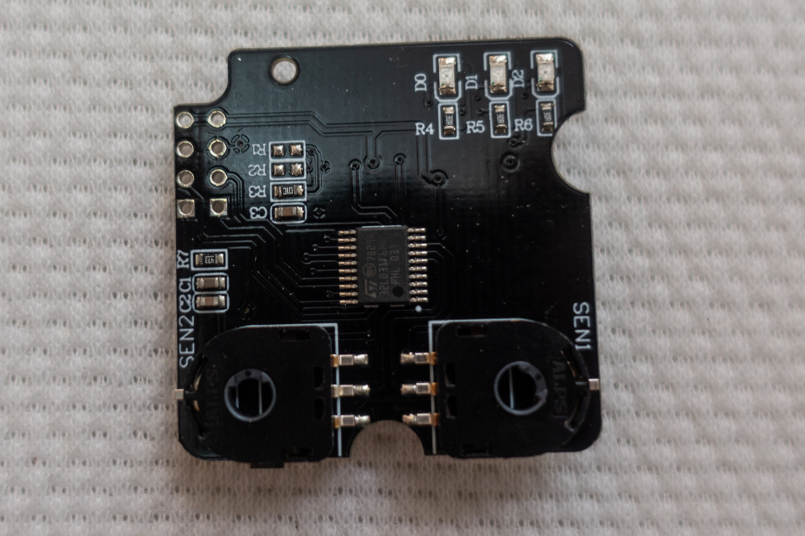
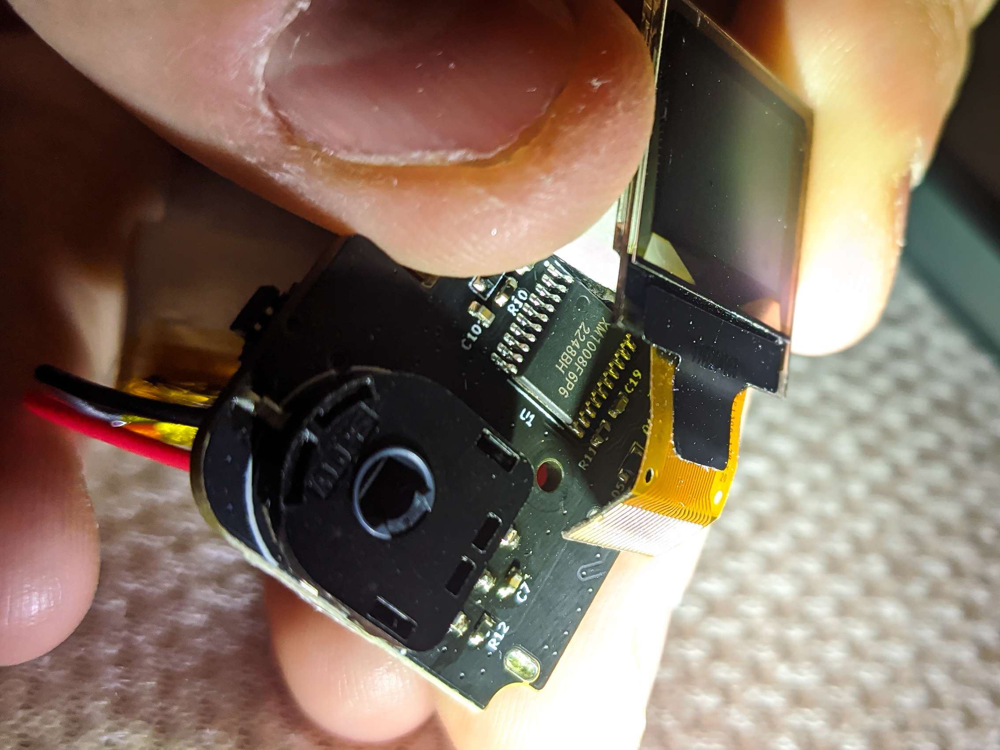

As fun as fully manual cameras can be, and Sunny 16 as true as it can be (although it's more like Overcast 4 in Poland), a small and light meter of the light can be really useful. For larger cameras such as Bronica S2A, Mamiya RB67 or anything large format, carrying a handheld Sverdlovsk 4 is no big deal - it's also reasonably precise, ensuring that every (expensive) exposure comes out well. But for the likes of Canon P a hot shoe meter makes more sense.

And since checking light intensity is mostly a solved problem, there's few reasonably inexpensive solutions from China.

Thus, last year I procured a TTArtisan one - first generation, which I've been using rather successfully, but not without its own pains. Now I've acquired an AstrHori one. Since they're both similarly priced (250-280 CNY), it only makes sense to compare them head to head.

# Why get a new one? - expectations

The TTArtisan meter is not without flaws, which will come out in more detailed comparison, but the main reason I decided to get another one is because of how determining right exposure works - by fiddling with the dials, until a green dot pops up. A light meter with a screen can tell you directly *some* exposure, and you can convert it yourself to desired aperture quicker than it takes to fiddle with the dials.

# On the outside - first impressions

With either of the meters you're getting a black box, with an outline of the meter on top of it. Notably, the TTArtisan one is 1:1 with the size of the actual meter, but the AstrHori box is smaller.

     

          
     

     

          
     

Inside both you will find the manual, and a screwdriver (TTArtisan) or a hex wrench (AstrHori) to change the position of the shoe, or open the unit up (I will get to it later, as curiosity has gotten best of me). The screwdriver on the TTArtisan one is actually too big for the heads they used, and I would advise using a smaller one to ensure not stripping the screws. Oversight, or a carefully calculated move?

     

          
     

     

          
     

Size wise it's quite obvious that the AstrHori is significantly smaller. TTArtisan just pops slightly beyond the front of Canon P and doesn't look too great, despite trying so hard to look vintage.

Having that in mind, AstrHori is heavier - at 49g, and the TTA is 38g. With the size difference, the AstrHori does feel more dense and solid.

Minor note though, with the topic of looks: holy shit, AstrHori, remove the fucking logo and fake-ass lines on the quarter of the disc. It's retarded. So fucking 1995. So fucking dumb I'm considering sanding it down myself, or getting some sticker on top of it.

# But how does it feel to use them?

On paper, the field of view for the TTArtisan meter is about 50 degrees (let's say, 40mm equivalent in 35mm), and AstrHori is about 30 degrees (about 65mm equivalent). In practice that doesn't change much.

The obvious difference in interface is how the measurement is displayed - AstrHori has an OLED screen with settings ready to be moved in, while TTA has three LEDs for -o+. As I mentioned earlier, fiddling with the dials to finally get that green light is a bit annoying. In bright light (midday sun, for example), the screen is actually easier to read, although both require shading with your hand a little to get a reading.

The aperture dial on TTA is click-less (that was changed to a click-ful in second generation, recently released), but the shutter speed dial is clicky. It's a bit tough to move, but alright, at least it won't randomly change the settings. ISO dial basically shifts the apertures. Simple, smart. I've heard that the ISO dial can move drastically on its own, but for me it really didn't.

The button on TTArtisan just wakes the unit up, and does one-time measurement. Simple to use.

The dial and button on AstrHori are the only two points of interfaces, and there's few more settings to change:
* switch between aperture priority and shutter priorty (double-click button),
* change exposure compensation (+- 3 stops in 1/3 stop increments) (double press and hold),
* changing ISO (double press and hold),
* toggling real-time measurement (press and hold) - if enabled, it will constantly do measurements, if disabled - only when the button is tapped.
* locking the measurement in real-time mode (press).

The information on the screen is also easy to read. Only problem is that every click of the dial changes the setting by 1/3 of a stop. Absolutely retarded. Most vintage cameras have half-stop clicks at best, and the granularity of a third of a stop is not necessary even for slide film, in my experience. That should be another configurable option.

TTArtisan promises 60 hours of constant metering on one CR2032 cell - I think it's a bit less. AstrHori promises 12 hours with its internal battery and is recharged with a USB-C port on the bottom. I would wager the TTA is more weather resistant, having less holes in the case.

However, the TTArtisan meter will die quietly - the green LED will go first as it requires higher voltage than the red ones; but will give reasonably accurate measurements up until suddenly it doesn't. So, replace the battery when you can see the green light going weak.

The AstrHori meter has a battery indicator on the screen instead.

The measurement on TTA is basically instant (although how fast you will get to correct settings, depends on you); AstrHori on a cold start takes few seconds. Before shutting down completely, it's in light sleep mode for 2-3 hours, and yields instantaneous results again.

The TTArtisan meter has a useful quirk. If it's too dark for its sensor, it will blink + and - few times, letting you know that you shouldn't rely on it anymore. The AstrHori will just show the lowest value it can go for - that is, 0.1 EV (at ISO 100). Keep that in mind if you go somewhere dark with it - the real light can be lower than that.

# On the inside - out of curiosity

Both units are easy to take apart, with the included screwdriver/wrench. Screws are easily visible. For the TTArtisan meter, in my case the battery compartment stripped, explaining the mess - I removed the stripped screw, glued the compartment to the rest of the bottom piece, and to change the battery you need to unscrew two screws, holding the case together.

Opening the panel shows the battery and part of the board:

The battery is easily replaceable in both cases - a generic small li-ion cell would have to be soldered on AstrHori, and a cell battery is popped into the TTA.

But neither boards show really anything interesting, besides 4 pins, probably used for programming. Let's have a look on the other side:

Both are using essentially the same rotary encoder. The TTArtisan is using an STM32L031F6P, directly connected to the battery. To get to the chip on the AstrHori I had to peel off the screen, stickied to the board; and I noticed a XM1008F6P6 - a direct Chinese replacement for STM32F030F4P6. The F series suggests they needed slightly more computing power to drive the OLED screen effectively. That also explains the shorter declared battery life.

     

          
     

     

          
     

# Conclusions

To be honest, I can't easily recommend either of them. I mean, they both do their jobs fine; TTA is slower to use but looks more vintagey; AstrHori has rather strong flaws with 1/3 stop step and ugly-ass communist red star logo with the website on the dial. So awful. I will keep using it however, as the measurements seem fine, and it still is faster to use in street photography scenarios.

# Addendum as of October 2023 on AstrHori reliability and repairability.

I have given away my TTArtisan meter as 'inferior'. I have enjoyed the AstrHori quite a bit, but one day the button stopped working.

I asked their support for a part number or anything that could help me replace it. Really. I will do it myself, even though I have no SMD experience. It's a simple button that is pressed on the side, after all. No answer, and I gave them the simplest possible solution. Not even a warranty repair. Fuck off.

I just used calipers - the button is about 3.6x4.7x1mm (6.4mm wide with 4 legs included). There are two pegs on the bottom that go into the PCB. Got 10 of them from Taobao for few yuan, and good because I did screw up the first repair - it didn't go all the way and wouldn't press well.

After the initial repair, also the rotary encoder failed - it would move on its own, or overshoot, or go back when I was rotating the other way. I assume I used too much hot air the first time around and melted something in there, although I've had this behavior briefly before - maybe it finally failed all the way.

The part number for that is ALPS RDC503013A - SMD, 4 pegs on the bottom. In order not to break anything more (there's few tiny capacitors and resistors around it), I opted for using the soldering iron and lifting the legs. Well, out of 4 legs, I lifted 4 legs and one pad, on 'top' of the part. I checked the datasheet for that encoder and thankfully it was a redundant pin, there probably for mechanical resistance, and the board had both of them connected too. Probably I could've epoxied it down, but for now I left it as-is. The damned meter works again anyway. Next time I'm buying a camera with a meter built-in.

As a sidenote, as AstrWhorey does not deserve to be advertised due to their inability to respond to the simplest request, their logo and website go off easily with a bit of sandpaper. May need extra polishing.