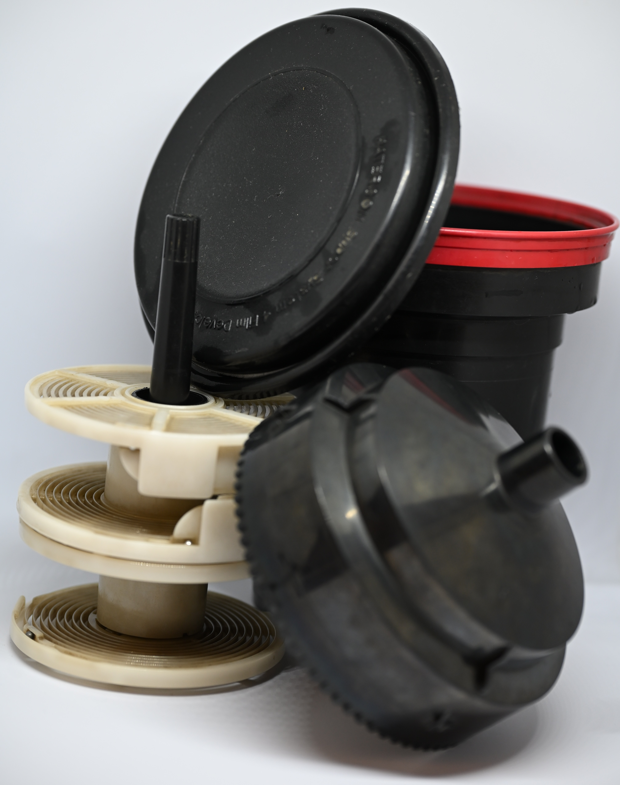
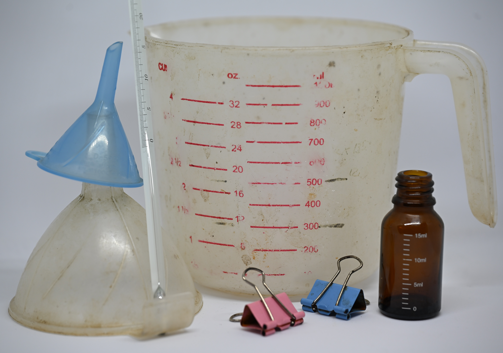
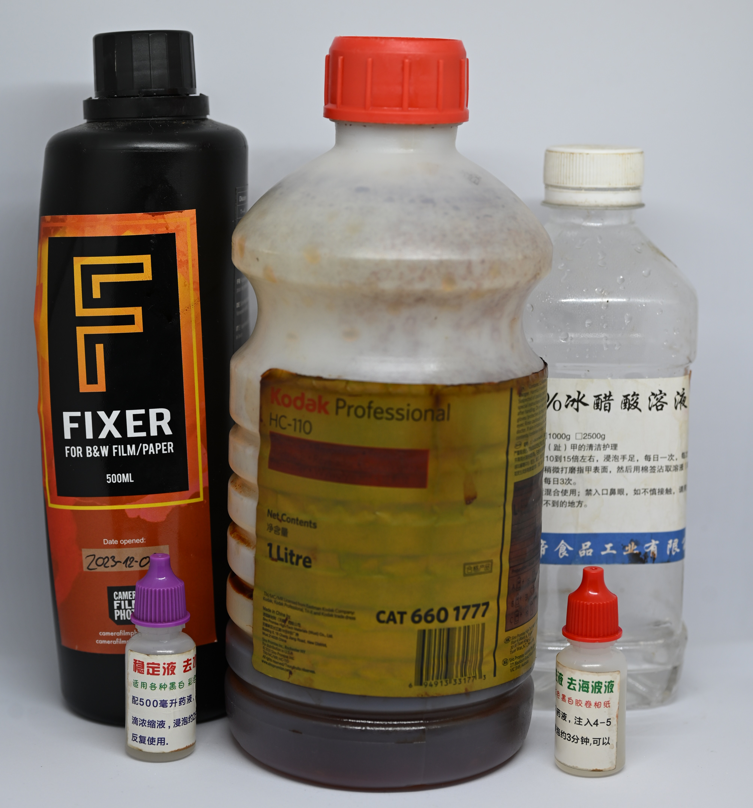
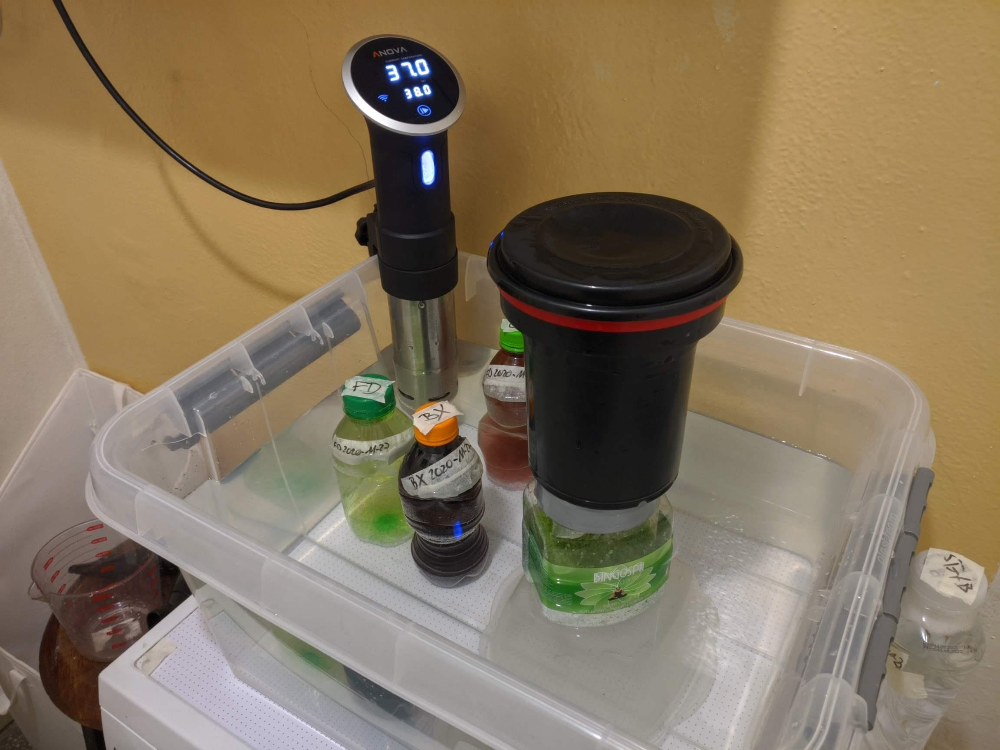

First of all: you don't need a darkroom. And also first of all: you don't need a "kit". 

Developing black and white film can be very cheap, but the initial cost may seem daunting. But let's break it down a little bit, and see where you can save some money.

## Few ground rules.

1. Anything with "photo" in the name is overpriced.

2. The kits give you stuff you don't really need, to seem like a better value.

3. There's nothing really complicated about development, but you gotta stick to the rules, at the beginning at least.

4. Initial cost may seem high, but development in a lab is expensive enough to get a return after just few rolls.

5. There are few things that you do really need and are photography specific and there's no way around that.

6. Color is a bit more involved, but not too much. More onto that later.

7. I will not explain the development process; there's many guides online and everyone has their own twist to it.

...so...

## What do you really need?

Basics of the basics:

1. Development tank. No way around that. Even for large format, tray development is tricky and ice cream boxes aren't a good replacement.

2. Developer. There are many options on the market, which we will discuss later, but again, no way around that.

3. Fixer. No way around that either. Many options on the market, including most basic salt, onto that later.

4. A dark place to move film from the cassette/roll/holder to the development tank.

5. A way to hang your film to dry.

Yep. That's it. Few other things I would consider essential:

1. Thermometer. Development time is usually defined for 20 degrees Celsius, and varies depending on the temperature. For example, around 27 degrees the time is roughly 30-40% less than at 20 degrees. If you know well your water temp whole year, probably you can skip that, but if it varies (like here in HK), you need one.

2. Stop bath. You can get away without it but I like to have it just in case.

3. Photoflo. Otherwise you'll get marks on your negatives.

4. Measuring jug.

Nice to haves?

1. Bottles to store your chemicals. But they don't have to be very special. If you get fixer and developer concentrate, you can get away without having them, but it's really not a problem.

2. For concentrated chemicals, a way to measure small quantities - a syringe or a small bottle.

3. Funnels, to pour chemicals back into the bottle if they're reusable.

## Basic equipment

### Development tank

As I said, there's no way around it. Skip old used constructions, just get a **Paterson Super System IV**.

Jobo options are nice and are ready for rotary development, but we're on a budget; we don't have money for overpriced electric motors yet. The Chinese options are also available, but the Paterson is maybe a little more and will last you forever.

If you get one used, make sure it's complete, with reels, the middle part, funnel, cover. Take good care of it, and you will develop hundreds of rolls, and pass it over onto the next generation.

For mine I got an AP reel, replacing one of the original reels, with wide guides, for easier 120 loading. In a pinch though? With enough practice you can load film onto the normal reel as well. Would recommend, but it's not essential.

### Dark place

So when I was starting out, I really had the concept of a "darkroom" in my mind. I had a windowless bathroom; put a blanket onto the door and a towel under it to kill any light, and moved the film from the cassette to the development tank.

That's free, if you have the opportunity.

However, I would say that a **darkbag** is almost essential. It's like lightproof pants that you close from one side, and access inside with your arms. Not only you don't risk a housemate turning on the light by accident, you can put the film onto the reels while watching a show, and in the field in case your camera malfunctions, it's much easier to handle, without having to carry the camera all the way back.

Not gonna lie though - in the field when I did not have my dark bag and e.g. got a fat roll with GS645S, I would use a hoodie, under a blanket, at night, to tighten the roll. You gotta manage.

### Jugs, bottles, funnels, thermometer etc.

Film development isn't too different from cooking. I mean, the instructions on how long to develop with what solution of the developer is often called a recipe.

So since we're cooking... head out to your local supermarket, to the kitchen section.

Grab a **plastic 1L measuring jug**. If it has lines for every 100mL, that's good. It's safe. Just don't use it for cooking later.

Not too far from the jug you can probably find some **funnels**. Super cheap. Again, just declare them for chemical use and it will all be good.

To store your chemicals, don't buy into the bullshit about harmonica bottles, the ones that fold. Yeah, better to not have air in your bottle, keep your chemicals fresh. So, here's a hack, in that same supermarket go to the drinks section. Grab a 1.25 or 1.5L **PET bottle** of your favorite carbonated (or not) beverage. I liked to get different bottle designs so they would be harder to mix up in the hectic development process. Then you can enjoy the drink and have something practical out of it.

For hanging film I use binder clips and a clothes hanger. Clothespins also work. Can't go simpler than that.

You may be tempted to get a film extractor or a canister opener. Well, if you don't care about keeping them, 135 cassettes can be opened easily in the dark with bare fingers shoved into the light trap. Yeah it requires a bit of force. If you still want to extract the leader, you can use the wet film method, detailed tutorials for which you can find online.

Similarly, in a pinch, you can get away without scissors - by loading the film with leader included, and by pulling out the film from the internal spool with a bit of force. But I'd recommend using them anyway. Just check out the stationery section of the supermarket while you're there if you don't have them yet.

Thermometer you may not find in the store for that cheap - I used a 1 USD thermometer from Aliexpress that had a digital screen and a probe on a cable. It really works. 

If you're using one-shot developers, you can get a syringe from a pharmacy, or a little marked bottle like I have.

## Chemicals

The part you cannot really skip, unlike above. But you can skirt some rules...

### Developer

So there's Caffenol, you can mix it with homemade ingredients. But I don't think it's much cheaper than commercially available solutions; people do this mostly for sustainability/ecology reasons.

I don't care.

Three options I would go with, personally:

* D76
* Rodinal
* HC-110

D76 because I was lucky enough to get hydroquinone and metol in massive quantities. But even then it's one of the cheaper options on the market. Remember you have to mix up some quantity and it's reusable for 10-14 rolls or so.

Rodinal and HC-110 are both one-shot options. They store well for long time. Just buy one big bottle, use them highly diluted (1:50 for Rodinal, H 1:63 for HC-110), and they last forever. Big bottle may be a big investment though, so D-76 may work better at start.

### Stop bath

The official option is something like Ilfostop. Yeah it lasts forever, I've heard.

People say water works well in lieu. Probably. With longer development times it doesn't exactly matter when the development is stopped.

There's a hack though. Developers are slightly basic, and they're neutralized by acid. You can get acid very easily.

**Vinegar**. In Poland I'd get the 10% kind, put some on the bottom of the measuring jug, add water to required capacity.

Here I can get 80%. I just add a bottlecap worth into water. Does it do anything? Dunno. Do I care? No. But I do get peace of mind.

### Fixer

Another thing you cannot really get away without, or your negs will be ruined. The old trusted option is just **sodium thiosulphate** - maybe you can get the crystals for cheap. However, that requires a long time (10+ minutes) to fix. Or just go with a commercially available options anyway - rapid fixer is certainly an improvement.

### Surfactant

There's one last step, after washing - putting some surfactant. The main purpose is to avoid water stain on the film.

Usually it's PhotoFlo, I got the Chinese equivalent for myself (one tiny bottle is enough for 50 rolls or so), but you can get with a drop of **detergent** or **liquid soap**.

Or you can do without, if your water isn't hard.

### Important: Marking and testing your chemicals

**Important notice**: mark your chemicals. Just so you don't mix them up, so no one else will mistake them, and mark each use on the bottle, so you can keep track of when you have to throw them out.

On top of that, since you're on a budget, you'll try to get as much as you can from your chemicals. **Test them out**.

You'll cut off the leader off 35mm film anyway before you load it onto the spool.

Cut it into two.

Dunk one part in the developer; it should get black within few minutes (around development time, maybe earlier).

Dunk the other part in the fixer; it should become transparent within 5 minutes. If it takes longer, your fixer is dying. You can extend the time and squeeze out few more rolls, but switch it soon.

## How about color?

Color gets a bit more complex. Chemicals can't be easily replaced with off-the-shelf powders, and you will need a way to control the temperature.

The first I cannot really help you with; the latter - yes. It's a well known hack; so much so that the Shitstill has rebranded their devices to sell at a premium (remember, anything photography branded is overpriced).

First of all, you will need a **bigger container**; a plastic box that would hold enough water to cover bottles with chemicals.

Then, get a **sous-vide**. It's a device for cooking in water, by keeping it at constant temperature... which is exactly what you need for developing color.

Look for a used Anova, or a Chinese option, but keep in mind that I noticed some of the cheaper Chinese options start temperature control from 50 degrees Celsius. Read the descriptions, listings, datasheets and make sure that your chosen device can go down to temperatures required by C-41 and E-6 processes (36-38 degrees or so).

Does it look ghetto? Yes. Does it work? Yeah, as long as the chemicals are fresh. E6 is a bit pickier than black and white.

# Total costs?

Don't know; it's very location dependent. Here in HK the household items from China are cheap, but development tanks are twice as much as in Poland.

Either way, following few simple rules and common sense for sure you can get everything for less than 100 USD in most places in the world; maybe 50; the development tank being the biggest initial cost.

But don't worry and don't get discouraged; the equipment you buy will last you for a very long time. You will only need to replenish the chemicals.