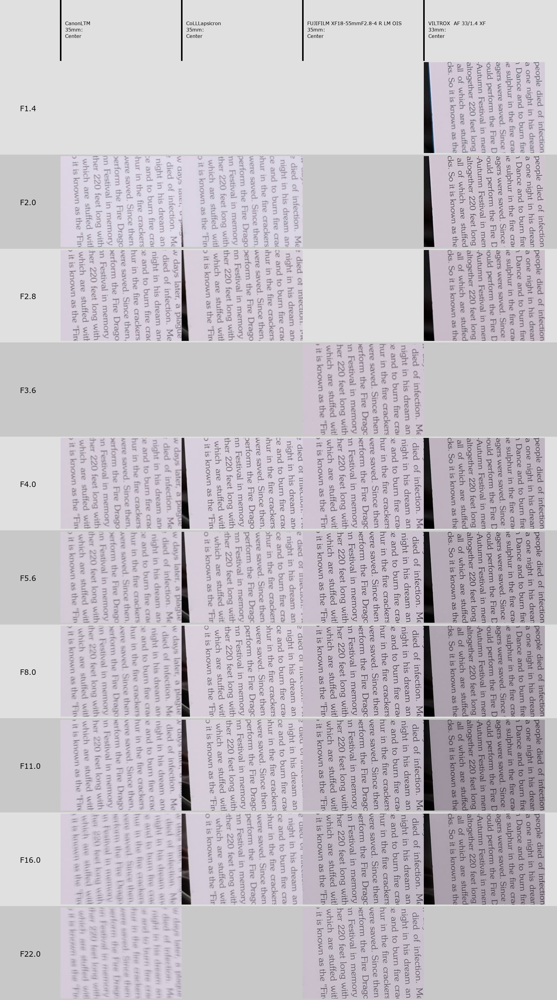

The lens that started out Light Lens Lab. Rare 8 element Summicron. Remade by the Chinese. I'm not a huge fan of 35mm, but I decided to give it a try - both Canon P and Hexar RF have the appropriate framelines, and reviews looked good. The lens itself looked bit quirky, and it was available in LTM, so I gave it a try. And these weird red dot people on the internet were constantly talking about EIGHT elements. Two more than typical double gauss... two more better?

From now on I'll be referring to the lens as CoLLLapsicron (pronounced collapsicron).

# Technical details

     

          
     

     

          
     

     

          
     

* Focal length: 35mm
* Maximum aperture: f/2
* Mount: LTM/L39
* RF coupling: yes
* Design: 8 elements in 6 groups
* Minimum focus distance: 0.5m (coupling depends on camera)
* Filter thread: None
* But accepts E39 hood
* Weight: 137.2g (without caps, adapter), 146.5g (with front cap, without M adapter)
* Dimensions: small

     

          
     

     

          
     

# In the box

`youtube: https://youtu.be/vbF4UrRL6Vc`

Please check out the unscripted unboxing video, I also show the lens on Canon P.

If you don't want to bore yourself with the video, in short: the box was pretty much the same as [Elelelcan](../blog/lll-elcan/). Nice white box, nice leather case that I will never use again, M adapter, caps. What was unique though is that with the collapsible version, you get the E39 hood. I don't really use hoods and if I do have one, it's because a bayonet and reversible, so it mostly stays in the drybox. I did notice it works on Canon LTM lenses though, and makes for a nice tube with the Canon 35/2.

# Handling

     

          
     

     

          
     

Well, it's small. With Hexar RF the whole set is pocketable (for someone with deep pockets, figuratively AND literally); with the Canon P the lens does not collapse all the way (despite claims that the lens is fully compatible with all LTM and M cameras, even M5). And even deployed it's not horribly massive either.

The lens cap isn't really tight either like on Elelelcan, so more often than not I find it in my bag rather than on the lens itself.

However, rather quickly I realized I should've gotten the rigid version. The lens IS solid when in fully deployed position, no complaints there; it's just... the little things. The fact that you do have to deploy it before usage. It has three valid positions, and only in one the orange aperture mark matches up with the focusing arrow - otherwise exact aperture is unknown. Well... with one quirk. The "I" in "China" on the beauty ring shows the aperture on the white aperture markings. It's EASILY fixable - just put a dot on the ring that is in front of the aperture ring. If the lens was any cheaper, I'd get a small drill bit and orange and white paint myself.

On the other hand, thanks to magical tech of Hexar RF, I don't need to know the exact aperture.

I found Elelelcan to be handling perfectly smoothly; the CoLLLapsicron is a bit stiffer in focusing, but aperture works nice. I do enjoy using the focusing lever too, albeit the top dingus that locks the focus in infinity does feel a bit loose. The focus throw is easily visible - 90 degrees from infinity to 1m, and then around 100 to 0.5m. It's definitely precise enough for this focal length, unlike 90/2.8.

I am however disappointed at the lack of filter thread (which I have figured out after I bought a 39mm yellow filter). Again, I know where it comes from, but for actual shooting, the rigid version is superior.

# Image quality (non-autistic)

Wide open is already excellent in the middle. I've been shooting black and white mostly with it and found it great; finally this year I got some Chinastill 800T from my good friend from [Hakonelog](https://shop.hakonelog.com/). At a first glance, I would call the images "digital" - something Viltrox 33mm f1.4 would've produced, okay, almost, a bit softer than that.

It's lovely for environmental portraits - separates your subject from the backgrounds, but also gives enough hints about what's going on otherwise.

The bokeh isn't quirky like on other old lenses I have (like Jupiter-3, Canon 50 1.8 LTM). It's soft, and pleasant, and probably adding to that "digital" look.

     

          
     

     

          
     

Quickly comparing with Canon 35/2 LTM (left) versus the CoLLLapsicron (right), both at f2 at a simple scene... well, there's no comparison; that lens is known to be low contrast at f2, and it takes up to f4 if not more to catch up.

     

          
     

     

          
     

I couldn't get the lens to flare much even on sunny days in most normal cases and as I mentioned, I don't use the hood much. The coatings are good generally.

     

          
     

     

          
     

    

          
     

Check the image quality reports in the autistic section if you wish for more information.

# Image quality (autistic)

So I took it out at short distance (1m) against bunch of other lenses I had in my drawer. I think there has been some shake in some of the pics, the Canon or Viltrox get worse with closing down the aperture. Tested of course on APS-C X-S10, so real corners are unknown - I test what I have, not what should be tested.

And for infinity I had to go climb a mountain, Devil's Peak:

In both cases, the images are usable across the frame from F2. Center becomes excellent at f2.8, middle also; the corners maybe f4. Splendid performance (if we forget about Viltrox 33mm for a moment).

# Conclusions

Has anyone figured out what the 8 elements are? Probably silicon, oxygen, iron, carbon, and some four more. For groups, we can try metals and non-metals, and solids and gasses, but there's still two remaining.

The only real problems I have with it are in the handling section. A stupid dot for aperture marking would make handling it much better.

Considering early LTM Voigtlander haze problems (and frankly, my Ultron copy was SHIT), it's probably the best LTM 35mm option on the market. Just I would recommend the rigid version. Maybe Nikon 35/2.5 or Color-Skopar could come close, but they're bit slower as well.

Even with the issues mentioned earlier, I would still rate the lens as 'excellent beyond usual usage', thanks to very good performance across the whole frame even wide open. For some, the handling may be a deal breaker - then consider the rigid version.

Oh, and at least my copy brasses really easily, really visible with normal handling after few months. A bit of a bummer, Elelelcan has much less wear visible on it despite being used more.