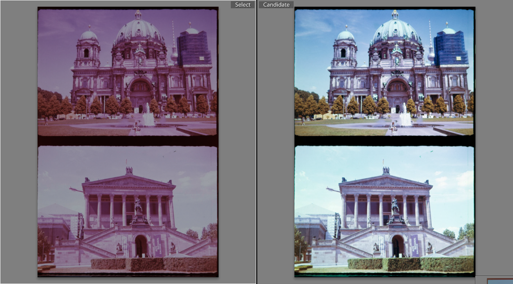
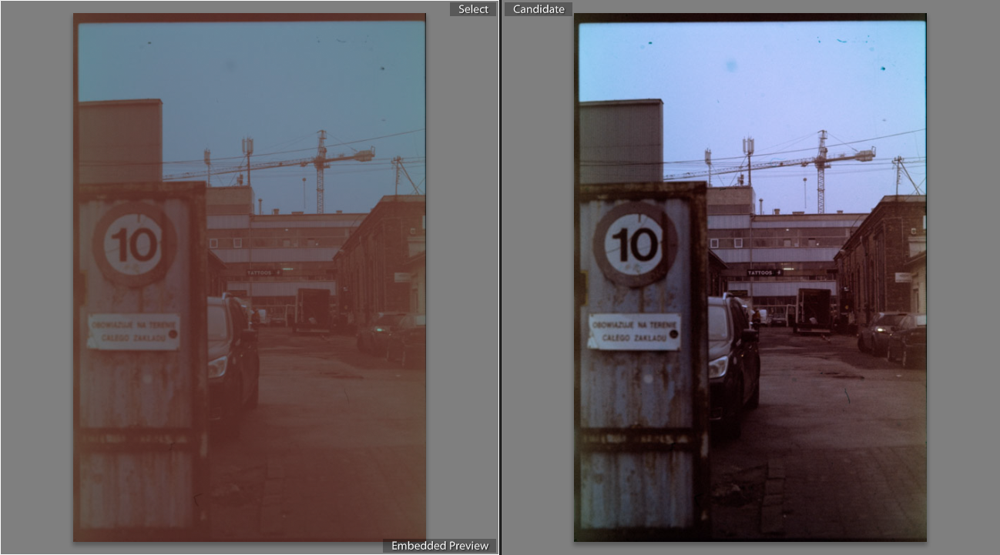
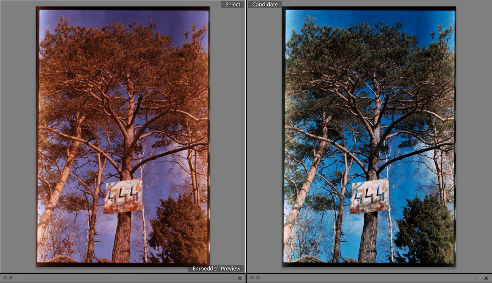
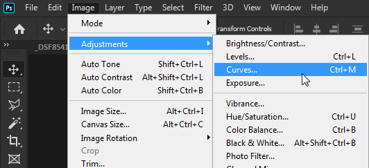
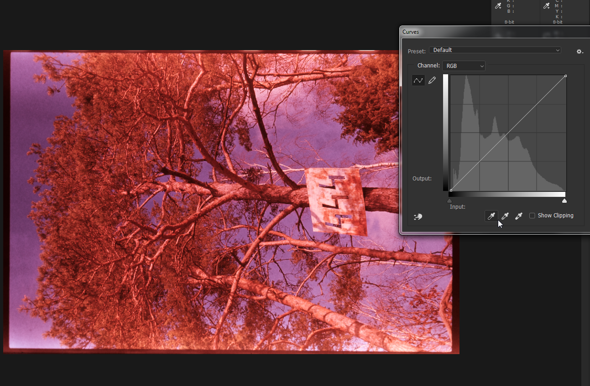

We all know how to deal with expired color and black and white negative already. Overexpose one stop per d- I mean, bracket, test, especially if you're not sure of storage conditions, but overexposing in general won't hurt.
All of that is to overcome the base fog that builds up over time through radiation and heat, and in case of color negatives, dyes may also start to degrade, producing color shifts.

Slide is different, though. Overexposed slide will have blown out highlights. Base fog doesn't seem to be the biggest issue here, but rather degraded dyes - blue and green degrade much faster than magenta. Somehow, the degradation is also much more severe than in equivalent color negative film too, making things more difficult. So in theory you should still shoot at box speed, but you would want to mitigate some of these effects too, and get usable results. How would you go around that, then?

Not too far back I got five rolls of expired Velvia, unknown expiry date, unknown storage. This gave me plenty of opportunities to experiment and see what's the best option here.

What you see in the first image of the article are three strips from that very Lelvia, shot and developed at +1 (pull), box, -1 (push).

One word of note: expired slide does not have to be completely degraded (especially cold stored, or expired just ever so slightly), so it may be still worth trying it out. Depends if you have more than one roll of it, of course. However, while slide that shows significant color casts is pretty much worthless for projection, it can still be scanned and color corrected. More on that later.

# Option 1. Dealing expired slide.

This is very immoral and probably illegal in some countries. Take the rolls you have with you and go to the shadiest places in your town. Stand in the corner...

*Psst, hey, kid, want some slide? First roll's on me...*

Or just advertise on a marketplace group or an auction site of your choice. Tell them that it's been fridge stored for the entire 15 minutes since you got it, that it's good for 'lomoh', 'experiments', 'cross-processing', and you are not responsible for bricked devices, thermo-nuclear war or sleeping in because you had a roll of film holding down the snooze button on your alarm clock. Slap a price lower than you think you can go, and someone may bite.

You don't have to tell the truth, but at very least, don't lie.

Getting rid of it, moving the problem from one person to another isn't the worst. With the money or fame you can afford a roll of fresh E6 film, maybe.

# Option 2. Shooting and developing at box speed.

Did the roll look at you with very cute eyes (OwO) and guilt you into keeping it? Great.

Let's begin with the basics. Meter, shoot, repeat, as if it were fresh. That's all there is to it. Frankly, you should shoot at box if you have only one roll of that material, or if it's the first one in the batch you have. See how bad the dyes have degraded, and plan your next move from there.

However, it would be a good idea not to shoot anything important or sensitive on that roll, just in case you really need perfect results. But then, you wouldn't have been shooting expired film in the first place, right?

In my case, however, it turned out very pink-ish. With post-processing, I could get some color out of it, but the overall appearance looked quite bad, and it required a lot of playing with digital tools to get to this level.

# Option 3. Pushing

Pushing refers to exposing the film at half the light (if pushing by one stop), and prolonging development. So in case of Lelvia, I shot it as if it were an ISO 100 film (i.e., E.I. 100), and developed it for 25% longer.

The logic here is fuzzy and I was mostly going by what my heart told me. My thought process was, okay, red dye is the main dye left, with a small amount of blue and green left. If I give it less light, maybe the remaining dyes will pick up the slack, especially with longer development times?

No.

There apparently wasn't enough dye left to do that really, and it only increased the apparent difference. After color correction in Photoshop, pictures turned out to be almost monochrome, with a slight faint hint of color. This dirty look definitely could suit some pictures more. The grain is much more visible, so if you're shooting drab places (for example, abandoned factories, or Poland), you gain a stop of light and a particular dirty look. It's not bad, and unlike with fresh slide, you actually have some artistic freedom.

# Option 4. Pulling

Pulling here refers to exposing the film to double the light (if pulling by one stop), and shortening first development by 25% (again, one stop).

Pushing didn't work in reducing the color shifts, so my thought process now was that pulling the film should "equalize" the differences in dyes. By (over-)saturating them with exposure and shortening the development time, there was theoretically less time for the magenta dyes to overwhelm the rest.

And this kind of worked. While the magenta cast is still there, the positives were very dense (the main image was achieved only through multiple exposures, with as much as +2 correction for the pulled roll!), I could actually see the blues and the greens with my own eyes.
Of course, it comes at the cost of slower film speed. Handholding ISO 25 requires some thought and is unsuitable for most moving subjects, but you do get the most color out of the three different process options.

To be honest, if the cast in positives shot at box speed is faint, or barely noticeable, pulling may get rid of it completely.

# Post-processing

Regardless of what option you choose, assuming you actually shot and developed it, corrections may be necessary. As for me, I find it easiest to do these corrections in Photoshop. It's probably doable in Lightroom too, as well as in open source equivalents, but the process may be different.

Once you open the image, you go to Image -> Adjustments -> Curves...

Using the pipette tools on the bottom of the window, first go with the leftmost one and choose the black point of your image. You can enable clipping preview, and in that preview click other darkest options until you finally find the one that's actually the darkest out there, to lose the least amount of information for later processing.

Same goes for the rightmost pipette and choosing the brightest point of your image.

Now that we're set, it's time to choose the midpoint. Try to find a part of the image that's somewhat neutral, or grey. Or try some other options around the image, until you're happy with the results.

...and that's it. Just gotta repeat it 71 more times if you were shooting slide in a half frame camera :))