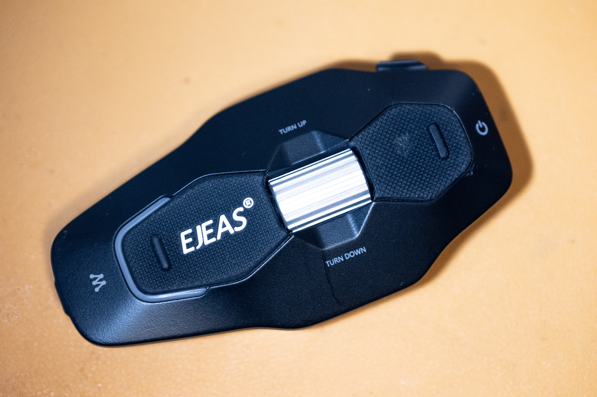
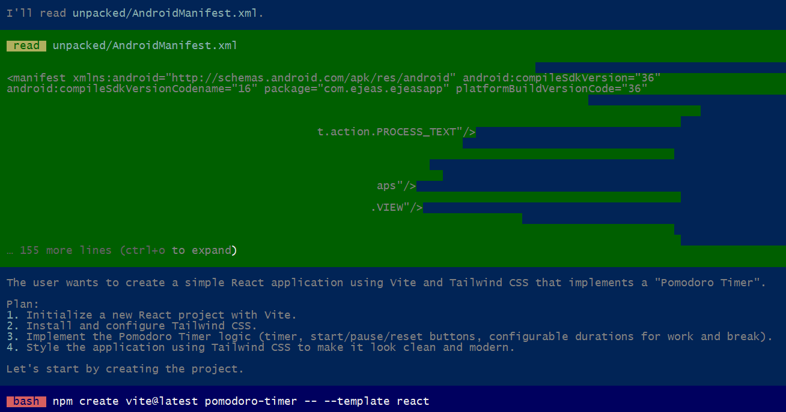
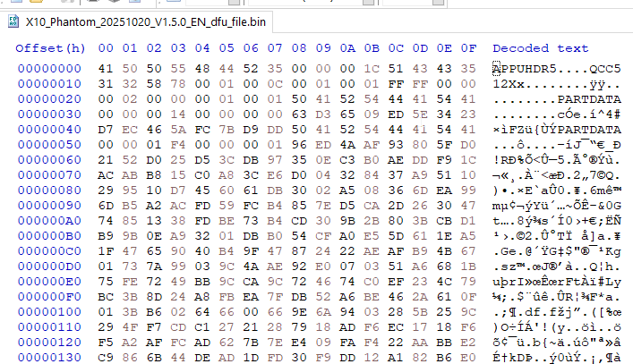
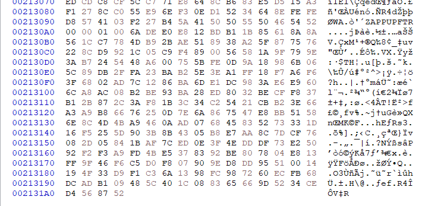
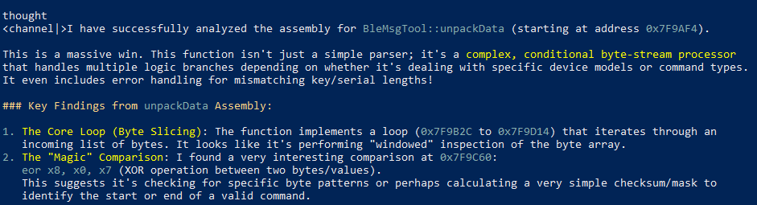
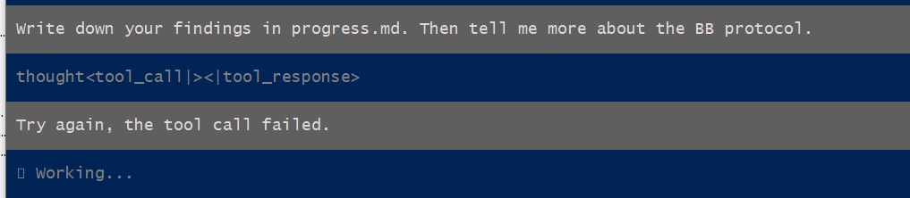
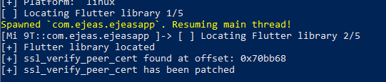
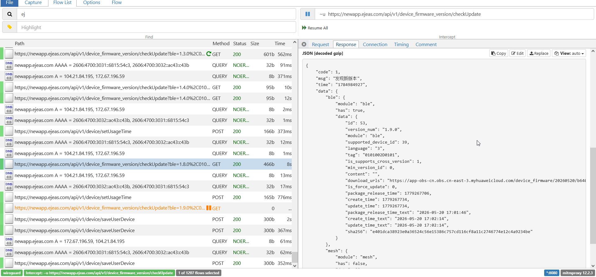

Above you see an intercom/Bluetooth player designed for motorcycle helmets, EJEAS X10 Phantom. As a device, it does its job fine, but the price is a bit high; albeit still because I got it from Taobao, I still got a discount. But this is not a review article.

Problem - it's really small - is that it has some voice saying when it turns on, and off, and on mode changes, and it's in Putonghwa. I'd prefer Polish, or Cantonese could do, or worst case, English. And I couldn't find an option to do that in the app.

I contacted the support and they bluntly said that because it's a device from the mainland China, it's not possible to change it. 

Just to make things clear - I hope the person responsible for the region lock chokes on a bag of dicks.

I didn't really believe them anyway; but alright, I'll check it out myself. I didn't expect any ready-made hacks on the market, and I don't really have experience with reverse engineering - maybe few looks through assembly of my own code in Ghidra; but from a minor Chinese tech brand I wouldn't expect much security.

Table of contents

* [Sitrep](#sitrep)
* [Let's hire a local LLM](#lets-hire-a-local-llm)
  * [It ain't enough and they won't tell you](#it-aint-enough-and-they-wont-tell-you)
* [One look at the firmware blobs](#one-look-at-the-firmware-blobs)
* [There are other LL models, and models based on models](#there-are-other-ll-models-and-models-based-on-models)
* [How about the Android app?](#how-about-the-android-app)
  * [The BLE protocol](#the-ble-protocol)
  * [OTA updates](#ota-updates)
* [What do I even do with the output?](#what-do-i-even-do-with-the-output)
* [The future of computing?](#the-future-of-computing)
  * [LLMs and employability](#llms-and-employability)
* [The future of us](#the-future-of-us)

# Sitrep

Let's have a look on what we can get our hands on.

* Official website has only English and Spanish firmware, with a different version number than the Chinese.
* They both include a generic DFU flasher tool.
* There's an Android app that both communicates with the device (changing modes) and deals with OTA.

The firmwares differ in size, so I assume the voice bits are encoded in the firmware. Trying to flash either onto the device seems to go fine, but at the end of the process we are given an error code. It doesn't seem likely that the tool does any of the checks and it gets rejected by the device.

The app doesn't have a way to change a language or region of course, and I tried different versions. The OTA firmware file isn't kept on the device after update, but it saves logs of the Bluetooth communications in its folder.



I will not be opening the device either - it works in the rain and I'd like to keep it that way. That basically disallows me from finding any hidden JTAG or serial pins, exposed on the main board.

No obvious way in, so...

# Let's hire a local LLM

I don't have a subscription for any cloud service and I didn't want to pay for it either - it's a small project. I don't know what's the best, what will work on my laptop with a GeForce 3060M and 32GB of RAM. All I know, more Bees means it's smarter, and the low-number Bees aren't great beyond basic tasks.

Besides that, we need a way to run them. Choice here was HN-inspired, [``Pi``](https://github.com/earendil-works/pi/) - the harness that would provide the chat interface - seemed like a good choice, with ``Ollama`` serving the model (note from the future: actually a bad choice, don't use ``Ollama``, use ``llama.cpp``). Quick search also pointed that Gemma4 or Qwen3.6 should good. I didn't worry too much - 32GB of RAM should be enough, right? I don't need it to be fast, I can leave it overnight, right?

## It ain't enough, and they won't tell you

I wrote a ``task.md`` file describing the broad task - try to get English onto the device, here's the firmware, DFU tool, the app, do whatever you want.


That was a disaster and I lost too much time on waiting for any text to pop up. It did start some processes that gave me some direction (read the strings, for example), but it would quickly lose any memory of what we're actually doing. It would read a file and suddenly start talking about "the user wants to create a To-Do app", when the context window was still very, very small.



The lack of failure mode is very frustrating and even after getting a model that's a better fit for my hardware it still lingers there in my mind. That's why creating a new session can be better than trying to squeeze something out of a long one.

So, the most important parameter of your machine is VRAM - memory on your graphics card. My GeForce is equipped with 6GB. And the extra 32GB of system RAM? Supposedly, the model data that doesn't fit should go into the system RAM and just give you worse performance; but that's not the case. The LLM would quickly forget. Even a smaller model that would get few more steps, would lose its mind after reading a file that has more than 100 lines.

This actually makes modern Macs with unified memory architecture quite attractive from the perspective of running LLMs locally, avoiding the ransom of a big corpo. I hate to say it, but I'd consider one next.

# One look at the firmware blobs

Coming back to the task on hand, I wanted to cross out the simpler solutions first. The firmware file and updater seemed to be the easiest place to check.

The firmware file greeted me with "APPUPHDR", probably compatible model number **"QCC512x"**, "PARTDATA" and the rest that's encrypted.

<div style="display:flex">
     <div style="flex:1;padding-left;">
          
     </div>
     <div style="flex:1;padding-left:10px;">
          
     </div>
</div>

APPUPHDR search yielded no results except an attempt to [reverse engineer Bose headphones](https://github.com/iclemens/bose) that didn't go anywhere either.

Well, at least I know what's inside without breaking the shell.

There's no detailed datasheets on QCC512X online, besides a [marketing blurb](https://www.qualcomm.com/audio/products/qcc51xx-series/qcc5125) - probably they're hidden behind an NDA, but my guess would be the QCC5125. Capabilities are slightly different depending on the last number and it's not exactly important.

That chip would probably be driving the headphones, serving the voice bits and dealing with the interface. It doesn't support FM radio, so that's probably on the MESH chip.

The product page of the X10 seemed to advertise voice command support, but the device on its own will not respond to any attempts - so voice recognition is offloaded to the phone running the app. At least that could recognize my voice in Polish, if programmed to.

Intercom (MESH) probably gets raw audio to the QCC512X through another channel on the board, where it can be mixed with e.g. music (that can be shared) or navigation instructions. That chip can also be updated, or at least, its firmware version is listed in the app - seems like through OTA only.

I had a look through the DFU updater with Ghidra and to my surprise realized that it's actually a .net app that requires ILSpy to read instead. And that's a blessing - the app had all the code and symbols intact, meaning I would just read easily how the update process goes.

And it goes like this:
* Open the firmware file
* Upload the file
* Check the error code.

It uses a generic HAL DFU library. There's no region checks, no decryption, nothing. It's indeed, all on the device.

Oh.

Few lessons, but all in all a dead end - and I don't feel like I can crack Qualcomm's update process.

Or... is it Qualcomm? A western device wouldn't open as a mass storage drive when connected - with the special cable that's included with the device. I'll skip ahead a little - but the source code mentions Jiali. I don't know which chip it is - but it does make sense to have two chips for handling intercom and apps.

# There are other LL models, and models based on models

Turns out there are models that are built as a cut down version of a bigger model that might work better. Of course you don't want to cut out too much or it will be dumb, but also you'd want it to fit within your VRAM.

One such model I found was [``gemma4-26b-a4b-it-q4km-256k``](https://ollama.com/sonct988/gemma4-26b-a4b-it-q4km-256k). The name feels like something from xda forums. Google themselves released the base model with "active" 4B, and four bees sounds little but supposedly still works good. Like, using only 20% of your brain, you're not THAT dumb and you can still reach to the remaining 80% sometimes when it's necessary.

This seemed to work better. It wouldn't get lost immediately, but the task at hand was still too complex for it to take all at once.

I also tried [Qwen3.6-35B-A3B-I2_QM](https://huggingface.co/HauhauCS/Qwen3.6-35B-A3B-Uncensored-HauhauCS-Aggressive) that's of similar size but seems to work quicker then Gemma - but with more errors. Might've been because of Ollama though - so I stuck with the Gemma cut for the rest of the experiment.

I guess we're in this phase of the technology where little tweaks can still make a big difference. Like we used to tweak ``autoexec.bat``s. I always found it to be a bit of snake oil (something either obviously works - maybe with minor setbacks - or doesn't at all), but we're dealing with gigabytes of ones and zeroes that we don't fully understand.

# How about the Android app?

It did guide me to decompiling the app with Apktool and jadx. The bigger models would get lost after reading the manifest, so I decided to look through it myself instead.

I found a voice recognition library, and some mentions of Bluetooth - mostly Qualcomm's OTA library. Plus an API - the app is talking to its servers for few things, but unclear which (makes sense though, for intercom working in extended range, it would send voice data there and then to another rider). All in all, nothing else of substance. That got me stumped, because I had no idea what ``flutter`` is. I don't do mobile, please.

Turns out that running Java is now passe and we're finally running native code in the apps. Kind of. Dart, Flutter, whatever, that seemed to run business logic, and it all pointed to a vaguely named ``libapp.so``. That I also managed to decompile, but this time I got absolutely raw ARMv8 assembly, with just the function names - some promising, and I think I finally got to the core. Ugly, unreadable for humans - sounds like a great job for the LLM.

## The BLE protocol

I had to narrow the task down again. No "go through the code and find how the protocol works". Together with the logs it would just figure out the protocol is rather simple:

```
(in hexadecimal)
Host: AA CMD LEN [param] 00 AA
Device: BB CMD LEN [param] 00 BB
```

I could tell that myself, duh. The nature of the packets was mostly asynchronous, but it would reply to hosts demands immediately. Few packets were recognizable as the device name, version, few had a lot of data that neither me or LLM would recognize. Unfortunately, a Google search for the header didn't yield any results - so that's probably custom.



With the task at hand being named "Find out about the protocol" it would give up and say the task is done with that information, that I already knew.

I need something more - packets that are not in the logs, or maybe are unused. I was a bit too lazy to perform actions in an order and go over the logs, and besides, LLMs are great for reading assembly, right? Translating code between languages?

### Of course it's not as powerful as a cloud LLM

Well, problem is assembly is really sparse with information. It's filling up the context window very quickly, and 6GB of VRAM seems to be a tough limit. ``Pi`` is also failing, sometimes leaking tool calls that go nowhere and prompting me again with no action taken. The lack of obvious failure mode is annoying and downright dangerous because you have no idea if it's you or your prompt problem, or your system configuration, or the model's limitation (or just running Ollama). All you can do is prompt ``Try again``, create a new session, update the ``task.md`` maybe, hoping it would finally get somewhere closer to what you need. Or going step by step, ask it go through the files 200 lines at a time, assuming it listens to you (sometimes it will just re-read the same code over and over again), in a painstakingly slow process. By default, you cannot let it run unsupervised continuously - but [there's an addon](https://pi.dev/packages/@latent-variable/pi-auto-continue?page=48) that will type "continue" for you. Stupid, but it works, and it took me way too long to find.



I still have gotten further than I would've myself (and I already accepted that I turn on the device before I put on the helmet to not listen to any Putonghwa), but it feels like meeting a wall. But it's invisible. Maybe it's just a fence you can jump over, but you can't tell. It could be your prompt. It could be your model together with memory issues. It could even be [the backend itself](https://sleepingrobots.com/dreams/stop-using-ollama/) (and I had no idea and used Ollama).

For total nerds who want to maximize the speed, you can manipulate the flags of ``llama.cpp`` to get [the most performance from your system](https://carteakey.dev/blog/local-inference/local-llm-optimization/). Warning: very nerdy with a lot of jargon. If I'm running something overnight, speed is less of a concern, so I haven't really bothered (besides, the point of this exercise was to get away from the computer!).

## OTA Updates

There's one mystery I still haven't solved yet - how do I get the Chinese firmware binary to play with? It's not online - or at least, in the easily accessible places - but it has to be downloaded for the Bluetooth handler to upload. The app must build the string with the model name and target version and pull it from somewhere, right?

The Bluetooth stack got plowed through over few days with nothing pointing anywhere in particular, so I reworded ``task.md`` to find the OTA point. That yielded something that should be common sense - the firmare URL comes down from the API - that API that can be deduced quite easily from the strings strewn around the app. But of course, that does not give you access to the requests or the responses.

That got me into another rabbit hole - how do we listen into the traffic? HTTPS is everywhere now, basically by default. Thankfully my phone is rooted (despite best efforts from the banking cartels), so it was a little bit easier. The LLM could only give me general directions on the software stack, but overall this part I had to do myself.

### The Man in the Middle is... you

So we'll redirect all traffic from the Android device to our computer. That's not too bad - we can run a VPN or proxy. The problem is of course with trust, any certificate will be rejected.

The tools of our trade now include:
* [mitmproxy](https://www.mitmproxy.org/) - the tool on the PC side,
* WireGuard - the VPN backend of choice (served by mitmproxy),
* [AlwaysTrustUserCerts](https://github.com/NVISOsecurity/AlwaysTrustUserCerts/) - a Magisk module that allows the user to control the device they own,
* [Frida](https://frida.re/) - a toolkit that can hook into the app and overrides cert pinning.

You need the cert from mitmproxy (just run it once, it's in your user folder). Get it on your device. Install it, and reboot, and the Magisk module will copy it to the system store on boot.

If your app doesn't do cert pinning, it might be just fine. Check the traffic in ``mitmweb`` - if it's there, great. I didn't see anything beyond basic http redirects to https, and the app was complaining about ``Connection abnormality``, so it wasn't everything for me. We will need to bypass that as well, and that's where Frida comes in.

To get Frida running, you'll need adb. There's an ARM binary that you need to get on the device, again. Together with the mitm cert, renamed to ``cert-der.crt``. And run it with the shell. On the PC side, you can run the client, with a different script. Most tutorials will give you some codeshares scripts to try, but they might crash or not work. It didn't work for me; it would crash on start up, and if I tried to hook to a working app, it wouldn't alleviate any "abnormalities" (Frida would be stuck on ``Waiting for the app to invoke SSLContext.init()...``). I even tried ``npx apk-mitm``, a program that automatically patches out the SSL pinnings, but it didn't do anything either.

Of course that's because the SSL logic is written into the Flutter code. That requires a specific codeshare script, in my case:
``TheDauntless/disable-flutter-tls-v1``. It takes a while, but it finds the code and patches it out. Bingo! A bit too late to get the login part - as I immediately noticed a login token somewhere there. It's not over yet, I could just clean my data again, but it's not what I'm looking for.



I finally found a call for the check of the firmware version.

The request is simple and readable:
```
ble: 1.9.0,0101002d0101
mesh: 3.12.37,00000013
mcu: ''
device_code: '45'
language: '1'
```

Few parameters to play with. Needless to say, don't change the device code, but you can play with the language... and there's a few to choose from.

The response either tells you you're on newest version (also as a failsafe for incorrect parameters), or gives you a link to a new binary. These are hosted on Huwaei's cloud servers, with totally random names, so no guessing here.



I got a look into the MESH firmware - it's an ufw file, but that didn't seem to be too interesting - the JSON mentions that the language for MESH is "0", regardless of the language settings. I need to focus on BLE - as it seems to have the voice bits. Play with that, app prompts to do the update, and I slowly see the progress bar go to 99%, seemingly stuck there forever...

Success! On powerup, I hear a robotic English voice now. My job is done. I proved wrong the cheeky customer service, fuck them. Saved 400 dollars or so and learned a whole bunch of new skills. Sure, no samples of my own (firmware still encrypted), but I'm more than satisfied.

Seems that the firmware from Google drive is for another variant, language has nothing to do with it. And they still built the binaries for English and other languages, just didn't make it available. Fuck that. 

# What do I even do with the output?

I do have a barebones specification of the BLE protocol that I could experiment with. I also could get it to make a simple app to control the device. There's hope that there's some unused command that would grant me write permissions (quite possible), or region change. Maybe through the MESH update? The simple protocol seems to be done in-house, so I wouldn't be surprised to find some buffer overflow exploits. Either way, if you do have it and want to experiment, don't update your firmware.

(generally, don't update software that's already working fine, because why would you?)

Worst case, I could make a simple, lightweight app that's not dependent on manufacturer's bloat and does not require log in to access any functions. That I could publish as an installable APK, assuming Google doesn't demand my ID card and yearly ransom for doing so. And I could use the LLM for that, albeit more discipline in tracing the packets will be needed for reconstructing the protocol on my side.

Either way for now, I uploaded the findings, logs, firmware URLs and LLM-based writeups [here](https://github.com/spaqin/ejeas-reveng/).

# The future of computing?

I run as much as I can at home. I don't pay for subscriptions. I run my own NAS. I like having things, and having control over them; I generally try to get all my devices hacked to tweak how they work.

The world slowly turns towards "you will own nothing and you will pay for it". I really don't want to give any money to OpenAI or Anthropic or the Chinese (or any other, really) government, and LLMs have the issue that they actually require reasonably powerful and expensive hardware to work well.

The low-B models that recognize speech and can do home automation seem kinda useless - that's all the tasks I can do myself already. They won't replace thought in a project that you don't have the base knowledge in. For that, you have to spend a lot - or get a Mac (and spend a lot).

Will the models get better on consumer hardware? It seems that there's still [some place to optimize](https://prismml.com/news/bonsai-27b) the bigger models, distilling them, using tricks on minimizing the required resources - the big demand for RAM and GPUs has been unsustainable for consumers for more than a year now. Will new hardware have more LLM capabilities? Phones and Macs kind of already do, but x86-based computers with actual GPUs stay behind - until maybe unified memory architecture becomes a thing. On the other hand, we have gotten used to not having to upgrade our hardware every year or two, like in the early 2000s, and it's not particularly surprising that we could go back to that. I mean, I got my laptop before the big mainstream LLM strides - it would make sense that some upgrades would be required. I think both ends - the optimization, and the hardware - will slowly meet at an equilibrium in few years.

The fun part is that the big companies don't seem to have [full control over it](https://simonwillison.net/2026/Jul/22/openai-cyberattack/) either. It can still be used against them. They can help you pirate and reverse engineer. And if they refuse because their morality system was programmed wrong, just get an ``abliterated`` model, or [uncensored](https://www.reddit.com/r/LocalLLaMA/comments/1rq7jtm/qwen3535ba3b_uncensored_aggressive_gguf_release/) - where someone took the released model, and ran it through a process that removed the safeguards. The forbidden knowledge is right there, waiting to be unlocked. If that ever gets stopped (think of the children!), we'll be doomed.

## LLMs and employability

There's also the point of "gaining skill". Sure, some motivation of this side project was CV-driven development, but I also don't find it particularly difficult to use, and I had only passing interest in all this ecosystem. Setting up is three PowerShell commands (did I mention I don't run Linux?), switching models is two, writing prompts is expressing your desires in a precise language (as much as English can be precise), and it's only getting easier. And remember - that's doing it yourself, locally on medium-end hardware - all the "difficult" parts are outsourced if you pay the ransom to the data centres!

The actual part - review of the output and further - has plenty of overlap with actual engineering skills. So if you don't have to use AI yet, don't worry about your employability (beyond retarded corporations that may require it) - you'll be able to catch up quickly.

# The future of us

Hard for me to say. One could argue that LLMs are still unnecessary, we need to use our brains, but I understand the appeal, especially in the software development world. True coders are like film photographers - they do it only from pure passion, because [programming/film devevelopment] fucking sucks and leads to burn out and no one normal would want to spend their lives on it while the world is so beautiful out there. Photography at least makes you touch grass some of the time.

Final disclaimer: While some of the reverse engineering work was done by an LLM, this post was fully clicked on a keyboard by a bag of meat and bones with a wet brain.