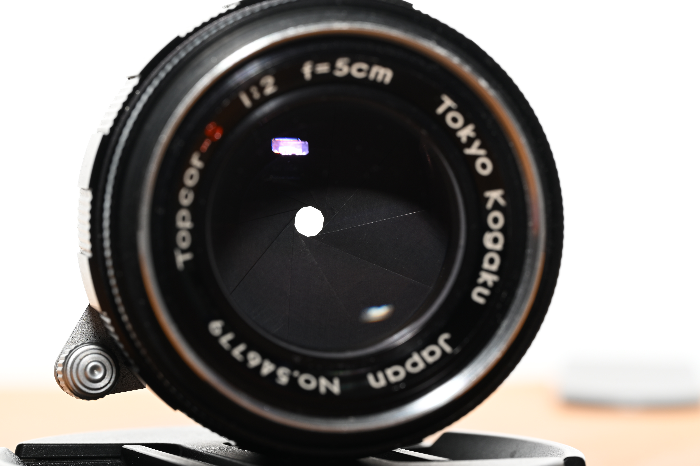
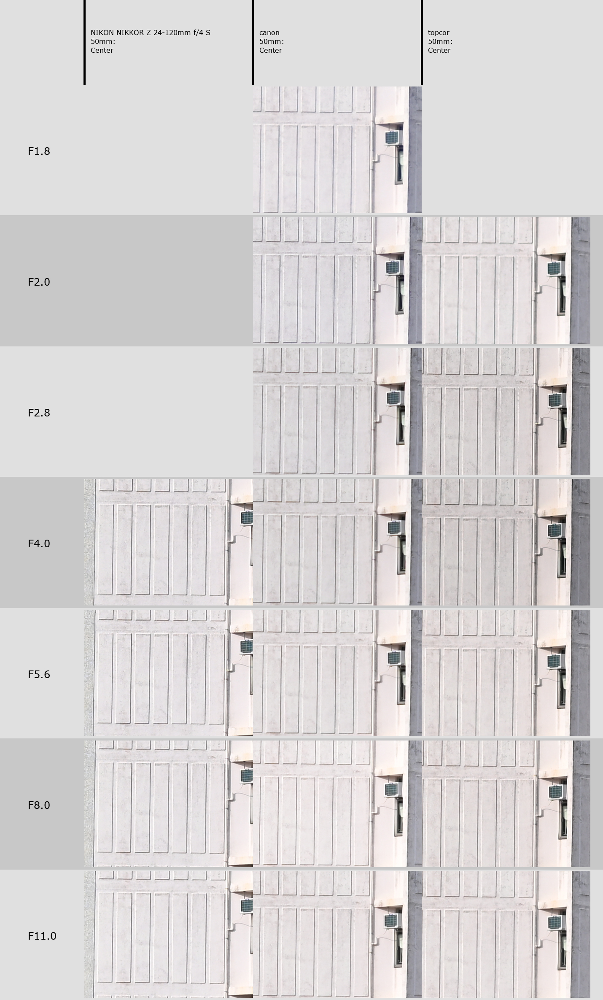
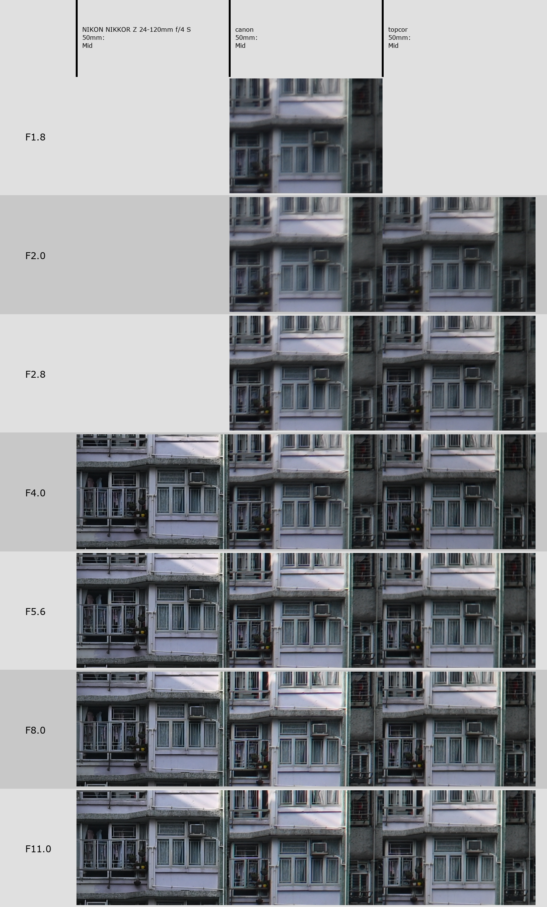
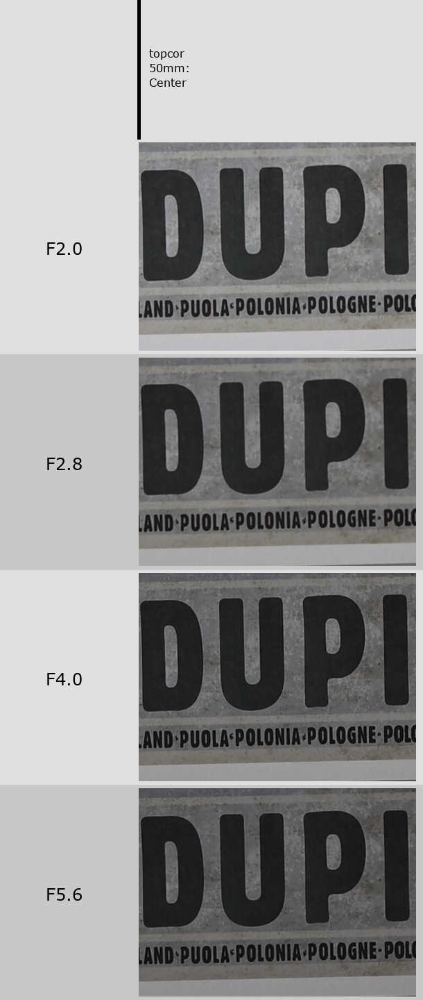
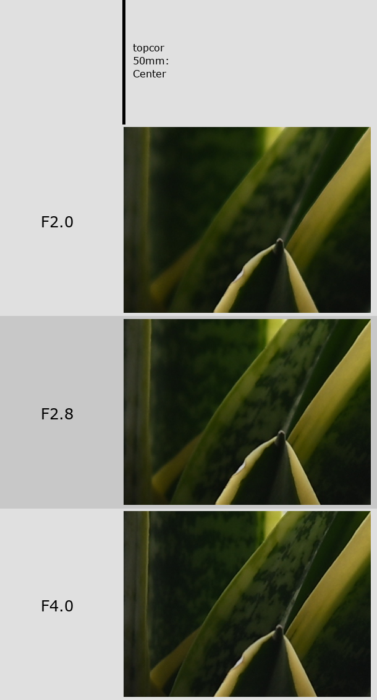

Here's a unique piece from a forgotten company. Something I've heard briefly about - the only Biotar lens in LTM, and a favorite of some guys online. The Biotar thing you might've heard of before, as it's the formula of the most overpriced cheap lens in the world - the Helios 44, mostly known for the swirly boke effect.

And in LTM, there's only one lens that shares the formula - the Topcor-S 50mm (or 5cm) f2. Don't mix it up with the non-"S" variant. Truly one of a kind.

The lens looks slick, especially in the newer revisions (never a fan of the all-chrome barrel). And while it's not easy to find - I have never seen one locally - if you look abroad, into Japanese auctions, you can find few examples. I found a clean copy, no fungus or major scratches on the glass, but that had its price; wasn't particularly cheap. It arrived with some other things in a consolidated package.

And I immediately loved it.

# Specs

* Focal length: 50mm
* Maximum aperture: f/2
* Minimum aperture: f/16
* Mount: LTM
* Focusing: Manual, with rangefinder coupling
* Minimum focus distance: 1m
* Lens design: 6 elements in 4 groups
* Aperture: 10 straight blades
* Filter size: 40.5mm
* Weight: 212g

# History

Topcor is one of these companies from the golden era of Japanese copying in the 1950s, that went into the other golden era of Japanese innovation of the 1960s, but slowly disappeared by the 80s. History of the company is rather murky on the English side and I don't have much more to say. There's an interesting site [in simplified Chinese](https://zhuanlan.zhihu.com/p/1904088547033580715) that outlines the history better with press examples.

The outline is that Topcon 35-S, a short-lived fixed-lens rangefinder, was equipped with a 44mm f/2 lens that was the basis for the later Topcor-S LTM lens. There was also an earlier, Topcor 50mm f/2 lens, that had 6 elements in 5 groups, not to be mixed up. The "S" in Topcor-S stands for "Special".

It looks like this lens has been introduced in 1956 as well, as a kit lens for Leotax rangefinders. Leotax is another Japanese manufacturer, that hasn't survived beyond the Barnack copy phase, winding down in the early 1960s.

The lens has gone through few designs. At first it was available in full chrome or panda (chrome with few black elements), slightly tapered towards the end. Focus ring had two strips for grip, aperture - one; and the aperture had markings for every 1/3 of a stop. Focusing ring would rotate whole 168 degrees for the full range; a precision instrument.

The version that I have seems to have been introduced in 1958, with Leotax TV2, in either full black, or black with silver lines. This time, the barrel is completely straight; focusing ring has a hills-and-valleys style with a focusing tab. Aperture is in the front, only with full stops this time. Full rotation of the focusing ring was also significantly shortened to 88 degrees for quicker shooting.

The optical design has not been changed between the revisions, only the barrel.

In late 1958, the f1.8 version has been designed, with a similar optical formula, sold with Leotax G. The barrel is basically the same. That lens seems to be even rarer and more expensive than the f2.

# Handling

     

        
    

     

        
    

My copy came broken, probably shaken all around during transport. The lens consists of the focusing block with the helicoid and rangefinder coupler, and the optical block with the aperture; the latter was loose. Both of them are held together with a ring in the rear of the lens, not unlike Canon's LTM lenses. That just needed tightening with a lens wrench - I use the Neweer kit. Two minutes and we're good to go.

I will keep comparing the lens to Canon 50/1.8 - as it's one of my favorite small lenses that I often adapt on Zf. Don't be surprised, that's my only real point of reference.

First impressions? It's heavy, and a bit bigger than I thought. LLLcan is more pocketable for sure, but surprisingly the Canon 50/1.8 is smaller as well. Still fits nicely on Canon P, with a bit of viewfinder blockage, but still manageable. On Hexar RF the viewfinder is not blocked at all.

The barrel is solid. Focusing is smooth and quick, thanks to the short throw mentioned earlier, and the focus tab. The focusing set mark is at an angle, towards the viewfinder, like Canon.

     

        
    

     

        
    

Aperture clicks confidently in place, at full stops, but leaves plenty of space for intermediate settings. The aperture marker is straight on the top. The offset between the two was a little upsetting (and confusing when I was fixing the alignment as mentioned earlier), what was the point? Are you supposed to see the focusing distance in the viewfinder, somehow? If I'm checking the settings, I check them by looking from the top. That doesn't matter that much though - in practical use, with rangefinder, it doesn't change anything.

Regardless, the total package feels great. And I had a quick look inside - there were no service markings, only the original factory calibration scratches, so I don't think it's been ever serviced. To describe the feel, I'd want to use "Leica-like", but that would be a disservice to Topcor. It's better.

# Does the optical formula really matter?

A bit of a side tangent.

Biotars, Gausses, you look at the diagrams, they're looking very similar, maybe some elements thicker or thinner, but that could also be the artist's rendition. Does it really matter?

In real life, no. With the exception of Tessar. Tessar sucks, despite whatever marketing Zeiss is trying to fool you.

What matters is if the image is sharp enough for your use case, if you like the outcome (see: [The Void](./the-void.md)). Arguing online about the look of the out-of-focus parts of the image should be left to the truly dedicated; real jobs are shot on zoom lenses that are almost infamous for terrible boke.

     

        
    

     

        
    

_Yeah there's a little 'Biotar' swirl in these._

So I will enjoy the weird thing about glass being shaped in specific ways and put in specific places, in that little corner of the hobby. Not too much. Images come first.

# Image quality (non-autistic)

Let's put it into practice. I put the lens on my Nikon Zf with Techart TMZ-02 autofocus adapter. AF worked flawlessly (to the extent the adapter works, at least).

     

        
    

     

        
    

     

        
    

I was surprised how modern the image looks like, with quite high contrast, even wide open, but improving immediately at f2.8. Frankly, I get very usable images at f2 already, so I rarely feel the need to stop down, if the subject is near the centre.

Corners are looking pretty good too. The only problem is vignetting at f2, that gets much better already at f2.8.

     

        
    

     

        
    

The lens is multicoated and it does a decent job, especially given the age (frankly, I've seen modern Chinese lenses do much worse). With sun right outside the frame you can get some ghosting, but the advice is... don't do that, unless you want the flare? I don't like using lens hoods, especially for small vintage lenses, so I will just accept it as-is.

Distortion is virtually non-existent.

Portraits come out lovely with that slight swirl, especially if you leverage a leafy background. And besides some bragging rights and nerding out about lens design, that's the main reason to get this lens; you can get a better sharpness performance with cheaper, modern equipment, but the backgrounds will look... different.

     

        
    

     

        
    

     

        
    

# Image quality (autistic)

I checked the lens against Canon 50/1.8 LTM and Nikkor 24-120/4 for a modern comparison, at infinity (remember to click on the images for the full size):

     

        
    

     

        
    

     

        
    

There's a noticeable midzone dip (as suggested by MTF charts in the Chinese article), but the corners look surprisingly good. They never reach modern levels, but they're great from f5.6 onwards.

Here's a portrait test, at 1.5m. First was taken with the postcard at the centre, the second - upper left mid zone, where you would usually put your subject's head for a portrait with rule-of-three. I refocused on these shots.

     

        
    

     

        
    

The centre looks usable even at f2, but it can - and does - get better when stopped down. At f4, it's basically perfect.

In the mid-corner, situation isn't as good; midzone dip must be showing. For coping, I will say it's a pleasant blur that will hide small skin blemishes, and in real life, especially on film, it doesn't matter that much. For real though, stopping it down to 2.8 improves the situation dramatically, and at 4 we get good sharpness.

As for reflections, we do have a multicoated lens, but it's multicoating from the 50s. Expectations are low, but in reality it's not too bad; surprisingly, with the sun at the edge of the image there is a slight loss of contrast. You will get ghosting though if you have the sun directly in the picture.

     

        
    

     

        
    

     

        
    

     

        
    

     

        
    

There's a slight issue with focus shift. Stepping down to f4 moves the focus slightly behind the subject; it's not too far to completely lose focus so it won't matter that much in real life, but it's something to keep in mind when using the lens with a rangefinder.

_I focused on the tip of the plant. It's a little blurrier at f4._

# What's the verdict?

In the three-point scale, this lens exceeds my expectations. I kind of expected mediocre performance that will be alright for day-to-day use, with some swirl to make things fun (kinda like Helios 44), but instead I got something that I can take with me, for a small nifty fifty that I don't have to swap out for a better lens in more demanding situations. In a good state it's a treat.

Now, to factor in the price and availability... don't get it unless you really want to, and check the state carefully before buying if you can. It is a piece of precision equipment that in the oldest version will reach 70 years soon. Some haze could kill the high contrast this lens offers, making it no different from other LTM offerings. And Japan is an unforgiving place for their storage, fungus growing too easily. They really should build a massive dehumidifier on top of Mt. Fuji to preserve all the forgotten photography equipment across whole Honshu.

     

        
    

     

        
    

