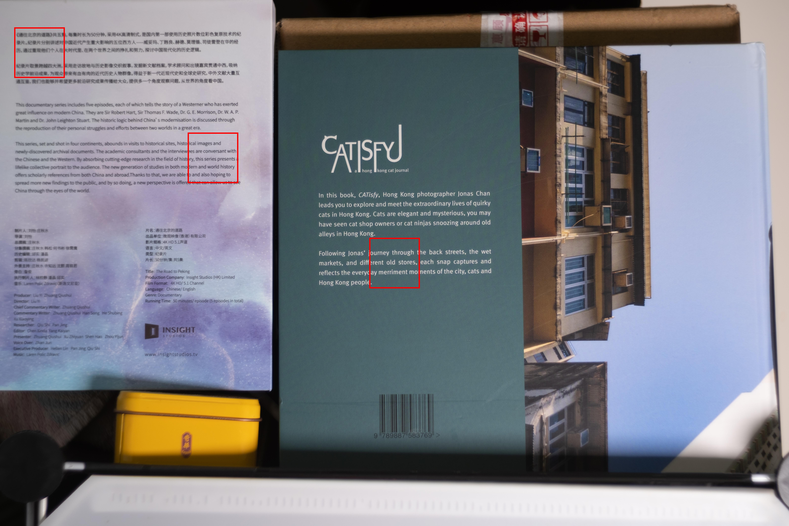
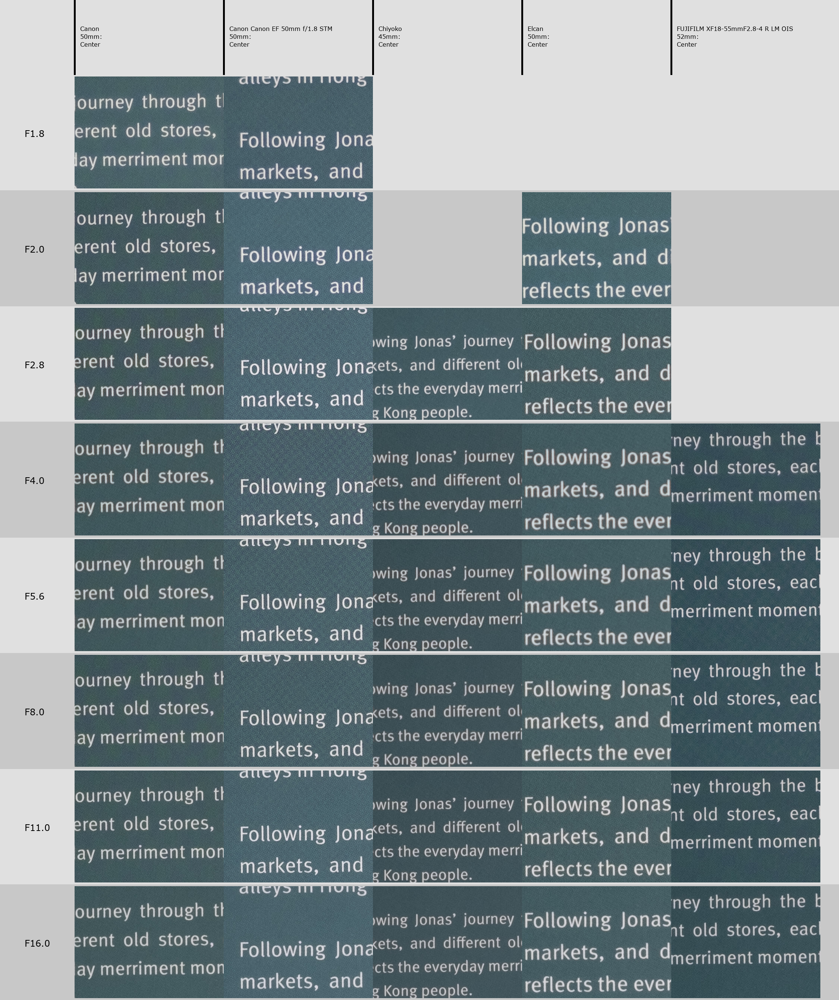
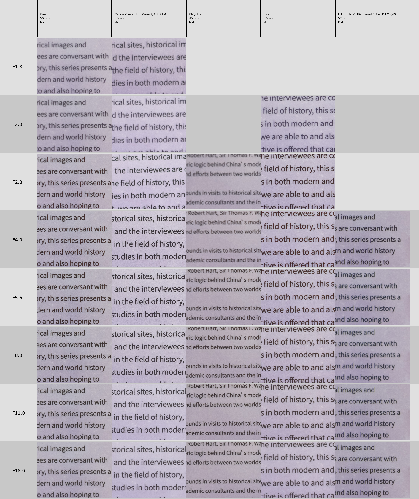
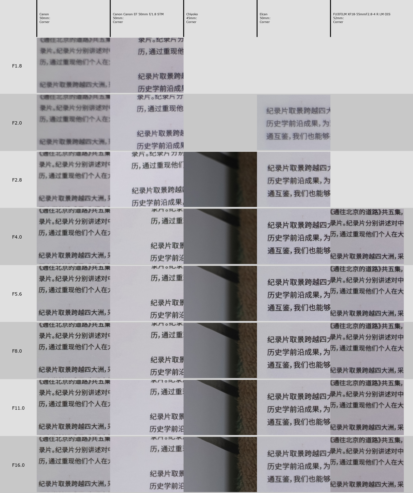
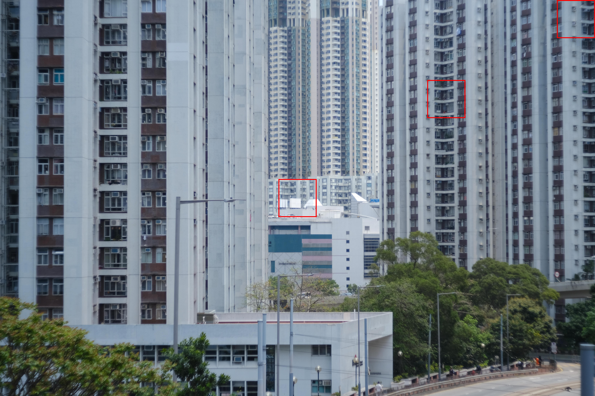

From China with love, without any snark. And a little middle finger towards the red dot, too.

The story of the 4-element Elcan has been touted on other reviews already, I'll skip this one. Instead, I will show what the lens is good at; including focusing on the negative.

I got news that it will be discontinued soon - as the small factory in China will stop grinding glass for that and start working on Hologons instead - and I fought myself a fair bit if I should pay the not-so-small amount for it or not... well, worst case I can resell it, right? LLL has somewhat of a good reputation, although most ~~fredmirandians~~ ~~leicamen~~ dentists are currently unaware of the brand and would easily dismiss the lens.

# Initial impressions

It comes in a nice, big box. It was so big I wasn't sure if I actually ordered something else with it?

In the box you will find a big, nice leather case. It's actually too big for daily usage - way oversized for the lens, so mine will stay in the box unused. In a tropical climate it even doesn't make any sense to keep the lens inside the leather case, it's much better if the lens is kept in a drybox. Anyway I can't be arsed to take a nice picture of it, as it really doesn't exist for me, for all intents and purposes.

     

        
     

     

          
     

  

Lens in LTM also comes with a M adapter and branded caps - front and rear, M. I'll keep the front cap, the rear will go back to the box, and use a third party LTM rear cap (a nice metal one from Taobao though, so it's not like I'm doing it any injustice).

The lens is dense. 4 elements, right? Made of metal, makes a good impression. Focus was slightly cranky, but smoothed out with some use - not suprising. Aperture ring has pleasant clicks. I really have nothing to complain about. The lens feels exactly like the reddot lenses, maybe even better.

Of course it does remind you it's not a real reddot - which is fine, it's a replica - and has "Made in China" engraved on the bottom (in Chinese). They're proud of it. And no wonder - there is a lot to be proud about.

The limited serial number on the beauty ring on the lens also makes me feel like a proud owner.

# Does it work with Canon P?

Yeah. Rangefinder works great, with a caveat. Lens focuses down to 0.7m, but the rangefinder is responsive down to about 0.8 - keep that in mind. If try to you focus any closer, the rangefinder patch won't move.

# Ergonomics

Since the lens is tiny, the focusing tab is a lifesaver. The focusing throw is rather short, about 90 degrees, which is fine with me - I don't need the precision I have with Canon 50 1.8 LTM most of the time, and thus it's a dream to handle in street situations. 

The aperture ring is smooth with a tab at f2. I'm thinking it's a bit unfortunate - I tend to grip the aperture ring with two hands, and I appreciate grippy rings on most other lenses. The aperture ring also goes the opposite way than on most other lenses, but that's no big deal. Even though the aperture ring is smooth, you can grip it with two fingers and rotate it that way.

One-handed use is actually possible though, thanks to both tabs. It's not perfect, Canon P is still a brick with barely any gripping points, but it's not impossible. That's impressive, very nice. I don't think I have any other lens that can be fully controlled with one hand (digital and EOS don't count!).

Of course I realize that it's a replica, and it's faithful down to ergonomics, including the silly aperture tab. Could've been improved, but the goal of LLL was not an improvement, obviously...

# Image quality (non-autist)

     

          
     

     

          
     

It's great. A short summary of the autist section down the article: on APS-C 26mpx digital - a bit low contrast at F2, gets amazing quickly. Sharper at shorter distances than at infinity. Corners not perfect, but good enough. On film, I don't shoot comparisons much. Definitely more than satisfactory, especially since film has much worse resolution than digital sensors and even mediocre lenses will look good on it.

And few more film shots below, on Acros II or Ilford P4 Surveillance.

     

          
     

          

          
     

# Bokeh

It doesn't matter. Really. See the autistic section for more details. It's not buttery smooth, it's got a bit of a swirl or whatever. If you care about bokeh so much it means your subject is not interesting enough.

# Flare resistance

Not great, keep it in mind. The lens is coated, but not like modern Japanese lenses are. It's not as aggravating as TTArtisans 27mm was, but I can get it to have lower contrast on digital with a light source on the edge. Maybe a hood could help a bit, but I rarely shoot into the sun like that.

# Conclusions

## Rating scale

I'll do a little introduction of a simple lens scoring scale. A lens can be:
- poor,
- good enough,
- excellent beyond usual usage.
That touches image quality, ergonomics, whatever problems I would have with it or not. And most importantly, it touches the expectations.

Poor lenses I don't keep for long. They usually have big problems - image too soft at all ranges, too big, cumbersome to set up, etc.

Good enough lenses can be fun and always a decent choice to bring with you. They may have their shortcomings, but these wouldn't matter for a vast majority of situations; and rarely, if ever, disappoint. "Good enough" has a bit of a pejorative connotation, at least for me; but it's how it is sometimes, and there is nothing really bad about them. Good tools for good photos, and I wouldn't sell them for no reason.

Excellent beyond usual usage usually have some amazing qualities; regular images would look great with these lenses. Or get you through the very rare edge cases with excellent results. What you fall in love with immediately. They may still have some shortcomings, but other qualities are so overwhelmingly positive, that the shortcomings don't really matter. These lenses are the keepers, that you never get rid of.

At the end of the day, you're not shooting the same scene perfectly the same with a set of identical lenses - that's dumb. So it all weighs on whether you capture the moment, and if you're happy with the result. Every photo, besides photos of test charts, exist in a void.

## And the verdict is...

The Elelelcan is definitely in the last category. Remarkably excellent. Small, great image quality in the middle. Great job, I gotta admit. I'm just a bit worried taking it out - but I would take it out over other 50mms for LTM anytime if I wanted to be sure to get great images on Canon P. Or bring it with me as a tiny addition for a portrait lens on digital, over the superior EF 50mm 1.8 STM.

It's also interesting to see the lens... through another lens. To Light Lens Labs, it's a product of love to ReddotCamera; for me, it seems like a middle finger - you didn't want to release that, so we make it ourselves, and sell it cheaper than any of your products, while also matching or exceeding the quality.

# The autismo corner

That is, more rigorous testing of image quality. I don't have any tools to determine MTF. Just my eyes and comparison with other lenses, aided with a tiny tool I wrote in Python. It's usually enough. Click the images to see full size.

Tested on Fuji X-S10.

## Close distance

Compared with few other fiddys I had. Scene about 1m away.

On the charts, "Canon" refers to Canon 50 1.8 LTM (the STM is the next one). Chiyoko refers to Super Rokkor 45mm 2.8 LTM.

Center:

They're all good, but the Canon EF is bonkers.

And corners:

(Ignore Chiyoko, poor little baby was too wide for the scene!)

Anyway usable from the get go, gets sharper at 2.8 immediately, good from F4 onwards. No wonder it produces t- the- I feel sick... but I have to say it... "3d pop".

Obviously has some advantage over Canon LTM.

Still, Canon EF 50 1.8 STM is stupid good. Elcan gets the edge at mid, somehow though. Amazing.

## Infinity

I forgot I also had Rokkor 50 1.4. Whoops. So I included it in the next test, at infinity range.

I'll skip mid for now. Kinda doesn't matter.

Scene:

Center:

And corner, but when focused at center - there's some field curvature at play:

When you focus at the corner (only few lenses didn't need it - Fuji, Canon EF, Chiyoko), things change fair bit.

Weirdly enough Elelelcan is a bit worse than the competition at infinity distances. But at close ups it's certainly better. Maybe that's the secret recipe for "3d poop" as the boomers call it? Sharpness and contrast optimized for short distances?

## Bokeh on film

To reiterate on my bokeh point, I wasted some film, and compared Canon 50 1.8 LTM at 1.8, 2, 2.8, 4; Elelelcan at 2, 2.8, 4; and Chiyoko at 2.8 and then I was out of film. So you know which lens is which by the number of frames. Click to open full size.

     

          
     

     

          
     

     

          
     

     

          
     

     

          
     

     

          
     

     

          
     

If you ask me, there's no real difference.

## Conclusions

Middle finger indeed. I've read somewhere that the Elcan is comparable to Mediocron 50 f2 first gen or something, or better, or sharper. Elcan is obviously worse than Canon EF 50mm 1.8 STM. Thus, few k USD for a lens will get you worse result than a cheap (<100USD) entry-level DSLR lens. Take that as you will.

And yet, I'm still happy with the purchase.