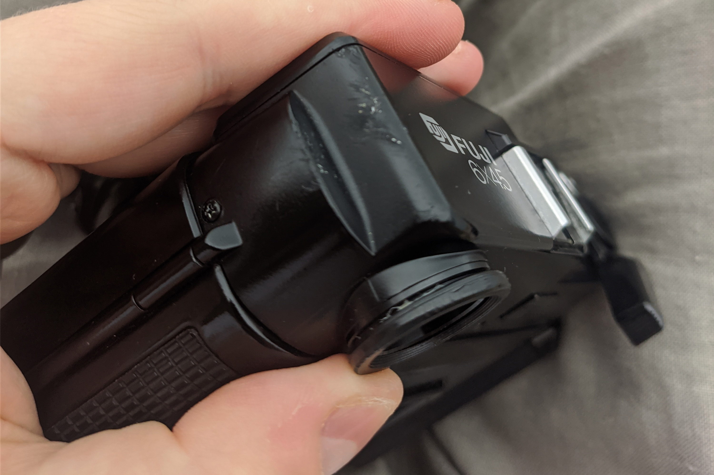
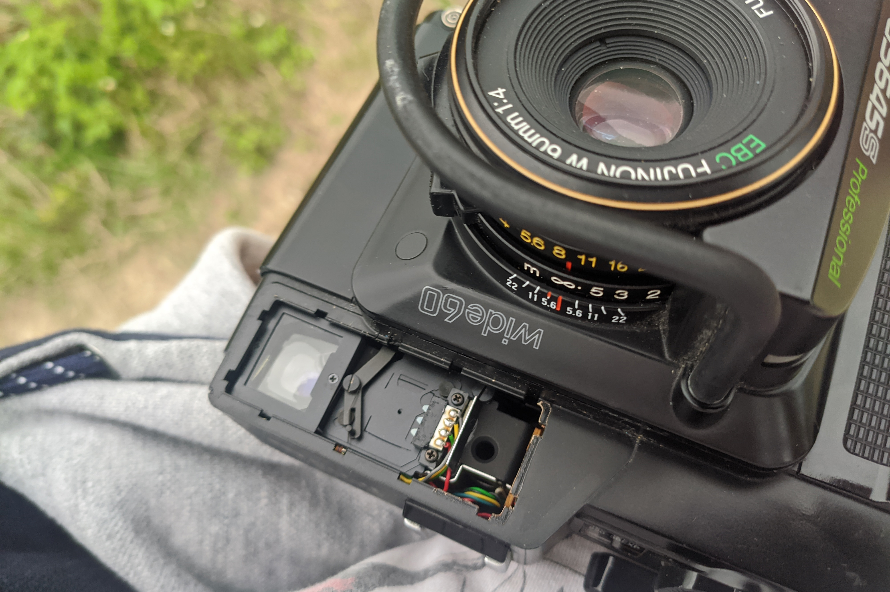
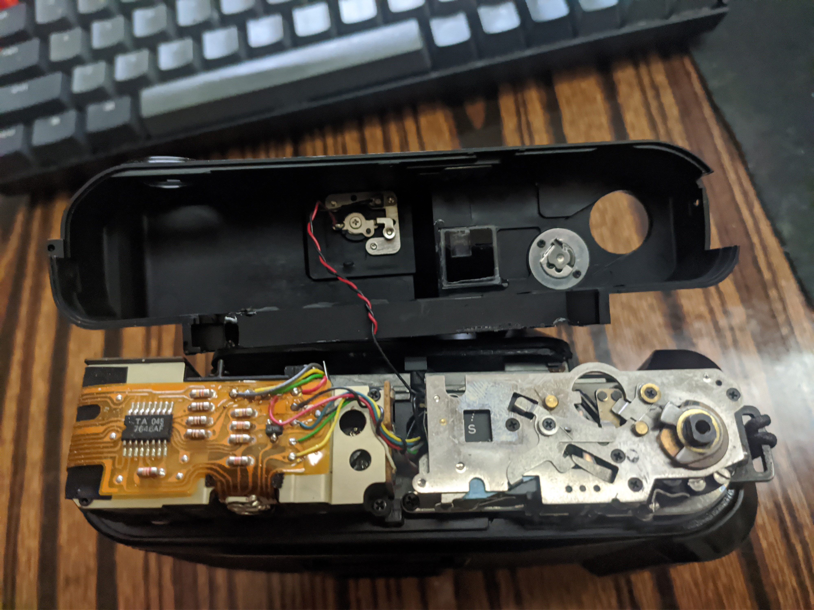
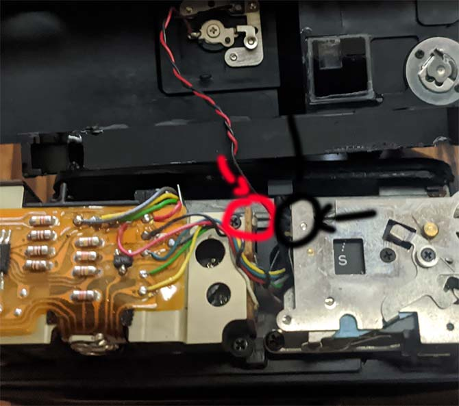
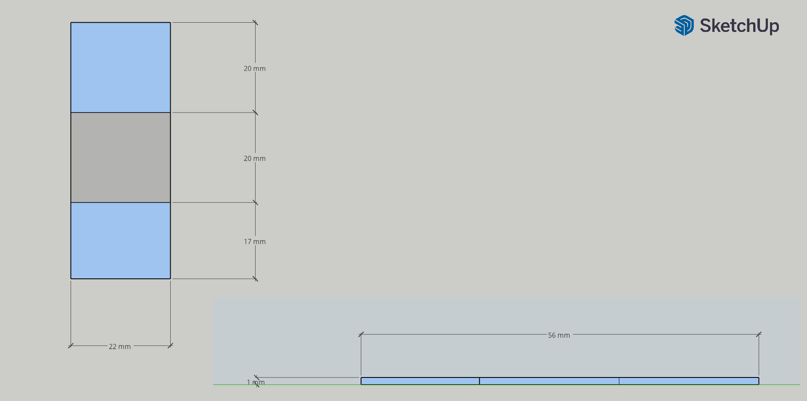
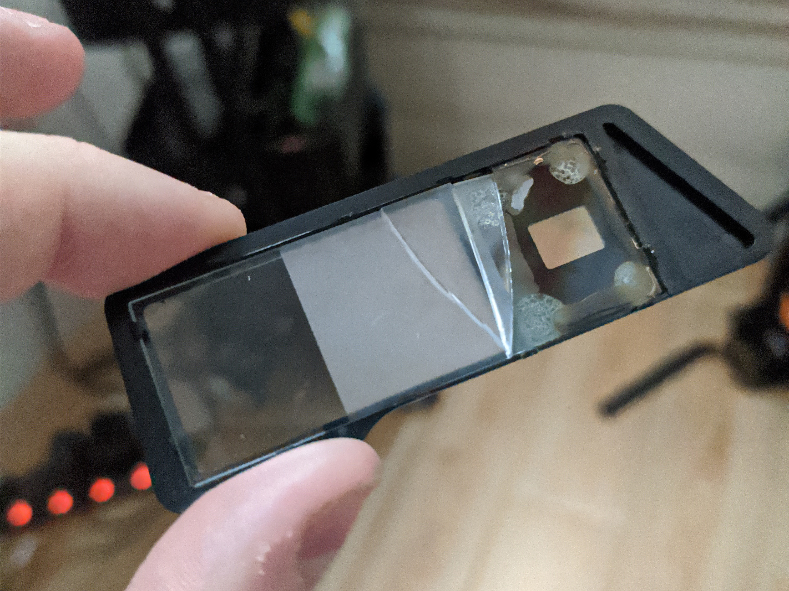
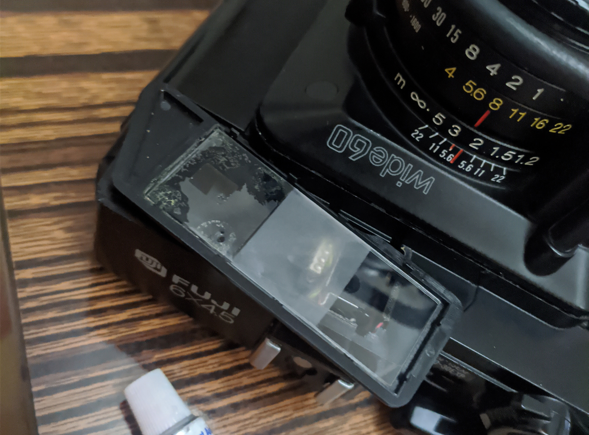
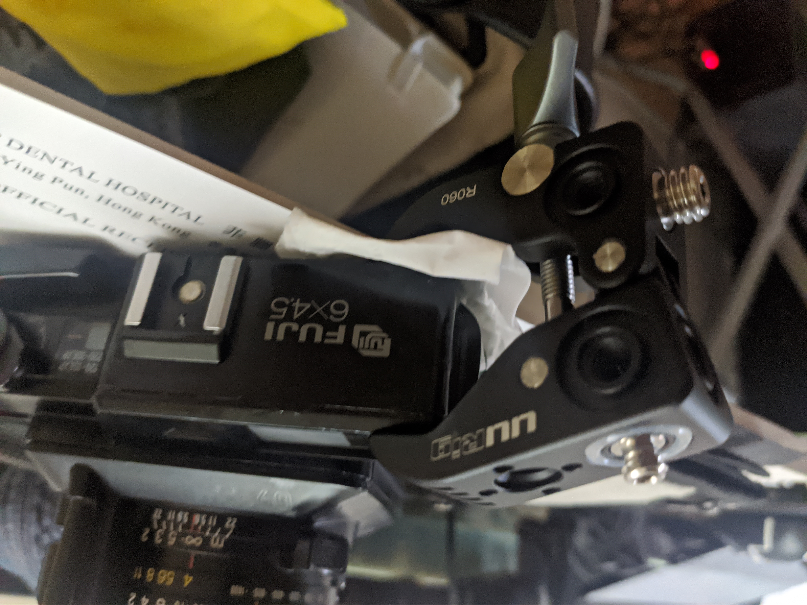
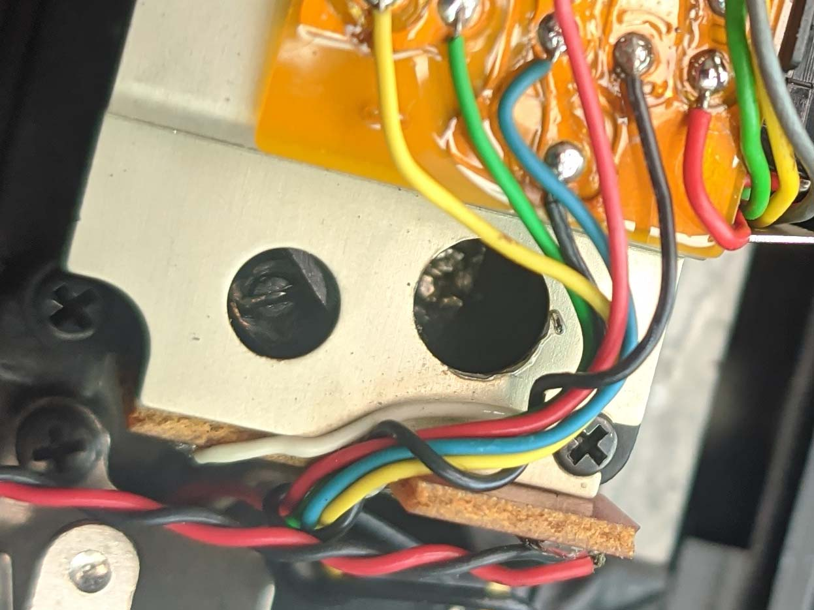

As much as you say you care about your equipment, accidents may still happen. So yeah, I dropped my beloved GS645S, from about half a meter onto gravel. Great travel camera, but really fragile. Does not help that I was a scatterbrain that forgot to attach the PD strap.

     

          
     

    

          
     

  

Aftermath:
- rangefinder was slightly off,
- the viewfinder glass was broken,
- the viewfinder cover clips broke off,
- few scuffs on the corner of the top panel.

I finished the roll and found that the shutter, aperture still work fine. So all in all pretty lucky. I don't know how to deal with broken shutters and I don't want to learn. I was still pretty annoyed at myself, but after a while cooled down and started working on potential solutions.

To the aforementioned problems I'll add a laggy rangefinder when focusing close - typical issue with these cameras. The path would just hang for a bit or move slowly when getting closer. Didn't bother me enough to deal with it before.

# Opening up the top

Three screws. Two longer, one shorter; the shorter one is on the right, near the advance lever.

Besides that there's the set screw, on top of the advance lever. Of course I scratched it - pliers with rubber seems like a solution, but the pliers actually penetrated the rubber and didn't move the screw even one bit. I remembered I got some grippy tape though - no brand, I just got it randomly... that actually worked. Sorry for not having any recommendations.

On the way back I only fastened the screw with my fingers. Looking at the scratch showed that it's pretty much in the same position as it was before. Don't think it's gonna fall off randomly.

That's all you need to take the top off. After opening it up, there's the flash cables that may be snapped if you pull on them too hard - be careful.

# Hotshoe flash cable

The red cable you can free - by unscrewing the terminal on the cover itself. Ground (black cable) I think has to stay, but it's longer and you have a bit more manouvering. If you do unscrew it, be careful - there are two transparent plastic washers. There's no direct connection between the red cable and the middle of the hotshoe, actually - I'm not sure how it works...

If you snap either, it's not very difficult to solder it back. The two points on the board are rather obvious, but here are they marked (red for the center contact, black for ground):

# Viewfinder window glass

It's a bit tricky. It's one piece of glass that's matte in the middle. The exact dimensions are (...more or less, I didn't have calipers): 57x22x1 (mm).
It further breaks into 17mm of clear (viewfinder), 20mm matte (light meter, frames), 20mm clear (rangefinder, glue).

Since it's both clear and matte in one part, it is slightly more difficult to achieve. On Taobao I found sellers that sell either clear or matte acrylic cut to size. Acrylic instead of glass is alright, it will make it more durable too. Only problem is that most of the shops will deny being able to have both clear and matte on one cut. I found one that has actually agreed to do it, albeit at a significantly higher price.

I mean, it's rather simple: take normal acrylic, mask off clear parts and sandblast the middle. It's just that it's a manual job. I ordered a bunch. The effect is not perfect but for me it's convincing enough and functional.

If you wish a replacement as well (glass broken or missing), I can sell the ones I got. Contact me for details.

     

          
     

    

          
     

 

I removed the remaining glass with some isopropanol soaking and pressure (chopstick through the RF window) and glued the acrylic replacement with superglue, at the rf window frame, like the original. That holds well.

# Viewfinder window frame

Since the clips have broken off, the frame itself would not hold. There's one thing to remember though - taking it off is not necessary for rangefinder adjustment or taking the top off, so it's safe to glue it to the top cover. I used clear epoxy for that - mostly on the triangle near the RF window, and few dabs on the remaining edges.

I had to do it three times though, as the far corner (near viewfinder) would be slightly off - on the last attempt I clamped it down and finally it looks flush. Since I had only one clamp, the far edge near the RF window would stick out a little, but since that part had more glue applied, holding it down for few minutes worked well enough.

# Rangefinder adjustment

There are two holes on top of the RF assembly, near the window. The one closer to the front, cross screw, is horizontal adjustment; the one towards the back, slot screw, is vertical. In my case both of these were very tough to turn and I was about to strip the horizontal adjustment screw, but somehow I got it down perfectly. Hopefully I won't have to touch it again.

As for the laggy rangefinder, the solution has been posted on photo.net before. There's a rod connecting the lens and the rangefinder assembly, somewhat deep. Clean the rod with some IPA on a cotton bud, apply a tad bit of machine oil, maybe repeat the process few times and it should be good.

# Minor things

Frame counter window fell in under slight pressure. I put it back and glued it with a bit of epoxy (seems it was done like that before). However there's black paint on the inner side of the window and it did not like IPA that I applied, trying to remove my fingerprints. A bit of model paint in a pen hid the missing paint well, though.

The whole lens cover on front of the camera - the frame, with the bullbar, also detached itself, not the first time. More epoxy on the edges, push it down overnight with some books.

# Putting things back together

If you removed more than the advance lever - there's the hook for the lever to rotate the pin, it has to be in a specific way. Basically before assembling the camera back make sure you can press the shutter button; if not, you need to move things around.

There was a bit of glue residue left on the camera body - I polished it with IPA-soaked microfiber cloth. Same applied to the scuffs on the corner, that buffed them out and they're not as visible.

Sure, under a finger you can still feel it. But... it's just another mark of shame.

# Conclusions

Don't drop your camera.