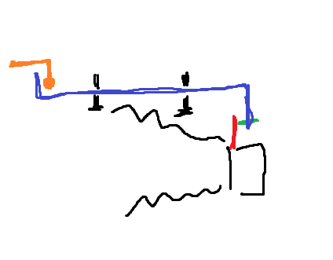
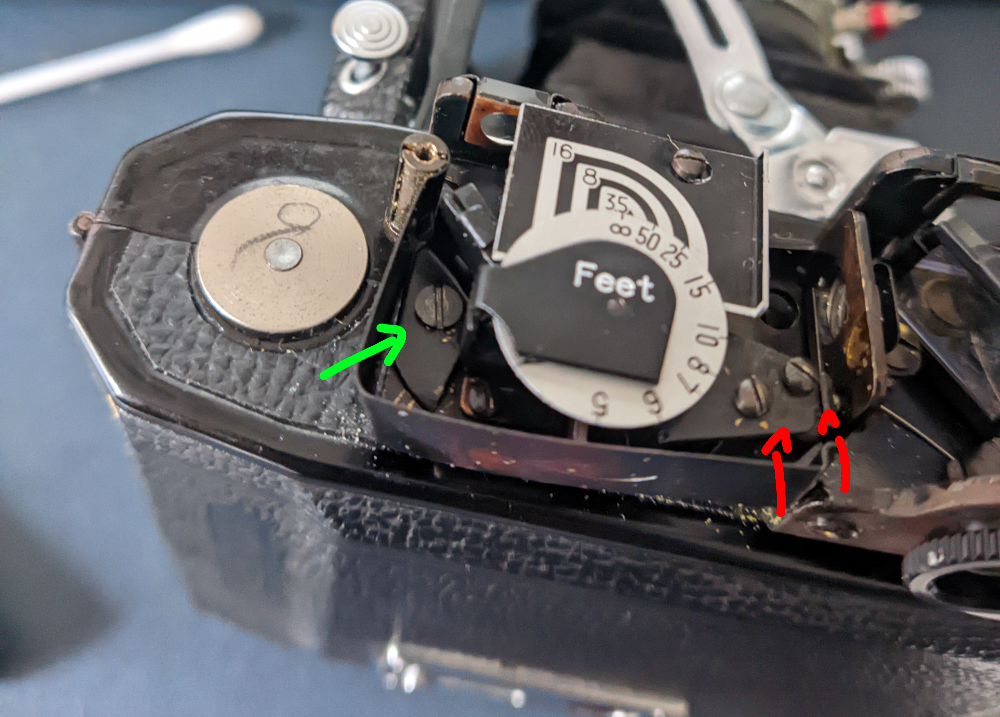
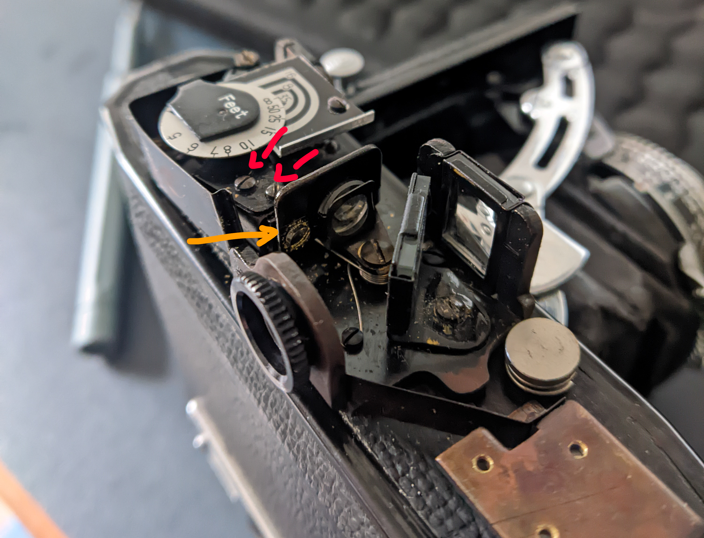
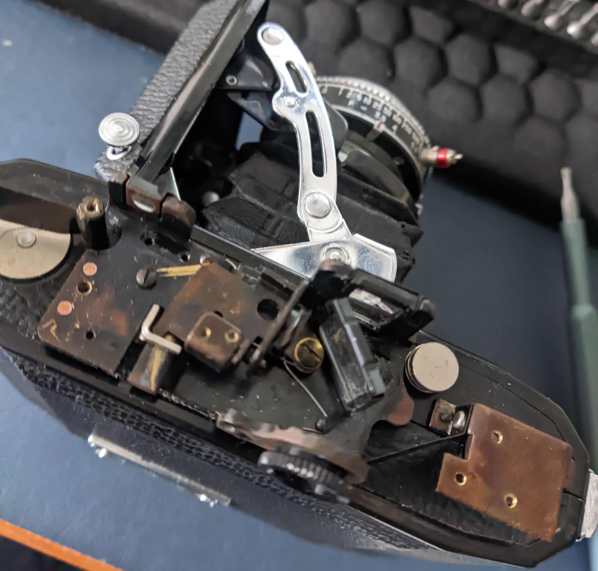

I finally got a folder. Konica Pearl II, or going by initials to the horror of all office workers, KPI(I).

Rangefinder was not accurate, neither was the shutter. Bellows also required repairs. This is some loose notes, as I found little information online.

The one I got is a bit special - it has both the red window, and the film winding mechanism from Pearl III.

_edit:_ don't read this garbage, see [this amazing repair guide instead](https://docs.google.com/document/d/1kag2NHxcP0Ke2lymI273vwquD89MvXdMerEnfT2ma6A/edit?tab=t.0).

# Shutter

Shutter/aperture is completely contained within the lens group. That's simple, but opening it up requires some real tight lens wrenches. You can just unscrew the front element with your hands and get to the shutter blades from there. Rear requires a lens wrench, but it's not completely inaccessible. Healthy dose of lighter fluid got it going. Yeah I know it's not good.

Yeah it's probably not accurate still. But I'd rather avoid opening it up.

# Bellows

Bellows I'd rather not replace. They're leaking, but replacement would be involved. I did replace bellows by myself on my Horseman 45HF (after being quoted 1300HKD in a shop, lmao), and it wasn't pleasant or easy; this would be more involved, I can tell.

I just used liquid electrical tape around the leaky points. Not expecting perfect results, though.

# Rangefinder

Rangefinder is a bit more complex. If it's not correct, then there's no way to set the focus correctly, maybe besides infinity.

The eyepiece is important because it has a lens in it and is required for the viewfinder. This was referenced in a later Konica's camera, the Hexar RF, where the eyepiece is also necessary. So don't lose it, and during calibration you may need to screw it back in to check the alignment.

From the lens (outside perspective):

There's a helicoid that moves the lens. I assume that at normal posistion it's at infinity, and goes to MFD.

There's a little plate (red) attached to the lens that pulls a rod (blue) with an adjustable screw (green) that's glued in place after factory calibration I assume. I wouldn't touch it.

That rod hooks onto the mechanism that moves all the things in the top plate (orange). So that's your linkage.

The lens pulls the rod towards outside, when the lens is retracted, the rangefinder mechanism is supposed to pull it back. It's a lot of mass, you know. Sometimes it gets stuck.

Two screws keep the rod in place - if they're too tight, the rod will get stuck more often. You can pop it with your finger sometimes. If it's too loose, it will not hook with the orange part when you open the door.

Keeping all these parts straight is crucial for accurate rangefinding.

When you open up the top plate (five screws + viewfinder thing), you get to see the rangefinder mechanism.

It's quite simple and you may be interested in the following parts:

1. (Green) Screw holding the mirror - may get loose after many years you know. The force it's tightened with reflects on **vertical** alignment. And horizontal as well, in a big way.

2. (Orange) Screw for adjusting the angle of the beam splitter - helps with **horizontal** alignment in much finer steps.

3. Distance scale. I'll get to that later, but it's your only way to keep track of the distance.

The whole arm movement is also there and I did put a bit of machine oil so it would slide better. The springs are probably weaker after many years, but it still moves and springs back no problem.

For 1 & 2 I have no tips, except try to make the mirror in roughly right position, and then adjust #2 in small steps until you get infinity. Then the rest should be fine.

For the distance scale wheel, it's on a spring. If for whatever reason it's incorrect, I did the following:

- with the door open, lens at infinity
- loosened up the gear mechanism that latches onto the distance wheel (two screws, marked red)
- tensioned the spring by spinning the wheel a bunch, maybe 3-4 rotations from the rest position
- ensured the infinity on the wheel is straight up on the distance scale, secured with blutak
- tightened up the little gear thing screws (red) so it latched securely again.

Move it around, see if it changes and doesn't skip.

That's about it. Just a lot of playing around, but the basics are simple.

You can take everything apart to clean, but getting it back together and making sure the mirror is in the right position with right torque is not gonna be easy.

# Some pictures

Of course. The lens seems to be sharp, but in the first roll I didn't even fix the bellows, so the light leaking is a bigger issue. Aviphot 200 is great though.

