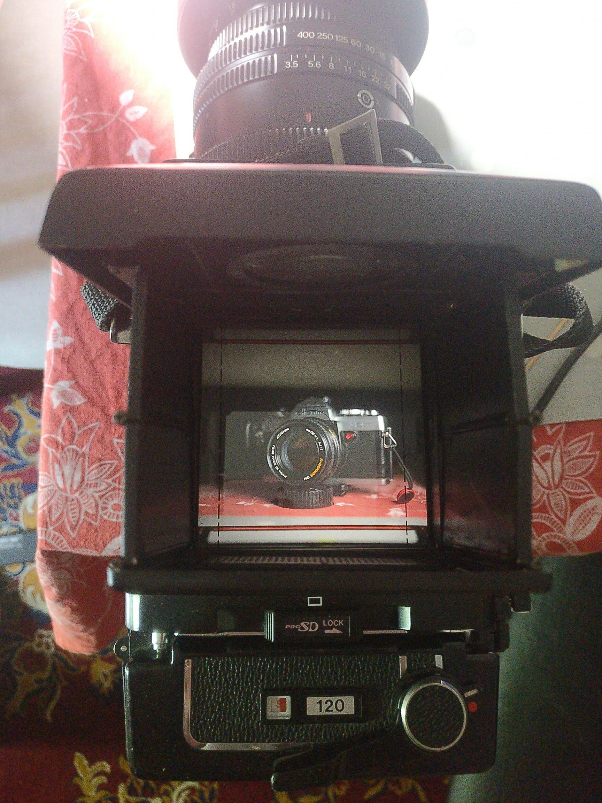

The moment I got my hands on my end-all 35mm camera, a black Minolta XD, I decided to sell off the XG-1 to a friend for a decent price. I had it for over a year, I shot quite many rolls of film with it, I knew its limitations, but I also liked handling it a lot. Now it almost seems as if I regret selling it - and I kind of do. Don't get me wrong, XD is great, and it has improvements over things mentioned in this article, it's just that it doesn't fully work as intended. I did upgrade, and if it just didn't eat batteries like crazy, I wouldn't miss the XG - the additional features aren't worth the inconvenience.

The XG series was aimed at beginners in the realm of SLRs, and yet it almost feels pro in hands of someone who knows what he's doing. The styling is not too far from more professional models of the lineup, at least before X-xxx series came along. And unlike similar beginner cameras of the era, such as Nikon EM, Pentax ME or Olympus OM-10, it manual mode in addition to auto modes. Sounds pretty good already, given that it's quite cheap and often overlooked. And then you get access to entirety of pretty good Rokkor lenses.

I got mine for free from a friend, in unknown state, body only - besides the fact that LEDs in the viewfinder showed something. I cleaned it up, bought a Rokkor 50mm f1.4, and shot my first two rolls of color negative film. To my surprise, it worked almost flawlessly...

     

          
     

     

          
     

Just had to replace the light seals, easy job.

XG-1 feels somewhat light and plasticky in hands. It probably is made of plastic, that doesn't surprise me. And yet, it's still incredibly solid - nothing creaks, dials move nicely, maybe the advance lever is somewhat loose in "unlocked" position (it sits flush with the body until you pull it away slightly with a click - something I've seen mostly on high end cameras such as Nikon F2, Canon F-1n and OM-4, and later the XD), but it's not bad at all. And again, it's light, saves your back over time.

It's a fully electronic camera - pressing the shutter without a battery does nothing. When you look at the top plate, from the left you can see a switch - B.C. (battery check), ON, OFF and Self timer. That switch is quite nice and tactile, and it's almost impossible to move it by accident. On the right of the prism you see the shutter dial, but it's kinda suspicious. It moves both ways, without a hard stop on either end, again indicating the electronic nature of the camera. What's interesting here is the A position - automatic exposure, in aperture priority. When A is chosen, you cannot move the shutter speed dial unless you also press the tiny button in the top right corner. As you move the "A", you move it into aperture priority with exposure compensation, marked on the left! It's in half stop, or third stop increments (or decrements), and you can easily count the compensation without taking your eye out of the viewfinder. Once you're done, you can just as easily snap it back to its middle, locked position.

The ergonomics of the camera are great, they don't interfere with your thought process at all, it's a tool that doesn't go against you, even in demanding situations.

It doesn't require you to think much or curse at the designers, and frankly it's easier to set compensation accurately without looking away from the viewfinder than on the XD. Another genius thing is the shutter button - it looks quite differently from usual, and that's because it's touch sensitive. You don't have to press the button at all just to see the chosen exposure settings, just put your finger on it, or lightly press it if you use gloves. And the lack of thread for cable release on the button... may make sense if it's not a pro camera, but the reality is.. that it's on the left side of the lens mount! Right over the PC flash socket (which also surprised me, on a budget camera). Nothing's missing so far!

The remaining things on the camera are the film counter, advance lever, and "safe loading indicator" - a little red thing is telling you if the film is still loaded onto the spool. It's useful for both checking if the film is spooling, and if it's off the spool for rewinding and unloading, so you can easily take out the roll before it's completely winded in, making it much easier to load the exposed film onto a spool when you are developing at home. Again, it's a feature I did not expect on a budget option.

The viewfinder is clean, albeit a bit barebones. Besides the image, on the right you can see an array of shutter speeds. When you touch the shutter button in automatic mode, an LED lights up next to the chosen shutter speed. If it's somewhere between (it is a stepless shutter for more accurate exposure), it lights two adjacent speeds. On top you can see 1/1000th and an arrow pointing up; on the bottom 1/30th and an arrow down. So, you can't know how long the shutter is going to be open for if it's less than 1/30th of a second. Of course, on the more professional XD, the array is extended down to 1s, but the compromise here is in my opinion very reasonable - you don't want to use speeds slower than that on normal lenses anyway.

*It's not much bigger than a mid (and frankly, really unreliable) digital mirrorless, with an equivalent lens. And much smaller than RB67 - who woulda thunk?*

There's nothing else in the viewfinder, unfortunately. It does not show the chosen aperture, as XD does; nor it does show chosen shutter speed in manual mode. Actually, in manual mode the LEDs are completely quiet, which means you can't exactly meter in manual either. The way I did it, if I needed manual mode to compensate with tricky scenes without an external light meter for example, was to put the camera in auto mode, touch the shutter button and make a mental note of the settings, then recompose and set the desired shutter speed. Other models in the XG line do have meter working in manual, so it was indeed improved, but it's not a deal breaker.

And when you press the shutter button... There's one more thing to remember. If the camera sees that proper exposure needs a shutter speed faster than 1/1000th of a second, it just won't let you shoot at all. So if you forget to change your aperture, you have a second chance at your exposure, but also it may annoy you a bit... sometimes, especially with negative film, I'd rather have an overexposed image in the correct moment, than no image at all. It's rarely a problem though.

So, what's lacking from an XD for me that caused me to look for one, albeit very lazily? Besides mentioned earlier information in the viewfinder, depth of field preview. It's just not there. And... that's it. So I can regret selling it and getting an XD with some issues. The new for me camera eats two batteries a week; the XG-1 uses just one, and despite leaving it on "ON" for weeks at a time, I haven't had the need to replace it during the 1.5 years I had it. DoF preview is nice, but I don't use it that often either. Seeing the aperture in the viewfinder is actually the feature I like the most after upgrading, but it's still workable without it.

I'm quite amazed how ergonomic and smartly designed the XG-1 is. For a beginners camera, or an alternative to all M42 cameras, I can't recommend a better one. And you could still connect a motor drive to one, if you really wanted. That's why I wasn't exactly pressed to get a black XD, but I did once I found a good deal, or that I thought I got it. No one's talking about this camera really, as most talk online is about the professional series - XE, XK, XD or the newer X-hundreds series. Bit of a shame, but I guess it keeps its prices low.

The pictures in the article aren't great because I really didn't do a proper shoot of the XG before selling it, just had few here and there. Another regret to put on the pile!

But I do have some pictures taken with it. Enjoy the small sample gallery.

*Fomapan 400, Vivitar 85-205mm f3.8*

*Retropan 320, MD Rokkor-X 50mm f1.4*

*Fomapan 400 at 200, MD Tele Rokkor 135mm f2.8*

*Fomapan 400 at 200, Hoya RMC 28mm f2.8*

*Fomapan 400 at 200, MD Rokkor-RF 500mm f8*