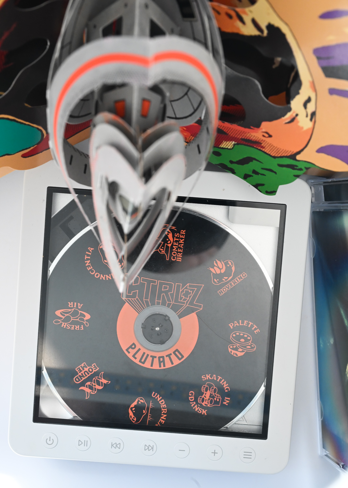

Vinyl records have had their resurgence in the last decade or so; but they're not the only popular media from the past. CDs are kind of getting back, and so do cassettes. FiiO decided to capitalize on the upcoming popularity with CP-13 and DM-13.

Well, I never really gave up on CDs. I've been buying indie albums and maybe some bigger ones I really liked for a while. They're great. Artwork isn't as big as an LP, but still it's there, with the booklet and all, and quality is impeccable (assuming you're a normal person, not an audiophile). The vinyl ritual can be fun, but they're a decent compromise between convenience, quality and still having an experience with the whole album.

Cassettes are a bit different. Their quality isn't as good, you have to swap sides, rewind. But they're also sturdier than discs, portable playing doesn't really need an anti-shake feature. These features don't matter that much in current age since no one carries a Walkman in their EDC, so they're a harder sell. Instead, the selling point is the slightly off sound, with wow and flutter added to the mix, giving a soulful feeling. Kinda like shitty CCD point and shoot cameras from mid 2000s are popular among the kids these days. However, good quality cassettes on a decent deck sound pretty good still. 

# What did I look for in a player?

I would support local bands and buy their discs for a while now. My modus operandi for CDs was putting them into an USB drive, ripping and listening on PC or mobile. Then they went back on the shelf, as an ornament or a conversation piece in case of few more interestingly published albums. I did what I wanted - support artists, get the music, but when the USB drive started to fail I was a bit in a pickle.

I wanted a separate music player for a while to enjoy them, but I also wanted the rip functionality. That was something obvious to me, have an USB connector and let it connect to PC to access the data like a normal CD drive. And yet, there's no device that does it. FiiO DM-13 almost gets there, but more on that later.

For the cassette player, I just wanted to play them in half decent quality. I got PlayMe locally, that's quite similar to a Tomashi F-113 you can find reviews of online. On paper, it seems neat - USB-C port for power or 2xAA, playback, recording, tiny speaker built-in and a microphone as well, but you can connect another one.

Problem was, it was shit. Recording from an audio device went really bad, and playback of good cassettes was riddled with wow and flutter. Some albums kinda gained on it, but it was a miserable experience. With AA batteries the playback was unstable, and even the USB-C port was implemented poorly, it would not work with USB PD because they cheapened out for a tiny resistor. I managed to sell it with a discount. 

# Let's throw some discs

FiiO knows how to do audio. I've been using their DACs for a long time now, they offered digital players and amplifiers. Seems only natural, then, but these two (plus their turntable that I will not be getting) are a different beast. You're no longer dealing with just a stream of bits that travels from another source. you're dealing with mechanisms, lasers, pulleys and gears. If the mechanical part fails, the audio output doesn't get to shine, so they need to get it right as well. And it still has to be attractive enough so potential customers won't get an older, used device instead.

It has an attractive, premium look and feel, especially with the transparent top. The device feels solid in hand, buttons click nicely. Feature wise is where it really shines, on paper - a built-in battery, a modern charging port, 3.5mm and 4.4mm balanced ports, anti-shake, and the recording to USB functionality, in two ways. Bluetooth connection to speakers if you splurge for that extra.

The lack of experience showed. I got it quite early with firmware that was a bit wonky. It still is, but in recent updates it has improved, and changed its behaviour a bit. But the basic functionality - playing music CDs, must work.

## Interface

It seems quite simple on a first glance. From the top, there are seven buttons, for track choice, volume, power, play and three lines for repeat options. On the front, a segmented LCD and the two headphone jacks. On the right side, a slider to pop open the cover. The back - two config sliders, line out, optical line out and two USB-C connectors. It is certainly packed to brim, but also elegant. Seems like the bare minimum, but some of the buttons are overloaded.

Initially, you hold the power button for a moment to turn the device on. It introduces itself with ``HELLO FIIO DM-13``. If there's a disk in the tray, it will read the TOC and stop it, waiting for you to press play again. It's a little annoying. Previous firmware would immediately start playing, even from the moment it was stopped before. That's annoying in a different way; I think playing right after bootup from the beginning would be alright, but it's not really configurable.

If you hold the power button for a moment again when the device is on, it will go into output choice menu. Preamp out (front jacks), SPDIF, Bluetooth or USB. A single tap switches between these options. I found to be using this menu the most; not really intuitive at the beginning, but you get the hang of it.

The sliders in the back are bit interesting. Desktop mode shuts off the internal battery. If you don't use the device in a portable manner, you can use it to save the battery. The other is ESP, anti-shake protection. Manual mentions the audio quality may go down if you use it; that's because audio is read ahead and compressed into RAM, so during a shake hard enough, the device will switch to the data from memory, to ensure unbroken playback.

Generally speaking though, beyond the annoyances I mentioned earlier, playing music is pretty much straightforward. Just make sure the output is chosen properly.

## Listening experience

I'll be frank, I don't have any equipment to check it properly like I could a lens or a camera. I can only say that the DM-13 has no problem driving Sennheiser HD6XX. Music sounds better than from a digital source, even if it's technically inferior. Could be placebo.

I can't say anything bad about Bluetooth either, but I don't have any audiophile grade equipment for that either. I'm just glad to put on the headphones and enjoy the sound without any extra distractions from apps, notification, dopamine hits.

You take out the album, click it into the tray, and let it play. You look at the album art, maybe take out the insert; browse through the lyrics and photos, or maybe check out the amazing 3D pop-up book like Plutato's Ctrl+Z album. The sound starts playing, free of annoyances; not as background music for something you're doing, so you focus. Even after multiple listens, you find new sounds, quiet instruments that you never paid attention to. Even if you look away for a moment to deal with real life, the music pulls you back quickly. Light jazz works nicely with reading a book; some rock with exercise at home

By no means there is any magic in CD playback. Good quality players can do that; first time I got half decent headphones I also went through that. A non-trivial part of this is your mindset. And there's the difference between popping up Foobar2000 with the bestest of FLACs while writing a review while juggling social media, and sitting down to listen with maybe one extra thing to do.

Just get a dedicated player.

## Recording

We need to go back a little bit, to the realm of technicalities. Here's the extra feature that really pulled me over to this particular device. DM-13 has two ways of recording, one of which is beyond useless. Let's check that one first.

I mentioned that there are two USB-C ports in the back of the device; one is called "USB REC". If you connect it to a PC, it will show as a soundcard. But it's for recording only. It sends the digital data directly over. You can use Audacity or some other software to save it. It's very close to having some use, if it worked the other way - as a headphone amplifier and DAC. 

The other option is: you provide power through the USB REC port, and use an USB-C pendrive or an OTG cable with a FAT32-formatted MBR partition. If that sounds complicated already, it's because it is. It's not convenient in the slightest. Then the player will make a ``RIP`` folder and each song will be labeled ``TRK#.WAV``. If there's already one, they will have a slightly different name, e.g. ``TRK1~1.WAV``. No auto tagging. No separate folders if you rip multiple discs. It's a pain in the ass, but it's the only way you can do it.

And there are few extra limitations. One was with old firmware it would stop recording after album was running for some time (thankfully fixed), just under an hour, so longer albums would be cut off, and you had to extract a song later by manually choosing that track. And it would skip sometimes, and the recording would also skip. It's not like reading raw data with a CD drive in a PC. But again, that was fixed with newer firmware; keep that in mind, just update.

Additionally, it may be for whatever reason incompatible with your USB stick. In that case, it will just keep blinking "Recording" forever.

The other two things that probably cannot be fixed is that the recording goes at 1x speed. Ripping takes real time, a 70 minute CD will take 70 minutes to copy. Plan ahead, or leave it on when you leave your home I guess. That's because you cannot playback and record at the same time; the outputs will stay silent while the DM-13 is diligently copying the data onto the USB drive.

The last is Sony DRM; I have a Klaxons CD that surprisingly is infected with the rootkit, and it will play, but not record. I don't know where this limitation comes from, but it's there.

So. When it works, it works, and I don't have to get another USB drive just to rip my albums. But goddamn it's annoying.

## Would I recommend the DM-13?

Yes, if you don't have a dedicated player yet. Despite its shortcomings and things we have taken for granted, or obvious 20 years ago. I can tell FiiO is doing CD playback from scratch, and with behavior different between different vintage devices, it was probably not easy to come up with a somewhat familiar and consistent menu.

I like its complexity that's hidden away; you can use it pretty straightforward if you want to, for music playback, and switch to the more powerful modes in cases you need them. And you rarely will, so the front is kept simple. I like the segmented LCD screen, that's nostalgic, but not limiting.

You can also take it on the road, but I wouldn't; it looks too good with the transparent top on the desk or shelf and I wouldn't want to scratch it. Plastic Discmans of the era would be a much better choice in that regard; as long as it's not stolen by your aunt to pawn off.

Yes I wish there were improvements, especially on the recording front. But it doesn't take away that much from the complete product. If you do have a dedicated CD player already, then there's little point. If you want to rip your music, just get a cheap USB drive, and do it quickly with automated tagging.

# Tangled up in tape

On the opposite side of the spectrum we have CP-13. A fully analog device, a sleek rectangle in which only the USB-C port on the side betrays its modern origins. That must have been a challenge to FiiO which before has worked only with digital audio sources. Not easy either when parts that were used to make the best tape decks of the 80s and 90s are no longer in production. It does seem that the head and tape mechanism are shared with other devices on the market, but hopefully with extra engineering effort and quality control at FiiO to get the most of it. I mean, I've had the PlayMe which uses the same head, and it was crap.

## The experience

This device is simple, with no underlying complexity; you could say the CP-13 is as simple as the construction of a flail (this is a joke only for the Polish readers).

The cassette slot is exhibited through transparent acrylic plastic. You can't see all of the inner workings, but the cassette you put in is displayed beautifully.

Four buttons on the top - stop, fast forward, rewind, play. Not sure about the order; I'd think FF should be next to Play, but it's no big deal either. Once you start playback, the buttons vibrate warmly with the movements of the mechanism. On the back there's just a machined FiiO logo. Overall, it's just lovely, minimalistic.

On the only side with extra controls there's a metal machined volume knob, 3.5mm jack, a charging indicator and the USB-C port for the internal battery. That's it.

Slide in the cassette, with the tape rolled in on the right side; close it, press play. No delay. Instant. I feel like we got used to the slight delay, even with super fast internet for streaming services; even with music stored locally on an SSD or internal storage, there's always a little bit of delay. Imperceptible, immeasurable, you may think, but it's there. Not with this fully analog device. 

Sound coming out isn't crystal clear, frequency is missing in the bass a fair bit, but it's still good. Good enough to enjoy the few albums I have that came out only on cassette and I should probably rip at some point. I can imagine (and actually did) take it out to listen on the way to work. Wow and flutter may be there, but they're at reasonably low levels.

There's only one issue I have with this device. When the tape is done, it will not stop automatically. Fast Forward or Rewind will also not unclick when they're done; the player will drain the battery in that time. So it's not perfect for pure pocket-only usage, if your hands are busy or you just forget to stop.

Would I recommend it? Again, if you have a tapedeck already, there's little use. But if it's crap or you're looking for a new one, you can't go wrong with FiiO CP-13. It's supposedly serviceable; speed is adjustable, although not easily reachable.

# But why bother if literally everything is more convenient?

Hard not to agree with this. FLACs on HDD can be higher quality than CD; streaming allows you to listen to anything ever made, physical media can get damaged or lose quality over time with tapes.

It's either a delusion or something else at play, right? Someone born too late, weird hipster guy trying to live in the past because he can't cope with the modern times. Probably.

To me there is a point of regaining control, bouncing back from "you will own nothing and you will be happy". Insurance from losing internet on a plane; insurance from streaming services adding extra ads, worsening quality or demanding payment. That's covered by digital copies on a hard drive, phone or Zune.

The other part is avoiding distractions. I like the Chinese word for a "smartphone", "hand machine". They're not very smart, nor they are used as phones, but they're in your hands and they're machines. Playing music will get you bombarded with notifications, or the mere temptation to check on social media, and two hours later you'll wake up from doomscrolling. On a PC it's not much different; opening a browser the first thing after logging in seem extremely natural. While it's the exact opposite.

Services which now create the centre of the internet are designed by professional overpaid committees to keep you engaged for as long as they can, with colors, animation, ragebait. And I just wanted to listen to Long Season while on mushrooms. Now that's dangerous. Or play some jazz while doing house chores, or reading a book. And I still see more value in listening to the whole album (or a crafted mixtape) rather than a random shuffle of a playlist.

One more thing is that I really don't just buy any album, I am not hoarding; I get the ones I like the most. The rest can live digitally. If I want to listen to something, I know it will be good, I just need to pick a genre. It's still not my main way of listening to music, but it's the main way of actually experiencing it.
