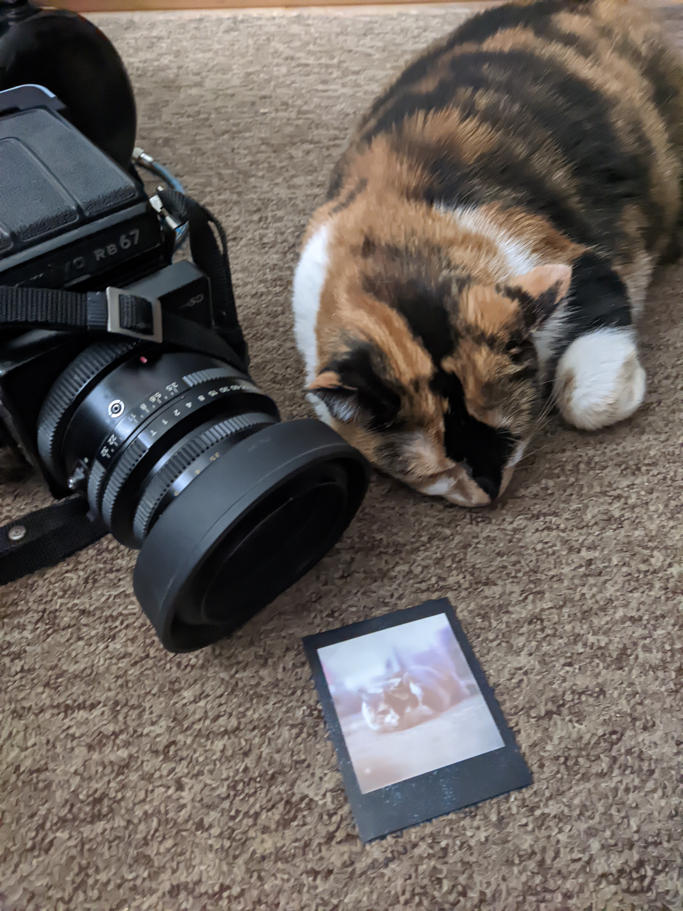
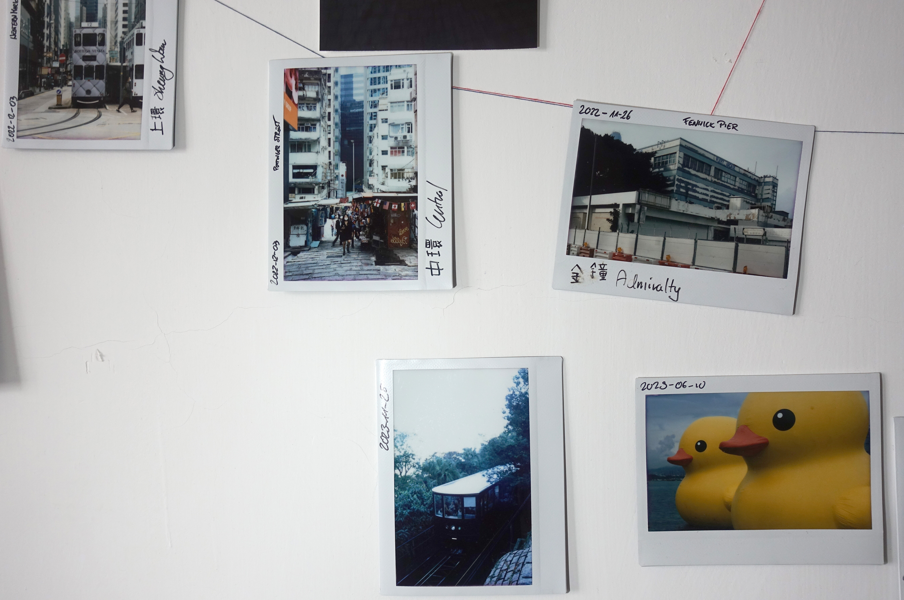
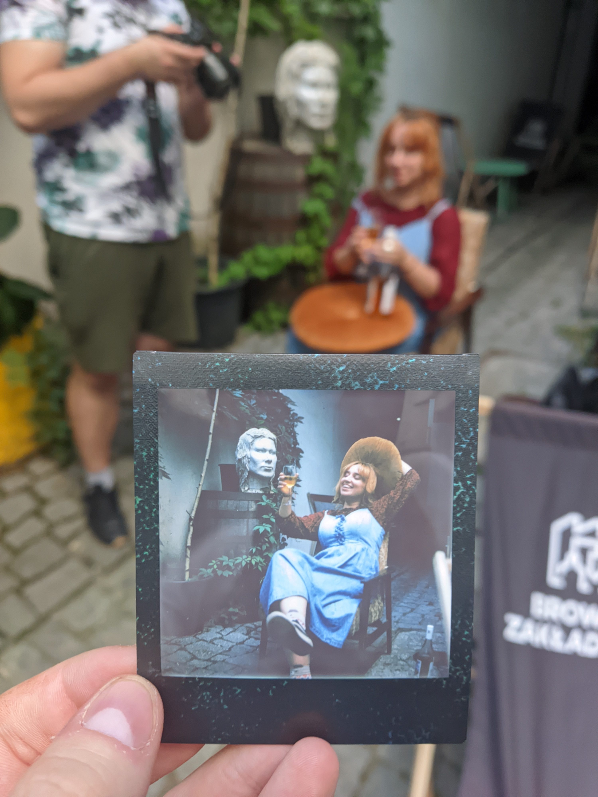

This is not a review of the RB67. This article is about the joys of instant photography, and exploring potential outlets of your own art.

The RB67 is certainly one of, if not my favorite camera. It's heavy as fuck, yes. But the viewfinder is a joy to look through. The images produced by the 90mm f3.5 K/L, 180mm f4.5 K/L, and 50mm f4.5 Sekor-C are always beautiful - I never complained about image sharpness or the bokeh. I haven't won any competitions with it, and it hasn't earned me half a grosz. But in its complexity, it feels comfortable to use. It is a demanding machine, but capable of being very rewarding.

Grabbing it after a 3 year break it felt almost natural. All the controls were where they were supposed to be, muscle memory came immediately.

There was only one difference. Instead of shooting 6x7 or 6x4.5, I brought with me a Chinese Instax Square back.

# Technical details

* Format: Instax Square or Mini (with adapter)
* Compatible with: RB67, RZ67 (presumably)
* Film advancing: manual
* Accessories: dark slide

Pardon no more details. Forgot to take pics, and I left the device in Poland. It's also lighter than the usual rotating adapter + film back for RB67, but I don't remember the exact details.

# How?

There used to be "Frankinstax" on the market about four years ago - made by some guy in the Netherlands, Instax SQ6s with 3D printed parts to be attached to RB67. The cost of that was about 250 EUR + shipping, and I passed the opportunity at that time.

On Taobao now you can find something that resembles just that - a cut up Instax camera. And there's another variant, with a new black shell that would fit the RB67 better. The cost is about 2300-2600CNY, depending on the variant. Now with some spare cash, I went with the former; branded "PANDA DESIGN", with extra accessories such as extra dark slide and the Instax Mini adapter.

In operation it is a very simple device. The viewfinder piece was replaced with a white button, toggling power. On the 3D printed front there's a black button for ejecting a photo. Basically, after taking an exposure, you're supposed to trigger the ejection, as there's no mechanism that would couple taking a shot, and ejecting.

Since Instax Square is bigger than 6x6, the whole RB67 viewfinder is your frame.

The procedure for using it is as follows:

1. Frame, focus, set exposure.
2. Remove dark slide.
3. Shoot.
4. Switch on the power (white button).
5. Eject the photo (black button).
6. Switch off the power.

You can skip toggling the power, removing the dark slide etc. if you take more than one photo at a time; these are just safety measures to prevent unwanted double exposures or ejecting a photo before it's exposed. But basically that's how it was like. Not too complex, but caught me off guard once at the beginning.

Keep in mind that Instax is an incredibly fussy medium. Slide may be considered difficult, but generally it's not too bad as long as you stick to the light meter readings, more or less. Instax will produce a very different result even within 1/3 EV. But when you nail it, oh boy.

I do have to mention one caveat - first time I loaded the film, the built-in cardboard dark slide got stuck. Batteries got warm and wouldn't move. The cardboard is more difficult to move than the actual photo, so it *may* happen. In a more or less dark environment of a bathroom I forced the cardboard out, and it worked fine since. It also didn't happen with subsequent cartridges.

_So the first picture had a little leak around. Doesn't matter._

# On the joy of instant photography

Back in 2018, I started out with shooting what I thought was somewhat interesting. Graffiti; buildings; garbage - the classic analog starter pack. Started shooting protests, considering that more interesting. Static subjects generally bore me, so in HK in lieu of protests I shot general street, but even that got... boring. I can do it, but I'm always looking for new challenges.

Sometimes I'd shoot golden or blue hour landscapes. There is something satisfying about a technically good shot that requires preparation, but it's not exactly most interesting either in a place where almost everyone has a camera and you have to come early for a better spot. Most of the fun is in planning, and it's not something you can do in a new location easily.

People are quite predictable, and good street shots are rare. Generally you will shoot a lot of nothing with maybe one interesting scene. I need something else.

Like a friend and a pack of Instax. Finally, put the camera down for a moment and enjoy a conversation; a drink; a walk. Since Instax is really fussy and RB67 isn't the simplest camera to use, there's still some degree of satisfaction from nailing the exposure and framing.

And then you eject it; after few minutes, you can judge the exposure. And regardless of the results, give it to the other person. Besides a photo you get happiness; conversation piece, something to put on the fridge. The fact that you had to carry the ridiculously heavy brick? Adds to the experience.

It really is as simple as the tangibility of it. And the realistic subjects with stories behind them. We may forget what photography was for; it's not just another shot of a gas station, roof of an American house, or pile of garbage. The documentary aspect doesn't have to be any grand thing either, it can be your own little moment (assuming you have 2-3 minutes for taking the image).

It's a bit different from a point-and-shoot or disposable shooting. Since every image does take some time to prepare, and you get 10 shots in a box (costs are not a problem, just don't be poor), you get people to pose. Consider the framing a bit more. Try a little harder. People will try not to blink. Yeah, the moment of the photo itself may be not authentic, but keep the memories around it as also important. The photo does not speak for itself, but it requires context, to prove its importance. And it's not a bad thing - it makes me think of parents going through family album with a friend or a child.

Either way, this was fun experience. Reminded me that I don't need to shoot for the stars to have fun, and create something fulfilling. But it may be hard to go back to casual shooting.

# Other uses?

Besides taking an image for great memories (of something slightly better than "the moment"), what else can we use Instax for?

I also have a LomoGraflok, for 4x5. For the same purpose of making memories of people around you, I had a project: taking an image of a landmark near an MTR station in Hong Kong. I mostly succeeded with the Island line and then slowly gave up by around half of the Tsuen Wan line, but it was fun: I could put it on my wall and connect it with blue thread.

Generally, Instax sucks for landscape due to resolution and more so, lack of dynamic range, which does limit it. The cost limits how much ~~shakacore~~ banal subjects can be captured, and how slow the process is, its reliability in street. One time though I did join for a photoshoot at a bar (Bałagan in Lublin, great place) and gave the print to the model/bartender. A nice surprise for her, a way to make someone's day, but not too far from the use-case discussed earlier.

I'd like to have more ideas with it; where tangibility, and non-reproducibility are the biggest selling points, which isn't much, but it certainly has that artistic potential.