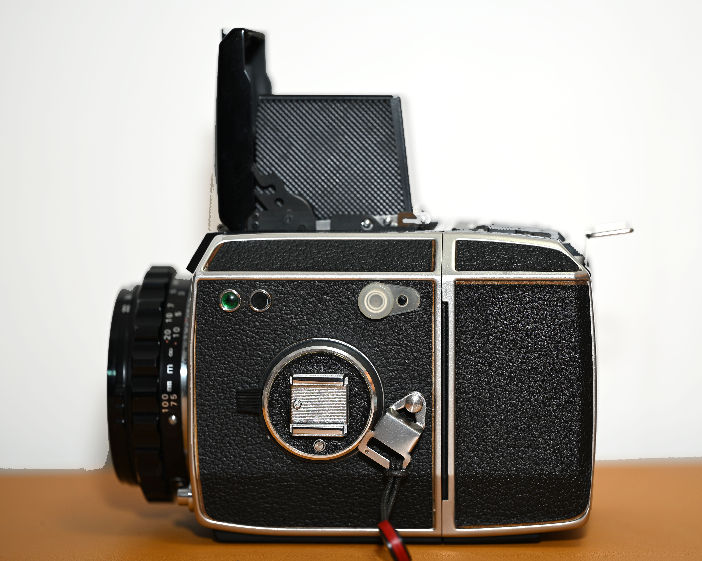

Bronica S2(A) is a popular cheap choice for 6x6 SLR, for many good reasons - besides the price, the glass is great, it makes a great sound, and it's all mechanical. Ergonomically it's a big brick, but it seems very difficult to improve.

I've had mine for four years and I've taken some stunning images with it (check out the HK section in the gallery!). But as you can see, this article is not about the S2A.

The main point of cope - it's all mechanical, it must be (eventually) fixable! - is a red herring. Sure, if you have unlimited resources, time, CNC and/or 3D printing capabilities, and this is your last camera, then probably you can get it working. In the real world though, you usually don't, and when the local sifu refused to take my camera for a cleaning/retensioning of the shutter along with Widelux, I got worried. It was working still, but for how long? I certainly won't have the dedication to repair it myself...

There are few ways to go from here:
- Just get another body if it breaks,
- Sooner Or Later, Hasselblad (TM),
- Upgrade to EC/EC-TL, with an electronic shutter.

With the dream of Topcor-S 50mm F2 coming closer to realization (ordering stuff from Japan), I had to make my move. 

Hasselblad, for one, would be far lighter, and with absolutely stunning glass available, but that step would be very expensive. Not beyond my means, but I wouldn't go to the plebeian 500 series; rather the focal plane shutter-equipped 2000 series, with the ultimate goal of getting the 110mm f2. If I'm going that way, I'll go all the way.

But I'm not ready for that yet. I decided to let go of the S2A rather cheaply (otherwise it's hard to get any customers!), but keep the splendind Nikkor 50mm 2.8 and Zenzanon 150mm 3.5 lenses, and get an upgrade.

# Upgrade path; EC or EC-TL?

I didn't know much before, the EC/EC-TL were kinda on the side, and main spotlight was taken by S and S2(A), with the S2A being supposedly the top.

The lenses and helicoids are compatible between S and EC series, but that's where the compatibility ends. Prisms, backs, ground glass are different. I kept the left hand trigger, but even that's not fully compatible - there's no bottom trigger.

On the other hand, I wanted to get rid of the prism, but no one was biting for years. I used it once, forcing myself in the process; otherwise it is just a big, heavy block that would take space in my backpack. The backs are a shame, but I can skip the 6x4.5 back this time; that also got little use, albeit a bit more than the prism. I liked the brightscreen I had installed in the S2A, but I'll manage with the default choice.

Last thing to consider was - EC or EC-TL?

The prices were similar; EC-TL slightly more expensive. The main difference is in-body TTL metering and aperture priority auto mode; EC does not have that. Otherwise, the TL seems to support intermediate shutter settings, and does not accept the leaf shutter Nikkor 105mm lens.

There is a chimney with a meter for EC, if you want TTL metering, but I realized I don't need that capability; given the nature of the camera, for most shots I would meter with an external device regardless. So I found a nice example, seemingly tested, with the original box.

# Specs

     

          
     

     

          
     

* Film type: 120/220 (medium format)
* Frame size: 6x6, 6x4.5 backs available, 35mm pano also available from China
* Shutter: Focal plane, cloth
* Shutter speeds: B+4s-1/1000s (no intermediate speeds)
* Flash sync speed: 1/60s
* Flash sync: PC socket on the side
* Lens mount: Bronica S
* Focusing type: SLR
* Mirror Lock-up: Yes
* Self-timer: No
* Battery: 4LR44, required (only B mode works without a battery)
* Weight: Still fucking heavy (2003g with lens, film back, waist level finder)

# Medium format SLRs - what are they all about?

It's easy for me to jump over directly towards comparisons with the Bronica S2A; or even Mamiya RB67. But for those readers who never had a medium format system SLR, it might be hard to imagine. The ergonomics are completely different from your typical 35mm camera, which you hold in front of your face.

These cameras can be basically reduced to a cube with a lens in front, film back in the back. As they're usually equipped with a waist level finder, you cradle the camera in your hands, looking down on top; right hand's index finger ready to shoot with the shutter button located on the front, bottom left (when the camera facing us). Left hand would usually be the focusing one. Film winder on the right as well. The process is not difficult, but also not fast, but it shouldn't be if you're planning your shot meticulously. The exact details differ between the systems, and they're covered in their manuals, so I will not describe the operation in here.

There are no ergonomic handles, and they're not really deigned to be carried all the time, especially at their weight. Tripods are their main spot, designed for studio, but it doesn't stop anyone from taking them out for street photography.

The lightest camera in this category (at 6x6 or bigger, at least) would be the Hasselblad series, at roughly 1.5kg, with a standard lens and back. Bronica is significantly heavier, at 2kg; the RB67 at 3kg. Add a prism, and that's an extra kilogram as well. There are large format cameras that are lighter than them. They're also often very complex internally and difficult to repair.

What they offer though, is impeccable image quality with dedicated lenses; more ambitious than 3 or 4-element constructions found in lighter TLRs. Their main use when they were first released was studio, portrait, weddings, advertising. They had to pull their weight on that front. The Bronicas in here have a focal plane shutter, allowing shooting at 1/1000 of a second, for super shallow depth of field; the Mamiyas and Hasselblad 500-series - a leaf shutter for flash sync at full 1/400-1/500s. Their modularity also includes removable backs - you could switch between film very quickly, for example between color and black-and-white; or preloading and then reloading - important given how twiddly 120 film can be, potentially saving the photographer in a time-sensitive situation like a wedding.

They used to be the workhorses in studios. Professional cameras for professional photographers; now in hands of the amateur you or me.

Bronica EC was not the first, nor the last in that category.

# Human-Engineering

The Bronica EC was announced in April 1972. That's 7 years after the introduction of S2, and 13 since the first camera, the Bronica D. The system seemed mature and with plenty of users, and yet unlike many other systems of the era, Bronica decided not to make a new mount, but rather, make the best of what there is.

> The Zenza Bronica EC is the result of human-engineering research for easier handling.

That's the first sentence in the manual. I'm stunned; while it's still not an easy camera to use for beginners, it's been improved, in small but significant ways, making it more pleasant to use.

In this case, it really is simple. A single focus ring, in front, shutter selector and film winder on the right; film backs releasable with a gentle push of the darkslide. The weight and shape make a device that is not what you would call ergonomic these days, and yet, your hands and fingers know where to go to perform the tasks they need to do. 

It's quite visible that Zenza was proud of this camera, and their brand. You will find "Zenza Bronica" mentions 7 times on this device, starting from the very obvious ones:
* Lens cap,
* In front, below the finder,
To less visible, on the:
* Film back,
* Film back hinge underneath,
* Dark slide,
* Focusing helicoid,
* Rear of the waist level finder.

In case you ever forget.

     

          
     

     

          
     

     

          
     

     

          
     

     

          
     

     

          
     

To fully appreciate the changes, I will have to compare it to the S2A after all; even if you haven't had one in hands before, the next section should still paint a good picture on how it really feels to use the EC.

## Upgrades over S2A

I didn't think S2A can be really upgraded, and yet it was. Of course, the shutter is now controlled electronically; in lieu of incredible mechanical complexity that may fail slowly over time, this should last a long time (until it breaks suddenly). However, as someone who has a Minolta XD7 and Hexar RF, and loving these dearly, I am not afraid of that.

### On the body

The obvious thing is the shutter speed selector, moved from left to right, with the speed clearly visible from the top, rather than printed on the side, at an angle. Film/shutter winder is still there, meaning you cradle the camera with your left hand and perform these operations with the right, rather than juggling between the two. I really like how the shutter setting is clearly visible, without flipping the camera on the side. There's one downgrade from S2A though - the shutter speeds are discrete now; you cannot set it in-between for intermediate speeds. Not that it's ever been a problem, or that I ever used it on my previous body.

On the other side, you will find the PC flash socket, and the mirror lock-up lever. It's not clear on the body itself; there's a button you need to hold while you move a lever. I haven't had much issue with mirror slap in practice, even with my lightweight sub-1kg carbon fiber Chinese tripod, but it's a welcome addition.

And it is indeed mirror lock-UP; not a misuse of a popular term. The mirror goes up now. In the original S series, it went down, uniquely; don't think there was another camera that did that; now it's (boring) normal. The original intention was to have lenses go deeper into the body for better optical performance. That had some issues though - for longer lenses, the image would vignette slightly as there was a bit of a missing mirror at the bottom. This has been alleviated, and the EC's mirror has two parts. Not that I will be using this camera with 400mm+, but it's there.

The important caveat here is that it does seem like the Zenzanon 100mm f2.8 and Nikkor 105mm f3.5 (leaf shutter) _barely_ fit with addition of the lower mirror, and the helicoid must be fully extended before installing, otherwise you may hit and break the mirror. That's the closest Zenza got to lens incompatibility between the EC and older bodies.

Another small difference, the shutter will now wind with an empty back. And speaking of...

### From the back

Backs themselves have also been upgraded. On the first glance you won't notice much, except that they're black, but they hide bunch of upgrades.

On the top, you will see two buttons to open the back - the slider from S2A that could open by accident is gone, now you have to press both buttons to open it. There's also the film reminder, and the film counter. The counter being on top certainly helps; it was on the right side before, now you can see where you're standing without swinging the camera on the side.

Below the second opening button, there's a darkslide holder. It's incredibly convenient, albeit there was nothing really wrong with putting it in the pocket or in your mouth (most convenient temporary storage for darkslides, only _ewwed_ at by people who have never used a camera with a darkslide before). This feature was so good, Victor Hasselblad himself has invented it in parallel, and it made its way to Hasselblad backs in 1994.

     

          
     

     

          
     

On the right side you'll find a 12/24 exposure selector, a pull-out lever for manually advancing film, and a multiple exposure switch. The lever is an ergonomic improvement over the previous crude wheel, and the multi exposure function was probably welcomed by some; in the S2A it was very clunky you had to take the back off, reload the shutter on its own, and put it back on. One caveat is however the rather unclear marking. It's marked as "D" and "A" and I was scratching my head, as it was not explained in the manual. "D" stands for "Multiple" (or probably, "Double", but it doesn't have to be a double!), and "A" stands for "Advance". It could've been depicted with some icons. OR "M" and "S".

Generally, the good parts from S2A have not changed. You don't have to use the pull-out lever for winding film, for that you can still use the main body winder. Pushing the dark slide in releases the back as well, and you can't remove it once it's not connected to the camera.

### Finding our composition

Now, for the top part of the camera, there's the waist level finder. How can you improve on that? Once you slide the lock, it opens neatly, and loupe is available if you slide the lock again. I kind of liked the neat hack of tapping the lid against the walls to pop the loupe out in the S2A, but here it's impossible. The WLF will fold fully if you push the lid back down; no need to fiddle with the sides first like on S2A. I mean, most TLRs 20 years prior already did that, but it does feel nice to have it here too, even if the ergonomics of closing the lid have won over the coolness of tapping for loupe.

The ground glass is held in a frame. Designers definitely considered the most likely use case. That is, not to change the ground glass; that's not quick as it's held by metal tabs, but it's very easy to clean it. One lever and it pops up for easy cleaning, like a cat flipping over so you can pet its belly. Swipe it with a brush or microfiber, and pop it back in.

     

          
     

     

          
     

Only problem? It still is prone to misfocus if the foam around the ground glass has deteriorated, same as in the S2A. And ground glass is the regular type, without any focusing aids. Thankfully, you can get a plastic brightscreen with microprism for 15USD off Taobao.

Besides few little hiccups, the camera is indeed truly humanly engineered, with ergonomics in mind. I can't believe I'm ecstatic about a product from early 1970s; but it feels like lost art. It's still a bit quirky, but the designers have done their best to improve the experience.

# One roll

## Image quality

This hasn't changed one bit. Glass is the same. Shutter is the same as well - focal plane, 1/1000s max, but hopefully more accurate with even most barebones electronic control.

Most of these cameras come with Nikkor-P(C) 75mm f2.8. It's a standard lens that recedes deep into the body. Nikon has made great lenses pretty much the whole time (just don't ask what they've been doing in 43-86). It's not the fastest, but it's solid; in real life I probably couldn't tell the difference between that and the Hasselblad kit lens, Zeiss' 80mm f2.8.

But that's a bit... normal. If you just wanted to shoot 75mm, you could get a TLR; maybe with a worse lens, but much lighter.

_150mm, Cinestill 50D. I missed focus a lil on that one, probably because of the old light seal around the ground glass. Only after seeing these results, I fixed that up and got new ground glass._

     

          
     

     

          
     

The other lenses I have are Nikkor-O(C) 50mm f2.8 and Zenzanon 150mm f3.5. 

The Nikkor 50mm f2.8 is rather large. The older, which I also used to have f3.5 was short, but had a massive front element. The image quality is said to be better on the 2.8 version, and it also has a more normal filter size. I don't really like shooting wide landscapes in the square format, it always feels like there's too much sky, unless there's plenty of mountains in the background, but I've used it a bit and haven't had much reason to complain. 

The 150mm f3.5 I've used far more, and not just for portraits. That's the lens I would shoot Hong Kong landscapes with, from a high point, focusing on the dense urbanization. Wide open for portraits, stopped down for fireworks, it never really let me down, despite being rather cheap and simple.

     

          
     

     

          
     

_50mm kinda sucks in the corners though._

Thankfully I have no medium format camera to test these lenses with, and pixel peep the results. I would probably be devastated.

## How did it turn out?

Regardless, to test the camera, I put a roll of (expired) Ilford FP4+ into the back. The gears felt a bit like slipping or skipping before reaching the first shot, worrying me a little. Later though it was quite smooth; and after developing it turned out that there was no issue with frame spacing, overlapping or anything like that.

Above I described all the ergonomic changes over S2A; and I enjoyed every one of them. I found myself still going for the side walls of the WLF when closing it; that's how familiar, but improved, it felt. Besides that, I was very happy to find that everything worked fine. Fast and slow shutter speeds, aperture, focus was on point as well. 

 

     

          
     

     

          
     

# Conclusions

I thought the S2A would be another forever camera that I would never sell (and not just because Hongkies will never look at anything that's not top of the line). I've used it a lot, albeit only in Hong Kong, due to how heavy it is, in many different circumstances where it never really failed me. But the reality fact-checked me.

Still, I'm quite happy with the next step. The EC is not a must upgrade for S2 owners - it does the same things, using the same lenses; it's just so much nicer to use. If I knew, I would go directly over there, even though in that case I probably wouldn't be able to appreciate the extra effort from Zenza. The final choice between the two depends on your perspective on electronic vs mechanical cameras. 

I don't mind some electronics in a camera - as I mentioned, I already own a few that depend on it. In practice, when it comes to maintenance and how fixable a camera really is, it's a matter of complexity. A medium format, focal plane SLR with speeds up to 1/1000th of a second will be far more complex than a TLR with a leaf shutter. Electronic control was the way to avoid hundreds of tiny gears and springs neatly tucked into the body (and to decrease manufacturing costs too, for sure). Capacitors seem to be the most common issue in such circuits, and these are still common and relatively simple to replace; unlike fully mechanical devices that may need parts that are no longer available. On the other hand, for an end-of-the world scenario, it would be easier to machine a replacement gear or lever, than to produce a properly specced cap; and god forbid, custom ICs.

If I had to put the Zenza Bronica EC on the three-point rating scale, it's hard for me to say. It's still relatively big and heavy, so it's not a camera to be taken everywhere with you; but it also does what it can very well, and will work in other scenarios in a pinch. The middle of the three-point scale, where it's a device that is adequate to its purpose seems fitting; it does not exceed, but it gets very close there. For an even better all-rounder, consider the EC-TL with auto exposure, that would cover basically any place that would require quicker shooting. If I felt ridiculous, I wouldn't mind taking the EC for street photography. I occassionally will anyway, probably.  