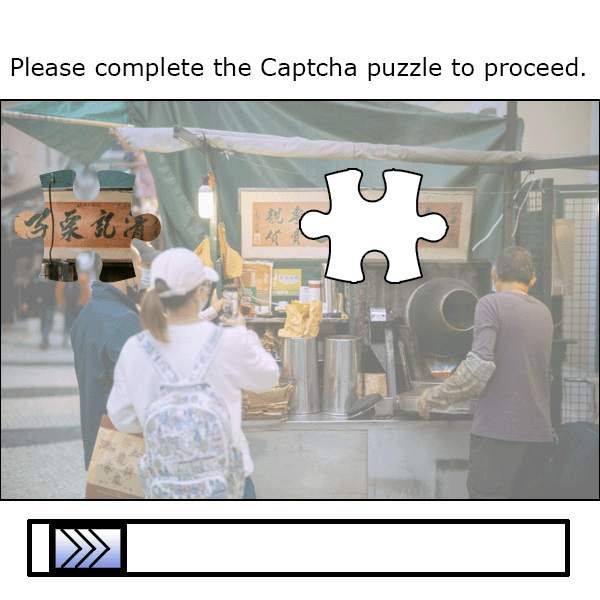
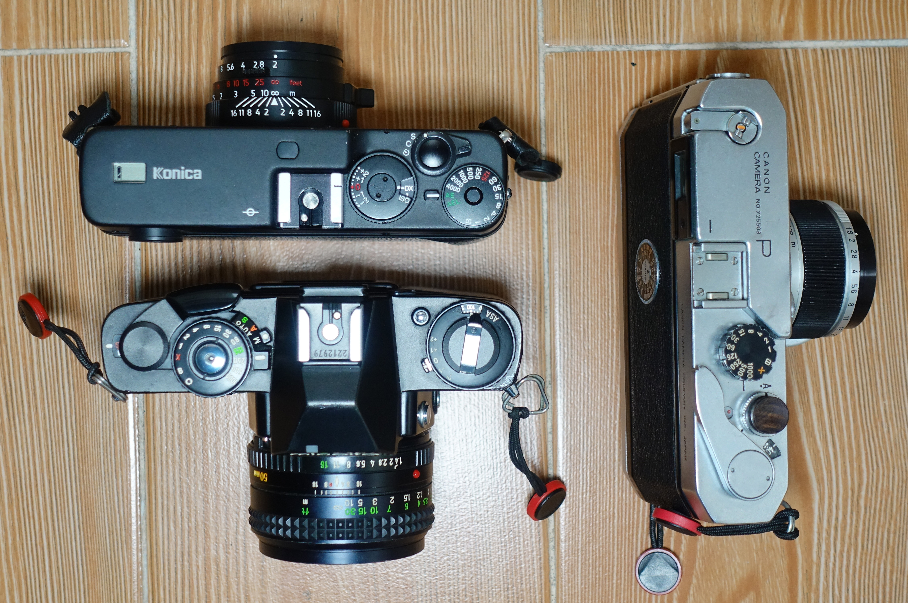
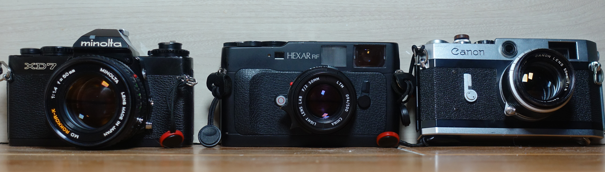
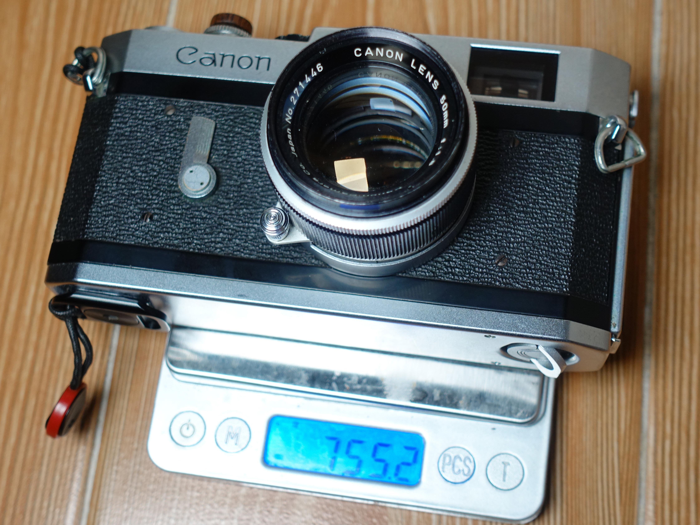
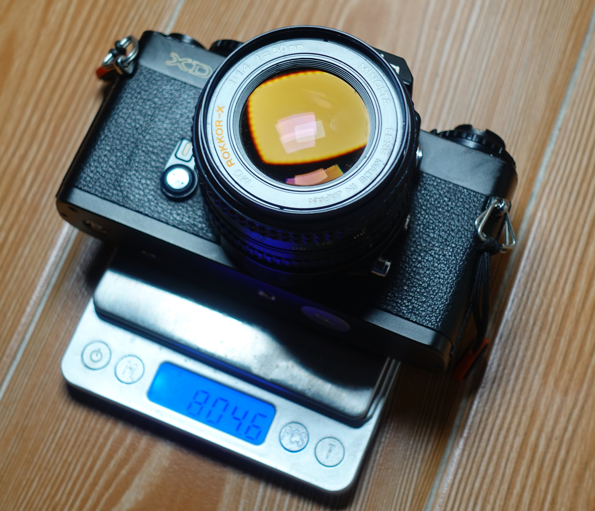
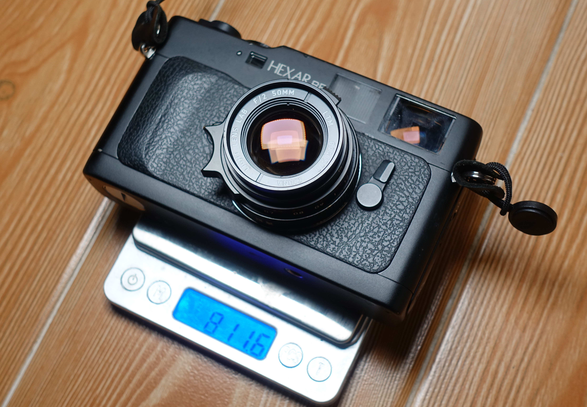
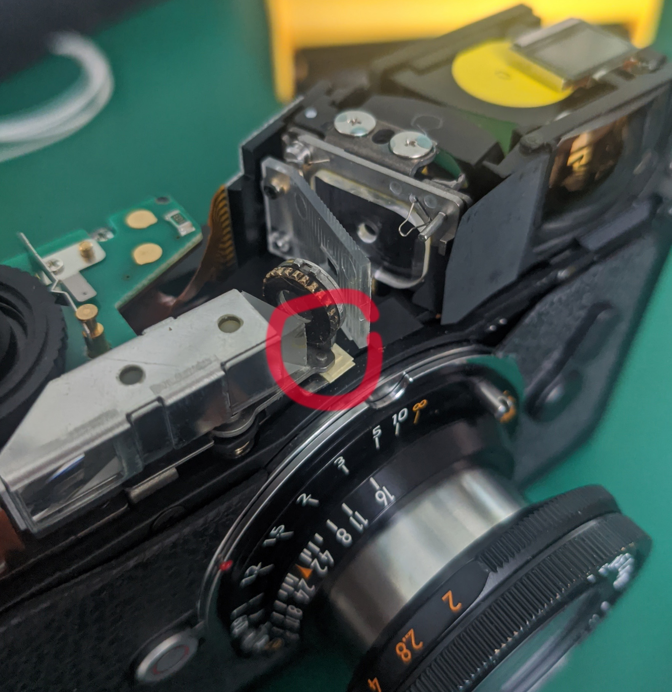
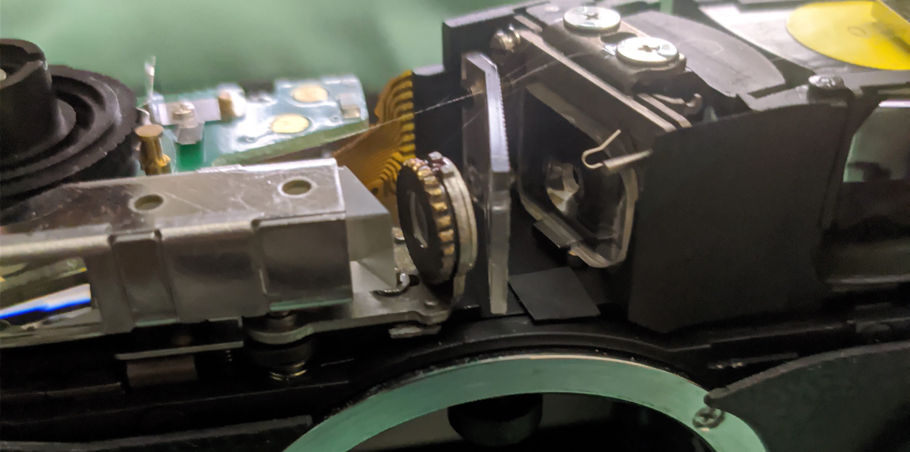

BRO. GET A RANGEFINDER. BRO. 

What for? SLRs are superior which has been proven how Lieca was begging Minolta to get them out of bankrupcy in the 70s.

BRO, SO MUCH LIGHTER AND SMALLER. QUIET, PERFECT FOR STREETS.

Literally not smaller or lighter, besides lenses. Sound maybe a bit quieter, but not much compared to a Minolta XD, and in the loudness of the city it doesn't matter. And you're trading away a lot of flexibility, zooms, accurate focusing... 

EVERY PHOTOG ENDS UP WITH A LIECA. SOONER OR LATER, HASSELBLAD AND RED DOT. BRO. GET A RANGEFINDER.

Seems like it, true. I really cannot argue with that - hobbyists do tend to go for that, despite its obvious flaws. Canon P was a great deal of fun, but you know what would make it even more fun? Automatic exposure. So I got the Hexar RF.

# Specs

* Film type: 135
* Frame size: 24x36mm (fool frame)
* Shutter: Focal plane, metal
* Shutter speeds: 1-1/4000
* Focusing: Rangefinder
* Viewfinder: 0.63x magnification, 28-90, 35-135, 50-75 framelines
* Metering: TTL
* ISO range: 6-6400, DX
* Hot shoe: Yes, with additional pin for when the flash is ready - just like Minolta X series (post SRT, pre autofocus)
* Automatic wind, rewind
* Batteries: 2x CR2
* Original price (1999): 168000 JPY (body only)

There was a 'facelift' model with supposedly better rangefinder mechanism - recognized by a small plastic half-circle guard at the lens release button.

Sounds about right for a state of the art camera from early 1980s, but wait... this one was released in 1999.

# What makes rangefinders so fun?

Why are they so popular among rich amateurs? Pros don't really go beyond the technically best devices, but may get one for fun...

Do you post on 4chan a lot? Do you like solving Captchas?

So what's the difference between solving a Captcha and finding range?

Yep, that's it. The satisfaction of matching two images.

Lenses can be smaller, true - especially wide angles, as they don't have to be a retrofocal design.

No blackout finder may seem like an advantage until you teach yourself to shoot with both eyes open.

# What makes them so bad?

I'll skip the topic of price and red dots - which is unrelated to the matter at hand.

Rangefinders were fine up until the release of Nikon F, and it should be obvious why, when listing few of their disadvantages:
- no TTL view and always some parallax error,
- TTL metering is always stopped down, not helping in low light situations (little light stopped down vs more light + calculated aperture position)
- focusing fast lenses is a pain and very dependant on effective rangefinder base length,
- no shutter priority is possible,
- no autofocus,
- no zooms,
- rangefinder may get knocked for no reason and suddenly you need a service,
- lenses beyond 50mm are unfeasible, and beyond ~100mm - impossible to use,
- long minimum focusing distance (typically 1m for LTM, 0.7m for M), no macro,
- you cannot choose a perfect option with all the possible framelines and longest base length - lenses are compatible by mount, but not by frameline sets,
- if lenses differ in actual focal length (eg. 52mm marked as 50), you're gonna have a mismatch between viewfinder and actual image. Not by much, but still.

So no wonder that they got replaced fast in most uses.

But they're fun. And that's all you need if you have disposable income.

# Few comparisons

Gathered up Canon P, Hexar RF and Minolta XD7 with a 50mm standard lens. Minolta is at immediate disadvantage as it's a 1.4, while the P has a 1.8 and the Hexar - the f2 Elcan, but we'll see. No film in either, just batteries if necessary and PD anchors.

First, size:

Core body size is almost identical to all. Due to mirror the Minolta goes out longer. Rangefinders can be coat (or hoodie) pocketable with collapsible lenses, but in most cases they go in the bag like all the others.

Now, weight:

     

          
     

    

          
     

    

          
     

755g for Canon P with 50 1.8, then 804g for Minolta XD7 with 50 1.4, then 811g for Hexar RF with 50 2. No significant difference that would suddenly make me choose one over the other. If you put them in your pants, they will sag.

Shutter sound, recorded with manual gain on external microphone:

`youtube: https://youtu.be/ZTUexHV9cgE`

Canon P obviously has the best sound, but neither Minolta XD7 nor Hexar RF are particularly loud either.

# Why Hexar RF?

Auto exposure was a must for me, and that already cuts the options down to CLE and Hexar RF. M7, ZIkon, Bessa - a joke, too expensive, too cheaply made for the price. CLE has 40mm instead of 50mm framelines, and I already have the LLLcan...

I just went with my heart, for the most advanced camera. 1/4000 sounds tempting for wide open bokehlicious portraits during the day; auto winding and continuous mode can be nice for pretending to be a journalist, and the form factor seemed better than the reddot equivalent.

I am not afraid of the electronics, as long as they're working at the moment of purchase. There's also a Russian guy that can fix the shutter error, so not all hope is lost. Besides, it's only 20 year old, roughly speaking, that's not too bad. Don't wanna go on a rant about how electronics and software should be open source when official support ends, but... eh... guess gotta reverse engineer at some point, although as they're highly integrated devices, replacements may be difficult. It doesn't seem to be a popular device online though. 

So, at the end of the day, I got one from Japan through dejapan, with fully working LCD, and description saying that shutter, winding works fine. Sounds good.

# The issue

Of course there was one. You spend so much for a camera and it can't be perfect, right?

Rangefinder was completely off. Vertically and horizontally. Did something get knocked in the transport? Should be a quick fix.

Opening up the top is simple - spanner wrench (or tweezers) on the sensitivity dial, three screws, one under the leatherette. It did look like someone got there before - tiny scratches here and there, hm...

I got the vertical alignment done easily, but horizontal... I couldn't move the screw either way. And then I noticed... few thin pieces of paper under the mechanism. I moved them around and sure enough, the horizontal alignment got better. Jesus.

That's beyond me. I left it at Camera Repair Centre in Tsim Sha Tsui in Friends House, and for a moderate but reasonable fee they fixed it. After four weeks, I picked it up, all good, then after a week the rangefinder was slightly off again, and then two days later it seems to have been fixed well. Whew. That was not a given, since parts can be scarce - but I told the obviosuly very experienced repairmen that I'm not against using what we call in Poland 'patents', referring to homemade solutions, as long as they're working and solid.

_I haven't had a proper look - I was gluing the frame illuminator window, but I did notice lack of papers..._

One thing to note is due to long repair time, me testing/retesting the camera, I took more than one roll with it. Again, disclaimer for the title. What matters is that the impressions were truly fresh and haven't really changed within a month of repair.

# What to check when buying a Hexar RF?

Try to get one with the half-circle guard around the lens release button. Better buy in person to check the rangefinder. LCD not bleeding, shutter speed indicator working in the viewfinder... the obvious. Most importantly though, that the installed diopter is one matching your eyesight, or at very least, a 0. The eyepiece is required, and a part of the optical path - without it the image is just blurry. You can't really get them easily, although I have found that for about 400 CNY there's a gold replacement for a 0 diopter on Taobao. In western world it may mean that you're fucked if you don't have one or it's wrong value. I gambled (didn't know about the Taobao option yet), and thankfully it was a zero.

# First impressions (post repair)

Ergonomically, it feels quite nice. There's a slight grip in front and back; rubbery leatherette keeps grip well, so you can hold the camera with two fingers without much worry. Of course it's not EOS 30 tier in comfort, but it's good enough.

Viewfinder is bright and clear. RF patch wonderfully rectangular. In comparison to Canon P seems great - P's patch is not so clearly defined, but then higher magnification better suited for 50mm+ lenses. Finally, for 35mm lenses I don't have to look around the viewfinder to get the whole picture.

The buttons, dials, they work great, proper clicks. The LCD screen only shows battery level and frame count, kinda weak. The shutter speed indicator in the viewfinder doesn't tell the whole story (stops at 1/4s + warning for exposure compensation) and isn't perfectly visible, but it does the job. That means the meter is enabled in manual mode as well as AE/AEL.

Hot shoe is the same like on my Minolta XD7. And I do have a Minolta flash that tells the Hexar RF when it's ready. Amazing backwards compatibility here! But do be careful with trigger voltage - since it's electronics only, it's gotta be low enough. Older flashes can be brutal.

     

          
     

    

          
     

    

          
     

All in all, a solid package. Obviously an enthusiast's piece of gear.

# In action

_CoLLLapsicron 35mm f2, Ilford P4 Surveillance @ 400_ 

Truly smooth, a tool that does not get in your way, designed to be fully operated with the right hand on the body, left on the lens. Point, focus, shoot. If you need a special adjustment for the scene, no problem either, the dials are easily accessible without taking your eye off the viewfinder. If you change the shutter speed in manual mode, you'll have the chosen one lit up, and suggested blinking; if you use exposure compensation, well, you'll get a warning but you won't know how much different it is without looking up, or counting thirds of a stop from the zero position.

The mode selector around the shutter button is easy to go into off/locked position, thanks to the little tab that sticks out when the camera is enabled, but from off to on is a bit more fiddly - you can use friction from front, or push the tab from top.

_Mr Ding 50mm f1.1 @ f2, Provia 100F_

Auto winding means unfortunately that first three or so images are lost, and that behaviour cannot be changed. But loading the camera is simpler than any red dot with its silly bottom loading systems. When the roll is finished, it's rewound automatically. There's this behaviour that if you open the back within 1 second after it's done, the leader will be left sticking out. But if you fumble with the door latch a bit too long (if you don't have long enough fingernails it may happen), it will be wound into the canister. That behaviour cannot be changed, either. Hexar AF has a whole secret menu and dynamic reprogramming, there's no option here (that we know of). So for rewinding, I brace myself and try to get the door latch into the ready position, for the tiny window.

_Forest Loli with LLLCan @ f2, Ilford Surveillance P4 @ 100_

Shutter sound is alright, the winding sound is a bit loud but not as bad as Konica MG/D. There's no stealth mode like Hexar AF, or delaying the winding until shutter button is released; again a bit of configurability would be nice. It's still great for streets thanks to automatic exposure.

# Is there anything more to say?

After all, it's a camera working properly that takes good care of what can be automated away easily. Maybe that Voigtlander 15mm gets metered properly despite heavily recessed element, and CoLLLapsicron fits in nicely, unlike Canon P. I could also say that I can nail 50mm f1.1 wide open if I try hard enough (+ some luck, probably), meaning all scare about inaccurate focus with non-Konica lenses is bull; that the meter is accurate enough for slide film, but that's properties of a properly designed and working tool.

_Mr Ding 50mm f1.1 @ 1.1 on Provia 100F_

A tool. I mean, I like mechanical cameras for all the sounds they make, but I appreciate the Hexar RF for what it is. I ragged on point n shoots that they're too automatic; Hexar RF is about the balance I need. For most shots, and especially street, spot metering is not necessary, but metering every time or even running Sunny 16 mentally (in tough conditions of densely populated narrow streets) gets old. Exposure can be adjusted if I need it; long exposures are still feasible, and I can focus (and recompose) wherever I want.

_few seconds on AE, with Voigtlander 15mm f4.5 LTM at f16, only +1 exposure compensation due to the lantern in the middle that could fool the meter._

I do catch myself sometimes wanting to wind manually after a shot, but it's not something I horribly miss.

Some people may call it soulless. To me, the boring and mundane aspects are removed so you can focus on the important parts. At the end of the day, you're not getting any extra creative control by _having_ to meter manually (you still can!) or manually winding. Okay, no double exposures, but frankly it's no loss. Instead, actually, you're given even more possibilities thanks to faster shutter speeds and continuous modes.

For all manual, slow, methodical shooting I still have large format. Baby format was never about planning a single shot, it was for fun, and speed, being ready at any time for the "decisive moment".

# Conclusions

_LLLCan, Ilford Surveillance @ 400_

Would I recommend a Hexar RF? With repairability issues in mind? Yeah, sure. Still competitive. No other M mount film camera offers 1/4000. It's around third cheapest, after Leitz CL and Minolta CLE, maybe on par with Bessas, but that does not mean it's cheap. If you want to take good pictures, you don't need a rangefinder; I'd say it's even detrimental due to its limitations. But if you want to have fun taking pictures (but not just of your camera), it's great - and overall quality is absolutely there to get you to the results you need. Get some funky third party lenses to accompany, M mount has plenty of choices (unlike LTM, unfortunately).

What will happen if it breaks again? Tough choice. If it's not repariable, I'd probably want to get another one. But do not worry, _carpe diem_, or as the younguns say, _yolo_.