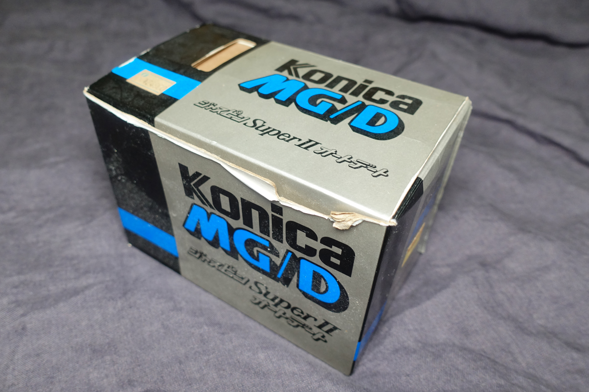

Run. Point. Shoot. Live. Then complain about Portra 400 prices. That's how an average film point and shooter thinks his life looks like, and probably it's not that far off - they usually have more of a social life than me.

# The PnS mindset

In general, in the PnS world, for anyone who's a bit more into it, there's a distinction between: jewellery, primes and zooms. The jewellery are the Contaxes, Mju-Twos, Yashica Ts and Liecas; their qualities don't really matter. Primes are generally regarded as 'sharp' and can get pricy, but not as much as the jewellery; unless it's a fixed focus one, then it's garbage. Zooms are usually regarded as trash, though, with dark apertures and being quite clunky. A long range zoom covering FF that's this small? It can't be good.

Usually they're bought for people who go on parties and generally have fun, so image quality isn't a priority; the ease of use and quick operation is. So I can already feel it's not for me - and I had a Mju-1 which to me, besides its size, had no redeeming qualities.

Quick Focus on the Negative for Mju-1: It was slow to focus (it would move the lens slowly after pressing the shutter), had a tiny viewfinder and image quality was nothing to write home about.

But that's a famous one. Many companies made point n shoot cameras that often went unnoticed, especially in the 80s.

# So, about the MG/D?

While looking for a Hexar RF, I found a _very_ cheap Konica MG/D. Two of them, even; one with the box included, in unknown states, although they looked quite clean. To recuperate some of the shipping costs, I bought them both to resell, or maybe keep one if I like it?

Konica MG/D is a date back version of Konica MG, released in 1984. Besides the date back, they're identical. Probably manufactured up until at least 1987 or so, given that one reminded the user to change the date back battery in 1991 - and the manual mentions to replace it after 4 years. The box of the one I got had a sticker, mentioning the price: 24900 JPY. In 1986, 200JPY = 1USD, giving ~125USD. Equivalent to ~350USD in 2023. Not cheap, but not terrible.

Disclaimer: since I bought two, and I tested/repaired them, I took more than one roll with the Konica MG/D. Just to be honest.

# Specs

Thankfully I have the instruction manual, albeit in Japanese, and as such all the specs come from it. The manual in English can be also found online.

* Film type: 135
* Frame size: 24x36mm (fool frame)
* Shutter: Leaf
* Shutter speeds: 1/30-1/500
* Aperture: 3.5-16
* Focal length: 35mm
* Lens design: 4 elements in 4 groups
* Focusing: Infrared autofocus, 1.1m-inf, can be locked with half-press
* Viewfinder: 0.43x magnification, 80% or more field of view (?) Simple with framelines, also for paralax correction
* Metering: CdS, auto metering, from EV9 to EV17 (ISO 100), will give underexposure warning if below EV9
* ISO range: 50, 100, 200, 400, 1000
* Flash: Built-in, operating range 1.1m-4.5m, equvialent to GN12 (ISO100, meters)
* Batteries: 2x AA 1.5V (will work with NiCd 1.2V too)

Other, notes:
* Self-timer, 10s
* Auto-loading, and when door is closed, it will advance first 3 frames automatically
* Manually enabled rewind, although with a motor
* Film will be advanced _after_ depressing the shutter button.
* Date back goes to from 1980 to 2019, classic.
* Warranty: worldwide, 1 year. Service points listed in the warranty card.

# Issues

Of course, not confirmed working cameras didn't work perfectly. On one, the door latch was broken, but thankfully the plastic piece still in the package. On the other, the battery contacts on the battery door were corroded. On both, the date back appeared not to work, but a fresh CR2032 battery brought them back to the world of living again.

The battery contacts fix was easy - sanded the rust down with a dremel, and put some solder on top to make sure it does not rust anytime soon again. Thankfully it was at the part connecting the two batteries in serial together, not at the other end with springs. A better fix probably would've been getting some copper tape and either gluing or soldering it to the battery door.

The door latch I almost gave up on - neither cyanoacrylate nor epoxy held it. I used a soldering iron to melt the two pieces of plastic together - that held for a roll, but broke suddenly again. Next time I also embedded a piece of wire to hold the two parts together and melted them much more, burning the light seal that then also needed a replacement. It's not an exact science and I probably could've done it better, but it feelt quite sturdy afterwards.

# First impressions

    

        
    

    

        
    

    

        
    

It's crude. I can really tell it was made in the 80s, the Mju-1 was far more refined. If you know a thing or two about mechanical cameras, you can easily spot every part that has been motorized without much improvement. The plastic shell is actually quite nice to hold, thanks to the rough surface at the back for your thumb, and a grip in the front. The included Konica branded, textile wrist strap was alright too, unlike Repo's. It's also pocketable, albeit it is quite chonky.

It's not a masterpiece in handling, but the door cover opened nicely, with a click; the shutter button is mushy but thanks to long travel distance it's not difficult to find the half-press point.

I did appreciate the manual ISO selection - allowing for pulling or pushing film with ease, without any silly DX hacks.

The camera does not give any indication if the focusing is closer than 1.1m, which can be tricky. Basically it's how long your arm can reach, and then a bit more.

_Ice cream at arm's length... too close._

# In operation

Both the shutter and advance mechanism are loud. However, in all its crudeness, it's blazingly quick. Opening the cover, and the camera is ready to go - so much so, that if you hold down the shutter button and open the cover, it will take a picture pretty much immediately. The lens starts at closest distance, and when a picture is taken, it snaps back in an instant to the proper focus position. Mju-1 would take its sweet time for that.

I also do like how the film advance is engaged after you take the finger off the button. The click of the shutter is sharp, but quick, giving street photographers an opportunity to snap a pic and walk few steps before unleashing the loudest part.

Once the camera cannot advance anymore, the red LED on top will blink, telling you to rewind. Just flick the switch on the bottom and wait patiently. It's not a particularly fast mechanism, and it does not stop automatically - you're supposed to listen to the sounds it makes, or wait until the red LED on top turns off, according to the manual.

And that's it. The whole experience. You can change the ISO mid-roll, treating it as exposure compensation. Maybe put your finger on the light meter below the lens to trick it into shooting wide open. Run. Point. Shoot. Live.

# Images

4 elements in 4 groups is not a Tessar (that's 4/3), but it's still plenty, it would seem. But never have I felt like the image quality amazed me in any way; autofocus seems to work alright, but you can't get any bokeh out of it. Sharpness is satisfactory, across the image. Pretty much what I thought about images from the first Mju as well, a reason why I haven't bothered with it much. Anyway, see for yourself:

    

        
    

    

        
    

    

        
    

_Flash is not very powerful - good enough for portraits, though._

# Was it worth it?

I enjoyed my time with the cameras while I was testing them. They're not bad, and frankly, a bit slept over. But they're not for me. If I want an automatic experience, I'll just grab a digital, and I don't believe in film look. The minimum focus distance of 1.1m also was a limitation I hit few times, that was a bit annoying.

I also was bullied in school, meaning I need to have more control over my life than most people. However, both cameras I bought, I sold _very_ quickly to people who enjoyed them much more, only underlining that the problem is me, not the camera.

For a point n' shoot for myself, I probably would go with the Hexar AF, but it's literally three orders of magnitude more expensive than the MG/D was.