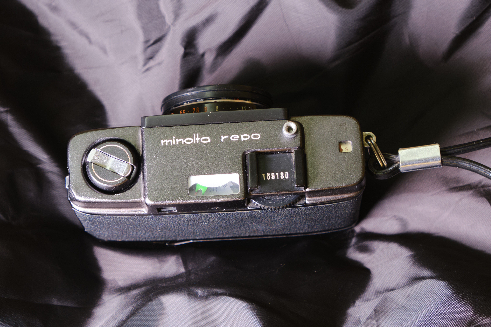
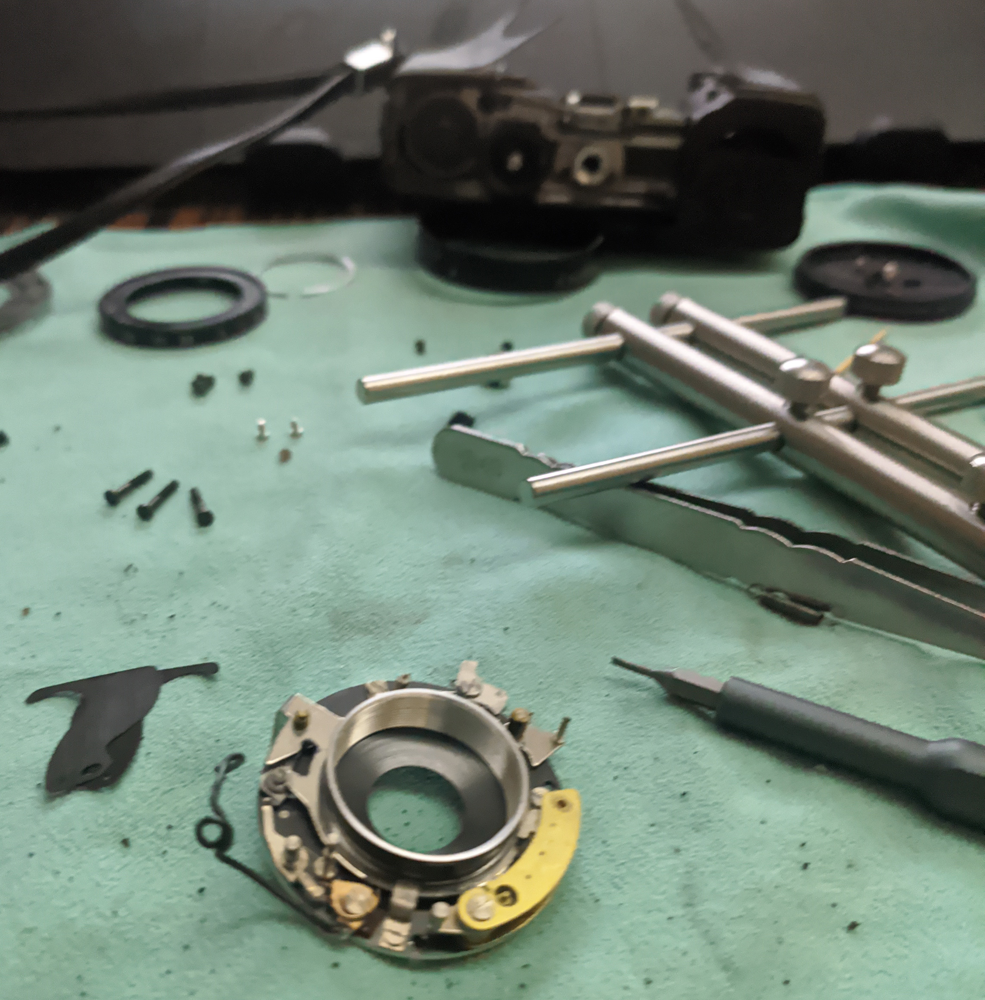
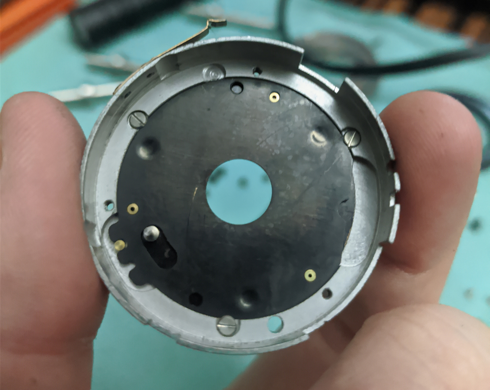
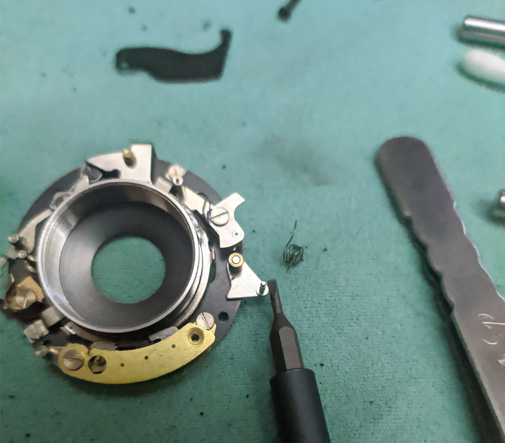

When I first heard of half frame cameras, I thought they're a great idea. 72 pictures! Can save so much on film! And the cameras are usually smaller, too!

And as a fan of Minolta, the Repo seems like a no-brainer. Just get one in sexy graphite black from Japan, and remembering it's a 60s camera, still, can't be that bad, right? So I got one, even though...

# Previous half-assed half-adventures

I had a Chaika 2, and Agat 18K (which is an amazing feat of low-cost engineering, by the way), and since moving to Hong Kong, I didn't take either of them with me.

Well if they're such a great idea as I mentioned earlier, why not?
Image quality from Chaika wasn't great, but that could've been a scanning issue - I started out on a flatbed. A 9x13cm print I once made didn't amaze me with sharpness. It's fine.
Cameras themselves weren't that much smaller - Chaika especially. Agat 18K was a bit smaller than Rollei 35.

And what a pain it was to finish 72 frames. When I went to Berlin to visit my friend, I decided to shoot Velvia in the Chaika. I didn't finish the film during my 5 day trip, actually. Accurately metering 72 times... it gets boring quickly. Although it still is better than shooting ISO 6 film, where you have to set up a tripod every time.

Funnily enough, film half frame has somewhat of a direct successor in digital in the form of APS-C - 18x24mm is not that far from 15.7x23.6mm. Well, let it serve as a reminder of what kind of scam APS film was. Anyway it means I'm basically using a half-frame digital camera now.

# Back to Repo

Despite previous mixed experiences, I saw the Repo and fell somewhat in love. I love the old ``minolta`` logo. Especially in black, it just looks great, much better than Chaika, but it cannot be compared to the plastic Agat. And in hand it feels better than the Soviet experiments.

So when I was looking for lenses for my Horseman 45HF on Japanese Yahoo Auctions, I also picked one up. Untested, but looked good enough in the pics. What could go wrong?

# Specs

* Film type: 135
* Frame size: 18x24mm (half-frame)
* Shutter: Leaf, made by Citizen
* Shutter speeds: 1/30-1/250 (fluid) + B
* Aperture: 2.8-16, three blades giving a hexagonal hole
* Focal length: 30mm (~50mm full frame equivalent)
* Lens design: 3 elements, I believe - some say it's 4, maybe. 3 groups for sure.
* Focusing: Guessing, with detents at 5, 3 and 1.2m
* Viewfinder: Simple with framelines, also for paralax correction
* Metering: Selenium cell, match-needle coupled with exposure setting ring
* ISO range: 10-400 (matters only for the meter)
* Flash: PC socket, cold shoe.

# First impressions

    

        
    

    

        
    

    

        
    

It's a solid chunk of metal, and not that small to begin with, to be honest. Goes in hand pretty nicely, although the (I assume) original wriststrap is stiff as hell. Conditioning it didn't help much... That's alright.

I was a bit disappointed to see that it's an EV-based camera. That is, there's no shutter speed and aperture to choose from, but you choose the exposure number. It was a silly trend, and frankly instead of numbers I'd prefer pictograms for weather. That would be more useful when the meter dies.

Weirdly enough, after 60 years or so, the meter on my copy was fully functional! It's a simple match needle type, but you don't need much more than that. I couldn't check exactly how accurate at the beginning, but I will get back to it later.

I was intrigued at focus scale having indents for 5, 3 and 1.2m - let's say group, full body portrait, and close up portrait distances. Seems like actually a good idea, given how the focusing ring is somewhat hidden, from the perspective of the photographer.

Usually I'm not a fan of advance wheels, but here it makes sense to keep the whole thing small, and usable with one hand, unlike Rollei 35.

# The issues

Of course there are. Not the first time, nor the last (*COUGH*HEXARFUCKINGRF*COUGH*) I bought a camera from far away with some issues. Chaika had some too, had to file down the hole for the advance lever.

In this case, the aperture blades seemed stuck and crooked. I understood from the EV dial that both shutter and aperture are changed at the same time (and unlike Agat, it's not one assembly doing both things, fucking genius btw), but the aperture wouldn't budge. The ring you rotate for exposure change also seemed a bit off - B was in wrong position, at least.

But the shutter worked, and the glass was in very good shape. That's a good sign. Worst case, can use it like a disposable, in sunny weather it should be fine.

I wanted a pro to look at it, as I was rather afraid of shutters, even of the leaf kind. I realized that in Hong Kong a specialist may be rather pricy, so I asked a friend from the mainland to find some alternatives. To no avail (I noticed a trend of chasing the newest here...), so the camera was unused for over half a year since I got it.

# The repair

Finally I got tired of it and opened it up myself. It was a T8 Sunday, so I didn't have any other plans anyway.

There is not much information about disassembly of this particular camera online - a video about cleaning the shutter and a Japanese blog.

Needless to say I removed the lens/shutter assembly, maybe with few too many parts actually. I found that the aperture was indeed stuck - old grease can really stick. Thankfully, everything else was fine. Aperture blades were cleaned, and shutter re-assembled. A tiny bit of machine oil was added to the critical parts, although they don't seem to need them.

_Aperture is stuck inside this module, sandwiched between two plates_

Well, re-assembly of the shutter took me a long time. I didn't pay particular attention to how it was assembled, and that was a mistake. At some points, some springs may have moved where they shouldn't be, and good luck finding which, and where it should be located... Remember kids to take photos on every step of the way, or you will have to pay the price.

The price is of course learning what every piece is responsible for, its range of movements, and where springs need to be placed for it to work properly. And that there's a specific assembly order, which if you don't follow, it won't work at all. It's a very educating experience, and humbling too. Can't imagine what was going on in the mind of the designer of the Citizen shutter. Every part of the machine was meticulously designed and produced exactly as it should be to perform its function, no more, no less. Seems obvious, but it does feel amazing.

_Putting the springs is really difficult, when you have to figure out how to put it in properly, and then do it..._

I was also amazed by the "programming ring" - a flat piece of steel that guides retarder, aperture and shutter lock pins, to go between 1/250 f/16 and 1/30 2.8, then B, then 1/30 from f/2.8 to f/16. Surely, precisely calculated and machined. Reminds me of automatic transmissions. Nowadays, a ring would be connected to an encoder, that to microcontroller, and that to electromagnetic shutter.

Knowing the exact position of the programming ring, I also adjusted the position of the exposure setting ring. B was finally B, not something around.

The front element does all the focusing. The focus ring basically screws in and unscrews the element, setting the focus. Unlike most lenses I've opened and cleaned, there was no indication where infinity lies. I had to use a spare ground glass and a loupe in B mode to find the right position, and then install the focus ring. I was really surprised to see rather sharp images on the ground glass, despite a simple triplet lens, wide open - meaning that half frame image quality is most probably limited by film, rather than lenses.

# Now that it's working, let's shoot!

Loading the camera is simple, but a bit fiddly with a metal tab. I put the camera in my bag and went to work. I don't go out to shoot much lately, and I wanted to test it as soon as possible. Put a roll of Ilford P4 Surveillance film, and decided to go at ISO 400, knowing it gets pretty grainy.

Few snaps later I learned to appreciate the simple metering and focusing. Of course it's not a rangefinder, so accurate focusing is a bit out of the question, but the indents are actually genius. In your mind you may have some distance to your subject. You can compose and without removing the camera from your face, focus more or less where it should be. Similarly for street and hipshots - much faster, and doesn't require you to look auspiciously at your camera. 

_Like in this shot of a freshly caught massive fish - just passing by with camera in my hand, didn't even bring it to my eye, 1.2m would be about right..._

Which means that every zone focus camera should have that feature. Especially since if you do get your subject perfectly in focus, it's sharp. The 30mm f/2.8 Rokkor is a simple triplet, I think - I couldn't figure out if there's a group with glued elements, but it didn't seem like it. And yet it produces great results.

_A boring bike shot, but it has plenty of sharp details._

Remembering the camera came before 1965, of course the lenses are single coated. There's not much for flare resistance, and highlights can give a bit of a soft, dreamy look (although that could be because I accidentally left a fingerprint on an inside lens element, that I cleaned after the roll). That can be good if that's what you're aiming for. I'd have to shoot some color portraits to make good use of it, though.

_Even at night, with strong lights, it's not that bad for an inexpensive camera with a single coated lens._

# Metering

Only problem with selenium meters is that I don't really know which area they meter for. I wouldn't shoot slide in this, they need to be generic enough to get a roughly good exposure all over, but would struggle with contrasting scenes. Even more so, given that you have no control over exact exposure settings, so an external meter would be essentially useless, unless I could somehow use 1/30 in every situation, with the flash setting. However, if the selenium meter was not working, it's not too difficult to figure out rough EV settings. Rightmost for sunny days, leftmost for a bit after sunset or heavy overcast. And in-between settings for in-between conditions. The printed values from 8 to 16 are I believe for ISO 100. But a moving needle does give more confidence in your shots.

I realized at some point that changing the ISO does not change how the shutter operates, but it changes the gearing in the green meter matcher. It goes from ISO 10 to 400, and of course, 1/30 2.8 at 400 is equal to completely different conditions than at ISO 10. So no reason to change ISO mid-roll to 'compensate'.

# Life after shooting

Still, 72 pictures is a lot, especially if you don't go anywhere really special. Rewinding is done by the pop-up lever and holding down the button - it's a cheap camera, and I guess locking the rewind would make it too expensive. No big deal. At least it's not something as stupid as a knob, like in Barnack Leicas.

Well, I did mention 72 frames is a lot. Doesn't change for development, but it does for scanning. Each frame is scanned individually to get better quality; I don't play with diptychs. And it takes time, and the keeper rate is usually lower, but I can be surprised by some photos I took on a whim.

That does remind me it's a bit of a pain to do it all myself. 

# Contradictions, conclusions.

It's fun to shoot in casual settings, but then I have the RX100... It's a lovely camera, but space in drybox is limited. Lack of manual settings is both a blessing (in quick shooting) and a curse (takes away control when you do need it).

Half frame makes it cheaper to shoot, but I actually don't shoot all that much. To drive a point home, after shooting the first roll in October, I haven't shot another, although I could say that I got busy with other gear.

Would I recommend it? If you want a half-frame experience, it's probably one of the best options you can get for cheap, without going full Pen F or Canon Demi. It's not as quirky as Dial 35 or Agat, but it's still a solid shooter. If it works, including the meter, absolutely. Even if you haven't tried half-frame yet and you're skeptical, it's relatively cheap, and it is a fun experience.