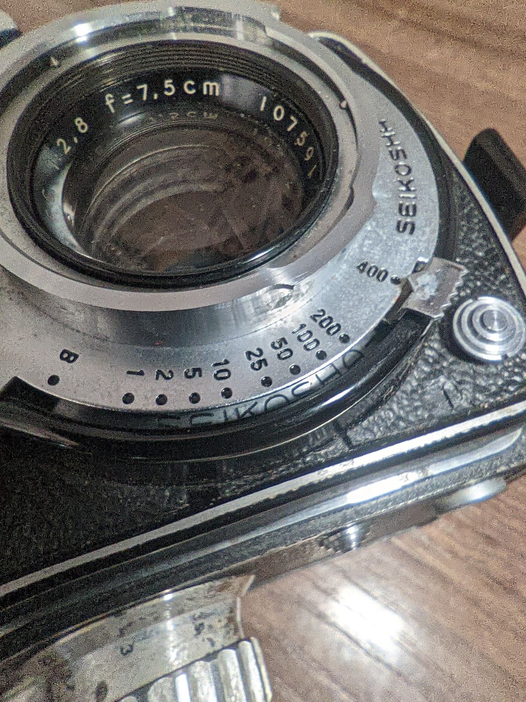

Or when you learn that Rolleiflex was not the only TLR with a f2.8 lens.

Most camera manufacturers that hung around long enough had a TLR in their lineup, even if we don't remember them for these quirky beasts; with notable exceptions being Canon and Nikon. And at the time it made sense - baby format was still in its infancy, and folders were slowly becoming passe. 

I was on the hunt for an Autocord for a while, but I got a good deal on the Olympusflex 2.8A. It's my second TLR, after Start 66. As soon as I got it, I loaded a roll of Pro400H and... it's fun. 

Generally TLRs are similar to each other from afar, but with small differences here and there that make all the difference in actual usage. I will compare it to the Start 66, that would've gotten its own review too if I didn't forget to take decent pictures of it.

# Specs

* Film type: 120 (no 220)
* Frame size: 56x56mm ("6x6")
* Lens: 75mm f2.8 (4 elements)
* Shutter: leaf
* Shutter speeds: 1-1/400s
* Focusing: twin lens on one board
* Minimum focusing distance: 1m
* Viewfinder: plain focusing screen with a magnifier, sports viewfinder
* Light meter: none
* Shoe: cold
* Flash sync: PC socket
* Frame counter: automatic (no red window)
* Double exposure prevention: No
* Self timer: Yes
* Filter system: Bayonet-I (like Rollei)
* Weight: 1096g (with film)

# Brief overview of Olympusflex models

There's a [site](http://www.biofos.com/coll/subcoll/tlr.html) (or [two](http://www.tlr-cameras.com/Japanese/Olympus.html)) that has all the models listed, that's how I know mine is the type A. Basically they came in two types, A and B, with 2.8 and 3.5 lenses. "A" was the cheaper one, didn't have a crank but still with automatic film winder (none of that red window bullshit); the settings are changeable with wheels rather than levers. Additionally, and maybe more importantly from modern perspective, the 2.8 lens on the A type is supposed to be a 4-element rather 6, however I haven't seen a side by side comparison to tell if it's any better. 

From my experience, the A is solidly built - on my copy everything works fine; glass is clear, okay, knobs are a little dirty and leatherette is cracking, but in this state I'm sure it will work for another 70 years.

Despite it being a "cheaper" model, it wasn't completely skimped on either. There's a Seikosha logo on the shutter speed lever inside - that's a neat little touch. What's even neater is that the film type and ISO reminder dials have clicks. ISO every third of a stop.

# Handling

     

          
     

     

          
     

     

          
     

     

          
     

Well, all TLRs are just these cute little bricks, which means they're not very ergonomic. But control placement makes all the difference, and I will compare it to Start 66.

On Start, the focusing knob is on one side, film advance on the other, which makes for an easy distinction; with Olympusflex they're both on the same side which can be a little confusing at the beginning, as they're similarly sized. However, the shutter release on the Start is on the lower left of the front board (looking from the front), and you have to press it from the side, making it hard to reach with the leather case on. On the Olyflex, in lower left you have the self timer, and on the front; the shutter release is in the middle on the left. And that's actually well thought out, as it's in the best position when you grip the camera.

As for the self timer, I haven't figured it out fully either. I think you're supposed to hold the button while you cock the shutter.

The lever to change the aperture on Start 66 is a lever on the bottom of the board and it's easy to change. Shutter speed is controlled with a ring around the lens; again, easy, precise. On Olympusflex it's just two little metal levers that are a bit stiff and not pleasant to operate with fingers, but they do get the job done. Can't believe that the Polish industry got these ergonomics in a basic camera model better than a glorious Japanese company, folded 1000 times.

Shutter has to be cocked separately from film advance on both cameras, by a lever around the shooting lens, in similar fashion. Nothing stopping you from doing double exposures, except common decency.

Film advance on Start though is just one one-way advance wheel, and you have to keep the film in check yourself through a dim red window in the back. Simple, works, annoying, but that's few less parts to worry about. On Olympusflex there's a proper film counter, and thankfully on mine the frame spacing is perfect. After taking a shot you have to push a little button on the right side downwards - that unlocks the advance wheel, and rotate until it locks again. And since there's no "missing frame" prevention either, you just gotta come up with a system. For both cameras I advanced the film immediately, so if I picked it up after a while I would be sure that it's ready to shoot.

Viewfinder on both TLRs is so-so, but keep in mind that I also shoot the RB67 with its brilliant stock viewfinder, and S2A with a BrightScreen. The magnifier is a must in most situations. You have to pull it out by a metal tab and it's a bit awkward if your fingernails are too short; on Start you just press the sports finder in a little. And focus. It's not too hard.

Generally though, for the Olympusflex, with the gripe of the setting levers, it's a pleasant camera to shoot.

# Image quality

With a film of higher sensitivity and shutter limited to 1/400 you cannot really shoot it wide open outside much to test it without an ND filter; and frankly, even the bottom of a plastic PET bottle at f8 will be sharp.

     

          
     

     

          
     

But I did shoot it indoors in a cat cafe. And it's alright. Bokeh seems smooth. Outside landscapes, closed down, also seem alright; human portraits at f5.6 or so will be sharp and still give you a bit of a blurry background.

Not much else to say, when I think about it. It's capable of making lovely images at all settings. Sure, close down for landscapes, but don't feel bad about keeping it open if you need; there's no significant vignette.

     

          
     

     

          
     

Same with Start 66, actually. The Cooke triplet does its job, albeit it does appear softer in the corners wide open.

# Conclusions

Everyone should have a TLR. Olympusflexes are generally rare and so I also get some flexing rights. If you find a decent deal on one, don't think too much. It's not a Rollei or Yashica, but it stays under the radar and you may get a better camera for the price.

I'd still love to get a Fujicaflex (it's just beautiful), and out of sheer curiosity, a Seagull 4A/B. The fun thing about the Seagulls is that you can find a lens upgrade kit - for 600 CNY you may get a Planar lens instead of a Cooke triplet.

On the three point scale, I would give it a solid "Very good for its purpose". Not exceptional and there's barely any reason to choose the Olyflex over another TLR, except for its rarity and 2.8 bragging rights. It would be unlikely that I will get rid of it though; like I said, everyone needs a TLR.
