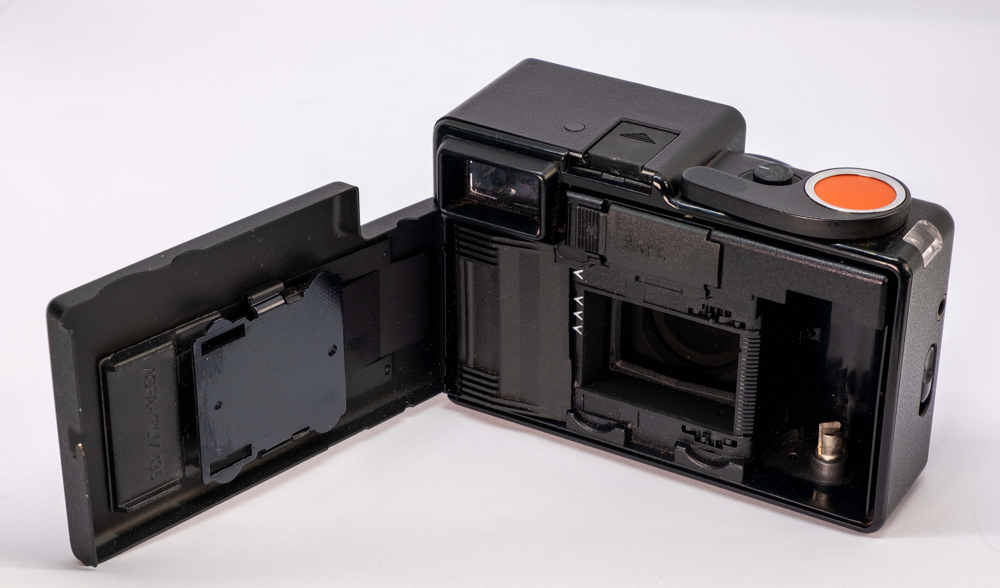

Rangefinder. Red dot. Made in Germany. I present to you... the Agfa Optima 1535. The odd one out, and fairly rare camera, the advanced sister of Optima 1035. Let's find out how does it shoot and actually feel.

I got mine back in Poland from Facebook Marketplace, for a price that's not a bargain, but wasn't expensive either. I did not bring it with me to Hong Kong as it wasn't my first choice, but I thought I would get some use of it here, so I had it imported to the Phillippines, where I shot a (disastrous) roll of expired Reala.

There's a lovely article by [Alfred Klomp](http://cameras.alfredklomp.com/optima1535/). Give it a read, or check out the older version of the article on the [Wayback Machine](https://web.archive.org/web/20031008004644/home.planet.nl/~ucklomp/optima1535/index.htm) - they're slightly different.

# Specs

* Film type: 135
* Frame size: 24x36mm (fool frame)
* Shutter: Leaf shutter
* Shutter speeds: 15-1/1000s
* Lens: Color-Solinar 40mm f2.8 (4 elements)
* Filter size: 49mm
* Minimum focusing distance: 0.9m
* Focusing: Rangefinder
* Viewfinder: 0.78x magnification with parallax marks
* Metering: CdS cell on lens barrel
* Exposure control: Auto only
* ISO range: 25-500
* Hot shoe: Yes, forces chosen aperture when inserted
* Batteries: 3x 625
* Shutter cable: accepted, on the side.

# First impressions

    

        
    

    

        
    

    

        
    

What a silly little thing. I like the rectangular design of it, to be honest, the back of it is minimalistic. There's no rewind lever - the advance lever changes jobs depending on the position of the rewind selector. Quirky, but well thought out and engineered. The strap is attached to the tripod screw, so you will not lose it easily, and doesn't add any extra hoops to the package.

It's tiny, thanks to film loaded right to left, with a quick and sure loading system. It's super light too.

# Handling and ergonomics

The viewfinder is massive, easy to see, and the focusing patch is also quite big - it reminds me of Canon P, just you don't have to hold your eye so closely to see the whole frame. But it's not the only massive thing in this tiny package - the film counter on the side seems to be behind a lens too, so checking where you are on the roll is super clear at a glance.

In hand though it feels solid - the plastic doesn't bend, but it doesn't boast confidence. That doesn't matter as long as the camera does not fall apart on its own. I'm always anxious about the film door closing with a latch like on younger cameras - that seems like a common point of failure. All in all, this small brick is comfortable to hold thanks to its lightness, better than the other red dot camera.

    

        
    

    

        
    

    

        
    

    

        
    

_Feel free to click on the images to get the full res version._

The focusing ring is quite small, feels flimsy and there's no real resistance to it. It rotates only 90 degrees from infinity to MFD of 0.9m. That's my biggest gripe with it. However, it's also very easy to zone focus, the chosen focus setting across the whole range is easily visible from top for discreet shooting.

In practice, the rangefinder is pleasant to use. And makes all the difference from its lesser models - in this camera you only have full control over one thing only, and it's reassuring to have a precision instrument for that one thing.

The shutter sound it makes is cute - like a sneeze. It's not the quietest, but it doesn't raise suspicion either. The LEDs in the viewfinder let you know if the shutter speed is gonna be slower than 1/30 (red) or faster (green).

The addition of the shutter cable socket overall makes me think that this was the higher end of small cameras back in 1977, when it was released. Or it just was well thought out for the budget, like Agat 18K was.

# Image quality (non autistic)

    

        
    

    

        
    

    

        
    

The four element lens seems kind of basic, but on the other hand, Elelelcan is also just 4 elements. I cannot detach the lens from the body, nor can I control the aperture, so I will judge it just by looking at film pictures.

There was a [guy who took apart another Agfa camera with a Solinar lens](https://www.flickr.com/groups/2877726@N21/discuss/72157667853076495/), but at 39mm f2.8 (same?). Besides losing the aperture, that's not representative either as he didn't shoot a static scene at infinity to judge the image quality.

Metering seems to be mostly right. The good thing is that the meter is inside the lens barrel, so if you use any 49mm filters, it will meter through it, so you don't need to compensate like you would on Yashica Electro 35.

In general, the extreme corners of the image are pretty blurry even when stopped down. Thankfully it's a tiny part and it quite suddenly becomes much better; but I wouldn't call it any good for landscape. The center of the image is decent even in darker, more wide open, conditions, but the rest of the image overall is not great.

But... it's good enough. Really. For the moments. For the streets. It's not a super sharp machine and it doesn't have to be.

    

        
    

    

        
    

    

        
    

    

        
    

# Conclusions

Coming back to the reviewing scale - it's adequate. It's not superb, for sure, with the image quality being unimpressive. But it's got its niche uses.

The perfect street camera? Or the best option for casual outings? It's certainly stylish, and a worthwhile addition to my collection. Yeah, it's the fourth rangefinder in my drybox, but it's still different and unique enough to warrant its stay.

As you probably noticed, this post has more pictures than usual. That's because at the end of the day I did enjoy using it a lot, and it was simple to snap away. And sometimes that's all you need to take pics you like.

And if I ever decide to part ways... I will certainly sell it for much more than I paid for it. For you, my readers, don't buy it at an inflated price - above $100 USD would be already too much in my opinion.