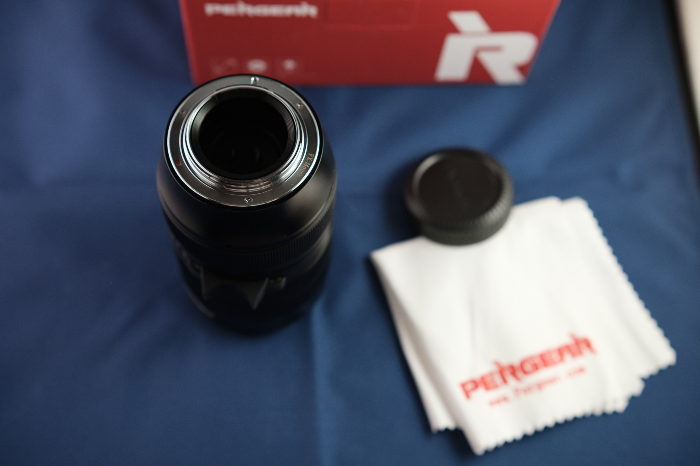
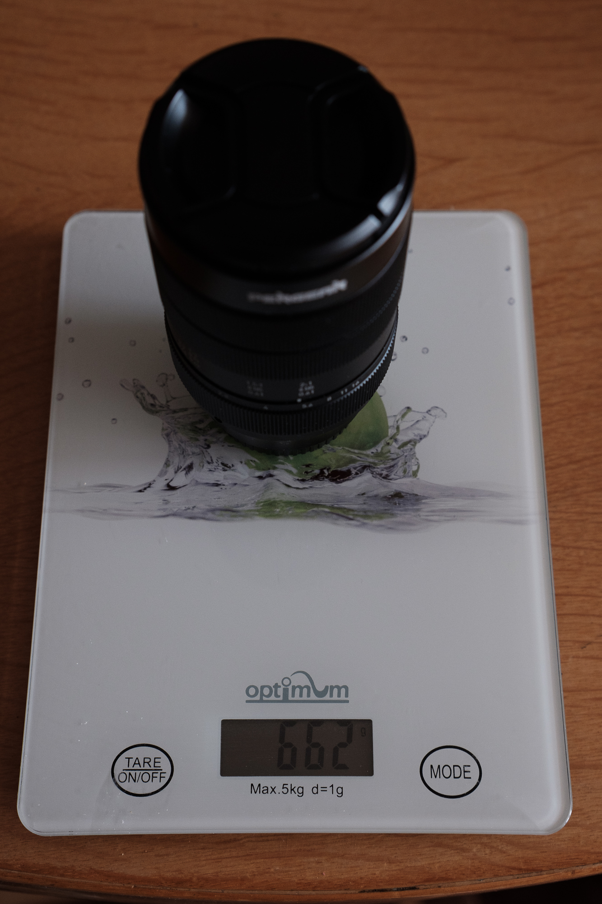
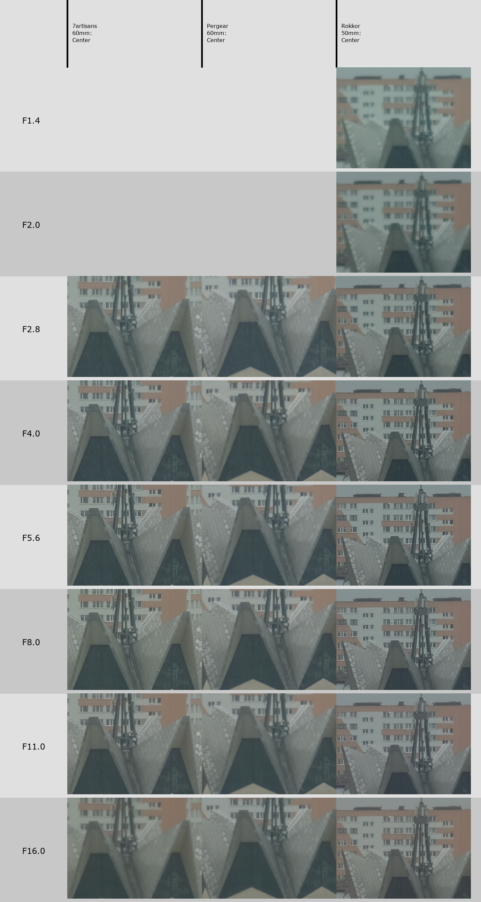
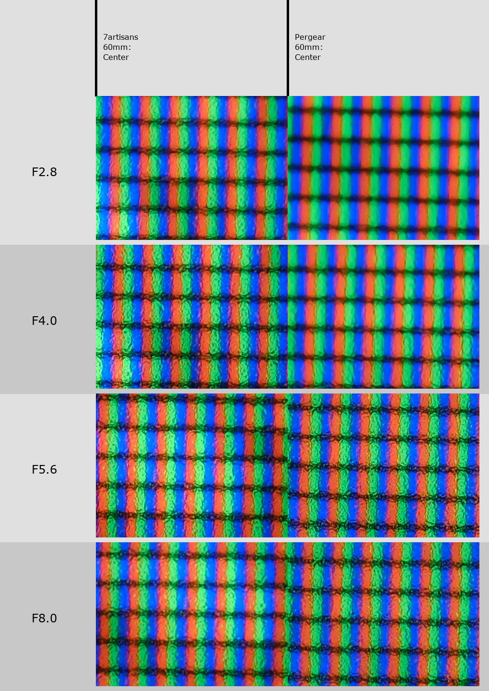
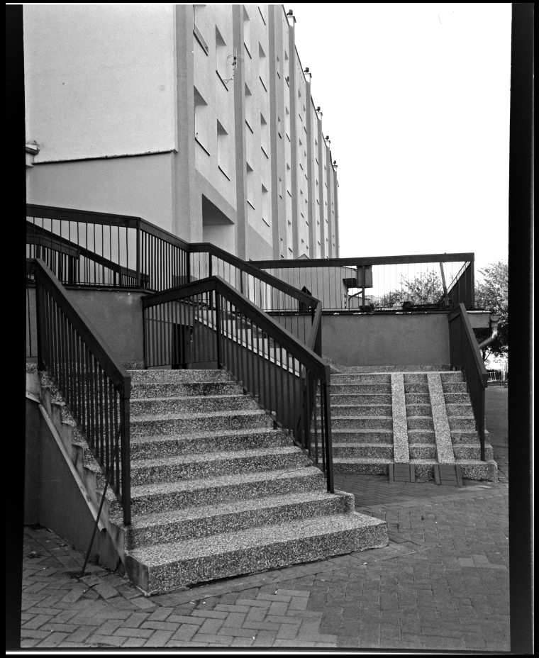

A Chinese manufacturer releases a new, cheap lens. Their optics have been getting better and better recently, but you're still skeptical. Mostly because there are usually no reviews, no comparisons. If it's a fresh offering, it's even worse. So, what do you do? You can wait for someone to do a writeup, or you can blindly purchase it, hoping that it's gonna be good.

And so I did, with the Pergear 60mm f2.8 macro lens, released this July. 230 USD plus VAT put this lens on the upper side of Chinese lenses, to be honest - 7artisans 60mm macro (that yes, goes to 1:1) was 120 USD last year, and the new Mk II version released recently is 160 USD; I paid less for my Viltrox 33mm f1.4 too! (shoutout to a fantastic lens, by the way, wondering how it compares to Fuji's newly announced product).

Wait a moment, you might say! I scan my negatives and all, that means I have a macro lens already! Yes, I do, the aforementioned 7artisans 60mm, first generation. I was looking at other options for few reasons. Firstly, hoping to improve sharpness. I made a comparison a while back with a cheap dedicated 35mm scanner and it was just no contest - 50 dollar scanner blew DSLR scanning out of the water. To be frank, it has its issues, and I should make a blogpost about it, so I'm not completely giving up DSLR scanning in baby format - but still I was left yearning for more. Secondly, the 7a has an awful quirk - when aimed down, at around 1:1.5 ratio (35mm :), over time it slides down, losing focus. You can use a rubberband to keep the focus from moving, but it's still annoying.

Still, I'm buying it mostly to scan negatives - I really don't have need for 2:1. By the time I decided to buy it, there were two, well, three reviews. Richard Wong and Camera Conspiracies had pretty good things to say about it - good for the budget. And there was Angery Monke, said it's a 0/10 lens, refused to elaborate further, and left.

Okay, I got it. I mean, worst case I'll sell it at a slight loss, best case I'll sell the 7artisans!

# First impressions

It arrived. First impressions? Not great. Flimsy cardboard box made out of recycled cardboard probably, no extras, no nothing. An insult were generic caps on both sides. On one hand, it's alright, I'm buying a lens for its optical qualities, not packaging, but the 7a that was half the price made me feel like I bought some fucking Zeiss Leicanon 42.0mm f0.69. With dedicated caps.

Lens itself is quite hefty. 100g more than 7artisans. Finally, normal, 62mm filter thread, but I don't know how to feel about the element in front that only seems to protect the massive tube from debris or bugs falling in. Rings were turning in smoothly, nicely, I really had nothing bad to say about it.

I quickly hit a first issue. The focus ring has a long throw, but that's a throw from infinity to 2:1. From infinity down to 1m it's incredibly difficult to set focus correctly; even worse is that the hard infinity stop is way beyond infinity. I thought - well it's alright, it's a macro lens, I wouldn't be using it at these distances often anyway, but it's an issue. Especially if you're comparing between lenses at infinity. A small nudge may throw focus off completely.

# Comparisons

Optically though? I compared it with 7artisans and Minolta MD Rokkor-X 50mm f1.4 at infinity and it's about on par. Nothing much greater, not much weaker. I know lenses behave differently at closer distances. Comparing them for me was rather difficult, though, focusing at exact place proved to be quite a challenge - despite being the same focal length as 7a, swapping the lenses and setting the focusing distance identically provided different results, and camera had to be moved.

Like here. It's incredibly obvious that Pergear was misfocused while trying to take a picture of the LCD. I don't have a proper test bench, sorry. 

I played with it a bit instead, and got some OK results out of it. Nothing really exciting again - I could've gotten similar results from 7artisans, but handling it wasn't really that bad at all, to be honest. For pure macro purposes, it's servicable, even wide open - if thin DoF isn't a problem for you.

# Film scanning performance

What mattered though, was performance when scanning film. I don't shoot macro, right?
And... the results... well, trust me on these. When focused properly, it was absolutely on par with 7artisans. A tad bit more contrasty in places, maybe. But nothing revolutionary. If it were just that, I would have a tough nut to crack - which lens do I get rid of? Focus on Pergear doesn't creep when it's aimed down, ergonomics are somewhat better, there's no weird tube sticking out. So, for the slight advantage, I should sell the 7artisans...

Except one little, and yet, very annoying thing. It's not even that big of a deal, it's fixable in Lightroom with one click, but 7a just doesn't have that issue. Pincushion distortion.

Below you can see a scan of Orwo UN54+, taken with a GW645S, two-stitched. You can see the arches on sides of the image. To me, for a scanning lens, this is a total dealbreaker. The film was held flat by Essential Film Holder, it wasn't that.

I mean, it's not a horrible lens for general macro usage. It's just that I'm using it mostly for scanning film. And it's something I don't want to deal with.

And so, I took on a small loss and passed the lens on, to someone who will use it to shoot flowers and bugs, hopefully.

