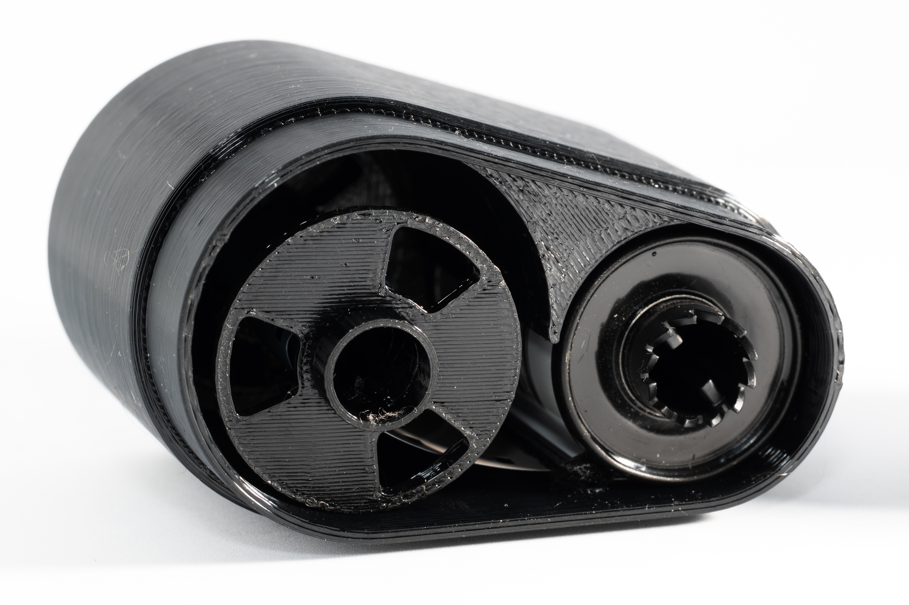

I've been searching aimlessly on TaoBao (to my own detriment). Generally I'm not too bad about not buying useless stuff, but I found an interesting ad.

I've seen the "devtanks" where you're supposed to dump the film in and just dunk it in chemicals - I don't believe this could ever work properly, so I skipped it. But this one takes the film out and spools it. I am aware of Rodinax or LabBox, but these are much larger; this just takes... 77mL?

There are three versions; one that has no drainage holes for 49CNY and two with different sizes of the holes for a bit more. Obviously 3D printed construction, my sus meters are high, but the reviews show developed pictures.

It's not that much and it may be a way to save extra on chemicals for one-shot solutions like HC-110 that I use.

I ordered it, and in the meantime shot a roll of mediocre pictures (well, probably, but I don't have good pics ever) on Ilford P4 film, expired in 2007, rated at ISO 100, on Hexar RF. That's my goto film for casual shots, given the low price per roll, and since I shot it so much I have a good feeling on how it should look when developed in the same settings I always use.

# First impressions

     

          
     

    

          
     

A small box came, with the tank and instructions in a ziplock bag. Instructions are in simplified Chinese and half of the leaflet was product description (not sure why, I already have it); the remaining instructions can be distilled into:

1. Pull the leader through 3 teeth.
2. Pour chemicals in.
3. Close the lid.
4. Rotate clockwise all the way, to get all of the film out.
5. Rotate counter-clockwise until you feel resistance.
6. Repeat 4-6 for duration depending on the chemicals/film used.

     

          
     

    

          
     

It's small, light, and obviously 3D printed. A quick check with a powerful Convoy flashlight revealed no leaks. While not super sturdy, it does look like it would fall apart quickly. Will it be fine or lead to emulsion touching itself and ripping? Only one way to find out.

# Let's develop

I tried to measure the 77mL mentioned, but it seemed it would overflow. So I poured water inside, poured it back, added less than 2mL of HC-110 for roughly (overstated) H dilution.

I would usually develop Ilford P4 Surveillance film @ EI 100 for 11 minutes at 20 degrees C, with the water being closer to 27 degrees, I went with 6 minutes instead. Technically it's continuous agitation, but probably wouldn't change much.

I loaded the film just fine, latching it into the three teeth was a bit tedious but nowhere as bad as first time trying to spool the film into Paterson in darkness. It can be done in daylight.

After pouring in the chemicals, I tried to close the lid unsuccessfully for a bit, until it finally clicked. Pulled all the film out, the cover was moving on the sides and a lot of water was leaking, probably displaced by the film (and shaken out by the movement). I followed the instructions, and it seemed simple enough; except after 5 minutes the tape at the end of my homespooled roll gave out. That's... not good. I still rotated it back and forth but without an anchor on the other side, I'm not sure how well the developer spread.

I washed it for stop within the container, then pulled the film out completely and spooled it into a Paterson for fixing.

# Did it come out?!

Surprisingly, on the first glance, I got something out. A little thin - I am not sure if it's HC110 requiring some minimum chemicals, the spillage, or me not really doing it constantly (I went to grab my phone at some point, and the time after the tape gave out could also be a culprit).

     

          
     

    

         
     

    

         
     

Then I had to clean up after it. Some developer spilled at the beginning, but not a big deal. Bigger deal was with fixing. I think it should be possible to fix the film in the same container, but dealing with such a small tank is not particularly comfortable, causing spillage everywhere - that's why I decided to move it to a bigger tank. Although fixing could be done in any bowl or bucket.

The other problem is that I would usually reuse the canisters, but this one got soaked. The velvet light trap is one place, the other is the internals of the cartridge. I left it overnight and I could still hear water inside when shaking.

Then I scanned the images.

     

          
     

    

         
     

    

         
     

They scanned quite well, maybe I should develop the original film less. The bigger problem was in missing emulsion and wet marks. One image also showed a bit of bromide drag at the top.

     

          
     

    

         
     

    

         
     

Well, it was my first time using it, I was a bit slow to start developing, and there was the tape failure at the end. I can wager that with constant agitation it could provide good results. So one thing to note already is that it's not a forgiving device and requires some understanding of the process. And here's the thing - I could do it again, with a proper store bought roll, but it would feel a waste of shooting frankly speaking whatever; and if I had any good photos on it, I would rather use my trusted Paterson reel tank instead to ensure good results. 

# Conclusions

Well, let's start with pros and cons.

Pros:

+ Small.
+ Actuall works!
+ Takes very little chemicals.
+ Can be loaded in daylight.
+ <100mL used means you can develop film on a plane.

Cons:

- Messy.
- Cannot reuse the canisters.
- Uncomfortable to use.
- Unforgiving; result may have issues if you're not careful.
- Requires the leader sticking out.
- Doesn't work well with homespooled film.
- Not sure about longevity.
 
I would not recommend it as your only development tank, but it would work in a pinch, if you're careful. I was kinda hoping it would be completely broken/useless so I could throw it out, but now it's just gonna gather dust probably with very limited use cases. I could save money on the developer, but I also often shoot handrolled film.

     

          
     

    

         
     

    

         
     

