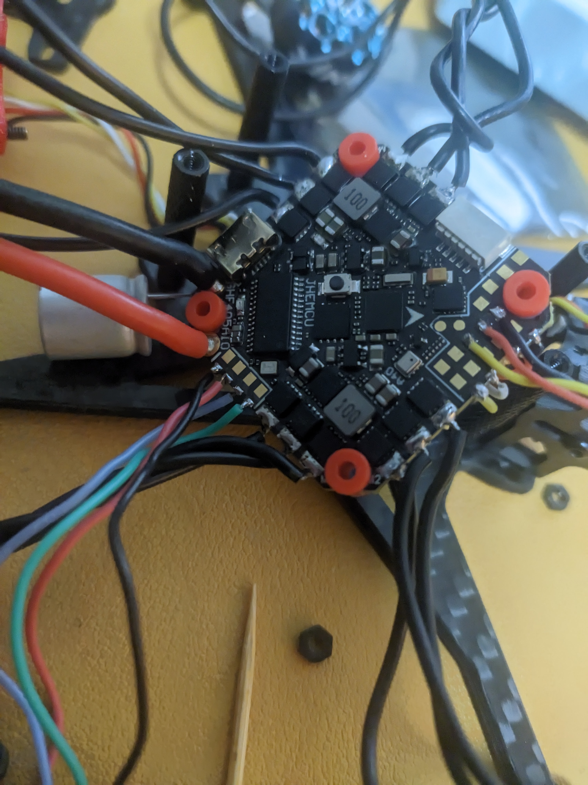

FPV drones were always there, on the fringe of cinema, or model aircraft; it seemed very DIY; some impressive videos would come out from time to time as well, but the details were murky. Parts lists? All these models don't tell me anything. The hobby became more popular in recent years, though, and I decided to take a closer look.

I've been using a drone for my photography and videos before, the DJI Mini 3 Pro, but beyond the initial stress that I've had, it turned out to be super easy. I don't think twice about flying in some winds, with rough terrain, leaving the drone to do its job in a 30-minute long timelapse, or launching from or landing on my hand. I know that GPS-based RTH will kick in if something goes terribly wrong. Of course at some point I would want something more complicated than that.

Not going to lie, there was a certain allure from the Eastern Europe that pulled me in at the beginning. One way to be a little more useful to not become cannon fodder. The reality is that the pilots still need to be pretty close to the frontline anyway so it's not the best idea to increase survival; it won't help avoid artillery shelling.

In this article I will show you my process of getting into FPV drones - or commonly, quadcopters (or quads), starting from early 2024, up to now. It's not a guide - for these, [Oscar Liang's website](https://oscarliang.com/) or [Joshua Barwell's videos](https://www.youtube.com/channel/UCX3eufnI7A2I7IkKHZn8KSQ) will serve much better; but they often go deep into topics which you may have no idea about. I do believe though that many beginners will go through similar path as me, and may be interested how to navigate them; and what would I want to know in a nutshell, if I went through it again?

# Bare minimums

It took me a while to figure out a starter kit; some advice was outdated. Some things had similarly sounding names and got me confused at first.

All I can say for now - avoid complete kits. They suck. That rule of thumb works for almost everything in life.

The most basic thing is...

## The controller

The DJI Mini 3 one will not work, and you cannot hook up an Xbox controller. It's just not suitable, for one main reason - controlling FPV devices requires one axis to be free. You know how controllers default to the centre position? For this purpose, one of them must be freely adjustable without any springback.

FPV drones work in 3 axes - yaw, roll and pitch. And there is one more variable here, throttle, that adjusts the speed of the quad. And the throttle is the problem here. Let's compare it to driving a car. You have a brake, gas, a steering wheel to go left and right. Sure, you want the steering wheel to self-center, but you certainly wouldn't want gas and brakes to be in their middle positions by default.

So the controllers are special in that way. There's also the fact that they need to communicate in a low-latency, long range way rather than Bluetooth, so the next part is the communication protocol.

You may find different names thrown around, like FrSky, TBS Crossfire or ExpressLRS (often shortened to **ELRS**). The latter is the current standard that most manufacturers stick with. I just accept that as a fact; any previous attempts have been basically made obsolete in recent years and there's no competition (one minor exception, more on which later). The good part is that it's good and open source.

ELRS comes in 2.4GHz and 900MHz variants. The former is most often used; 900MHz is useful for long range, but comes at the cost of bigger antennas. I'm getting a bit of ahead of myself, I will talk only about 2.4GHz from now on.

There are few manufacturers of compatible controllers, most famously Jumper and RadioMaster, the latter being recommended more often, and on which I will focus. RadioMaster has radios with different capabilities, screens, switches, form factors; and the most recommended one for starters is the **RadioMaster Pocket**, which I ended up getting.

That one was priced at 300CNY, or around 60USD overseas. It's pretty basic and cheap, so even if I don't like the hobby, I can still exit without much cost.

There is a new offering from RadioMaster - the _T8L_, at 35USD. It's an even simpler radio and I would not recommend it. It looks like the DJI controllers and the screen is often unnecessary, but it's capped to 100mW of output power (Pocket has 250mW) without any possibility of extension (Pocket can take a Ranger Nano to go up to 1W for long range missions). And as you will see, the controller is only a small part of the overall budget...

The Pocket is relatively small. Not really pocketable, but fits in the bag easily, and fits well in hands, not unlike a game controller, and you can use your thumbs only for control. There's a screen for basic configuration, some buttons and that's all I need. Only problem is that it's slightly confusing to configure - took me a while to realize the scroll button is clickable, and what to find in each menu. The controller needs 2x18650 batteries, but otherwise comes ready to go.

You can connect it to PC using either USB-C or Bluetooth and use it on...

## Simulators

I didn't really believe when online commenters would say that a simulator is necessary. Frankly, I still don't like them - they make me more dizzy than in real world and they're often focused on racing, but I do have to admit they're indeed essential for starting out.

So for starters I pirated _TRYP_ and _LiftOff_. The first had nice graphics and free-roaming mode, but a pretty bad tutorial, the latter has a decent tutorial, but is more focused on racing. There are few other available, like Uncrashed and Velocidrone, but for the tutorial itself, I'd recommend LiftOff.

It will teach you the basics. Some throttle control, how to fly forward and back, how to turn. These are not trivial things. Races are there to give you an objective: to teach you how to control the quad to get where you want. Practice that. A lot. Do remember that in real life quads will feel different, but you're only here to get basic muscle memory, rather than fine tuning your movements.

I ended up getting legit versions of Velocidrone and LiftOff after all.

You'll find plenty of opinions that Velocidrone has most realistic physics, but there's more to flying than just physics (like battery management, link management, video quality, propwash, wind, random things unplugging themselves mid-flight). It's definitely mostly race focused with barely any freestyle or freedom. LiftOff is generally decent all around.

Anyway, the point is to practice. Races will push you to fly faster and faster, but in real life you'll also need to manouver slowly at times and land (that's the one trick that FPV pilots cannot do), so even if it's not very exciting on the screen, try to practice that as well.

Mostly you will want to practice something that's called _acro_(batic) mode. In this mode, you control the attitude of the aircraft, and as you set it, it stays; for example, if you move the pitch forward and return, the quad will try to stay in that position. It's the most difficult part, but it also gives you the most freedom. It may be tempting to start with what's called _angle_ mode, where the drone will automatically return to level position when the yaw/pitch/roll are centered, but despite initial ease, it will only make getting the muscle memory for acro harder.

How much are we into the hobby now? Around 100USD. You still have the time to pull out, cut your losses if you don't like it. Take at least few weeks to practice, and if you're on a budget you can stay in this stage without further investment for a while. Otherwise, time to make your first real big decision with...

## Goggles

FPV works best with goggles. There are screens available, but they're usually for spectators. Simple reason really - nothing stealing your attention, and no random sun reflections in the split second.

### Video systems

Beyond the insane number of different models, there's one main characteristic that you must choose now: video system.

Currently on the market you will find:
* Analog,
* HDZero,
* Walksnail,
* DJI,
* OpenIPC.

The choice of the video system will determine which goggle options you will have, and the overall cost of the video transmitter/camera on the quad.

The classic choice is _analog_. Truly open, with most choices available; it's just sending PAL or NTSC signal over 5.8GHz range. On FPV drones, it's the lightest, and also the cheapest. When the signal breaks up, it usually goes from clear to some snow noise to a full [Snow Crash](https://en.wikipedia.org/wiki/Snow_Crash), making a visual reminder that you're about to be out of range and that you should return or get out of the obstruction. Image quality is obviously the shittiest as well and for any cinematic usage you should get a HD camera to be mounted in parallel.

Next on the list is _HDZero_. This one, despite being fully digital, is often seen as "analog+". It's not recording tier of quality, but is a considerable improvement over analog in quality. The biggest pro in comparison to other systems is that it allows for 90 FPS, for far smoother video than NTSC's 60 FPS. And when HDZero starts breaking up, you can still see some digital dots of noise, not unlike analog, earning it its nickname.

CaddX's _Walksnail_ and DJI's _O(3|4)_ systems are similar to each other in the digital realm. I don't have much experience with them; Walksnail Goggles X look fucking awesome though. Both can be used to record onboard video without another camera installed, making for overall lighter systems if you want to have high quality video. DJI is probably the most popular, second to analog only; and most expensive. When the transmission starts to break up, the bitrate goes down for some hit in quality, until video completely dies. DJI also allows to use their own controllers, skipping ELRS, albeit their controllers are quite barebones, and control link will die together with the video.

_OpenIPC_ is more of a curiosity at the moment. It's open source software for IP cameras, that has been modified for lower latency. The quality can be good, but it's nowhere production ready at the moment, still lagging (pun intended) behind the commercial competition, and when link is temporarily lost, you will get the h.264 smearing instead of a clear frame. It's also neither cheap or light.

### Googling my goggles

I went with analog, mostly on the price factor. For analog goggles, the overall opinion is that Eachine EV800D are the cheapest "worth having". The main selling point is diversity - they accept two antennas, and if one of them loses signal, the other will pick up the pace. That's important because losing your video signal is absolutely the worst case scenario - if the quad drops from the sky, you won't know where; may hit something or someone and you won't know. With two antennas you can specialize as well - have one that's omnidirectional for short to medium range, and one patch antenna looking in a specific direction for longer reach.

Another important feature in goggles is DVR - just constantly recording the footage. Things may happen quickly, too quickly to react, but if you're able to replay the video right before the crash, it may help you retrace the quad's path.

All decent goggles will have both diversity and DVR. Then there's the topic of other specs - screen resolution, HDMI input, AV output, and whether they're box goggles, or binocular style. Box goggles are cheaper, but they're bulkier and heavier; binoculars are sleek. DJI for example doesn't even offer box goggles.

After a long search, I went with box goggles - Skyzone Cobra X V4 - for about 1400CNY.

That's the most expensive part of the system by now. The top analog binocular goggles that I would maybe upgrade to are the Skyzone 04X at more than double the price. However given the nature of analog signal that's limited to 576p on PAL, increased resolution isn't necessarily a big sell for me.

So you may think now - with goggles that can be connected to a PC via HDMI, you can practice in a simulator even better! The reality is that _no, it does not make you for a better experience_. I would even say that I get nausea on a simulator with goggles even quicker. There's no point. I'd rather use them for watching a movie without a screen, looking like _Case_ from [Neuromancer](https://www.reddit.com/r/Cyberpunk/comments/63m5gh/neuromancer_cover_art_by_josan_gonzalez/).

# First quad - a Tinywhoop

Ah finally we're getting to the core of the matter, isn't what this hobby is all about, after all?

Not necessarily. You're more likely to own one pair of goggles and multiple different drones, so maybe the hobby should be called FPV goggling?

For starters, there are many, many choices on the market. You don't have to build your quad either, you can get something premade. There are still few things to consider, main one being...

## Quadcopter Types

There are few classes of quadcopters, mostly depending on their size. Some terms you may have heard would be a "tinywhoop", "cinewhoop", "toothpick", 5 inch, 7 inch, etc.

Weight is also a factor, usually with quads being "sub-250g" and over 250g. 250 grams is often the distinction made in law, being more lax on quads below that line.

Another factor here may be the battery type taken. Bigger and faster drones will require bigger batteries; more on which later

### Tinywhoops

Tinywhoops are small quadcopters, often fitting on top of your palm, with usually 35-45mm propellers, with plastic frames and prop guards. Very light - 16-45g depending on exact setup, video system. They're almost indestructible, can be flown indoors and outdoors (if it's not too windy) and they're a lot of fun. Since they're seen as toys and rather cute, they let you do some [guerilla whoopin'](https://www.youtube.com/watch?v=vE8gntoymkA); if someone really doesn't want you flying in a spot, they'll just tell you first rather than calling the cops or FAA.

Frame size is usually in the range of 65-85mm, and it refers to the distance between motors.

Whoops are great for freestyling - doing tricks, flying through small gaps, and racing. They won't do well in crusiing, especially long range, with video transmitters that aren't particularly powerful, can be blown away easily, can't carry an action camera, and with typical batteries they suffer from relatively short battery life - 3-5 minutes. That's enough to have some fun and pop another battery, though!

A tinywhoop on a frame without prop guards is referred to as a toothpick; albeit that distinction is not perfectly clear (some may refer as such to bigger quads). Lack of prop guards makes for more efficient flight or better wind resistance, but also more danger. These are usually self-built.

### Cinewhoops

These are like bigger tinywhoops - with propellers that are 3-3.5 inch in diameter, can carry a camera, but their motors are not very powerful. They still have prop guards as they're designed for making smooth cinematic footage, and not destroying anything in the process. 

DJI Avata is an example of one. They're often used for making marketing videos for houses in America. Nothing too exciting.

### Any drone that has "inch" in the name

The number refers to prop size, rather than frame size. Usually on frames without prop guards, with various use cases; up to 5 inch are used mostly in freestyle or racing, and above that - long range, cruising.  Sure, you'll find some overlap in usage within all sizes, but that's a rule of thumb.

5 inches are most popular, but they're no joke to handle - they will chop your fingers off if you're not careful. 3.5 inches is _usually_ the cut-off for a sub-250g setup. They all would be able to carry a camera on top, with some limitations on how big the camera can be.

I've been using _usually_ very liberally here because... sky is the limit. There is a lot of _depends_ in this hobby, and yet the gear is usually flexible enough to perform in a role it wasn't designed for.

If I were to summarize quad choice, think about:

1) What can you reasonably control without causing damage?
2) How much space do you have? Is it okay to bring some attention, or would you prefer stealth?
3) What style do you want to fly?
4) What's the budget?

## First choice

Of course, I did not know everything that I do now, the consequences. That's a good thing - the choice paralysis would hit me terribly.

I went on Taobao and started searching. I knew I wanted something small to fly indoors, and was bombarded by many choices. I certainly recall Mobula series from HappyModel and Meteor series from BetaFPV. I went with the smallest option available at the time - Meteor 65. Now there's Air65 available, that's even lighter.

The idea is that I would practice slow, methodical flying indoors, rather than stay bored with simulators. Great first choice - prop guards, camera is shielded with the canopy.

Threw in some BT2.0 1S (one cell) 300mAh batteries, and I was good to go.

## First flights

They didn't go well.

At the time, I lived in a subdivided flat, 11m2. I could fly from my bed to the door in one second, and back. Did I mention that flying fast in a straight line is much easier than flying slowly? One part of that is the fixed camera angle - it changes your perception. How fast the drone goes depends on the pitch angle - how it's angled forward - and if you have a camera that's perpendicular to the motors, the "normal" view in the goggles is basically without any forward movement; if you want to fly straight, you need to "look down" - or pitch down.

Usually you'd want the camera angle to be around 20-40 degrees, but that means, to fly slowly is to keep the camera "high", unnaturally, and therefore cutting off the view of what's going on below. The horizon line is on the bottom half of the screen if you're flying directly up.

With that all said, without confidence to go out and nowhere to practice indoors, I put the drone down for a bit. I'd get a bit simulator time here and there, but I wasn't very excited about it. Even after I moved to a bigger place, it wasn't particularly enticing.

The time has come to fly outdoors more with a trip to Poland, and thus bought a Meteor75 frame and 40mm biblade propellers, to replace the smaller 38mm triblades. I changed the frame and I flew around the yard a bunch. With some space, flying there and back, I finally started to have fun. Problem was short battery life. In flight? It was hard to tell the difference. Of course it would be there, but when you're struggling with controlling the quad, it's really hard to say. I still learned how to do flips and rolls; the most basic tricks that's actually very effective in making spectators wow.

One thing I haven't mentioned so far is that landings at this time was either just ending the run after a crash, or crashing deliberately into grass near me. That works. Landing is one trick that FPV pilots can't do, right?

<video controls loop muted style="width: 100%;">
  <source src="/vids/fpv/perch.webm" type="video/webm">
  Your browser does not support the video tag.
</video>

_This trick is called "perching", where you land on top of a pole or something else._

I also started to run into my first technical issues. Most often it would be the camera getting disconnected after a proper smack. Sometimes the video transmitter would glitch out, especially if it was left transmitting without flying for too long (they get hot!). Props would get mangled as well. 

Still, the spark has returned. I got addicted again, until my inevitable return to Hong Kong, where it was put away again for some time.

There I found a place that's without any security ready to scream at you, that is big enough and flat enough to fly around and crash without worry of causing any issues to anyone. That was my practice ground for many times; there was even a "hole" to practice more tight manouvering.

It was all good until I was showing off and did a flip near the sea, didn't recover on time, hit a rock which bounced my Meteor75 into the sea.

<video controls loop muted style="width: 100%;">
  <source src="/vids/fpv/deathstarcrash.webm" type="video/webm">
  Your browser does not support the video tag.
</video>

_That's a different crash, but ended with the camera being disconnected. Not fun at all!_

Thankfully, it was fine after two days of washing in isopropanol, except for the camera. It still flies to this day, after some more crashes and repairs - I had to fix the power cable as it was too tight and broke off, and I finally soldered the camera directly to the video transmitter, after ripping off the connector in a particular crash. Doesn't matter, it flies, and I have a lot of fun with it; it's also my most reliable drone. And you can still spot some salt or rust deposits on the main flight controller board.

# Can't resist the 5 inches

I thought this would be finally the time to get into FPV videomaking. I was planning the trip to Seychelles, and so I thought I could do some crazy-ass stunts with that. I got cruising down, right? That shouldn't be too difficult. I needed something serious this time:

* Able to carry a GoPro (Insta360 One RS in my case)
* Powerful enough, faster, wind resistant
* With stronger video transmitter
* With a GPS

With barely any research I realized that a 5" drone will be the answer to that. Some taobaoing later, I found **Manta 5 SE**, analog, with GPS, costing about 1100CNY. 

I also needed some new batteries, 6-cell ones, for 80CNY a piece.

And a new charger. **Hota T6** is a small one that can use USB-C PD and charge a single 6S battery at a time.

And extra props. And a new, RHCP antenna for my goggles.

And I flew it the first time. I was not ready. My hands were shaking at the end of it. Absolutely terrifying, but also exhilirating; I got it to 80km/h and I thought that's fast  (later I would reach 160), that monster flying into someone could seriously hurt them, and the props would definitely chop your fingers off if you weren't careful. On another flight I didn't secure a prop nut tight enough, and two meters after take off, it flew to the moon, to be never found again.

I didn't take it with me. I had a [nice break in the middle of nowhere](./2025-Seychelles.md) without any added stress.

# Tools and spare parts

Speaking of a break, FPV stuff _will_ break. If only just because how hard it's to control them when you're inexperienced. What will you need?

* A decent screwdriver.

I like the Xiaomi Wiha set that is not sold anymore, but any small screwdriver with bits will do it. Most screws are either cross or hex, and in different sizes.

* 5mm socket wrench (for bigger drones)

I have a cross-shaped tool that has a 2mm hex key on one end, 5mm on the other, and 5mm socket. The sockets are necessary for nuts that hold the props together. I didn't _need_ it, but it's damn convenient. I always take it with me if I'm flying 3.5" or bigger.

* Soldering iron

Cables will break, pads will rip. I got a copy of a Pinecil, and frankly - it's not good at all, a bit uncomfortable to use, but it's small and I can get the job done, even in the field; maybe it's the cheap tips? If you have the space, a T12 soldering station copy is a much better choice IMO. If you have the space and money, a Metcal soldering station is awesome.

Of course, throw in some solder and flux. From miscellaneous things, Kapton tape and heatshrink can also save your ass at times.

* Multimeter

For checking connections, making sure things aren't bridged. You can get away without one, but it makes things easier. Also for checking batteries without getting the charger out.

* Extra screws

Check out what screws your drone may need. Get 100 of them. Same with nuts, just go nuts. You will lose them in the field.

* Spare parts

Here is the part that gets tricky. I know availability and shipping time may be difficult, especially if you live far from China, but that doesn't mean you should buy spare parts just in case. Except for props; they're always useful.

Buy a whole new drone, so if one gets damaged, you have a spare to play with while the spare parts are on the way. Sometimes a new part comes and turns out it wasn't the culprit, so you end up with a pile of perfectly working parts. Especially if you upgrade some parts, then you have the old ones - not broken, but unusued; then after a while you can just get one more thing and assemble another drone from the spares.

Get some antennas and props for sure. For electronics, if there's one thing to have ready, it's the camera. It will take probably the most abuse, on a rough landing it may hit a rock that will leave an ugly scratch.

# Batteries

Oh my, we take batteries in our devices for granted so much. RC car, plane, copter batteries come without any protection, and often with multiple cells.

Starting with the obvious - charging without a protection circuit may end with overcharging, and thus - a fire.

If you discharge a battery too much, it will build up internal resistance and hold less charge, getting damaged.

If you're dealing with multiple cells, these cells must be balanced - if one cell discharges below its threshold, it will get damaged at best, or may fail when used.

If you crash, or even land a bit roughly, and the physical cell gets damaged, that may cause a cell not to hold charge at best, or a fire while charging at worst.

If you keep a cell charged for too long, it will degrade and lose capacity. If you keep it at too low state of charge, it will degrade and lose capacity. These cells are happiest when at what's called "storage voltage", usually 3.8 to 3.85V. These batteries, when not in use, should be brought to that voltage for longevity. DJI batteries do that on their own (they have an integrated protection circuit and will detect not being used for a long time and discharge), but here - you have to do it manually.

If you charge your battery too fast, it will degrade, and if it's way too fast, it may start a fire. Recommended maximum safe output is 1C; can be pushed to 1.5 or 2 even in a rush; but let's focus on 1C. That's an easy calculation - you take the cell capacity on the sticker, "remove" the hours from mA, and that's your charging current. For example, I have a 1500mAh 6S battery, I would charge it at 1.5A. A 600mAh whoop 1S, at 0.6A. It means that any cell, regardless of capacity, at 1C would be charged fully from zero in 1 hour. But that needs to be set manually.

That's why you need a specialized charger that will be able to charge your battery with balance. In my case, I went with Hota T6 as I mentioned, which can serve up to 6S. I don't plan on getting any higher than that. Charger will detect the number of cells, but it won't detect the capacity, so you need to set the charging current manually.

BetaFPV for Meteor75 included a 2 slot 1S charger, but that forces more current in than 1C, causing the batteries to fail prematurely; especially those with smaller capacities.

While charging, you can also check on the cells' internal resistance. Hota T6 will tell you that after a bit. If it's too high, it is an indicator that the cell may fail soon.

There's two types used in FPV drones: LiPo and LiHV. Lithium polymer batteries are standard, and have a maximum safe voltage of 4.2V per cell. High voltage lithium polymer batteries have a maximum safe voltage of 4.35V. The latter are used in 1S whoops all the time, but you can get them for other drones as well. They get you bit more battery life, or extra oomph at the start.

But that's just charging. What else is there?

Battery connectors: XT60 standard in 6S, XT30 in smaller, BT2.0 or PH2.0 for 1S small drones, etc.; that's easy though, just make sure they're compatible.

There's plenty of discharging worries - also not obvious at the first glance. A fully charged battery will show you 4.35V on a multimeter, but when plugged into a drone, will show maybe a bit more than 4.2V - under load, voltage drops. That will further go down once you spin up the motors, especially at full throttle. Momentary drops of voltage are normal, and thus it's hard to gauge how much battery juice you have left. Some flight controllers can display the momentary power draw, or power used in mAh; that's helpful. Another thing could be a timer and just your own experience. The most important thing is to constantly keep an eye out for the battery voltage; usually at 3.3V with low load the cell is almost at the end and you should land - for a whoop, for bigger drones, 3.5V is a safer place to be. If your battery has less capacity than advertised, flying by time or total power draw will only cause you trouble.

Remember also about battery sag - at lower end of the voltage range, motors will spin up slower, and may make some tricks that rely on a throttle punch fail.

Batteries have also a characteristic that's called a "C rating", that means how much power can you pull out safely, without the cell failing or causing degradation. Quadcopter batteries often have 90-100C rating that usually covers most use-cases. For the first build (more on which later), I got a small, light, LiHV 1100mAh battery that only had 60C rating, meaning up to 66A safe draw; thankfully, at full throttle the drone would draw only 40-42A.

So yes, another part of the hobby that takes considerable mental space is managing your batteries, pre-emptively charging the day before, not keeping them at full charge for too long, flying responsibly without putting too much stress on them, discharging to storage and monitoring their charge so they don't cause a fire.

# Skill progression and the little things I picked up

It's not just about flying skills, although these have improved over time. Making smooth movements, anticipating turns, rather than reacting in a robotic way just takes time and practice. However, your technique matters as well; I switched from holding the radio like a controller and using thumbs to keeping the thumb on top, but supporting from the front with the index finger - sometimes called "hybrid pinching". For Radiomaster Pocket I also got 3D-printed stick ends, called FeliSticks V3 - far more comfortable than the pointy-ended metal sticks included by the manufacturer.

Slow, methodical flying is a skill, and landing where you want is something what you don't think about when flying in a simulator. And it's that skill that will help you the most with keeping your drone intact, or with minimum damage.

With more confidence and less crashes I could take the whoops to the city and do some guerilla whooping - flying in the city environment where you could get into trouble, especially if you hit someone.

<video controls loop muted style="width: 100%;">
  <source src="/vids/fpv/guerilla_city.webm" type="video/webm">
  Your browser does not support the video tag.
</video>
<video controls loop muted style="width: 100%;">
  <source src="/vids/fpv/guerilla_playground.webm" type="video/webm">
  Your browser does not support the video tag.
</video>

Getting to the skill level of that and confidence is the hardest part when starting out, where you really need big, open, and forgiving spaces; where a crash doesn't mean a loss of the drone (e.g. no water, no mountains, limited trees), but also give you enough room to zoom around and have fun. Simulators are great for learning (and LiftOff is only getting better physics), but getting real-life confidence is crucial.

Some VLOS experience also helps in case a camera or VTX fails after a crash. Or just for showing off, it's somewhat impressive to other pilots especially.

There is also skill in antenna placement, and knowing roughly the shape of the output depending on the antenna. Too often I would complain about terrible range when I would be flying sideways to myself, where there is an RF blindspot on the RM Pocket; I should have rotated the antenna sideways. For VTX, you can get a patch antenna that will get the signal from a narrower angle in the front, meaning better gain in that particular direction, but being almost blind in any other place (that's why diversity is important!).

<video controls autoplay loop muted style="width: 100%;">
  <source src="/vids/fpv/lighthouse_orbit.webm" type="video/webm">
  Your browser does not support the video tag.
</video>

Conformal coating may save you from a humid or wet environment. That's an extra layer of plastic that you can paint or spray onto the board (making sure you don't cover the barometer!) that should protect it in case it gets wet. There are guides about it online. That probably could have saved some stress when I first landed in water. It's also important in snowy environments.

For radios with a screen, you can get a cool [telemetry](https://github.com/iNavFlight/OpenTX-Telemetry-Widget) script, and one for [finding your drone](https://github.com/iamsunilchahal/edgetx-lua-scripts-bw). Generally spend some time configuring your radio, according to some guides, or to your tastes. Dynamic power is the one thing I would enable first; another is configuring extra switches, or cutting them out to make for more efficient communication. How often are the packets sent is a tradeoff between responsiveness and range (lower packet rates will fly further).

`youtube: https://youtu.be/GBmYLS4Zczk`

_Fly further or penetrate through concrete better._

Same goes for Betaflight, the firmware on the drone. It has a lot of options, and new features are added from time to time; keep an eye out. GPS Rescue is one thing that adds an almost DJI-like return to home function if the link is lost. There's countless parameters to tune to your liking. Don't worry about them though, unless something is terribly wrong, your quad will keep flying.

However I'd definitely recommend you to configure your OSD to have at least:
* Link quality,
* Link RSSI in dBm,
* Link power if you're using dynamic power,
* Battery voltage,
* Timer,
* For GPS: Latitude, longitude

There are many things that can be displayed, but IMO these are essential to keep an eye out to not lose a connection and/or battery. That's especially true in environments you don't have much control over - you can probably skip most of the link quality stuff if you fly in an area you know, not going too far.

Over time you'll also find what you're most interested in - freestyle, racing, long range cruising, mountain diving, and you'll adjust your settings and parts to match your tastes. I found that I don't have the talent/money/reflexes for freestyle, but I learned few tricks to make flights more fun. It's kind of like skateboarding, except for your fingers, not your whole body.

<video controls loop muted style="width: 100%;">
  <source src="/vids/fpv/doublepowerloop.webm" type="video/webm">
  Your browser does not support the video tag.
</video>

_And maybe you can do a power loop twice in a row! It could be much neater and tighter, but still - super happy with this trick._

# First build, and third drone

5 inches are too much for the place where I am, really. I flew it few more times, got berated once, but I didn't take it too seriously. I wanted something better than a tinywhoop, but not as scary as the Manta 5 SE.

I wanted a 3.5" prop-drone, powered by a 4-cell (4S) battery, preferably under 250g. That should be less scary to control, and obviously easier to take on hikes. I found a HappyModel Crux35 that looked alright, but it was not sold anymore where I am. It was time to build my own.

     

          
     

    

          
     

I learned more or less what the required parts are, with some fixes on the Meteor and trying to tune the Manta, learning more things from guides and tutorials. I finally gathered up the courage to build my own.

I went through the part list on HappyModel site, as reference. For the base, I found the Crux35 frame. **1404 3800kV iFlight Xing2** motors will be pulling the whole body up. Noted that the frame takes 25.5mm mounting holes and chose the ESC (electronic speed controller, the thing that gives power to the motors) and FC (flight controller) based on that and price - **JHEMCU F405-based**. For video transmitter, the choices were quite limited in the mounting size, but I found a **Tiger II 600mW VTX** that would fit. Antenna for that, something random, RHCP. Camera, cheapest **Caddx Baby Ratel**, 14mm mounting size. EP1 ELRS receiver (but they only had EP2 in stock, so I got that instead). Props, there seemed to be various pitch and shapes available; got a bunch to try. And a whole bunch of extra screws and nuts.

There are plenty of tutorials on the builds - building standoffs, assembling frames, connections. I was quite confident with my soldering (to some extent) and started assembling. It can't be that hard, it's basically an adult version of LEGO, right?

My digital parts list has finally met the real practical world. Issues were apparent from the get go:

1. Cables came pre-tinned, but often were too long! I did trim them down, but what's the point of pre-tinning then if you have to shorten them regardless?!

2. FC/ESC assumes being mounted diagonally, but the only way to mount it is flush square. I don't really get why still, what build would use it at an angle, but that had to be fixed later in firmware to make sure the drone controls as it should.

3. I soldered the battery cables without measuring. The cable was way too long, and it's not easy to desolder - they have massive thermal capacity. And they are through-hole, and knowing my luck I'd be stuck with a soldered-up hole that I can't clear. And they're equal in length, but because the board assumes diagonal install, they're sticking out in the corner; one of the cables should be shorter than the other as well. From all the cables in the build, I decided not to try to redo them - I might do that if I get another XT60 connector. For now, the cables are routed around the frame in a rather ugly way, but it works, and nothing is in the way of props.

4. Oh yeah, the XT60 connector. Most 4S batteries on the market assume smaller XT30. I found some, though, and while there is not much choice, it's not impossible.

5. There was a capacitor to be installed between the battery contacts too. After I put the board into the frame, I realized there's no good place for it! And worse off, the props would hit it! On test runs, the props hit the cap and moved it out of the way in a rather brutal way. It's still there, but dented, and off to the side.

6. As for props, I didn't realize they're supposed to be screwed down with screws. They're not friction-fit like whoop props. I was doing tests at home when they decided to fly away, to no damage, thankfully.

7. The Tiger VTX... I haven't read the instructions close enough. It only expects 5 volts to go through it, and I connected it to VBAT instead. Into trash it went. I ordered another one at first, but later I found a Cyclone 1W VTX, that would mount into a smaller form factor, 20x20mm. I wanted the extra power, so I got a 25.5mm to 20mm adapter. It also took a different antenna type. In the meantime, for the first flight, I took a spare BetaFPV TinyWhoop video transmitter which has broken control signals, so it was stuck on 200mW power on R8 band.

I prepared the Betaflight firmware and on-screen display (OSD) to give me all the information I need to check if everything is alright. I was ready.

## Maiden flight

I took it for my first flight to the usual, free spot, early in the morning. I was excited. At home it was flying! It's gonna be great. I set it up, screw the props in, prepare goggles, controller links, everything is fine, ready to fly! I am getting the video feed properly. The camera is kinda shitty, but it works.

Except that it doesn't go up. It shakes from left to right. Ugh. Worse, the small rocks are picked up by the airflow and flung right into the camera.

I screwed up the prop direction. It happened to me before with the Manta and Meteor; but nothing really happened; the drone would be just pushed down into the ground. However, since the Crux35 frame assumes the battery to be on the bottom, it's not that stable, so this quad would trash around.

The camera was trashed, and two props broke as well.

I reinstalled new props and finally went into the air. It was rather windy, but it took it well. The scratches and dents on the camera lens would create awful blur and reflections with the sun, but I could mostly see where I'm going. It flew pretty good given stock tune. And it was much less scary to fly than the 5". This thing, that I shoddily put together, is flying! Yeah, the solder joints weren't the best, some cables could be shorter, the VTX was temporary and I will have to order a new camera at some point, but it's in the air!

I gave it a full throttle punch to check if the ESC can take the full power draw. No problem, and the amperage displayed on the OSD was well below the maximum limit. I do a little flip as well, and do another throttle punch, above the hill.

<video controls loop muted style="width: 100%;">
  <source src="/vids/fpv/cruxmaidencrash.webm" type="video/webm">
  Your browser does not support the video tag.
</video>

Suddenly, I see the video signal failing. The snowy noise overtakes my screen. Something gave in, maybe the VTX antenna? I thought I know what I need to do - bring it down, closer. I switch to angle mode to ensure the drone is level to try to catch it, but by the time I take off my goggles it's already coming to the ground. I just hear a crashing noise, somewhere. I have no control link, and no video feed. I walk around the field, fairly clueless, when the controller catches a glimpse of the signal. Rocks are opaque to RF, so there is a connection, and some hope it's not stuck on a tree on the mountain.

Reviewing the video footage, the feed came back for just few frames, telling me a little more about where it went. It seemed to be already below the face of the cliff. But how do you find it? I have a link, so the battery wasn't disconnected. I arm the drone and try to move it, listening for the whine of motors. Nothing. Walk to another spot, try again. That's how I did it with the whoop before. I was already somewhat devastated; a thousand HK dollars gone on the first flight! Already thinking of a new build... but I hear the motors whining.

It was stuck on a tree in a barely accessible spot, with the battery ejected from the strap and hanging, with no damage. I got stupid lucky.

That same day, besides a new camera, I also ordered a buzzer. These have to be somewhat special, not like the PC ones, they need external voltage and a signal to beep.

## Getting the hang of it

I flew it few more times and got way more confident than I ever did with the 5". So I got a Runcam Thumb to stick on top of it without being too heavy, for more cinematic views.

Sure, not doing any flights in the city, but I took it up Kowloon Peak where it would be pretty windy; one stressful flight later I realized I don't have an SD card in my goggles so it would be very difficult to find it if I crashed without a DVR. Would've flown again if not for that!

<video controls loop muted style="width: 100%;">
  <source src="/vids/fpv/crux_kowloonpeak.webm" type="video/webm">
  Your browser does not support the video tag.
</video>

I also took it to Po Toi island, where without much interference I had a few fun runs.

`youtube: https://youtu.be/zKfp6XKTTo8`

There's a realization somewhere that we're building machines that can fly very high, but it's actually most fun to hang close to the ground.

`youtube: https://youtu.be/UB2InqWe_b0`

I also installed a tiny GPS, for potential longer range ops and GPS rescue (but at this point it doesn't want to work). The whole build has become incredibly messy, but it works and props are not cutting anything. And it still feels nice to fly. I upgraded the camera. And we just arrived to now, where I'm planning to basically redo the whole build, disconnect, shorten cables, and make it cleaner.

# Second build - a dental tool

Sometime after finishing up the Crux-based quad, I was tempted by ATK65 carbon frames on Taobao. I had some spare BetaFPV motors and props, I would need to get an AIO (flight controller + ESC + VTX + ELRS), a canopy and a camera. The goal this time would be to make a drone that's lighter than my Meteor, and more of an efficient zipper. Hopefully below 20g dry.

The total price wasn't too bad, and the parts would include:
* 4x 0802 19500kV motors from BetaFPV (one burned out, replaced with Happymodel SE0802 19000kV)
* Matrix 5in1 AIO (I clipped the motor cables to save some weight on the plastic; was cheaper than the Air AIO still)
* Air-like canopy, 3D printed (official one was 20cny for one, unofficial - 20 for 5, a little heavier),
* C03 camera,
* 40mm biblade props (later upgraded to 45mm that *barely* fit and scrape the canopy sometimes).

Plus 4 M2 10mm screws, with metal nuts to fasten to the frame and nylon for the AIO and canopy boards. I think it looks neat.

I know that Air65 is just a bit below 18g, with a plastic frame; it felt doable, I surely can do something better than the manufacturer? Carbon is light, right?

I got it down to 22.4g dry, with the props on. That's a massive difference. On the other hand, my Meteor is about 27g, but also has stronger motors. Things start to get blurry and it feels like I just made something that flies similarly. What was the point of this again?

In the end, it is different enough. The lack of prop guards makes for a much more responsive quad that can withstand more wind, and creates less propwash. It's quieter as well. "Slower" motors make for longer play time, 5 minutes is easily achievable, and it's still quite responsive. For cruising along that I like to do? Flies even smoother.

Of course, not without problems. Lack of prop guards also means that in crashes, dings, the props might get bent more easily and I do replace them way more often. Screws I had were too short and so one time the motor has detached mid-flight; I couldn't figure out the battery holder for too long (didn't realize there were supports I had to cut and it would fall off); once the prop has had enough abuse and also disengaged from the drone above some trees, but thankfully I found it easily.

<video controls loop muted style="width: 100%;">
  <source src="/vids/fpv/tufpikcrash.webm" type="video/webm">
  Your browser does not support the video tag.
</video>

So for casual outings I'd just bring them both, have fun with one, try the other; if one breaks I still have a backup. Never enough quads.

<video controls loop muted style="width: 100%;">
  <source src="/vids/fpv/nightstall_tufpik.webm" type="video/webm">
  Your browser does not support the video tag.
</video>

# What will the future hold?

More flying.

`youtube: https://youtu.be/aSkYcxTxBsA`

Of course I don't always have the time (or desire, or weather, or confidence) to do so. Biggest problem is probably traveling to places that have enough free space and no people that could ~~snitch~~ be bothered. Hopefully, with a personal transportation device that I'm working to get a license for, it will be less of an issue. Still, coming back to places I've been to is an acceptable compromise, to polish up the skills, or try new tricks.

I even returned to simulator flying with LiftOff to practice tricks. I get dizzy with it very quickly so they're not long sessions, but I still get some stick time even if I can't be bothered to go out.

Long term I would definitely want to switch to digital, but all systems have pros and cons; HDZero has no recording capabilities, Walksnail seems half dead (but fairly priced on the Chinese market) and DJI's problem is that it's a massive corporation and I wouldn't want to support a monopoly; and a common disadvantage is of course price. Flying wise? I'm quite content with the quads I have, so if I change the systems, it's gonna be probably after I crash badly or lose one of the bigger quads.

Has this article cleared anything up for you? I tried to ease in some terms, but extra reading may be necessary. If you're into FPV already, there's no new information here; but if you're new or curious, does it give a better idea of everything involved?
