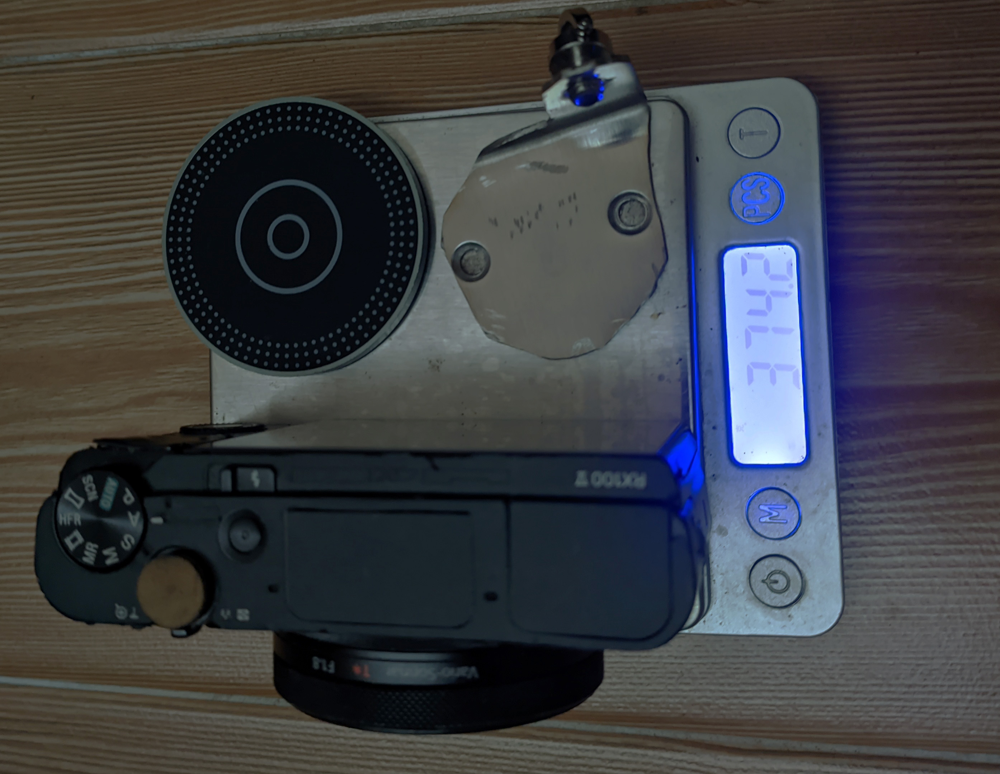
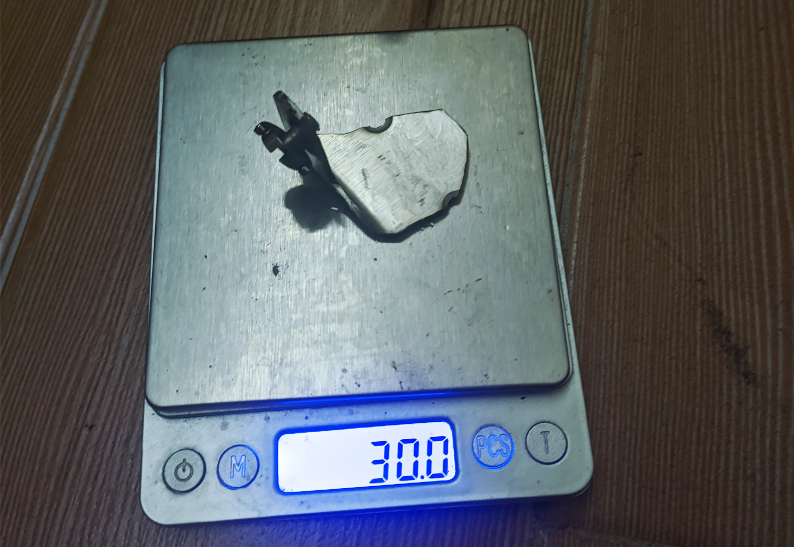
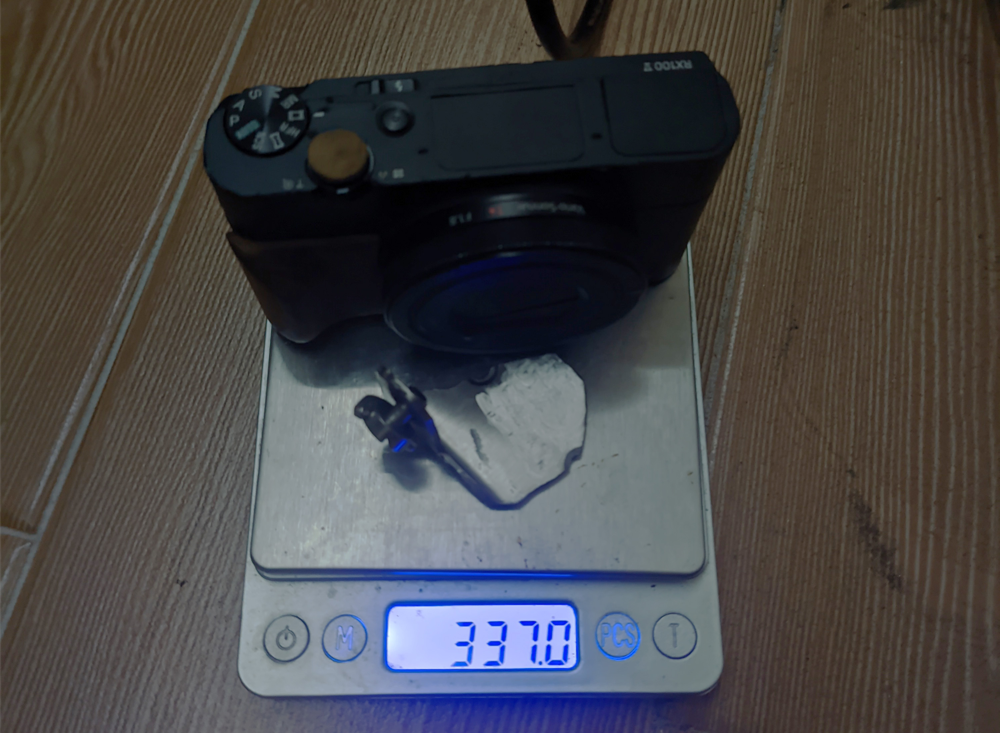
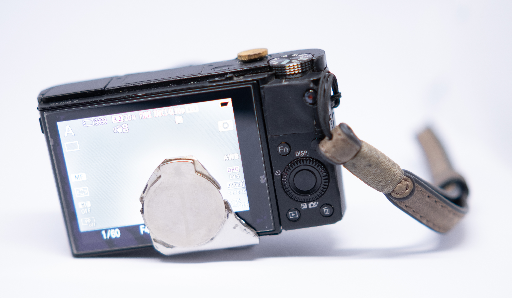
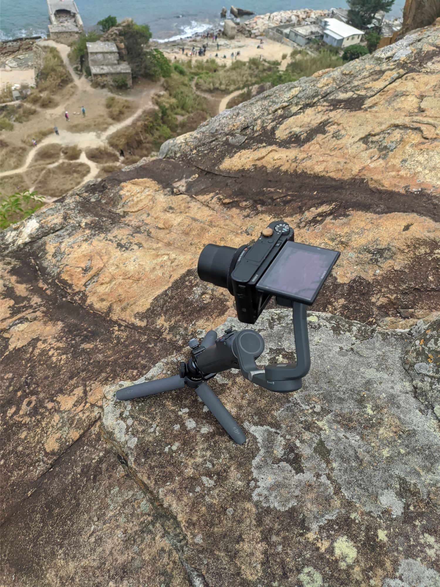

Osmo Mobile 6 is a light gimbal dedicated mainly for cellphones. And I got one for free. But you know what? I don't like my phone that much - a cheapo Xiaomi Mi9T makes decent pics, but it's not as good as this other lightweight camera I have - the Sony RX100V. Looking on the net, I'm seeing some 3D printed contraptions... well, I don't need it to be looking the other way, I won't be vlogging but I would probably set it only for timelapses. Besides, manual mentions quite strictly that it can support up to 290g.

# What are we dealing with, actually?

I had in my hands the DJI Ronin, full fledged gimbal for DSLRs or mirrorless. That thing is massive. But it had a normal tripod socket mount for your camera, and then you would balance it yourself by moving the counterweights around. The Osmo Mobile however has a different target - kids who just wanna have fun. So the gimbal has a magnetic mount in which you slide your phone in, simple to set up, simple to put back when you're done playing. That means no tripod screw.

But that can be worked around.

Quick search on Taobao showed that there are third party magnet adapter - to work with Magsafe on iPhones, and that there's an official magnetic mount that can be sticked onto your phone. The idea is simple: get a tripod screw, steel L-bracket, one adapter to keep the thing as compatible as possible, drill the hole, stick the magnet, enjoy.

# Assembly...?

The L bracket I found was for furniture. Huge thing, 50x50x2mm, twice. Already had holes. Turns out one of the holes was actually perfect for the camera placement, just a bit too narrow - bit of dremeling helped that. Put it together... and the gimbal won't hold it. Back to dremel, started removing bits and pieces, and more every time...

Finally, I got the scales out. Of course. The full L-bracket itself weighs 90g. The camera itself is over 300. Adapter also adds a bit of weight to the whole system. 290g mentioned in the manual may be a conservative choice - my phone in case with the official bracket comes out at 297g, but there's only so much it can take.

Trimming it down got me the whole system weigh to 374 gram. That was enough to have 1 minute timelapse, once, then the motors shut down, jerking the camera down, and they need to rest for a while. Thankfully the magnet is strong enough and the camera does not fall onto the floor after the motors give in.

# Improvements?

In the meanwhile I learned that my phone in the official bracket causes the motors to shutdown after 12 minutes or so. So the slightly too high weight may be a factor. And it could also be related to heat, given how subsequent immediate attempts fail quicker.

I changed my approach slightly - I got a direct third-party magnetic sticker, rather than to try to go with the adapter, to cut down weight. That should get me at least 30g off, and maybe I'd come closer to the practical engineering limit of the device. Maybe enough to have a meaningful timelapse, or a vlogging stick. 

I dremeled off few more bits, as the sticker was smaller than the one previously, and the bracket reached 37g. And that's the practical limit of my in-house engineering. I believe with strong plastics it could be possible to create a bracket - maybe one that doesn't use a screw, but goes around the camera, that would weigh 10-15g.

With this in mind though, I could reach 5-6 minute timelapses (from left to right). That's enough, to be honest, for some use cases. I'm not really happy, but I'm glad it was not a complete failure either. The only costs I took were the adapter, extra sticker, brackets, tripod screw... less than 10USD. And some time.

`youtube: https://youtu.be/tJunifHFO_Y`

_yes it's 5 minutes of a camera slowly rotating_

One important caveat though - the mini tripod included with the gimbal isn't really good. With it just on a flat surface, the gimbal is straight up, or even slightly tilted backwards (towards you). That moves the center of gravity with RX100 installed slightly towards you, and causes it to fail sooner. If you tilt the gimbal forwards (away from you), with camera more in line with the center of gravity, I get far longer working time. I assume that just allows the gimbal motors to work less. The test you see is with that tilt achieved; otherwise it would fail within a minute. I don't have any exact figures on the perfect position, just going by feel.

Oh and the camera is not balanced perfectly in the vid. Looks fine when it's installed though.

# So, can you make a bracket for RX100V to mount on DJI Osmo Mobile 6?

Betteridge's law of headlines says it straight - no. In reality though, that depends on your expectations. You can make something, it just won't work.

But you know what? With that universal mounting solution, I could easily put an e.g. Canon S110, with CHDK installed and run a timelapse for however long I want on that. RX100 is just too pigfat for this application.

# Flawed, but in practice

On RX100V, I used the free (FOSS) [Timelapse](https://github.com/jonasjuffinger/TimeLapse) app. Connecting an external intervalometer wouldn't work well - extra tug, extra weight, I'd rather avoid it. The app seems fairly wonky - I feel like it doesn't take the image every 1s. However, the official app is not only 10USD, which I could afford, but also PlayMemories store had disabled purchasing last September, and is about to be shut down. Travesty.

On the gimbal side, I need to use the DJI Mimo app. This kind of sucks for few reasons:
- it's a huge app on its own. It is powerful and decent, but in this use case I would make do with much more barebones solution.
- it assumes that the phone is the recording device, and will keep the screen on at all times, draining battery.
- You cannot even lose focus on the app, otherwise gimbal will return to default position. 

Still, it works. I would set the timelapse points and duration on my phone, then set up the Timelapse app, to have slightly higher duration. That way I could start the process on RX100, then press record on the phone.

Keeping in mind the remark about tilting the gimbal, I grabbed an Ulanzi ball head, and this was the sketchiest setup on the edge of a cliff:

I used the timelapse function in DJI Mimo app with waypoints. I set one point, looking at the screen of RX100, confirmed on phone, then used the joystick on gimbal and set the other. Later when assembling the timelapse I would just discard the unnecessary images.

First five minute test was a success, accounting for strong winds in that location:
`youtube: https://youtu.be/vlTa7xB6FKY`

Didn't fail even once. I moved to another rock to get a better view and immediately tried again. Then I went to grab a sip of water and in that very moment, the motors were overloaded, camera moved down, and lost balance. Being at basically the edge of the cliff in the blink of an eye I threw myself to save the equipment. Unfortunately, I hit the camera by the rock, giving it a slight scratch on the lens housing.

Undeterred though I gave the motors a bit of a break, and set it up again. This time my hands would be around the setup at all times, and I even opted for a 10 minute timelapse. That too was a success. A very boring (and tense) one, but a success nevertheless.

`youtube: https://youtu.be/rLCi6ozlm9o`

Was it worth it for these results? Probably not. Was it a learning experience? For sure. On the other hand, the potential is still there - for special times, or with longer focal length, which phones cannot provide.

