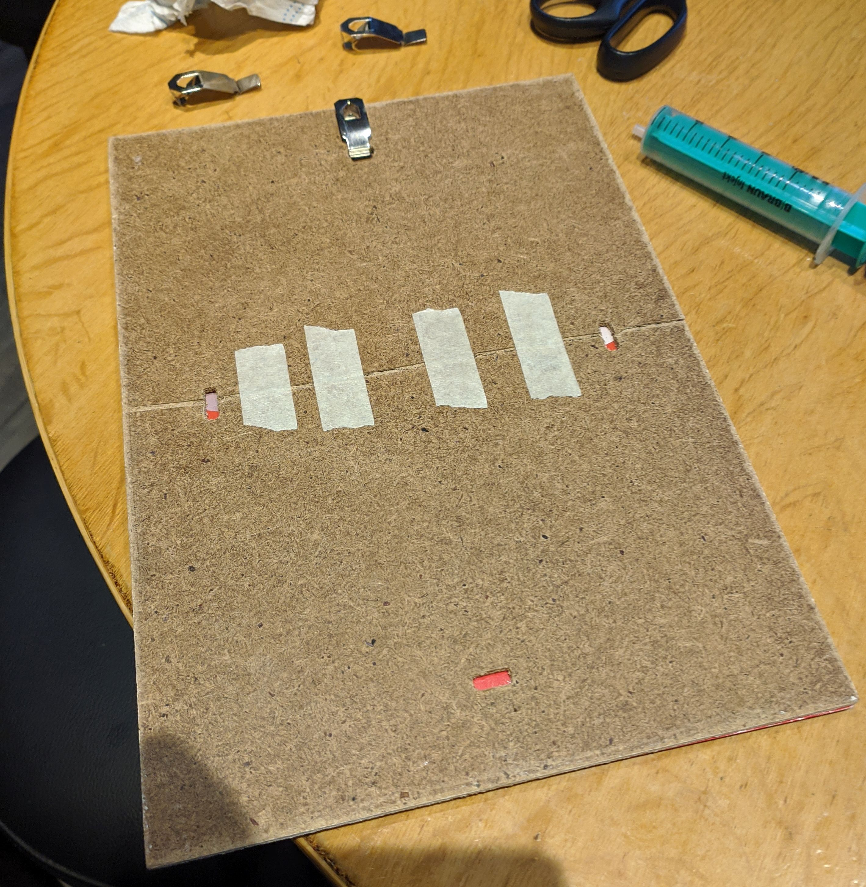

Salt paper prints were discovered in 1830s, and were the method of making positive prints from negatives. The process has been widely abandoned in 1860s in favor of... well, I don't know - collodion? Ambrotypes? Later silver gelatin prints?

Either way, I had the opportunity to attend a 1.5h workshop, so I'm an expert in the matter now. No, of course not. I'm just passing the knowledge I wrote down during the event, as I tried it myself recently and the results aren't as horrible as I thought they would be.

Pros of the method are quite apparent - it's rather easy, the only "hard" to obtain chemicals it requires is silver nitrate and sodium tiosulphate (the latter of which is a photographic fixer, so even that barely counts), and it doesn't require a tight darkroom, or a darkroom at all, really.

The cons - it's time consuming (but what in photography isn't?), and since it's contact printing, it requires a negative as big as you want your image to be. Still, it's not that bad, really, I'll cover some options down below.

Because the number of steps and equipment necessary is rather vast and a bit of it depends on what you own, please read the guide first before you jump into it.

Let's begin with the three solutions you will need...

*pardon the rather mess on the table - that's how it be when you live with other people in a small apartment*
# Preparation

## Equipment you may need

For making the solutions:
* A drug scale. Or a jewelry scale, depending whom you ask. At least with 0.1g resolution. They're cheap (few dollars on Aliexpress or Amazon).
* 2x 1L bottle. Do yourself a favor, get some ice tea or juice in one, just wash it when you're done and leave to dry.
* A beaker for measuring liquids.
* A brown glass bottle, at least 100mL in capacity.
* A syringe to measure water more precisely.
  
Useful for the prints:

* Paper (painter's) tape, whatever kind
* Transparent adhesive tape
* A hair dryer
* Clothespins
* 3 trays to put your paper in - developing trays are great, but you can do with ice cream boxes or something else.
* A marker to label your bottles.
* A picture frame that has its back plate broken in half, taped together. Trust me.

As for how each and every one of these things is used - you will see in sections below.

## Solution A - Salt solution 1L

For 1L of the solution you need:
* 1.5g gelatin - preferably beef, but pork works fine
* 15g table salt - preferable not iodised, but that also works fine
* 7.5g citric acid
* 1L water, can be straight from a sink.

In this solution you will soak up your paper.

Now, the steps:
1. Mix the gelatin with 100mL of room temperature water in a small container. Mix it for 20 minutes. You can take breaks, don't worry, just mix it well.
2. Get a bowl of warm (40-50C) water. Put the gelatin container in it, let it warm up. Mix 5 more minutes until the solution is clear.
3. In another container, mix the salt, citric acid and remaining 900mL of water. Stir until clear.
4. Pour the gelatin solution into the salt and citric acid solution. Stir for few minutes.

That's it. Pour it into a bottle or a tray if you intend to do the prints today.

This solution should be good for about month - after that, things will start breaking down, or if anything crystallizes, it's time to throw it out and make another one.

## Solution B - silver nitrate

For 100mL of the solution you will need:
* 6g silver nitrate
* 6g citric acid
* 100mL distilled water (or deionized)

This solution will be put in small quantities onto salted paper, making it photosensitive.

Note that the water for this solution must be as clean as possible, as silver nitrate will react with iron in your water.

Also note - silver nitrate is a very dangerous substance. It will make your skin black, if it gets in your eyes it will blind you, and if it gets on your clothes, it will leave unremovable stains. Wear gloves and any other protection you deem necessary! (I just do gloves and wear shitty t-shirt for that).

*for mixing silver nitrate I used gloves and a single-use chopstick*

Steps:
1. Put 6g of the nitrate in a container, pour 50mL of water into it. Stir well until fully dissolved.
2. Put 6g of citric acid in a container, again pour 50mL of water into it. Stir well.
3. Mix these two together.
4. Pour the mixture into a brown glass bottle.

This solution should be good enough for at least a year. Even if something does pop out of it, it should still be fine.

## Solution C - fixer

For this one you need:
* 125g sodium tiosulphate
* 500mL water

Mix them together and stir well until fully dissolved. I did 250g of it because that was the smallest quantity I could buy, and made 1L of the solution.

This also should be good for a long time. And it doubles as photographic film fixer too, although with longer fixing times (10-15 minutes!)

## Solution D - baking soda

Prepare it on the day you will be making the prints, as it's short lived.

* 10g baking soda
* 1L of water

Just mix together and stir. It's used to get fixer particles out of the print, so it archives better in few years time.

That's it! That's all you will need.

# Salting the paper

## Which paper do I choose?

OK, so this is not as simple. Regular printing paper may work, but it's not gonna be great. You want something thick, and something textured, to make up rather poor resolution.

Most importantly, the paper should be **acid-free**. Most thick paper for watercolor or acrylic paper is, but make sure it is indeed acid-free. Paper manufacturers will boast that on their packaging. As for how thick - that's up to you, depends on how much you want to pay. 150g/m^2 paper is cheap and can be used for training, and you can get 250+ for nicer prints. The texture also depends on your tastes.

## Preparing the paper

Of course, start by pouring out the Solution A into a tray.

Take a sheet out. Decide which side you will print on - there's no need to soak both sides at once. Mark the non-salted side with a pencil, for example writing the paper type or g/m2 figure. 

Put the paper salted side down (so your pencil writing is visible) onto the solution. It should float nicely. In few moments, as the paper's absorbing the solution, the corners of the sheet will go up. Hold them down gently, like you would if you wanted to drown someone.

Hold it down for around a minute. Once you're done, pull the paper out with one hand, holding it with a finger on the other hand towards the tray, so excess solution stays in the tray. Hang the paper to dry, putting additional clothespins on the bottom to weigh it down. Repeat with as many prints you may need, or maybe few more - they can be easily used the next day.

It will take an hour or two, depending on your environment, to fully dry the paper. 

# Silvering the paper

Do this all in subdued light.

Now, once the paper is dry, affix it to a surface - preferably one you won't worry about accidentally staining. Use painter's tape, tape the short end of the paper on one side, and secure the corners on the other.

Time to put on your gloves and shitty clothes, or an apron. Take the silver nitrate solution, and pour a tiny amount into a container. Take a cosmetic pad, fold it in half and soak it in the solution. Soak it well, push it towards the container so it spreads on the pad nicely.

Now, take the pad and pushing it with moderate force, drag it left to right, top to bottom across the paper. Push too lightly and it won't coat the surface; push it too hard and it will push out the salt solution.

Then drag it top to bottom, left to right; then right to left, bottom to up; bottom to top, right to left. Basically, to make sure it's all coated evenly.

Now the paper is photosensitive. It's sensitive mostly to UV light, and doing it in subdued light - a bathroom, for example - won't fog it if you don't leave it under strong light for long - but do keep that in mind.

Dry it with a hair dryer, so the negative won't stick to it. A minute on medium heat should be enough, as you didn't put too much water onto it after all.

# Final preparations

Get your negative, affix it to the paper (of course facing the ) using transparent tape - only on the long edges, leave the short side flying in the wind. It will all be pressed by the picture frame anyway.

Put your paper/negative combo into a picture frame, and head outside.

Hopefully it's sunny, or at least around midday - otherwise exposure times will be long.

# Exposing

Just go outside. This advice works for both basement dwellers, and for exposing salt prints.

Depending on your weather, you will need to wait few minutes for the image to start forming.

In midday in overcast weather, it took me six minutes to get satisfactory results on some of the thinner negatives. But near the evening, 30 minutes was not enough. 

Since the negative covers the image, it may be difficult to judge if it's done. That's where the previously prepared picture frame comes into play.

Here's what I did to mine:

And here's what you can do: bring it inside, and peek under it to judge how deep the brown is. It's all for your taste and you will need to experiment with it.

Once you're done, head back.

# Fixing and washing

You will need three trays.

* First with plain water.
* Second with the fixer.
* Third with soda solution.

In my picture, they go right to left (or left to right: soda, fixer, water). I put related items next to them so I remembered which one was which.

Now, with a print extracted from the tray, with the negative untaped of course:

1. Put the print into the water tray, face down. Move it around a bit. Flip around and see if it's soaked up in full, the brown tones being lighter than before. It's alright, as long as it's the same on the entire surface. If not, pour water onto it. Should take you few minutes.

2. Put it in the fixer, face up. You'll notice the contrast decrease significantly quite quickly, but worry not. Keep it in the fixer for two minutes. When you take it out, shake off any fixer you can.

3. Put it in the soda solution to wash away any leftover fixer. Lightly agitate and leave it for 5 minutes.

4. Wash it under running water for 15 to 30 minutes - I do it again in the first water tray, after replacing the water. During that time, replace the water 3 to 5 times, whenever you remember to.

That's it. Leave it to dry. They will look better when they dry too.

You can see uneven coating in the leftmost image...

# Waxing the print

The final step, to ensure the longevity of the print, to protect it from elements, and slightly improve contrast too.

That's the part I haven't figured out well yet. The workshop guy had beeswax mixed with petroleum jelly (vaseline), which spread nicely with a cosmetic pad. But I could not find one in stores, online and offline!

I went with the method described in this video below:

`youtube:https://www.youtube.com/watch?v=GFw7kYgSevg`

After putting the wax on, and letting it dry for few days, you can delicately polish the surface with a cosmetic pad, to give the print a bit of a shine.

# Where do I get big negatives?

One last thing I didn't mention not to muddle up the guide beforehand.

There are few options to consider here.

## Shoot large format

The simplest method there is. You can shoot either film, or paper - however, contact printing paper with this method will require a long exposure (could be even 8 hours with sunlight). The bigger the negative, the bigger the print will be.

## Print a negative

You can print a negative on tracing paper, that will give short exposure times, or special foil for inkjets. I used the latter. You can adjust the picture as you deem necessary too.

## Do contact sheets of medium or baby format

This could also be a fun little experience. I would use a paper that's less textured, but still a viable option.

## Expose a big film sheet

Some companies do that - they can expose a digital image onto a film sheet as big as 60x80cm, for example. In theory this could be sharper than printing the negative.

# Author's notes

Not played with it enough, but it seems that high contrast negatives fare better, as the print itself is rather low contrast.

It's simple, and it's fun, but you do need sunlight (or UV lamp) for it, so it's not easily doable after work in winter ;)