So, you live in Hong Kong. Are you tired of the crowds, people walking incredibly slowly, zig-zagging without reason? People blasting short-form videos in Mandarin over speaker in the pubtrans? Ever noticed how sidewalks are about 1.5 meters wide with a cattle fence, while there are 3 lanes for vehicles next to it?

Yeah, if you're rich, you're prioritized. But that's rich-rich, as car ownership is incredibly expensive. Fuel is most expensive in the world (although no one really pays the full price, but even with the discount it ain't cheap), but parking is even more expensiver.

There's one cheatcode to this - albeit you will still feel like a second-category citizen in some ways, already it's gonna be far better for mental health. It will still cost you some, but... maybe it's a price worth paying?

# Motorcycles.

Why would you get on two wheels? Isn't that incredibly dangerous? Well, yeah. I've never ridden before and wasn't particularly interested, but I weighed my options - I have an affinity for mechanical devices going fast for one, and the reasons above also were important.

Street parking is free (if you can find a spot). With a proper license you can rent one in Thailand or Vietnam without worry that the popo will nick you. You can filter through traffic.

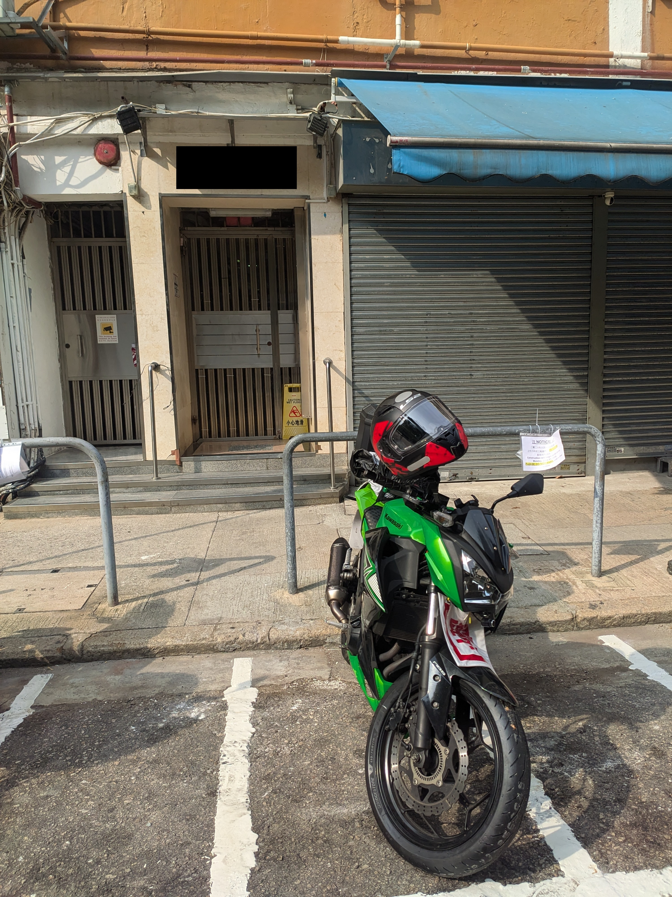

_And I can park literally in front of my apartment building. So much more convenient than relying on pubtrans!_

Yes, it's also a bit more difficult to get started and unlike with a car, a mistake can put you in a hospital, or worse.

The scene in HK seems to be divided into Chinese and South Asian food delivery drivers on scooters and people (usually Western immigrants and wealthier Chinese) who drive for fun. I'd be a commuter, and it doesn't seem to be a popular option - Hong Kong climate is full of tropical depressions in the summer months, meaning a lot of humidity and rain; and Hong Kong itself is full of depressingly bad drivers. But with the extra fun factor... it can't be that bad, for me at least.

That's basically it. I also did some napkin math to figure out how much it would cost me, put that amount on the scale with mental health, and decided it's worth it.

The license and school would take about 12k HKD, reasonable bikes can be had for ~20k (with a repair budget), gear like helmet, gloves, jacket, boots is basically mandatory and I would spend 5-6k on it. Total within 40k, spread across a year or so - the process isn't fast.

# How to get the license?

Alright, so the time to get the full license, from scratch, is incredibly long - you're looking at almost a year for the final exam, and assuming you pass that, another year on top of that to get out of the probationary period. It's not particularly easy either, so if you have the opportunity to skip it... do it.

## Easy options

Option 1: You're from a recognized country.

If you're from a country that Hong Kong recognizes the driving licenses from - places known for great driving culture - such as Germany, the UK, Burgerland, Bangladesh or Pakistan. The list in full is on the [Transport Department's website](https://www.td.gov.hk/en/public_services/licences_and_permits/driving_licences/how_to_apply_for_a_driving_licence/appendix_c/index.html).

If you have a motorcycle license already, you can just make an appointment and exchange it. Boom, you're done.

If you don't, consider going back and getting it there. It will probably be easier or cheaper.

If you have a car license, you should exchange it anyway; with the local license in hand, you can skip the written exam as you know the rules of the road already.

It's actually quite common for the local Hongkies to go to the Big6 (mainland) and get their license there - it's a quick, painless, easy process, but you need to wait a year before you can convert it. They can do it on a tricycle even, on which keeping balance is not a problem, and it still translates to a full motorbike license in Hong Kong!

Option 2: You have a license from a country that's not on the list.

Then you need to go back in time, and within 3 months of your first arrival to start living in Hong Kong, get your license translated, and sign up for a test... That's at least what the TD says. I'm not sure.

## Option 3: You were born in the wrong country with no license

Poland is not on the list, and I have never ridden a motorcycle, so I had to sign up myself and start from scratch. I have gone through car driving school back in my hometown, so I thought I would be prepared for what should come next.

Turns out the system is a bit complicated - a mix of "you can do it yourself" and "use a school for it". I went with the fully hand-holding route - maybe I could save some cash if I hadn't, but it made my life easier.

There are few driving schools to choose from - if you can speak Cantonese. For English speakers, there's only HKSM - Hong Kong School of Motoring, Ap Lei Chau branch. You can sign up at their [MEG point in Causeway Bay](https://share.google/awPwe0SRLoOZiqEyx), a little office on 4th floor of a building next to the [ladies that beat a picture of your enemy with a flipflop to curse them](https://en.wikipedia.org/wiki/Villain_hitting).

The neatly-dressed salesman will give you an outline of the process, which I will describe in more detail. Auto or manual? Auto of course is "easier" but you can't drive manual afterwards. Sign here. That will be around 11500HKD, cash or card?

# The Three Trials

The process of getting the license is basically broken into three steps, each unlocking a bit more of what you can do.

First, if you don't have a HK license of any other kind, you will have to pass...

## The Written Exam

Or Part A.

Time from signing up: about 1.5 months

20 questions, from a base of around 500. The guy in the MEG shop will give you a few books - one that describes the traffic rules, one with example questions. He will also guide you to install the HKSM app that has a quiz you can practice.

The written test touches all vehicles - so yes, if you are riding a bike you must also know about truck rules.

Most of them are common sense - especially if you've driven before. The tricky ones are with numbers - how long baggage can stick out of a truck (front and back), how much alcohol is allowed in breath/blood/urine, these kinds.

I would recommend going through the books, making some notes, doing the quiz book and practicing with the app. The school also organizes a lecture, located at the MEG shop, that you can skip - it's a repeat of everything in the books.

Then when the day comes, you need to go to the only place that does the computerized tests - in Cheung Sha Wan Government Offices, follow the signs, stay in the queue, show your HKID and sit down in front of the computer. Read the instructions carefully, and realize that there's one question that was not in the book and you're not sure of, but that's okay - two mistakes are allowed. Hope you pass.

If you fail, that's about 500HKD you're out, and another month or two waiting.

Then you can work on your...

## Mandatory Competence Test

Or Part B.

Time from signing up: 4 months (extended to 5.5)

The preparation consists of 3 classes, 4 hours each. Actually a bit less, 3.5 hours, with a 30min break. Hope that's enough.

After you pass the written exam, you can come back to MEG and sign up for the first class. And you'll have the time to get some basic gear. While the school will provide all mandatory gear: long pants, helmet, gardening gloves and knee and elbow protectors, I would say that getting your own gloves is a must. Their helmet is okay, but I bought my own as I was planning on riding in HK myself anyway, and ended up ordering cheap knee/elbow protectors from Taobao as the school's are incredibly smelly.

For your first class, head out to the school, located [conveniently at the edge of Hong Kong](https://maps.app.goo.gl/Qe7UBLYQWLhEM5DD9). You will get on the bike (a CB125F or something like that) for the first time, waddle a bit, learn the controls, find the clutch biting point, and probably do your first left-handed circle, followed by a right handed.

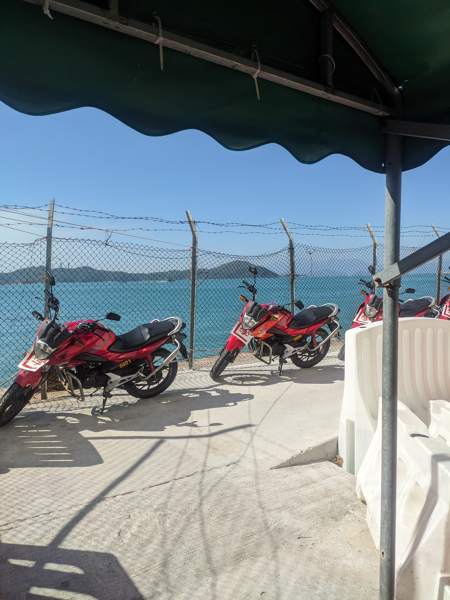

In my group of 12 people, mixed Cantonese and English speakers, you can observe how everyone is doing. Maybe you will stall the bike, maybe you will fall and drop the bike, but it's okay - we're all here to learn. The bikes have crash bars but you'll see signs of abuse on most of the fleet. It was crowded though - for obvious safety, you had to wait in line for your turn, and once a classmate has finished the full circle, the next person could go. A lot of seat time, not so much throttle time.

The second class will introduce you to the exact goal of the test. Luckily, that time there were only three more people, so that meant much more driving opportunity. I met a French guy who managed to skip the written test thanks to his car license being recognized; lucky guy. Learned that he's only getting the exam to get the international permit later and probably won't drive in HK. Seems to be the case here quite often, especially for car drivers; they get the license only to use it overseas.

The third class is basically a repeat of the second, and polishing the technique for the exam.

The test is done on the school grounds and consists of four tasks:
* Starting and driving straight to the yellow box,
* A left-handed turn and returning to the yellow box,
* A right-handed turn and returning to the yellow box,
* Emergency stop.

Basically checking if you can drive straight, turn both ways and stop.

You'll be also tasked to switch from first to second gear, and back into first. The front wheel must fit within the yellow box. At any point, your right leg cannot leave the peg, and left must be used only when you stop; otherwise it counts as losing your balance.

For the emergency stop, as you emerge from a turn of your choice, you have to twist the throttle on the tiny 125 enough to get you going 22 km/h. If you reach that, the light in front of you will turn red; if you don't go fast enough you're supposed to go again, but it's no fun and is just an extra opportunity to making a mistake doing another circle. When you do stop, using front and rear brakes together, you still can't just take the right leg off the peg; only after you do the last safety check and turn off the engine you can get off.

Every time you stop, or start, you need to do a safety check - turn your head left and right for blindspot checking. Doesn't matter that there really should be no one there. I guess it's good to build the muscle memory for it, it will come in handy.

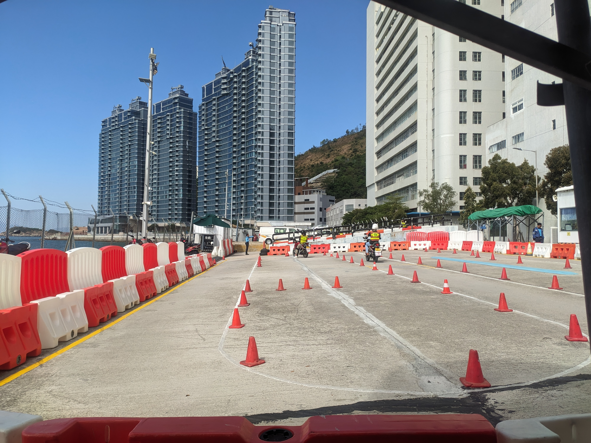

_The view you get while waiting your turn for the exam._

Of course, no crossing lines or hitting the cones either. Generally, I didn't feel particularly ready after these 12 hours, few times I'd do things too slowly and stall, sometimes I would struggle with balance and let my leg off the peg. No one really taught us how to do it properly, how the bike behaves. Coming from a car I thought slower is better, but that's not necessarily the case. A motorbike will be wobbly at super low speeds, so a bit of throttle when you lose balance would help things out. On the other hand, I see why they would not say that, after seeing a girl accidentally throttle up and crash into a fence that's separating us from the sea.

First time I went for the exam, it was in the dry season, but that particular day it rained in the morning. A little. By the exam time, it was already mostly dry, except for one small puddle. The instructors have told us to do a warm-up - basically follow the exam instructions, twice - and wait for the official examiner from TD. Incidentally, my confidence was high as I had done the warm up correctly both times.

He had a look around and deemed the track unusable for the exam due to the puddle. My test got postponed by more than a month. Call it anger, call it disappointment, but it's been already so long! And it's only gonna get longer!

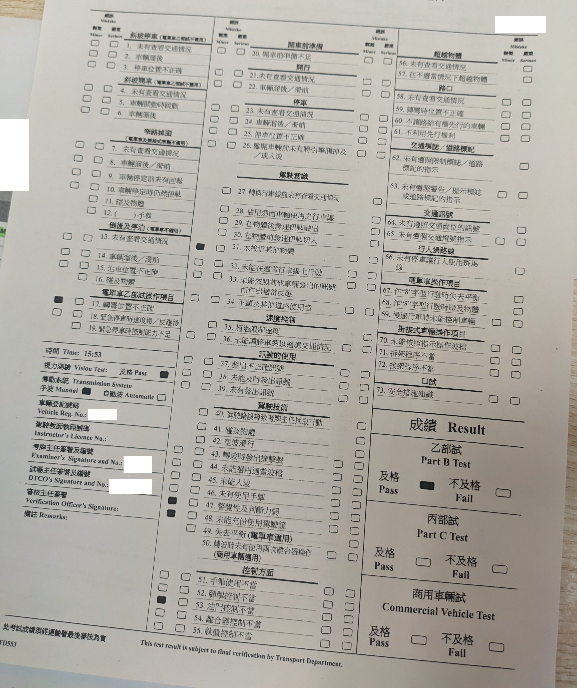

Second time, without any extra practice in-between, I passed. I was deemed worthy of a Learner's Permit.

With the test result in hand, you can either go to the Transport Department yourself and get the license which will be necessary later, or let the school do it. The school will be slower, but that means you can basically skip the trip to Transport Department and the queue. There's a reason why you'd want to do it quicker though; if you really can't wait and you already ordered your new shiny bike.

Still, you'll probably want to sign up for the initial lesson before the next step:

## Road Test

Or Part C.

Time from signing up: 9.5 months

You need your learner's license at this point to attend this class.

The road test consists of two parts:
* Figure 8 on a slope (repeated 3-5 times),
* Road driving.

### Sloped Figure 8

Figure 8 in general is not easy. Slow speed driving is not easy. It's an exercise of keeping your sight where you want it to be, and the speed at just right level. Add a slope to it and there's suddenly need to use the rear brake and the throttle in a more pronounced way.

The start is also from the middle of the slope, meaning you have to get used to hill starts.

And then you still need to fit within the alotted area.

At least, on a naked 125, the bike is light enough that it's not terribly difficult once you get some practice.

The instructors will tell you to learn in 4 steps - from a right-handed loop, to the full fledged continuous figure 8. At first, I couldn't really get past the first step. There were two more people with me on the first class; one was a British pilot who already had some experience riding, and he told me about target fixation - where you keep looking at the wall and you just end up driving into it. You have to keep your eyes where you want to go. After that I managed to do the full figure 8, albeit with some balance loss, especially going uphill.

Problems may arise from the fact that the bikes aren't in great shape, abused by countless drops. One I practiced on had a loose throttle, so coming out from the bottom quite often I didn't turn it enough to engage and the engine would stall. Another had a sticky rear brake; when pressed it wouldn't disengage for a bit, making it basically impossible. It's one of the few cases where actually the tool isn't great and you struggle with the machine more than you should.

From now on, you can use 8 hours of self-practice for either city driving or the figure 8. There's also one "Enhancement Riding Skill" 4 hour class. Another necessary class is "Familiarization with the exam routes", where you get into the car and the instructor tells you how to approach every point. The last one is of course the mock exam. Don't rush to book them as soon as possible - there's a long time between your part B and C exams, but make sure you do book them before they're all taken.

And yes, self-practice means self-practice. There's no instructor riding with you. Just hop on.

There's also two lectures, but you don't have to attend them. I didn't.

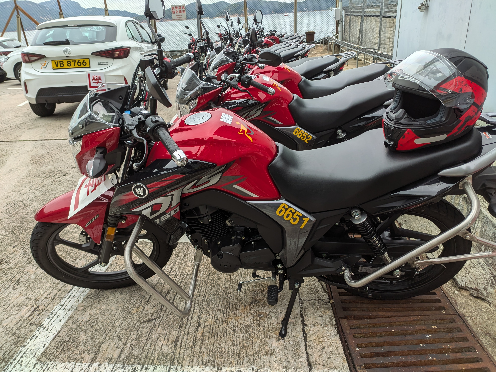

Three weeks before the exam I realized that the school has replaced their fleet completely. Rattling Hondas CB125Fs got replaced by Chinese Haojue DKS150. Shiny. New. Less than 1000km on the odo. Funnily enough, still equipped with manual kickstart. They do handle a bit differently and have a bit more power, but they're still light. I don't know how long the new bikes will stay in such, uh, decent, condition though.

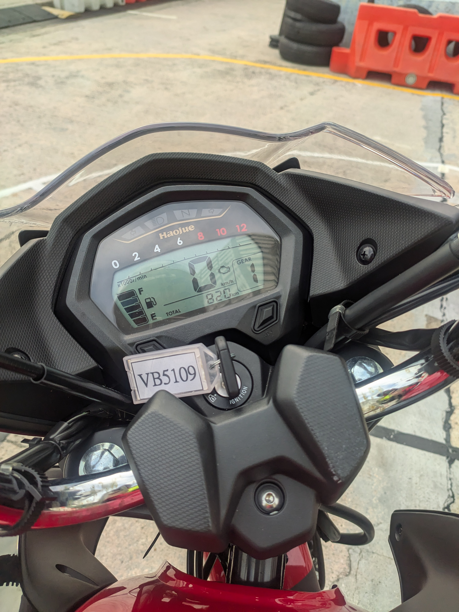

_So new!_

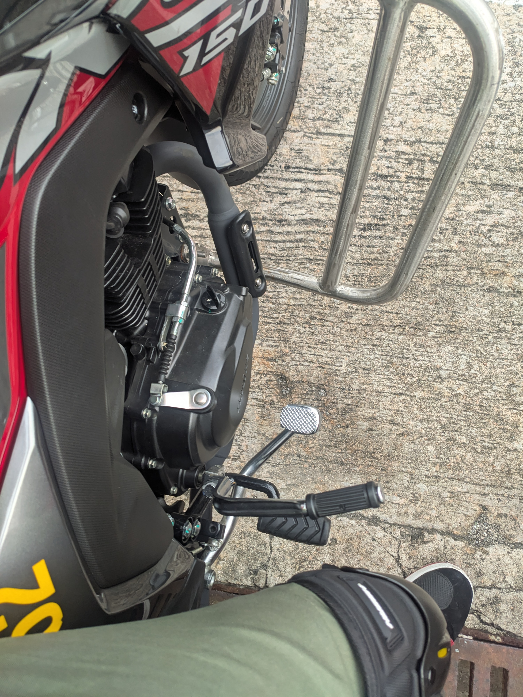

_The black foldable lever is the kickstart, yep._

Either way, with the new, not abused bikes - or my skills improved, I actually started to enjoy the figure 8 exercise - it has clearly visible skill progression - at the start you might be too scared to do much more than a u-turn, but at the end it's a breeze, and in your practice you might start adding some extra challenges. You can tighten up the turns and be done in maybe half, or 2/3rds of the slope? It's also possible to do it without touching the rear brake as well, except of course for the hill start and stopping at the end. Of course, don't challenge yourself during the exam, but being aware of how much margin you have during the stressful moment can help retain some confidence.

I also made a video about the figure 8, explaining my technique. You can skip ahead to the later chapter to see my run. Seems effortless after some effort.

`youtube: https://youtu.be/zqC7_jhbJ2o`

### Road driving

Road driving is the easier part - I mean, you just drive? There's a lot of space on the actual roads. Just remember to yield, blinking, safety checks - which you should be doing in real traffic anyway, albeit with more excess here. The place where the road driving takes place is a small industrial area at the end of a tiny island - there's not much traffic in the slightest. No roundabouts, no traffic lights, no highway driving. That's a formality.

There are two routes, called Lee Wing Route (also known as 4123) and Lee Hing Route (also known as 2413). The first one is a big loop followed by a small loop, the second mixes them both a little with few more collision points.

But your still need to be extra aware. Common mistakes include:
- Crossing opposite lane's line when turning,
- Not doing safety checks after you stop AND just before you go,
- Losing balance,
- Not turning off the engine after you stop.

Generally during the day the roads are busy - not with normal traffic, but with learners. Moving slow and unsure. Speeding is basically impossible, with both the tiny single piston engine and traffic limiting how fast you can go - you're lucky if you can switch into third. Losing balance shouldn't REALLY be a problem, but it might be if you have to brake hard, suddenly. **Give yourself space**. 1-2 bike lenghts before the next fellow. If he crawls forward but stops soon after, you don't have to go either.

Another reason why you'd want not to move is safety checks. You have to turn your head to both sides every time you stop, and before you go. Maybe if you stop for a second or two you can get away with one check. I tend to forget to do it before I go again, especially if I'm stuck for a longer while behind a car.

If you need to overtake a stopped vehicle, remember to do the shoulder check before and after the vehicle.

Turning is also a bit more involved, as it's two phases - starting from the middle of the lane, mirror and shoulder check to move to the center line, and do that again before you actually turn. Of course, let pedestrians and oncoming cars pass first.

I had recorded a typical test route but there's really not much point in it - it is that simple, so no video.

# Interlude: Learner's Life

One thing I have not mentioned yet, but you might have been surprised to read that no instructor is needed.

What's needed is a big sign with an L and 學 (hok6, "study") on the front and rear of the bike. Which means, you can get your own motorbike, and slap these two signs, and enjoy driving already! I mean, of course, getting road experience for the exam.

With limitations, of course.

You can use your own bike for the exam as well - but not on Ap Lei Chau - there's restrictions to get there in the first place and they won't let you for insurance reasons. On the other hand, you probably don't want to - I prefer my own motorcycle to remain undropped.

### Learner's limitations

There are few caveats, [as you can see officially here](https://www.td.gov.hk/filemanager/en/publication/conditions_imposed_with_issue_of_ldl_eng.pdf). Biggest one, in a big simplification, you can't go on the highways or take the tunnels. There are also other roads marked with no learner's allowed, but the logic there is a bit weird. I found an Excel sheet with the places listed, and I painstakingly confirmed it with Street View and made it into a [list on Google Maps](https://maps.app.goo.gl/xUKYShZsMzkNdxN6A), for Hong Kong Island only. It's non-exhaustive, and I skipped the obvious no highways/tunnels.

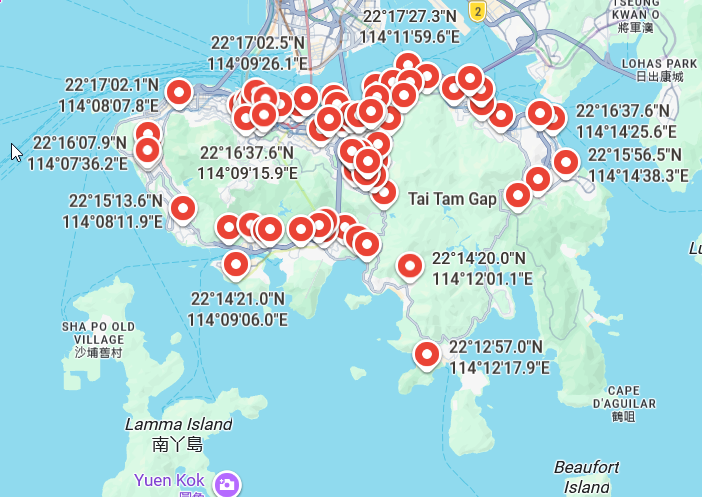

_Doesn't it look ridiculous? It is._

On top of that, there's a time limitation - no night riding and no rush hours. The times forbidden are:
* Every day: 23:30 to 6:00
* Monday to Friday: 7:30 to 9:30, 16:30 to 19:30,
* Saturday: 7:30 to 9:30

Public holidays are treated as Sundays.

There's also no passengers allowed, fair enough.

It's fairly limiting if you commute to work of course; you either wait a bit longer (maybe grab a dinner?) or get to work earlier, if that's allowed. Of course assuming your home and work are in the same allowed area. On the other hand, if you don't display the plates, it could be a 450HKD fine if you get caught; similarly, another 450HKD if you get caught on a road not permitting learner drivers. If you get caught.

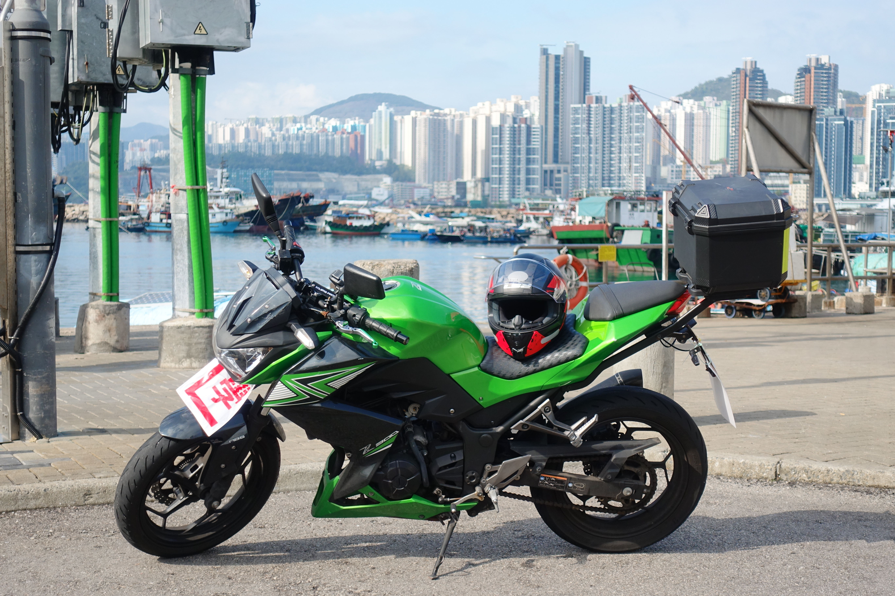

To be honest, I found the random no-L signs much more limiting - in my opinion at least - than a blanket no-highway rule. Because of that, any longer route (basically, more than the hood I know) I would have to plan ahead. Consult the map, consult the list; use navigation on GMaps to make the initial sequence, move some points around to skip known no-Ls, then just in case, go through the whole route with Street View, checking intersections. And then remember it, as you _can_ export a navigation route on GMaps by link to your phone, but it doesn't preserve your changes. Oh and if there's an event on the route you're planning to take, forcing you to go on a forbidden path? Welcome to the dark side.

Still, it's relatively common for learners who have the means to get a bike. Once I passed my part B I had a chat with a clerk at the school; he asked me if I want to get the license myself, or through them. Young guy, quite invested into the scene - me frankly new, but eager to learn. Most of his friends going through the process had a bike ordered before the exam, ready to be picked up the moment they get their hands on the license. First bike? Well, I had a CB190R in mind, maybe a cafe racer later... but these are uncomfortable according to him. Something easy. How about the restrictions? Yeah they suck, but sometimes if you take off the Ls, and don't get caught, it'll be fine, but shh.

Surprisingly, there are some difficult and fun roads you can drive on Ls. If you plan your route, I think even going all around Hong Kong Island might be possible.

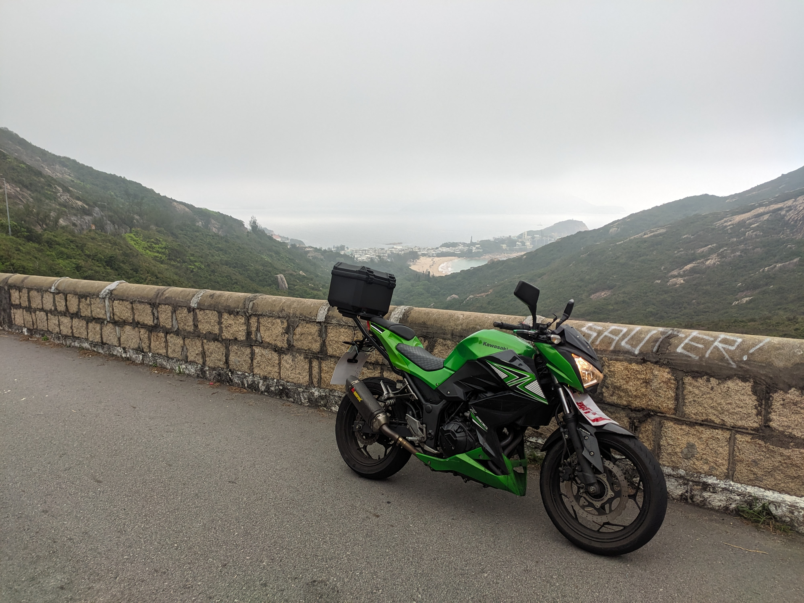

### Insurance

If you do decide to get your own bike, keep in mind that insurance would be higher as well.

Usually, for probationary or normal drivers it's about 1300-1600 HKD per year. For learners though, you can be quoted about 4000 HKD. Can be even more if you want to get a bigger engine, like 600cc. If you look around a bit though... I found one offer for 2600. Still higher than usual, but consider that an extra hour of self practice costs 400, during which you will probably be stuck in traffic with other learners, or waiting for your turn on the slope.

Instead you could be riding your own, for how long you want. Yeah it's not the same as the school bike, but the skills transfer.

# Finally, the exam day!

By the day of the exam I had done around 500 km on my bike (more on which later) and finished all my lessons. I felt ready.

It was a warm mid-May mid-day. I arrived at the School of Motoring on my exam day an hour early to get my last lesson. I was feeling quite confident. I'm gonna nail it! But once I was on the DKS150, I realized I was struggling a bit with the figure 8. Sure, after few tries I could get it. Most of the time. It's gonna be fine. Is it the nerves?

No, it was terrible rain. The exam got cancelled.

Again. That's annoying. As before, I was awaiting a call from TD with the new test date. I didn't have to wait long - three hours later a voice with a heavy Chinese accent told me over the phone - a [very](https://en.wikipedia.org/wiki/Marvin_Heemeyer#Rampage_and_death) [special](https://en.wikipedia.org/wiki/1989_Polish_parliamentary_election) [date](https://en.wikipedia.org/wiki/1989_Tiananmen_Square_protests_and_massacre), 9 AM, cannot change. OK, what else can I say? I can't predict the weather two weeks ahead but I'll take any chance.

And chances weren't so high - statistically, in summer months, more than 2/3rds of the month has days with rain. With a bit of unluck I could be stuck in this cycle until October.

I was also out of self-practice sessions at this point. I did not want to pay any extra - in preparations I'd do fig8 on the Z300 on flat terrain. I could do it. Most of the time. Gave me more time to think and improve the technique. Keep your hand on the right side of the throttle so it doesn't get hit on full handlebar deflection; always keep some speed. And the thing with rotating my head both ways on every stop and start, deep into my head.

### Second exam day

Weather was hot, but most importantly sunny without a single cloud. I left my jacket at home, I didn't want to get cooked. The asphalt was dry. It had to be now.

Arrived early enough to get few rounds of warmup. I got on the DKS, which at this point had 1500km on the odo. Still not in a terrible shape, thankfully. Figure 8 was easy this time around, and I couldn't leave the school grounds for city warmup, but that's alright. That's easy, I said so before.

Closer I get to the exam time, more I get gastrointestinal issues. That's normal, just gotta hold it in for a moment...

The examiner gave me a rundown of the things I already know - no right foot down, how the fig 8 works, and the route - Lee Wing, big loop and small loop. Simple. For vision test (yeah, second time, in case your vision went to shit in half a year), he didn't ask me about plates hung on the pole nearby like they usually do - but a car practicing parking nearby. Interesting! Guess there are some people who would remember the hung plates. Anyway, put your gloves and helmet on, and raise my hand to start whenever I'm ready.

Don't forget your kickstand. The DKSes don't have a killswitch. I got up there and just started going. Hill start, no problem, first turn, alright, going into left... why am I still accelerating? Oh shit, almost lost balance! Saved it - probably because I knew my margins. I didn't notice that I was so nervous I held the throttle so tightly I was gassing up all the way. Fixed that and kept looking at the examiner. Three loops, four... he's still there looking. Probably because of my little wobble earlier on. Not sure how many it was, but he finally raised his hand. We're off to the roads.

Some careful readers might notice a small discrepancy: I'm a learner still, but the exam is at 9 AM, when learners can't drive outside. Yep, that's acceptable. And it's probably the best time as well - the roads are empty, without any other learner cars taking their sweet time to make a simple turn. Needless to say, it was a breeze and I was back at the school grounds in what, three or four minutes?

Don't forget to turn off the engine once you stop. Then turn it back on, park the bike and wait for the results.

Here are mine:

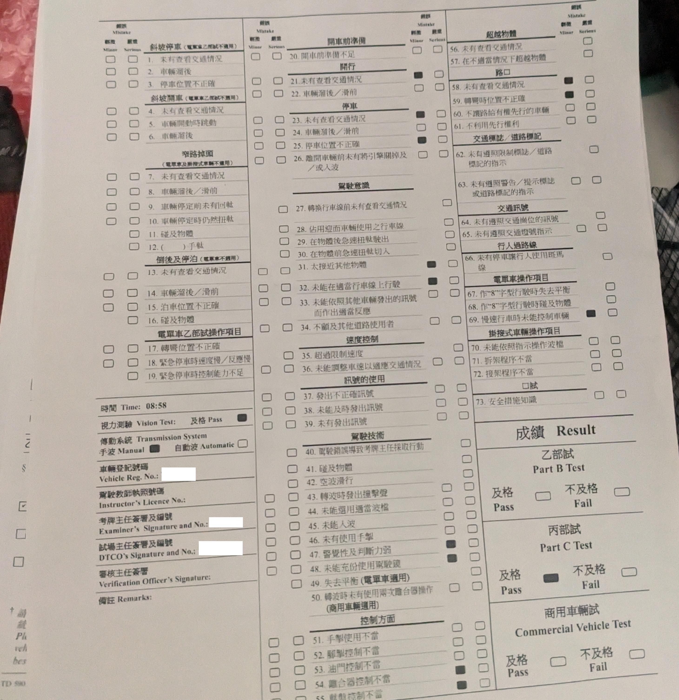

## Post road exam: freedom?

Not yet. But a small taste of it was deleting the HKSM app after 10 long months.

Once you pass your final exam, you have to wait 4 painful working days before you can get your probationary license. Oh, you wanted a full one, after almost a year of practicing? You wish. Go to another country and transfer it here if you can; here all you get is probationary.

But wait, what does it actually mean? The limitations of learners' are lifted, but new ones come up:
* Maximum of 70km/h or the normal speed limit, whichever is lower.
* Still no passengers (unless you have a sidecar).
* No fast lane on expressways with more than 2 lanes, except to take a right exit.
* Must display a P sign on the front and back of the bike.

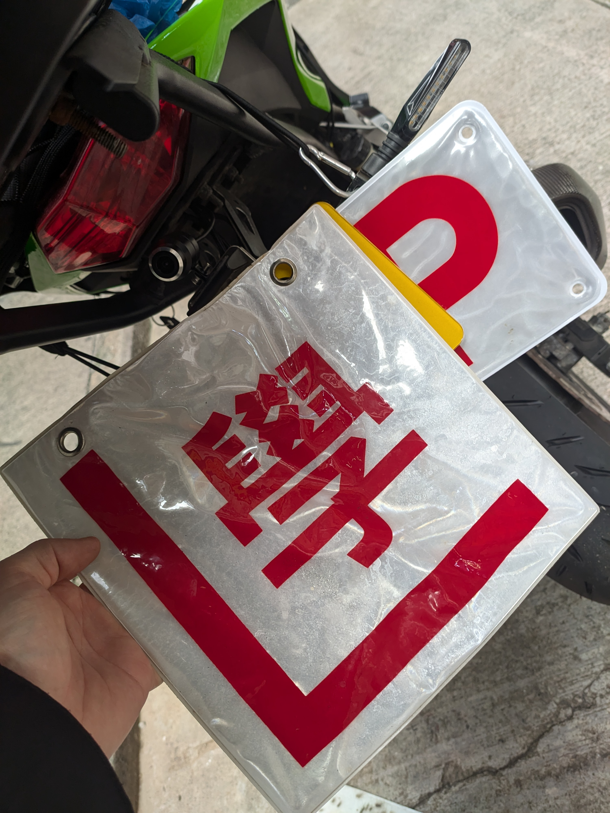

_Giving out the old L plates if anyone needs :P_

That stays with you for a year; if you get any demerit points (e.g. speeding or other driving offences) that gets extended by 6 months. But if you do two of these things together, then a retest is due. I will not comment much how retarded this system is - someone who doesn't drive at all can get the full license anyway and have less skill than someone who drives every day in that time. Some burger after 2 days of MSF training can get a full license transferred and have less skill than a HK student on Ls. But alas, I'll just blame the britbongs for the first implementation and the PRC govt for keeping it that way.

After that, it's freedom.

Freedom, within the 1100km^2 golden cage.

# Alright, how do I get a bike?

New? I have no idea, I'd never get a first bike new. I've heard enough stories how you'll probably drop it sooner rather than later.

Used?

I would point to three sources, and quite often you will find the same bikes posted on all three:

## Used bike markets

### Facebook Marketplace

Used by both expats and locals. Navigating it is a pain in the ass (The Algorihm TM has gotten its claws on something as simple as browsing items), but it's alright.

### [Carousell](https://www.carousell.com.hk/%E4%BA%8C%E6%89%8B%E8%BB%8A-used-cars/h-2020?t-source=homepage)

Also probably used by both expats and locals, albeit more the latter than the former. Easy to navigate at least. Built-in chat function before showing your phone number for Whatsapp.

### [28car](https://www.28car.com/)

Probably the most popular and most local site. It's available only in Chinese and it takes some practice to navigate it. Descriptions are often short, with basically just the odo, maybe some new parts installed listed.
The most infuriating part about that site is that it's listing sold bikes next to available ones. If it has contact number, it's probably still available (but ask), if it doesn't, then it's off. And it's not like it's in big letters (or rather, Chinese characters), I was looking at too many sold bikes before I realized that.

And unlike the previous options, here you can filter by engine size, transmission type, seat count - if you're not sure of the model you want yet, I'd start with browsing there.

## Purchase experience

I bought and sold few cars back in Poland (or assisted my Dad with), that was complex enough with having to go to the tax department as a seller and tax department plus transport department as a buyer, but you know, you could test drive it, sign the papers and just go.

It's not like that here. Oooh boy.

First, you meet with the owner. Check the bike, have a look, ask for scratches, test drive - if they let you (better if they do, avoid if they don't) - and agree on the price. You may or may not have to pay a deposit at this point.

Deposit? Why? You're buying it, right?
Here's the next steps you have to follow:

1. Get the insurance.

Insurance covers a driver and a vehicle at the same time. You get a quote from an insurance provider, pay that and you get a cover note.

2. Check if the vehicle has any outstanding tickets - note of clearance.

YEP. If you buy the vehicle and transfer the ownership, you're also responsible for the fines that the previous owner has not paid. It boggles my mind.

That's also another reason why they don't let you take the keys immediately - until the transfer of ownership, they would be on the hook for your driving offences. The logic here... I really can't grasp it. In a normal country, if the police stopped you, you'd just show the contract you have between the buyer and seller before you re-registered the vehicle. Or if they came knocking. Insurance would also pass over with the vehicle. Simple. Effective. Reasonable.

3. Go TOGETHER to the Transport Department.

Once you have a cover note from the insurance and verified there are no outstanding penalties, make an appointment online, and pre-print your documents. You will save 3 hours. Make sure you don't use open-source printer software that will accidentally cut off the bottom of the document making it invalid and ending up with you being sent off to the 3 hour queue.

Yes, that means you're meeting the seller twice, few days later.

There's some transfer fee, and a fee for getting a new license.

Alright. Almost there, but you still can't legally drive yet.

You get a piece of paper that's your vehicle's license. It doesn't hold any important info - that's all digital - but you still have to display it somewhere in the back. Most people go to FOTOMAX to laminate it, make a hole and put it under the registration plate.

At this point, you'd transfer the money and get the keys. You'd think it's all over, but you still need to...

4. Get a registration plate

You don't get one in the Transport Department. I think it's the only city in the world where this is the case. You have to go a third party with the license paper you got, and ask them to print the plate for you. They can customize it as well, make the letters embossed or something, or the plate more reflective if you pay extra. You know, showing off to the neighbors, for a legal requirement that usually ruins the car's look. Important stuff.

But how do you get to the third party if you can't drive because you don't have a license plate? I'll leave that as an exercise to the reader.

Then you can also attach the L or P plates if required, and you're finally good to go.

Wait, not just yet! That would be true if you didn't plan to cross the harbor or take any tunnels.

5. Sign up for HK e-Toll.

Visit the [official site](https://www.hketoll.gov.hk/), and basically connect your vehicle registration plate with the auto-toll system. Otherwise, previous owner could be on the hook (if you kept the plate). That can be done about an hour after you leave the TD offices, once the information propagates in the system.

Whew. That's about it, I think. Gear? Driving safe? Who needs that. Paperwork is done and that's all you need!

## My personal experience

I had a look at few bikes; I wanted to get one still on my learner's plates. My requirements were: no more than 20k HKD, newish, ABS, simple to ride with minimum maintenance. I'd probably sell it after the P period as well, so it didn't have to be powerful either.

A bit of rust and dings was to be expected. We're in a humid climate after all, and everyone will drop their first bike. Many owners don't scare me, although every one of them will add some mods.

At first I was looking at a Honda CB190R - especially in Repsol livery, looked great. There's plenty on the market which would indicate it would be an easy sell later too. 

I messaged some sellers on Whatsapp, asking if they speak English, and got some responses. I ended up test driving two and didn't have any problems with either. Found one new-ish Repsol with 8k km on the odo, but that got sold to a higher bidder, so I looked further.

In 250-300cc range the Yamaha R3 or MT-03 was a bit out of my budget, and anyway I didn't want a race bike with fairings, thinking I'd just drop it multiple times anyway.

So I looked at Kawasaki Z300. Found two in the neighborhood that looked alright. First had aftermarket fairings from Taobao and a seller that was incredibly pushing; I didn't get that one. The latter was sold by an MK仔 that seemed honest enough and in a state that I'd say was good enough. So I got it.

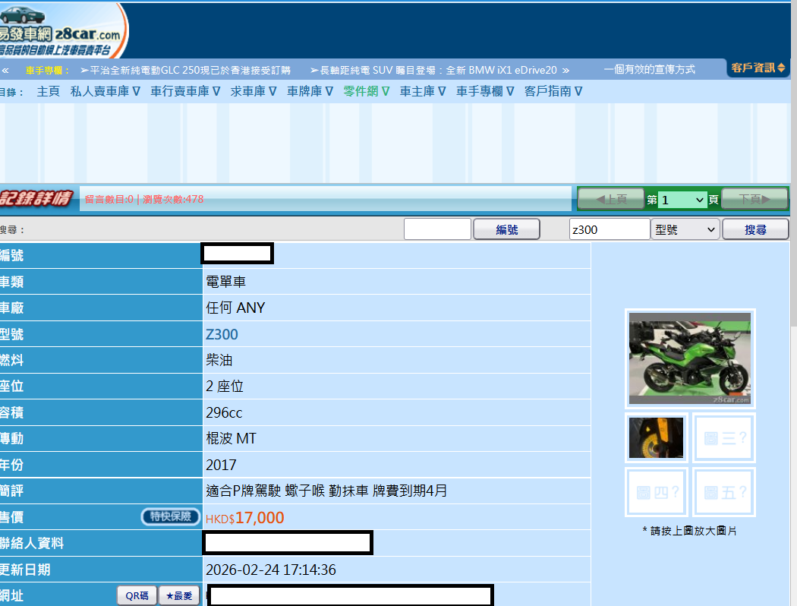

_The actual listing. Yeah, two photos and few words. That was enough._

The dude's English skills weren't great but we managed. He was very understanding and helped me through the process. I think if you buy your first bike, it's good to have an owner that will also guide you through the insane bureaucracy.

Generally though they seemed genuinely friendly, in the most part. And people on the road are better than the people in the public transport.

After some time I did learn the bike was actually in good shape but I did miss some parts I could've haggled on. The exhaust is non-original and might be a problem if caught, the fairings and mirrors aren't original, but most importantly it drives, turns and brakes, and it's fun to ride. From must-do parts I just had to replace the tires, and front brakes are coming soon.

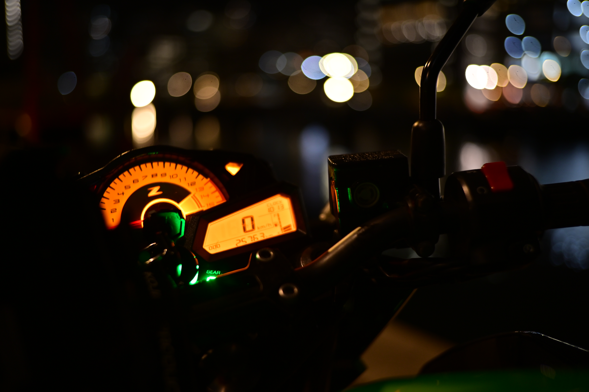

_And hopefully many more kilometers ahead._

For mods, I'd just say a dashcam might be necessary. Hong Kong is the land of snitches, so you should become one as well.

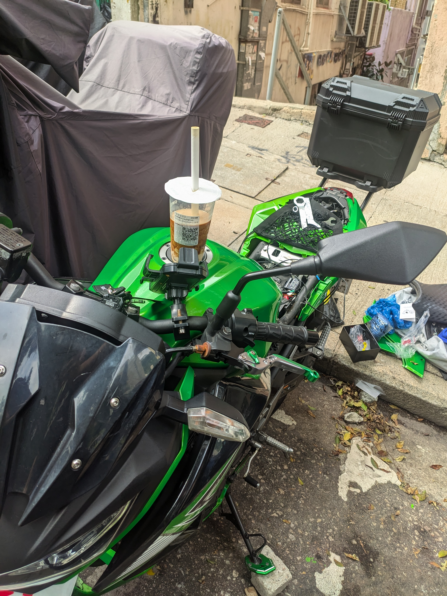

_And bikes are simple to work on. Much easier than even my 1993 Corolla or 2000 A3._