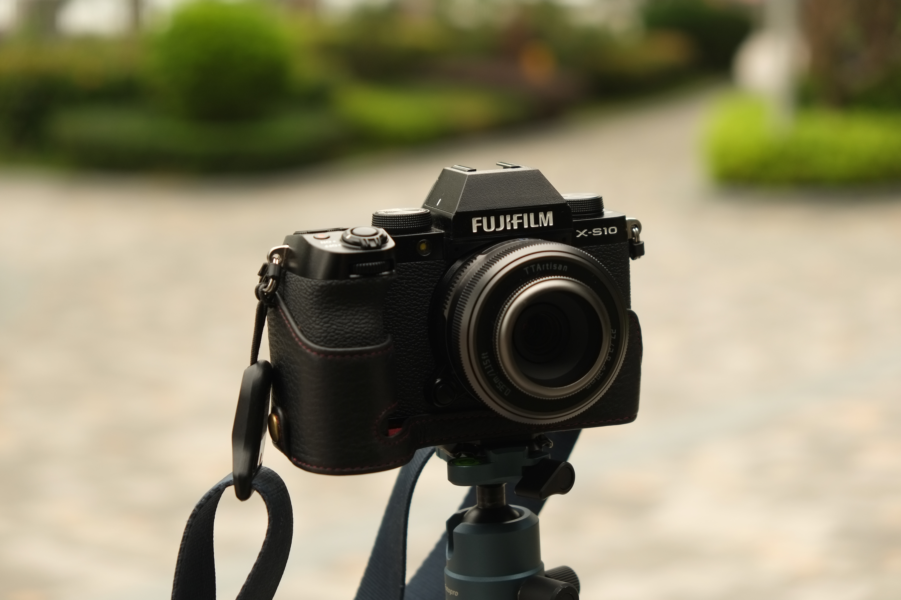
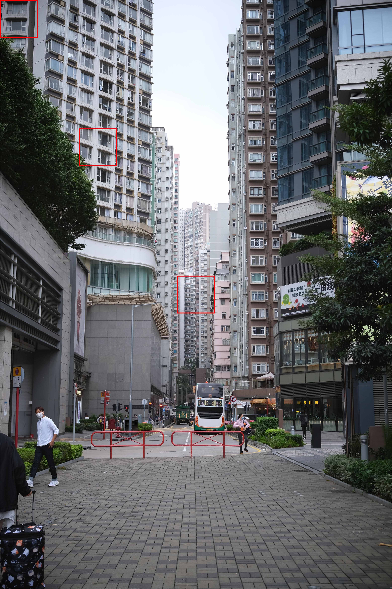
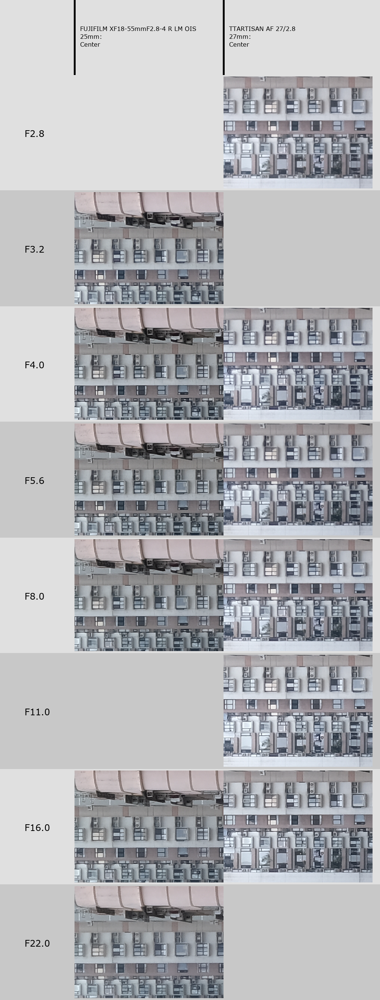
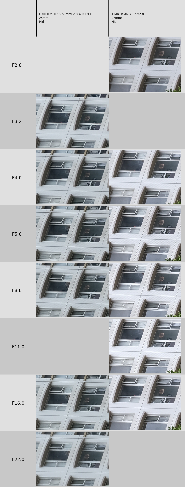
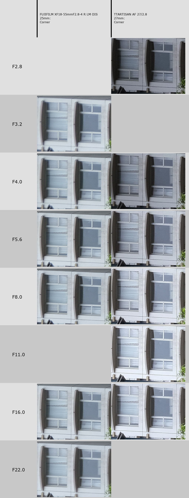

I'm cheap. I'll get it out of the way first. I'm not loyal to anyone, except for low taxes, low prices. TTArtisan did a quick release - preview on one day, release the next - a 27mm pancake that could be easily mistaken with the Fuji one. A knockoff, you may think. I was interested, having received an X-Pro1 a while back, this could be a nice alternative to a rather expensive, even on second hand market, official Fuji lens. I thought to myself - if it's less than 200USD, I'll get it - worst case I'll sell it. The announced price - 160USD was definitely below that, so I was getting ready... but a quick look on Taobao revealed an even nicer surprise.

690CNY! With a coupon, 660! That's around 95, and 91 USD respectively. Nobrainer! Living in China is great! Human rights? Reasonable government? Who needs that?! Gimme cheap stuff!

I'll write few of my thoughts about it after few days of using it - I won't go _too_ deep into it as I'd better leave systematic tests for Chris Frost, which I hope will review it at some point.

On a side note - I don't have, nor have I used the Fuji 27mm pancake - so don't expect a direct comparison.

# Looks and ergonomics

You can get it in either black or titanium colors - the difference on photos wasn't particularly visible, so I went with titanium. In reality, the difference is quite obvious - I think, I haven't seen the black one. Titanium, or I'd rather call it graphite, is certainly a better match with silver Fuji cameras, but it still works very well on black ones.

I've heard it's thicker than the Fuji 27 - and it does stick out from X-S10's grip, but not much. I'd still call it "coat-pocketable", with the size of the camera body being the biggest issue.

Certainly a handsome lens otherwise. The included hood presents nicely, and it's all metal build. Light, but solid. No weather resistance gasket, but none of my cameras have WR anyway, and neither do I really care.

The aperture ring has clicks every third of a stop, from f2.8 to f16. I love clicks, but what I don't love about it is how narrow it is. The grippy part also takes a really small portion of the ring, maybe a fifth in total, and moving it outside the grippy parts is rather difficult! I'm really tempted to get a focusing tab, and put it on the bottom, so I could set the aperture more easily.

A workaround would be putting it into A mode - and on X-S10, that means with "A" on the PASM dial, that I can control the aperture with the front command dial. Better than getting my hands around it, if the camera is by my eye.

The focusing ring, on the other hand, is much wider. Of course, with the lens being autofocus, it does not make much sense. It does turn smoothly and in manual focus mode allows to set focus precisely. 

The lens cap is small - and along with the similarly small 39mm hood, fell from my hands onto the asphalt few times already - but they're sturdy enough, I can't see any marks. The lens cap is smartly designed, so you can use it both without the hood (39mm), or with it installed (where the entrance hole is smaller).

# Image quality

Fuji's optical scheme for the 27mm lens is superb from what I've heard and seen; the TTA's design is a simpler - 6 elements in 5 groups. Still a lot for a small package, but more elements must mean the Fuji is better?

_X-S10_

Surprisingly, it's decent. Pretty good. If you wanna see a comparison of image by aperture, go to the [Nerdy part](#nerdy-part) section of the article.

As for sharpness or contrast, I don't have a 40MP fudge (yet?), but on 26MP it made a really good impression. On 16MP X-Pro1 essentially flawless.

_X-Pro1_

During the day, in daylight, no problems at all. The bokeh can get a bit busy, but at f2.8 it's not really a bokeh monster.

But not without problems - most notably, vignette and flaring.

Vignette is definitely pronounced wide open, but it does quickly get better. Fixable in post, and for street photography doesn't matter _that_ much, but still, something worth mentioning.

Additionally, the seller included a 39mm UV filter, which I decided to put on initially. However, the filter in tandem with the hood caused the corners of the image to be cut off. Either filter, or hood - that's my lesson.

As for flaring... well, I have never had a *vintage* lens that was worse at this! Absolutely awful, gutter oil coatings - if you have a strong light in the scene, either get rid of it, or stop down significantly. See the examples below - one at f2.8, the other at f7.1:

     

          
     

     

          
     

  

_Thanks to IBIS on X-S10, I could take the latter image at 1/4s..._

There's some barrel distortion as well as I've seen on RAWs, but nothing really annoying - for proper measurements, don't ask me, I don't have a proper chart and brick walls are a rarity.

The lens focuses down to 35cm - not too close, I think, I'd like a bit closer - but quite alright to be used for portraits or in general to get slightly closer to your subject. The good news is that the image quality holds close up as well.

_X-Pro1_

# Autofocus

STM motor, really quick and quiet, that's for sure. On X-S10, at least. On par with other lenses I have - whether Fuji zooms, or Viltrox primes.

_X-S10_

In low light? No problems. Focuses on the eye with grace; no back or front focusing.

The only problem comes on older bodies - X-Pro1 hunts a fair bit, and sometimes it focuses completely wrong - so I have to refocus. 

That should be somewhat alleviated in 1.0.1 update - and yes, it does hunt much less, but it still has issues. Which brings me to...

# Firmware updates

Most third party lenses have a USB port on the mount. TTArtisan decided to change things a little bit - and the port is... on the rear lens cap. Which is great, no ugly ports, but if you lose the cap, it's not an easy replacement. A bit of a problem - so better to leave the lens cap at home, and get a generic one instead.

In theory, the update process should be the same as other lenses - you connect it to your computer, copy the firmware, reboot. And that's what the instructions on the lens website say. Even more so, website claims that "upgrade must be done with Windows (Windows 11 not supported yet)" - very stringent!

But my Windows 10 laptop would not see the device at all. Another laptop with Win10? Same problem. Rebooted to Linux and finally can see, but what is it - ``errors=remount-ro``? I can't copy it...? Well, I did copy it forcefully with ``sudo cp`` - and it worked, but it does feel weird. 

# Conclusion

It's not perfect, for sure. It's fun to use, though, and the images make me happy. But would I recommend it? Below 100USD, the price compensates the shortcomings greatly; at 150 or more, I would rather recommend looking for the first generation Fuji 27mm - I assume vignette and flaring performance will be better on that. ~~It's not the end of the world if you do get one though - I will be keeping mine, it's a solid walkaround lens with a lovely focal length.~~

I think it will stay on the X-Pro1 most of the time, for daytime walks.

(edit: I sold the lens in mid 2023, haven't used it much and got an offer higher than what I paid for it.)

     

          
     

     

          
     

_X-Pro1_

# Nerdy part

So I have a ``lenscomparator`` python script that I use for testing lenses performance. Just as a guideline, as it takes only JPEGs, but does prove to be useful. I tested it out at more-or-less infinity distance.

Got the X-S10 out, with this scene:

And I also brought my Fuji 18-55mm 2.8-4, for laughs - it's a great zoom that often beats old vintage primes. But would it be better than the TTA?

(yes I forgot to shoot the Fuji at F11)

In the center, they're similar. I'd say more contrast for the Fudge.

In the middle, similar. Could be copium, but the TTA seems a hair sharper.

In the corner though, absolutely destroyed. Very surprising - that with this level of vignette, the image sharpness itself isn't worsened at the edge of the frame!