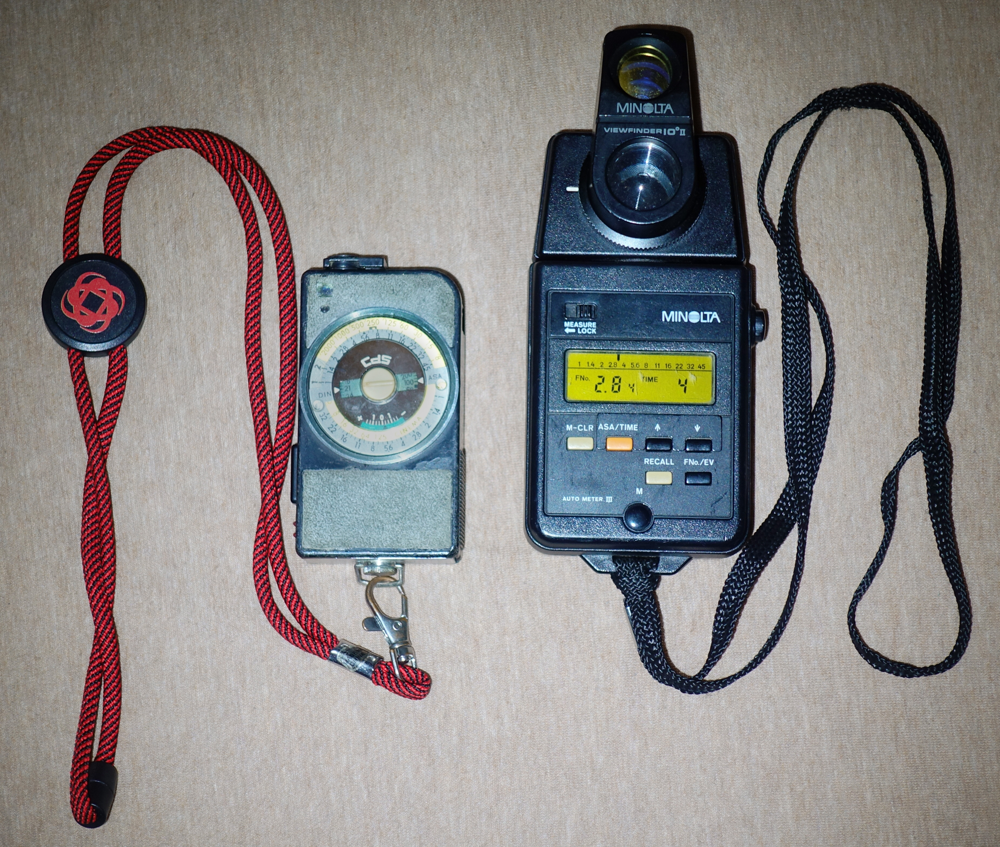

Like in the last year, I have decided to catalogue what I got in the last year. And there has been... Maybe less than I thought it would be, but still. But in a predictable way - 2022 was all over the place, this year is about finding range and few gadgets here and there - and it all fits on one picture this time! Let's have a look...

1. [Hexar RF](#hexar-rf)
  * [LLL Elcan 50mm f2 (LTM)](#lll-elcan-50mm-f2)
  * [LLL Collapsible 8 element 35mm f2 "CoLLLapsicron" (LTM)](#colllapsicron-35mm-f2)
  * [Voigtlander APO-Skopar 90mm f2.8 (M)](#voigtlander-90mm-f28)
  * [Chiyoko Super Rokkor 45mm f2.8 (LTM)](#chiyoko-super-rokkor-45mm-f28)
  * [Canon 35mm f2 (LTM)](#canon-35mm-f2)
  * [Minolta Rokkor-QF 45mm f1.7 (M converted)](#rokkor-qf-45mm-f17)
  * [Mr. Ding 50mm f1.1 (M)](#mr-ding-50mm-f11)
2. [SW-Nikkor 75mm f4.5 (4x5)](#sw-nikkor-75mm-f45)
  * [DaYi 612 back for 4x5](#dayi-612)
3. [DJI Mini 3 Pro](#dji-mini3-pro)
4. [Sony RX100 V](#sony-rx100-v)
5. [Miscallenous](#miscallenous)
  * [Minolta Repo](#minolta-repo)
  * [Konica MG/D](#konica-mgd)
  * [AstrHori light meter](#astrhori-light-meter)
  * [Minolta Auto Meter III](#minolta-auto-meter-iii)
  * [Ulanzi shoulder bag](#ulanzi-bag)
  * [Ulanzi uurig R060 clamp](#ulanzi-uurig-r060-clamp)

# Hexar RF

I have just finished writing a [review of that camera](/blog/one-roll-with-hexar-rf/). The height of finding range this year, to be honest.

👍Comes in recommended, as per review.

## LLL Elcan 50mm f2

This lens I reviewed a [while ago](/blog/lll-elcan/). The start of the journey, pretty much. From longer perspective I probably wouldn't buy it again - this was a bit of a yolo deal, should've gotten some other vintage optic, but I still like this one and I'm unlikely to sell it.

## CoLLLapsicron 35mm f2

Light Lens Lab's most famous lens, 8 element 'Summicron v1' in collapsible version (and yes I nicknamed it how I did). A proper review would be coming soon, but in short: it's a very nice lens, but I should've gotten the rigid version instead. The gimmick isn't most convenient and it doesn't allow installing filters. However, the image quality and bokeh is quite pleasant; collapsing makes the Hexar _technically_ pocketable.

👍 Yeah I would recommend that one.

## Voigtlander 90mm f2.8

I love the Minolta MD 100mm f2.5 - it's really sharp, has very nice separation for portraits, out of focus backgrounds are nice too and I would bring it for close and personal shots anytime. But it's not APO, and it does suffer from chromatic aberrations. I've heard a lot of nice things about the APO Skopar and I threw it into the package from Japan with the Hexar. Frankly, I was positively surprised - super sharp wide open, definitely APO, it's small and light; definitely an improvement, and a great addition to the system... as much as shooting longer lenses sucks on a rangefinder. My biggest gripe is 90 degree focus throw from infitnity to 0.9m.

👍 If you don't have a small, short telephoto, you should get one.

## Chiyoko Super Rokkor 45mm f2.8

Bought it earlier this year. Sold it later that year because I couldn't really justify it with the Elcan, which had very similar size. Image quality was very 1950s. Yea it was cute, and lens cap with the old Minolta logo was great, but all in all I made a good deal.

## Canon 35mm f2

I got it to replace the 35 1.7 Ultron. At least for the Canon lens I don't have such awful feelings. It's a small lens that's low on contrast at f2, but at f2.8 it magically becomes much better. Can't be compared to CoLLLapsicron - technically it's not perfect, but it handles nicely, is quite small and for casual street snaps does the job. And of course with it now I have the complete frameline collection for Canon P, so I'll be keeping it, even if I don't use it that often.

## Rokkor-QF 45mm f1.7

A peculiar item I found on the Japanese auction sites. Converted to M mount, but without proper rangefinder coupling - I use it sometimes on Fuji. Not particularly sharp (at infinity, I blame the conversion being slightly off), but can take lovely soft portraits with bubble bokeh.

## Mr Ding 50mm f1.1

Last purchase of the year, a Christmas present - a superfast 50mm, my first lens faster than 1.4. Not super sharp, but the separation, the out of focus backgrounds are creamy. Handles great as well, and pairs superbly with Hexar RF's 1/4000 top shutter speed. I'd bring it for night shooting, or for taking pictures of people I like, haven't had a bad result yet; for streets or general shooting, Elcan is certainly smaller, lighter and easier to handle.

👍 Please don't overpay for the Noctilux.

# SW-Nikkor 75mm f4.5

My third 4x5 lens (or second; as Super Topcon 120mm wasn't intended for 4x5). Super wide. Great sharpness overall, but handling with the Horseman camera was a bit of a pain. I had to get a (third party) lens board for it, thankfully the Chinese make good ones for not too much. Movements are very limited as the lens just barely sticks out of the initial 'house' of the camera. Up, sideways, a bit of tilt and swing - but forget about it when using the Lomograflok. Fall with the bed is impossible.

I had an issue with this lens that it seemed like the camera bed was visible in the pictures, but I couldn't reproduce it with the ground glass. Only later I realized that this was because the bellows were collapsing and covering a part of the rear element... well, be careful. The wide angle is great when it is, but it's quite niche at 17mm equivalent. Sometimes I wish I had something less wide, like 90mm... but than I'd want also a 150, and a 180, and maybe a telephoto 400mm f8 etc etc.

👍 If you're looking for a wide angle 4x5 lens, look no further. It's much more affordable than the german brands but I would not say that it's any worse.

## DaYi 612

A panorama back for 4x5 cameras. Well, doesn't have to be a panorama - you are also given a set of masks to get any format: 6x12, 6x9, 6x6, 6x4.5. Or you can mix and match the manual masks any way you like. Mid-roll. No one's stopping you.

It's a simple accessory and I bet the margin is massive, and I already bought it cheaper than on Ebay thanks to Taobao. It's a simple device, and you have to remove the ground glass to install it. On top of that, no frame counter, it's not so fancy like the Sinar Panorama back which I would vastly prefer over this; but it does get the job done, and that's what matters.

With this, I can plan a whole-ass trip for a single shot on Provia.

Hard to recommend at the price, but slide panoramas make it feel worth it.

# DJI Mini 3 Pro

I joined the party late, and lots of registration, restrictions were implemented worldwide, but... yeah this was definitely worth it. The technology is now quite mature - the DJI drone is basically flying itself, giving very stable footage, and allowing me to both somewhat document my local trips for social media, and allow me a new perspective over things I've already seen.

Usual rules of photography apply for aerial photos, with lighting and composition being crucial. But now you have more freedom, in every axis. But with freedom comes responsibility, not to cause harm to anyone uninvolved in the first place, you and your party second, then to your drone. Check for obstacles, kites, trees, electric wires, any people teleporting into the drone when you're landing, the weather, wind, battery life, and who could forget about regulations?

Besides the drone, I got few basic accessories - two extended batteries, filters: CPL and variable ND; ultra-wide attachment, a separate bag. The CPL I should've skipped, but the ND is a must for natural looking water in daytime (in sunlight ND32-128).

I noticed that freedom to go anywhere does not exactly translate in immediate search of the best angle. Photography from the ground is fairly limited by where we can go and what angles we can get; I caught that few times after a flight I would notice that I could've approached the subject in a different manner, or there was something worth checking out if I just rotated 90 degrees. But natural human tunnel vision, and the battery-clock ticking do not help.

The 1/1.3" camera sensor on the Mini 3 Pro can get you good footage in good light and at base ISO - the 48MP mode for stills is really impressive. The quality does fall apart VERY quickly beyond base ISO though. Thankfully, with moderate wind resistance it can be pretty stable - probably 1s windless would be feasible, but actual performance depends deeply on the environmental conditions.

I love shooting hyperlapses with that, for sunsets. It's also super easy to throw in some movement into it, and you can easily get stunning footage, as long as you start with good composition. Probably my favourite purchase of the year that got me out in the weekends the most.

👍 If you think it could be fun, try it out, or just go for it. Remember to fly responsibly, and even more so be mindful of your behavior afterwards - especially do not tell anyone which rules you've broken.

## Sony RX100 V

Forgot to put in the picture!

Tiny compact cameras are falling out of fashion, and I know why, but I can't accept it as a valid reason. The RX100 is not much bigger than a smartphone, and takes much better photos, especially thanks to optical zoom. In darker situations? 1" beats phones which get mushy even with the newest software mumbo jumbo, and it has a proper, even though tiny, flash, rather than a weak LED diode.

I'm quite amazed how many features are put into such a small package - with a pop-up electronic viewfinder, super high speed recording, WiFi connectivity it's a great casual travel companion, and a full-fledged camera, just with a smaller than usual sensor. You won't get paper-thin depth of field... but sometimes that's actually for the better. Since the image quality at lower ISOs is pretty good, I'd use it for quick product photography, to get more depth of field. And it's truly pocketable, like pants pocket pocketable.

I'd complain about the coating of the screen and lack of touch screen; Sony menus aren't great, but once you set the camera up, you don't really have a reason to go back in. Great travel companion, or locally for streets, whenever I don't feel like carrying a full camera - film or digital.

👍 Everyone should have a camera in their pocket!

# Miscallenous

## Minolta Repo

Got it with the Nikkor 75mm from Japan in February... took a long time to fix. I [reviewed it earlier](../blog/one-roll-with-minolta-repo/), and it has left me on Christmas Eve.

## Konica MGD

Got two of them with the Hexar RF in October and it was quite obvious that we're not meant to be together, despite both parties being generally good (I hope at least, that I am good). Check the [review](../blog/one-roll-with-konica-mgd/). Both after repairs left me quite quickly once I announced that I wanna get rid of them.

## AstrHori Light Meter

I wrote a fair bit about [it earlier this year](../blog/ttartisan-vs-astrhori/). It will stay on the Canon P but it's no joy compared to having automatic exposure.

## Minolta Auto Meter III

That's an interesting one. Got it because it seemed cheap and had the 10 degree "spot" attachment. And I always kinda wanted a more proper meter than Sverdlovsk 4. And I will compare the Minolta to the Sverdlovsk, because it's actually a closer comparison than you'd think.

Incident metering is spot metering with extra steps (literally, you have to walk to your subject). It's useless for landscape, so I don't miss not having the dome, although for completion sake, I should get one if it comes cheaply.

Sverdlovsk is significantly smaller and lighter. It has similar working EV range as MAMIII. The Minolta meter is fully digital, Sverdlovsk is analog, that seems to be a hack of some sort to get the reading (you have to manouver a wheel and look at a LED - proper settings you get when the LED is at the edge of being enabled and disabled). MAMIII is simple, you press a button and you get the aperture depending on the shutter speed you chose with the buttons.

Getting the reading itself is faster on the Minolta meter, but on Sverdlovsk you get all the information and possible shutter speed/aperture combinations immediately. On the Minolta you have to change the mode to check or change the film speed, not great if you forget (has happened before :X).

The viewfinder on the Minolta is clear, zoomed in; Sverdlovsk is more barebonse. In low light, after dusk, screen/dial readability is bad for both meters, with MAMIII being just a tiny bit better.

The real advantage of the digital meter comes with built-in memory mode. You can make a reading and remember it, make another reading, and they both (or 3, or 4...) appear on the aperture scale on the screen. For shooting landscapes, especially on slide - great! You can quickly gauge the dynamic range of the scene, and make an educated guess how you should expose. That's a big advantage over Sverdlovsk, where I had to do mental calculations, ending up metering multiple times just to make sure because I'd forget the settings quickly.

Sverdlovsk easily wins in weight and size, Minolta in functionality. Ease of use for me now is similar, but for newbies Sverdlovsk has a bit of a learning curve. I can keep both and use depending on the planned picture and taken equipment.

I'm still missing a meter with flash metering. And a real spot meter. But the former is easily solved with digital proofing (or dumb auto flash), and the latter... is not THAT necessary.

I would not really recommend it - it seems like a lateral move from Sverdlovsk 4, which still can be found for cheaper. But it's solid.

## Ulanzi bag

The fake design bag from last year finally gave in after 1.5 years, with zipper failing again and I haven't had enough patience for it, so I got the Ulanzi shoulder bag. A third of the price of the legit Peak Design, it offers... a better experience?

The shoulder strap has a removable pad; the straps can be disconnected from the bag, so you could use it as a camera cube; it has a back pocket, and the zipper pocket inside has tiny compartments for SD cards and all that. The zipper is a better design, being mostly flat, not going in a curve around the bag with potential failure points. The outside material is not the prettiest and gets dirty easily, but is water resistant.

Okay, the zipper design is a bit weird - when the bag is fully closed, you have a zipper on both sides; you open the bag by pulling one of them towards the other, so when the bag is fully open, two zippers are together. That does not help wide access, but is still serviceable. Just not comfortable with big cameras like S2A or EOS 30.

👍 If you want the PD sling back but wanna save some cash, consider the Ulanzi one. Defo more solid.

## Ulanzi uurig R060 clamp

...and a small ballhead. I bought it as a mini tripod replacement for trips or lighter walkarounds. The clamp works well with railings, but it's limited by their thickness.

At home it's great for holding a light or flash.

Or I can clamp it to the tripod. On the center column I'd have medium or large format, and I'd use the clamp on one of the legs to also attach a digital camera - so I could shoot stills with the big cam, and have a timelapse or video recording with the digital. That's how I shot the 2024 fireworks on both film and digital:

`youtube:https://youtu.be/dDcRr2RTlMU`

👍 It's very cheap, very strong and very versatile. A tiny accessory like that may come in useful in the least expected moment.

# What's next?

No concrete plans, of course, just like last year. I can expect myself buying more M and large format glass; maybe Viltrox 75 or 27 1.2, for the most concrete examples.

# Any new opinions on the gear from 2022?

I mostly stand by recommendations I wrote last year. I've greatly enjoyed using what I got, and Canon P certainly shaped the purchases for 2023. The pinhole camera didn't get much use, but it's still a nice conversation piece; large format got more use, but it's very specific and it can sit unused for months before I get inspired. EOS 30 has fallen back a bit, but it's not gathering dust. Digital gear is always useful.