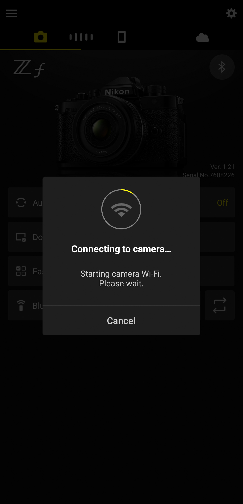
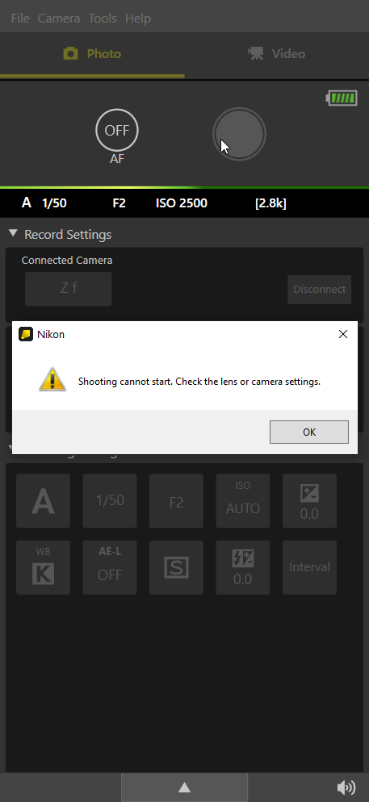

Since corporations get bigger and bigger, technical support gets abstracted away. Or offloaded. Or just doesn't exist anymore and it's a miracle if you can find one email address that should've been removed years ago to contact someone with your issue. Or if you'd like to give some feedback? The only feedback the company will listen to is the sound of money getting out of your wallet.

I guess you can make a 10 minute long talking head well-articulated video about your gripes on YouTube, so even if you're still unhappy, at least you can get some ad revenue to dry your tears. But if the only way to vent your frustrations is by talking shit online? I will exercise my rights.

I still like the Zf - I use it as my main camera, most of the time. But it doesn't mean it's perfect. It's far from it, actually. And it compounds over time; after half a year here's the few retarded decisions that bother me the most.

# I'm gonna Snap[bridge App]

I was quite happy with it at the beginning, with the auto download feature. After some time though I realized that since I'm snapping away and the thing just keeps copying and sometimes doesn't copy all so I download manually and then there's two copies of an image and it's up to you to figure out which one is the full resolution- yeah the experience feels a bit like this overly long sentence. I gave up on that function.

Instead, using the usual connect to WiFi... it's painfully slow. For seemingly no reason.

The app has to do:

1. Connect through Bluetooth (fast)

2. Order the camera to turn on WiFi (that's like one command, should be fast)

3. Wait for it to start the access point (doesn't take too long, you can see on the camera itself)

4. Just... connect?

And yet you will be staring at the fucking circle for god knows how long - could be 2-3 minutes, and if you're tempted like me to have a look at the Wifi settings of your phone you will see the access point, but the app will still not connect. Or if you God forbid actually connect manually, then the app will return back to the starting point, pushing away your hand from the help you wanted to give it. Connect again, sucker. It will not recognize when you're already connected and that it can just skip steps 1-3.

Oh and if you get a message from a friend and switch contexts for a moment to reply while it's connecting? Well fuck you again, return to nothing.

Fuji app was better than that. That should say a lot.

     

          
     

     

          
     

Oh and recently? It refuses to do that for me; from day to day just failed. Shows "An error has occurred." WHAT FUCKING ERROR HOW DO I FIX IT FUCK YOU even does that in AP mode where you connect manually, camera kills the connection WITH NO FUCKING INDICATION WHAT WENT WRONG

I am not particularly smart, but also not that stupid to not find any extra information handy. COME THE FUCK ON WHAT IS GOING ON

can we go back to the time where you'd get schematics with your device thx

# No custom profiles

So these days I use the Zf with 105/2.8 for film scanning. And it's a simple thing that I'd want base ISO, RAW only setting for that. And on Fuji I just set C4 to be exactly that. And here? Fuck you, you're not pro enough to have custom profiles. That's on Z8+ or whatever. But you have a dedicated switch for b&w mode instead! Shove the b&w mode switch up your ass Nikon, I accidentally switched to that more times than I ever wanted (I want to use b&w mode exactly NEVER, I can make my images monochrome in post). Why not have a custom profile even in the menu?

So every time I scan I take 10 seconds to switch to base ISO and to RAW. I may forget about the RAW thing actually and then I get annoyed I get two images in CaptureOne while tethering, before I go into the menus again. And then I forget to switch back from RAW to RAW+JPEG for normal shooting so I get annoyed again.

# (Almost) Absolutely retarded ISO dial

I think it's the number one thing everyone complains about. I have no problem with PASM, it does its job, but the fucking ISO dial is absolutely useless.

To recap, if you don't have it in auto mode, it behaves like an ISO dial should. But who normal would not use auto ISO for most of their photography?

So you enable auto ISO, which you can only toggle in C mode, and in that C mode you can also choose the ISO with the wheels, and maybe you go back to using the ISO dial?

Auto ISO, and a specific ISO settings... what could happen? What would you want to happen?

If you change the sensitivity, then maybe because you want to control noise...? Have less of it? Shutter speed can go lower in a calm scene, but ISO threshold should not go over your chosen setting?

Nope, Nikon knows better than you - your chosen value is the MINIMUM. You set it to 100? You have normal auto ISO setting. Set it to 400? It starts from 400. All the way up to 512k. Because yes, that's a physical dial setting, and I'm sure 100% of the Zf owners will use it as such all the time.

And there is no way to change that behavior. Read online that "it's consistent with other Nikons-" well I DON'T CARE. It just DOES NOT MAKE SENSE at all. Have they never used a camera before?

So that dial is permanently on C for me. It's more effort to use the dial than it is to change the ISO with command wheels. How convenient. Waste of fucking space that could be used idk for custom profile wheel.

## Firmware 2.00 addendum

Finally _some_ improvement has been made, even though it's unclear as always in the menus. You can now have C set to auto, and the numerical values to set ISO. Here's what you have to do:

In C ISO mode, go into the photo settings, and ISO - enable Auto with your preferred settings.

Then switch the ISO dial into a numerical value, and go into the same menu, and disable Auto. It's not documented anywhere, but it will only apply to the numerical values, leaving C in auto. Finally.

Funny thing - you can set the maximum ISO to 200 (or some other value) on the numerical scale. If the ISO dial is set to 100-160, then it will go up to 200 (you choose the minimum ISO as before), but over that, it will stick to the dialed in value. Seems like there could be a niche use for that, but I wouldn't count on it.

# No cabled shutter release options

This threaded hole? It's **fake**. I mean, it's real, but the only purpose is to screw in soft shutter buttons. Yeah these plastic toys you randomly lose and contribute to making the world a dirtier place, or they break off leaving you with a stub you cannot remove from the button.

But a shutter release, like in Fuji X-T20 that I had? Nope. I didn't know it's the case so I put a cable in and pressed it... and nothing. 

Who the fuck thought it's a good idea? That's copying the aesthetics but without the original function. I should've expected that, it looks the part but it's an empty shell without a single thought went into it.

The worst thing is there's no alternative. The 3.5mm microphone jack cannot be used. No USB button either. All you have is lousy tethering or Bluetooth. So if I'm scanning and don't want to introduce extra vibrations, all I can do is press space on the keyboard in CaptureOne. Or your phone in Bluetooth mode. But you cannot use both.

Why? Is it to sell more Bluetooth remotes? Greedy ass bitches, if you as a Zf user do want a dedicated remote, at least get the Chinese copy. Works the same, still overpriced (over 100CNY) but at least not THAT overpriced.

# PixelShit (sic) mode

Here's a bit of a correspondence with Nikon my attempt to solve a problem that's obviously buggy software:

> Please be advised that the Pixel **Shit** \[emphasis mine] Shooting function is not compatible with NX Tether software when using a wireless connection. However, this function can be used with NX Tether via a USB connection. During the processing of Pixel Shit Shooting, both the monitor and viewfinder will be disabled until the process is complete.

I had a problem with the wired connection. Not listening at all, but it happens. I did not solve it. Tethering just won't work with Pixel Shit. And fuck you for trying to report a bug. Too big of a company and suddenly feedback paths disappear. So consider this as a formal bug report.

And you know, Pixel Shit moreso requires absolute stillness. I don't want to touch the camera, if I don't have to. Wired shutter release would be the best option of course, but as we said before, it's not happenning.

Besides the fact that optyczne.pl said there's not much improvement in optical quality, I wanted to check this on my own. However, no working remote release is much more a dealbreaker. I can use it still, with 5 seconds wait per image and hope there's no movement... What a pain.

# No thumb rest

Inspired by FM2. Leica-tier ergonomics, a massive slab with a tiny front grip.

I actually have no problem with the front grip, although considering the size of the camera it's not great. But okay, most of the time you hold your camera by the lens.

The problem is the total lack of understanding... with the film cameras, you would rest your thumb by the advance lever. Lenses would be smaller and lighter as well, allowing more comfortable use. But that advance lever is important, it adds extra grip. Or on Hexar RF, there's a little bump and it works alright. Or on the EOS 30, it's also profiled normally so in the lieu of the advance lever, you have a place to put your thumb on.

But you know, for a company loving their legacy, the lack of understanding what made it actually usable? And then you pair it with modern, heavy FF glass? What?

Has to be fixed with a third party option. Again. Get the Chinese option. Mine was 35 CNY. I wish I got something grippier than wood but it's not too bad.

# Prehistoric focus stacking

I cannot believe it, but film-simulation-oriented, completely unserious Fujifilm has focus stacking implemented so much better. Let's see how it goes on Fuji:

1. Get into focus stacking menu.
2. Choose focus points A and B, with magnification, to cover your entire subject.
3. Camera will automatically calculate the DoF coverage and how many photos it needs from A to B. And takes them. You can use a remote shutter, even, to minimize shaking.

Easy. Sensible. How is it on the Zf?

1. In normal shooting mode, enable AF, single shot only (no self timer).
2. Find the spot closest to camera. Oh remember it's AF, no MF allowed, so don't refocus by accident after reaching your point.
3. Get into focus stacking menu.
4. Choose focus step (how much the camera changes the focus), and picture count.
5. Start shooting immediately after pressing start in the menu, without any preview.

So... what? No preview, and you have no idea where the focus will end. And you're touching the camera in the process and possibly could bring some shake. Wow, great for macro. Not even real macro, but closeups. Will the chosen focus step be enough? You'll find out after you edit. Focus step is just a number, it doesn't tell you a single thing about how far it will change, aperture be damned.

# No magnification with DoF preview

And if you wanted by any chance to verify how deep the DoF is with a smaller aperture, to ensure all the little details are covered especially for macro, you just cannot. Magnify, and press DoF preview? You get kicked out. DoF preview and magnify? DoF preview turns off. So I guess you have to take the picture first and then chimp. Just why? Scratching my head.

# And you know what?

Most of these things could be fixed with software. But they won't. That's not in vogue. That won't make money. Open sourcing, so at least someone could fix it for you? Nah that's for losers and would hit the bottom line. Only says that in hardware all cameras are the same and the secret sauce is in buggy ass software with retarded design decisions. Oh sorry, at least Canon is special for forcing you to buy their overpriced red ring lenses that don't even cover full frame.

I'm not even complaining about lack of retro-styled lenses. I just use the Techart M mount AF adapter (absolutely great). The 40/2 SE I sold, it wasn't *that* great - besides AF and IBIS performance which was better than adapted M mount lenses, but I liked having cash on hand and drybox space more than that lens.

Not even complaining about non-global warranty options. The same camera is much cheaper in some markets, but greedy ass nipponjin want their dollar bills folded 1000 times in richer regions. That's why grey market exists. Somehow it's cheaper to import a camera or lens from India to HK and even give a healthy margin for the reseller.

I'm still pissed. But there are no better options. Where are we going, as humanity? If I come up with a cure to cancer I'll make sure to make it closed source to anyone working for a modern camera company.
